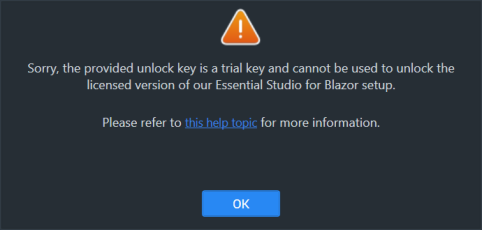
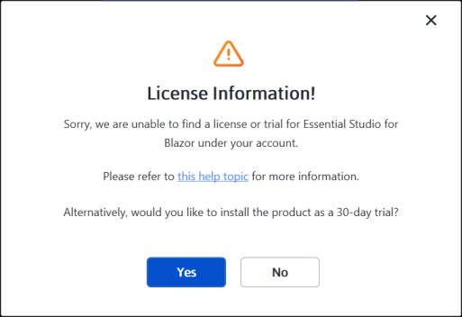
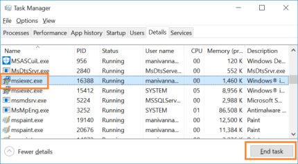

# Common installation errors

This article describes the most common installation errors, as well as the causes and solutions to those errors.

* [Unlocking the license installer using the trial key](https://blazor.syncfusion.com/documentation/installation/common-installation-errors#unlocking-the-license-installer-using-the-trial-key)
* [License has expired](https://blazor.syncfusion.com/documentation/installation/common-installation-errors#license-has-expired)
* [Unable to find a valid license or trial](https://blazor.syncfusion.com/documentation/installation/common-installation-errors#unable-to-find-a-valid-license-or-trial)
* [Unable to install because of another installation](https://blazor.syncfusion.com/documentation/installation/common-installation-errors#unable-to-install-because-of-another-installation)
* [Unable to install due to controlled folder access](https://blazor.syncfusion.com/documentation/installation/common-installation-errors#unable-to-install-due-to-controlled-folder-access)

## Unlocking the license installer using the trial key

**Error Message:** Sorry, the provided unlock key is a trial unlock key and cannot be used to unlock the licensed version of our Essential Studio&reg; for Blazor installer.

**Reason:**   A trial unlock key is being used with the licensed installer.

**Suggested solution:** Only a licensed unlock key can unlock a licensed installer. So, to unlock the Licensed installer, use the Licensed unlock key. To generate the licensed unlock key, refer to [this](https://support.syncfusion.com/kb/article/2757/how-to-generate-syncfusion-setup-unlock-key-from-syncfusion-support-account) article.

## License has expired

**Error Message:** Your license for Syncfusion&reg; Essential Studio&reg; for Blazor has been expired since {date}. Renew your subscription and try again.

***Online installer***

**Reason:** This error message will appear if your license has expired.

**Suggested solution:** Choose one of the following options.

1. Renew the subscription [here](https://www.syncfusion.com/account/my-renewals)
2. Purchase a new license [here](https://www.syncfusion.com/sales/products)
3. Contact sales: sales@syncfusion.com
4. If applicable, extend the 30‑day trial period.

## Unable to find a valid license or trial

**Error Message:** Sorry, we are unable to find a valid license or trial for Essential Studio&reg; for Blazor under your account.

***Offline installer***

***Online installer***

**Reason:** One of the following is true:

* The 30‑day trial has expired
* The account has no license or active trial
* The user is not the license holder for the product
* The account administrator has not assigned a license to the user

**Suggested solution:**
1. Purchase a license: https://www.syncfusion.com/sales/products
2. Ask the account administrator to assign a license in Syncfusion account portal
3. Request assistance: clientrelations@syncfusion.com
4. Contact sales: sales@syncfusion.com

## Unable to install because of another installation

**Error Message:** Another installation is in progress. You cannot start this installation without completing all other currently active installations. Click cancel to end this installer or retry to attempt after currently active installation completed to install again.

**Reason:** You are trying to install when another installation is already running in your machine.

**Suggested solution:** Open and kill the msiexec process in the task manager and then continue to install Syncfusion. If the problem is still present, restart the computer and try Syncfusion&reg; installer.

1. Open Windows Task Manager.
2. Browse the Details tab.
3. Select the msiexec.exe and click **End task**.

## Unable to install due to controlled folder access

***Offline***

**Error Message:** Controlled folder access seems to be enabled on this machine. The provided install or samples location (for example, Public Documents) is protected by controlled folder access settings.

***Online***

**Error Message:** Controlled folder access seems to be enabled on this machine. The provided install, samples, or download location (for example, Public Documents) is protected by controlled folder access settings.

**Reason:** You have enabled controlled folder access settings on your computer.

**Suggested solution:**

**Suggestion 1:**
* Syncfusion demos are installed to the Public Documents folder by default.
* You have controlled folder access enabled on your machine, so our demos cannot be installed in the documents folder. If you need to install our demos in the Documents folder, follow the steps in this [link](https://support.microsoft.com/en-us/windows/allow-an-app-to-access-controlled-folders-b5b6627a-b008-2ca2-7931-7e51e912b034) and disable the controlled folder access.
* You can enable this option after the installing our Syncfusion&reg; setup.

**Suggestion 2:**
* If you do not want to disable controlled folder access, you can install our demos in another directory.
