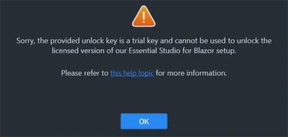
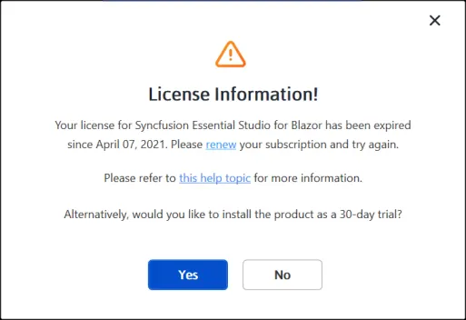
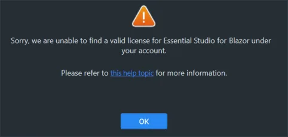
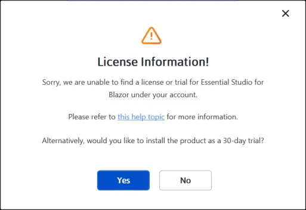
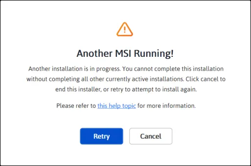
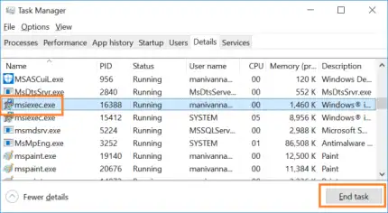
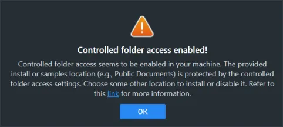
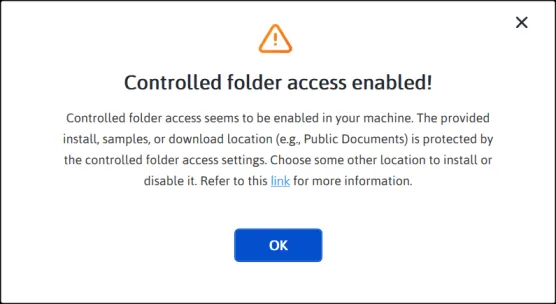

# Common installation errors

This article describes the most common installation errors, as well as the causes and solutions to those errors.

> **Prerequisites:**
> * Verify that your machine meets the supported OS and .NET version requirements for the Syncfusion Blazor version you are installing. See the [system requirements](https://blazor.syncfusion.com/documentation/system-requirements) for details.
> * Close all running Visual Studio instances before starting the installation to avoid conflicts while installing Visual Studio extensions and project templates.
> * Ensure that Windows is up to date with the latest recommended updates to avoid installation and compatibility issues.

* [Unlocking the license installer using the trial key](https://blazor.syncfusion.com/documentation/installation/common-installation-errors#unlocking-the-license-installer-using-the-trial-key)
* [License has expired](https://blazor.syncfusion.com/documentation/installation/common-installation-errors#license-has-expired)
* [Unable to find a valid license or trial](https://blazor.syncfusion.com/documentation/installation/common-installation-errors#unable-to-find-a-valid-license-or-trial)
* [Unable to install because of another installation](https://blazor.syncfusion.com/documentation/installation/common-installation-errors#unable-to-install-because-of-another-installation)
* [Unable to install due to controlled folder access](https://blazor.syncfusion.com/documentation/installation/common-installation-errors#unable-to-install-due-to-controlled-folder-access)

## Unlocking the License Installer Using the Trial Key

**Error message:** Sorry, the provided unlock key is a trial unlock key and cannot be used to unlock the licensed version of our Essential Studio&reg; for Blazor installer.

**Reason:** A trial unlock key is being used with the licensed installer.

**Suggested solution:** Only a licensed unlock key can unlock a licensed installer. So, to unlock the Licensed installer, use the Licensed unlock key. To generate the licensed unlock key, refer to [this](https://support.syncfusion.com/kb/article/2757/how-to-generate-syncfusion-setup-unlock-key-from-syncfusion-support-account) article.

## License Has Expired

**Error message:** Your license for Essential Studio&reg; for Blazor has been expired since {date}. Renew your subscription and try again.

> In the message above, `{date}` is a placeholder that is replaced with your actual license expiration date.

***Online installer***

**Reason:** This error message will appear if your license has expired.

**Suggested solution:** Choose one of the following options.

1. Renew the subscription [here](https://www.syncfusion.com/account/my-renewals).
2. Purchase a new license [here](https://www.syncfusion.com/sales/pricing?category=ui-components).
3. Contact sales: sales@syncfusion.com.
4. Contact [Syncfusion support](https://support.syncfusion.com) to request a trial extension, if applicable.

After renewing or purchasing a license, re-run the installer and enter the new unlock key to complete activation.

## Unable to Find a Valid License or Trial

**Error message:** Sorry, we are unable to find a valid license or trial for Essential Studio&reg; for Blazor under your account.

> This check is performed against your Syncfusion account, not just the current machine. The result applies to all platforms tied to the license.

***Offline installer***

***Online installer***

**Reason:** One of the following is true:

* The 30‑day trial has expired.
* The account has no license or active trial.
* The user is not the license holder for the product.
* The account administrator has not assigned a license to the user.

**Suggested solution:**

1. Purchase a license: https://www.syncfusion.com/sales/pricing?category=ui-components.
2. Sign in to the [Syncfusion account portal](https://www.syncfusion.com/account/) to verify the license is registered to your account.
3. Ask the account administrator to assign a license to your user in the Syncfusion account portal.
4. Request assistance: clientrelations@syncfusion.com.
5. Contact sales: sales@syncfusion.com.

## Unable to Install Because of Another Installation

**Error message:** Another installation is in progress. You cannot start this installation without completing all other currently active installations. Click cancel to end this installer or retry to attempt after the currently active installation completes.

**Reason:** You are trying to install when another installation is already running on your machine.

> **Warning:** This error applies to the Windows Installer (MSI) engine. It can be triggered by any MSI-based install, not only Syncfusion installers. Use the steps below only if you are certain that no other installation is in progress, or after a reboot if the issue persists.

**Suggested solution:** End the `msiexec.exe` process using Windows Task Manager, then continue to install Syncfusion. If the problem persists, restart the computer and run the Syncfusion&reg; installer again.

1. Open Windows Task Manager. For example, press **Ctrl + Shift + Esc**, or right-click the taskbar and select **Task Manager**.
2. Click the **Details** tab.
3. Right-click the `msiexec.exe` row and click **End task**. If multiple `msiexec.exe` rows are listed, end each one.
4. After all `msiexec.exe` processes are ended, run the Syncfusion installer again.

## Unable to Install Due to Controlled Folder Access

N> Controlled Folder Access is a feature of Microsoft Defender on Windows 10, Windows 11, and Windows Server. The steps below apply to those operating systems.

***Offline installer***

**Error message:** Controlled folder access seems to be enabled on this machine. The provided install or samples location (for example, Public Documents) is protected by controlled folder access settings.

***Online installer***

**Error message:** Controlled folder access seems to be enabled on this machine. The provided install, samples, or download location (for example, Public Documents) is protected by controlled folder access settings.

**Reason:** You have enabled controlled folder access on your computer.

**Suggested solution:**

**Option 1: Disable controlled folder access for the install**

Syncfusion demos are installed to the Public Documents folder by default. With controlled folder access enabled, the demos cannot be installed in that folder. To install the demos to the default location, disable controlled folder access during installation and re-enable it afterward. For steps, see [Allow an app to access controlled folders in Windows Security](https://support.microsoft.com/en-US/Windows/Security/Threat-Malware-Protection/virus-and-threat-protection-in-the-windows-security-app).

1. Open **Windows Security** and select **Virus & threat protection**.
2. Under **Virus & threat protection settings**, click **Manage settings**.
3. Scroll to **Controlled folder access** and click **Manage Controlled folder access**.
4. Set **Controlled folder access** to **Off**.
5. Run the Syncfusion installer to the default install location.
6. After installation completes, set **Controlled folder access** back to **On**.

**Option 2: Install to a different directory**

If you do not want to disable controlled folder access, choose a custom install directory that is not under a protected folder when running the installer.
