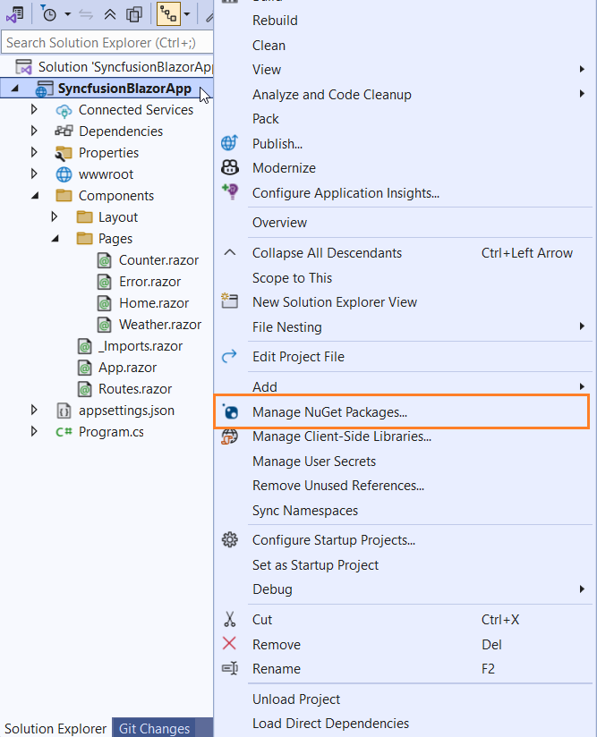
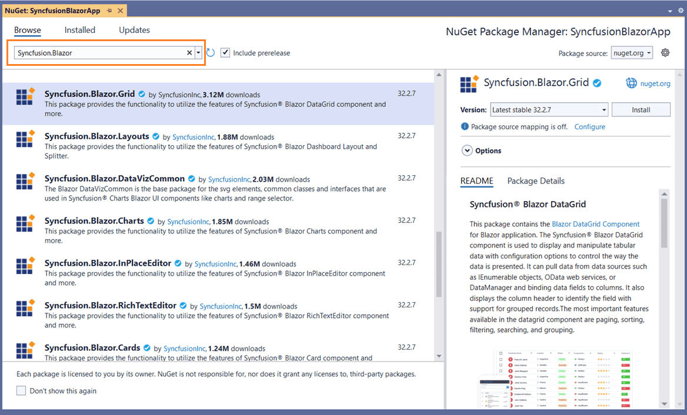
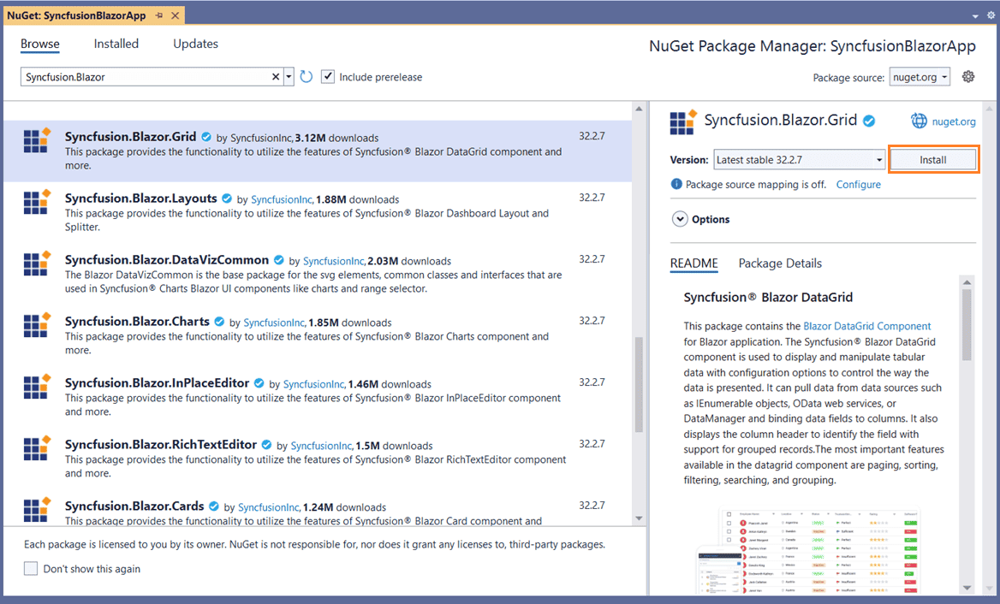
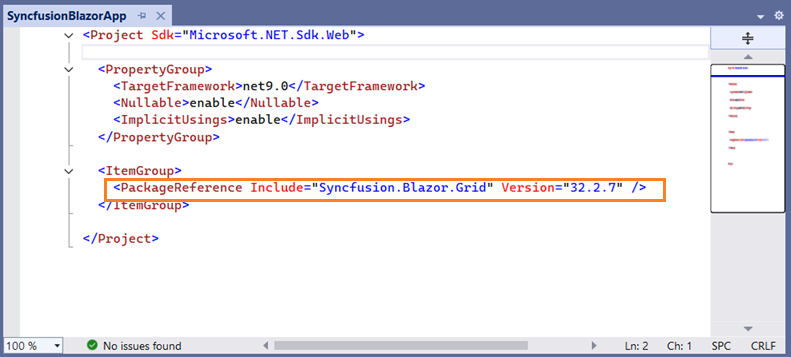
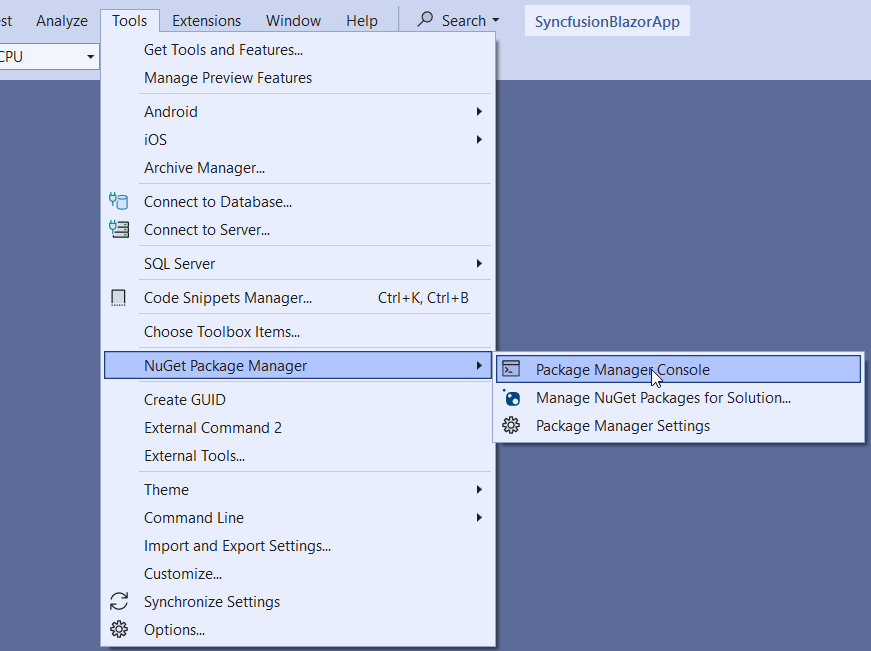
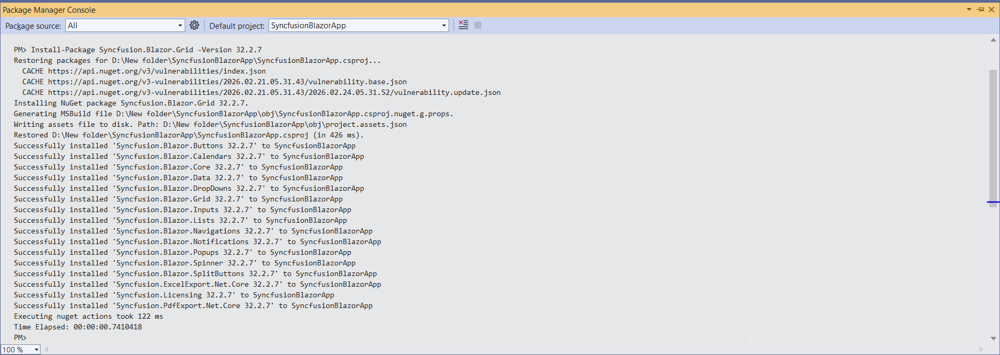

# Install Syncfusion Blazor NuGet packages

## Overview

**NuGet** is a Package management system for Visual Studio. It makes it easy to add, update and remove external libraries in our application. Syncfusion publishing all Blazor NuGet packages in [nuget.org](https://www.nuget.org/packages?q=Tag%3A%22Blazor%22+Syncfusion). The Syncfusion Blazor NuGet packages can be used without installing the Syncfusion installation. You can simply exploit the Syncfusion Blazor NuGet packages in your Blazor application to develop with the Syncfusion Blazor components.

> The Syncfusion Blazor NuGet package, which contains all Syncfusion Blazor components in a single package, is available beginning with v17.4.0.39 (Essential Studio 2019 Volume 4).
> The Syncfusion Blazor UI components are available separately as [Individual NuGet packages](https://blazor.syncfusion.com/documentation/nuget-packages/) beginning with v18.4.0.30 (Essential Studio 2020 Volume 4). The NuGet packages are segregated based on the component usage and its namespace.

## Installation using Package Manager UI

The NuGet **Package Manager UI** allows you to search, install, uninstall, and update Syncfusion Blazor NuGet packages in your applications and solutions. You can find and install the Syncfusion Blazor NuGet packages in your Visual Studio Blazor application and this process is easy with the steps below:

1. Right-click on the Blazor application or solution in the Solution Explorer, and choose **Manage NuGet Packages...**

    

    As an alternative, after opening the Blazor application in Visual Studio, go to the **Tools** menu and after hovering **NuGet Package Manager**, select **Manage NuGet Packages for Solution...**

2. The Manage NuGet Packages window will open. Navigate to the **Browse** tab, then search for the Syncfusion Blazor NuGet packages using a term like **"Syncfusion Blazor"** and select the appropriate Syncfusion Blazor NuGet package for your development.

    > The [nuget.org](https://api.nuget.org/v3/index.json) package source is selected by default in the Package source drop-down. If your Visual Studio does not have nuget.org configured, follow the instructions in the [Microsoft documents](https://docs.microsoft.com/en-us/nuget/tools/package-manager-ui#package-sources) to set up the nuget.org feed URL.

    

3. When you select a Blazor package, the right side panel will provide more information about it.

4. By default, the package is selected with the latest version. You can choose the required version and click the **Install** button and accept the license terms. The package will be added to your Blazor application.

    

5. At this point, your application has all the required Syncfusion assemblies, and you will be ready to start building high-performance, responsive app with [Syncfusion Blazor components](https://www.syncfusion.com/blazor-components). Also, you can refer to the [Blazor help document](https://blazor.syncfusion.com/documentation/introduction/) for development.

## Installation using Dotnet (.NET) CLI

The [dotnet Command Line Interface (CLI)](https://docs.microsoft.com/en-us/nuget/consume-packages/install-use-packages-dotnet-cli), allows you to add, restore, pack, publish, and manage packages without making any changes to your application files. [Dotnet add package](https://docs.microsoft.com/en-us/dotnet/core/tools/dotnet-add-package?tabs=netcore2x) adds a package reference to the application file, then runs [dotnet restore](https://docs.microsoft.com/en-us/dotnet/core/tools/dotnet-restore?tabs=netcore2x) to install the package.

Follow the below instructions to use the dotnet CLI command to install the Syncfusion Blazor NuGet packages.

1. Open a command prompt and navigate to the directory where your Blazor application file is located.
2. To install a NuGet package, run the following command.

    ```dotnet add package <Package name>```

    **For Example:**
    dotnet add package Syncfusion.Blazor.Grid

    > If you don’t provide a version flag, this command will be upgrading to the latest version by default. To specify a version, add the -v parameter: dotnet add package Syncfusion.Blazor.Grid -v 19.2.0.44.

3. Examine the Blazor application file after the command has completed to ensure that the Syncfusion Blazor package was installed. To see the added reference, open the .csproj file.

    

4. Then, run  [dotnet restore](https://docs.microsoft.com/en-us/dotnet/core/tools/dotnet-restore?tabs=netcore2x) command to restore all the packages listed in the application file.

    > Restoring is done automatically with **dotnet build** and **dotnet run** in .NET Core 2.0 and later.

5. At this point, your application has all the required Syncfusion assemblies, and you will be ready to start building high-performance, responsive app with [Syncfusion Blazor components](https://www.syncfusion.com/blazor-components). Also, you can refer to the [Blazor help document](https://blazor.syncfusion.com/documentation/introduction/) for development.

## Installation using Package Manager Console

The **Package Manager Console** saves NuGet packages installation time since you don't have to search for the Syncfusion Blazor NuGet package which you want to install, and you can just type the installation command to install the appropriate Syncfusion Blazor NuGet package. Follow the instructions below to use the Package Manager Console to reference the Syncfusion Blazor component as NuGet packages in your Blazor application.

1. To show the Package Manager Console, open your Blazor application in Visual Studio and navigate to **Tools -> NuGet Package Manager -> Package Manager Console**.

    

2. The **Package Manager Console** will be shown at the bottom of the screen. You can install the Syncfusion Blazor NuGet packages by entering the following NuGet installation commands.

    ***Install specified Syncfusion Blazor NuGet package.***

    The following command will install the Syncfusion Blazor NuGet package in the default Blazor application.

    ```Install-Package <Package Name>```

    **For example:** Install-Package Syncfusion.Blazor.Grid

    > You can find the list of Syncfusion Blazor NuGet packages which are published in nuget.org from [here](https://www.nuget.org/packages?q=Tags%3A%22Blazor%22+syncfusion)

    ***Install specified Syncfusion Blazor NuGet package in specified Blazor application***

    The following command will install the Syncfusion Blazor NuGet package in the given Blazor application.

    ```Install-Package <Package Name> - ProjectName <Project Name>```

    **For example:** Install-Package Syncfusion.Blazor.Grid -ProjectName SyncfusionBlazorApp

3. By default, the package will be installed with latest version. You can give the required version with the -Version term like below to install the Syncfusion Blazor NuGet packages in the appropriate version.

    ```Install-Package Syncfusion.Blazor.Grid -Version 19.2.0.44```

    

4. The NuGet package manager console will install the Syncfusion Blazor NuGet package as well as the dependencies it has. When the installation is complete, the console will show that your Syncfusion Blazor package has been successfully added to the application.

5. At this point, your application has all the required Syncfusion assemblies, and you will be ready to start building high-performance, responsive app with [Syncfusion Blazor components](https://www.syncfusion.com/blazor-components). Also, you can refer to the [Blazor help document](https://blazor.syncfusion.com/documentation/introduction/) for development.