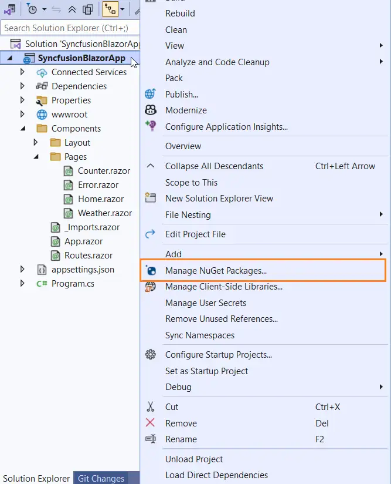
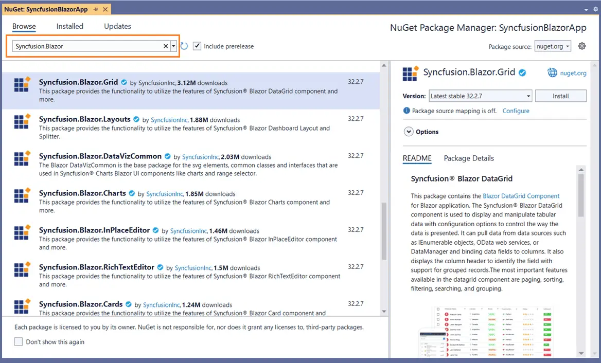
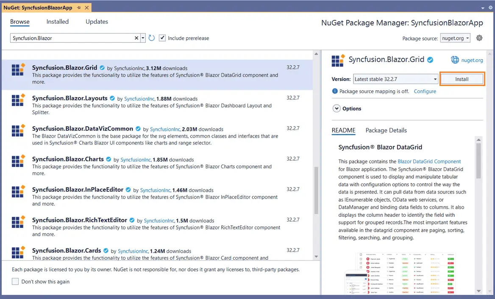
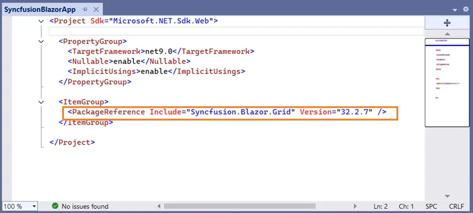
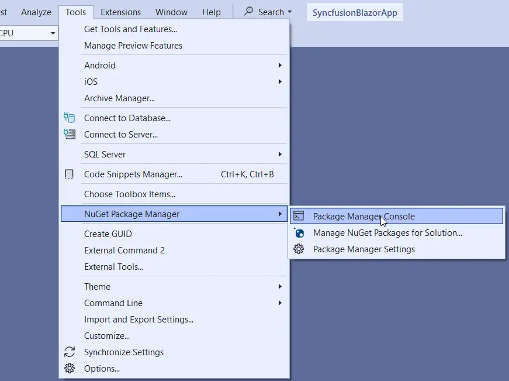
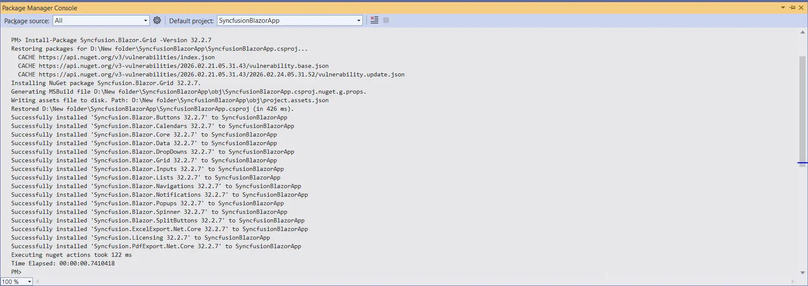

# Install Syncfusion® Blazor NuGet Packages

Syncfusion<sup style="font-size:70%">&reg;</sup> publishes all Blazor components as NuGet packages on [nuget.org](https://www.nuget.org/packages?q=Tag%3A%22Blazor%22+Syncfusion). You can use the Syncfusion<sup style="font-size:70%">&reg;</sup> Blazor NuGet packages in your Blazor application without installing the Syncfusion<sup style="font-size:70%">&reg;</sup> installer. The sections below describe three ways to add the packages to your project: Package Manager UI, .NET CLI, and Package Manager Console.

## Prerequisites

Before you begin, confirm the following:

* Visual Studio 2019 or later, or the .NET SDK, is installed and available on `PATH`.
* A Blazor project is created. See [Get started with ASP.NET Core Blazor](https://learn.microsoft.com/en-us/aspnet/core/blazor) for details.
* The `nuget.org` feed is configured in your environment. See [Microsoft package sources documentation](https://learn.microsoft.com/en-us/nuget/consume-packages/install-use-packages-visual-studio#package-sources) for details.
* A valid Syncfusion<sup style="font-size:70%">&reg;</sup> license key is available for development. See the [licensing overview](https://help.syncfusion.com/common/essential-studio/licensing/overview) for details.

## Overview

NuGet is a package management system for Visual Studio and the .NET SDK. It makes it easy to add, update, and remove external libraries in your application.

> N> The Syncfusion<sup style="font-size:70%">&reg;</sup> Blazor NuGet package, which contains all Syncfusion<sup style="font-size:70%">&reg;</sup> Blazor components in a single package, is available beginning with v17.4.0.39 (Essential Studio<sup style="font-size:70%">&reg;</sup> 2019 Volume 4). 
>The Syncfusion<sup style="font-size:70%">&reg;</sup> Blazor UI components are also available separately as [Individual NuGet packages](https://blazor.syncfusion.com/documentation/nuget-packages) beginning with v18.4.0.30 (Essential Studio<sup style="font-size:70%">&reg;</sup> 2020 Volume 4). The NuGet packages are segregated based on the component usage and its namespace.

## Installation Using Package Manager UI

The NuGet **Package Manager UI** allows you to search, install, uninstall, and update Syncfusion<sup style="font-size:70%">&reg;</sup> Blazor NuGet packages in your applications and solutions.

Follow the steps below to locate and install the Syncfusion<sup style="font-size:70%">&reg;</sup> Blazor NuGet packages into a Blazor application:

1. Right-click on the Blazor application or solution in **Solution Explorer** and select **Manage NuGet Packages...** from the context menu.

   

   Alternatively, open the NuGet package manager in Visual Studio by selecting **Tools → NuGet Package Manager → Manage NuGet Packages for Solution...**.

2. In the **Manage NuGet Packages** window, go to the **Browse** tab and type **Syncfusion.Blazor** in the search field. The window displays all Syncfusion<sup style="font-size:70%">&reg;</sup> Blazor NuGet package options. Select the appropriate package based on the component requirements.

   > N> By default, the [nuget.org](https://api.nuget.org/v3/index.json) package source is configured in Visual Studio. If `nuget.org` is not available, see the [Microsoft package sources documentation](https://learn.microsoft.com/en-us/nuget/consume-packages/install-use-packages-visual-studio#package-sources) to configure the `nuget.org` feed URL.

   

3. When a Blazor package is selected, the right side panel displays detailed information about that package.

4. By default, the latest version is selected. To install a specific release, select the required version from the available options, select **Install**, and accept the license terms. The package is added to the Blazor application.

   

5. After installation, the required Syncfusion<sup style="font-size:70%">&reg;</sup> assemblies are available in your application. Build and run the application to start developing with the [Syncfusion<sup style="font-size:70%">&reg;</sup> Blazor components](https://www.syncfusion.com/blazor-components). See the [Blazor documentation](https://blazor.syncfusion.com/documentation/introduction) for further development assistance.

## Installation Using the .NET CLI

The [.NET CLI](https://learn.microsoft.com/en-us/nuget/consume-packages/install-use-packages-dotnet-cli) provides functionality to add, restore, pack, publish, and manage packages without modifying project files. Use [dotnet add package](https://learn.microsoft.com/en-us/dotnet/core/tools/dotnet-package-add?tabs=netcore2x) to add a package reference, and [dotnet restore](https://learn.microsoft.com/en-us/dotnet/core/tools/dotnet-restore?tabs=netcore2x) to install it.

Follow the steps below to install Syncfusion<sup style="font-size:70%">&reg;</sup> Blazor NuGet packages using the .NET CLI.

1. Open a command prompt and navigate to the directory that contains the Blazor application file.
2. Run the following command to install the NuGet package.

   ```bash
   dotnet add package <PackageName>
   ```

   **For example:**

   ```bash
   dotnet add package Syncfusion.Blazor.Grid
   ```

   > N> By default, the command installs the latest version when no version flag is provided. Add the `-v` parameter to specify a version: `dotnet add package Syncfusion.Blazor.Grid -v {{ site.releaseversion }}`.

3. After the installation command completes, check the `.csproj` file to verify that the Syncfusion<sup style="font-size:70%">&reg;</sup> Blazor package reference has been added to the Blazor application.

   

4. Run the [dotnet restore](https://learn.microsoft.com/en-us/dotnet/core/tools/dotnet-restore?tabs=netcore2x) command to restore all required packages to the application file.

5. After installation, the required Syncfusion<sup style="font-size:70%">&reg;</sup> assemblies are available in your application. Build and run the application to start developing with the [Syncfusion<sup style="font-size:70%">&reg;</sup> Blazor components](https://www.syncfusion.com/blazor-components). See the [Blazor documentation](https://blazor.syncfusion.com/documentation/introduction) for further development assistance.

## Installation Using Package Manager Console

The **Package Manager Console** lets you install NuGet packages by typing a command instead of searching for them in the UI. Follow the steps below to use the Package Manager Console to install Syncfusion<sup style="font-size:70%">&reg;</sup> Blazor components as NuGet packages in a Blazor application.

1. Open the Blazor application in Visual Studio, then go to **Tools → NuGet Package Manager → Package Manager Console**.

   

2. The **Package Manager Console** appears at the bottom of Visual Studio. Enter one of the following NuGet commands to install the Syncfusion<sup style="font-size:70%">&reg;</sup> Blazor NuGet package.

   **Install the Syncfusion<sup style="font-size:70%">&reg;</sup> Blazor NuGet package in the default project**

   ```powershell
   Install-Package <PackageName>
   ```

   **For example:**

   ```powershell
   Install-Package Syncfusion.Blazor.Grid
   ```

   > N> Browse Syncfusion<sup style="font-size:70%">&reg;</sup> Blazor NuGet packages on [NuGet.org](https://www.nuget.org/packages?q=Tags%3A%22Blazor%22+syncfusion).

   **Install the Syncfusion<sup style="font-size:70%">&reg;</sup> Blazor NuGet package in a specific project**

   ```powershell
   Install-Package <PackageName> -ProjectName <ProjectName>
   ```

   **For example:**

   ```powershell
   Install-Package Syncfusion.Blazor.Grid -ProjectName SyncfusionBlazorApp
   ```

3. By default, the package is installed at the latest version. To install a specific Syncfusion<sup style="font-size:70%">&reg;</sup> Blazor release, specify the `-Version` parameter with the Package Manager Console command.

   ```powershell
   Install-Package Syncfusion.Blazor.Grid -Version {{ site.releaseversion }}
   ```

   

4. The Package Manager Console installs the Syncfusion<sup style="font-size:70%">&reg;</sup> Blazor NuGet package and its dependencies. After installation finishes, check the console output for a confirmation message indicating the Syncfusion<sup style="font-size:70%">&reg;</sup> Blazor package was added to the application.

5. After installation, the required Syncfusion<sup style="font-size:70%">&reg;</sup> assemblies are available in your application. Build and run the application to start developing with the [Syncfusion<sup style="font-size:70%">&reg;</sup> Blazor components](https://www.syncfusion.com/blazor-components). See the [Blazor documentation](https://blazor.syncfusion.com/documentation/introduction) for further development assistance.