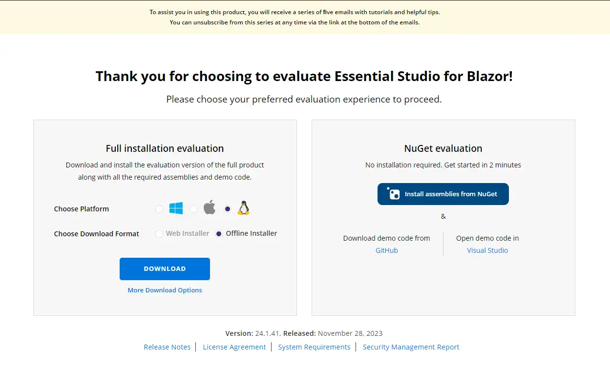
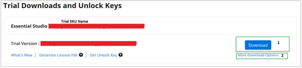
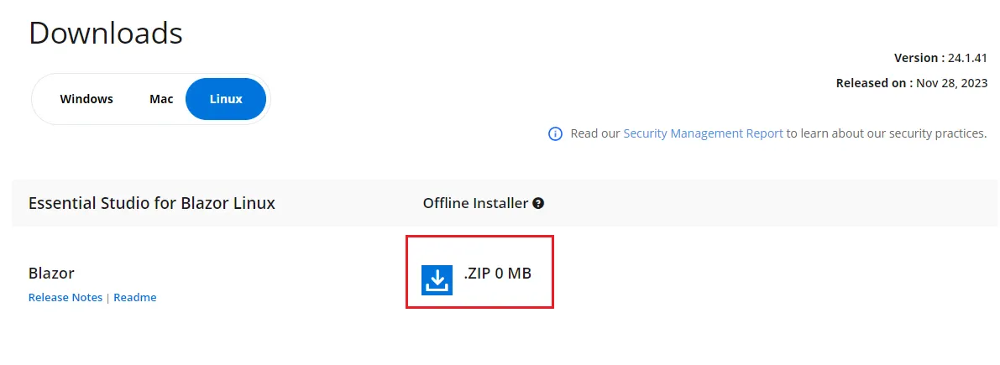
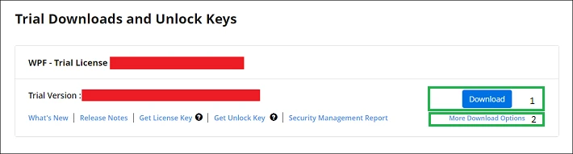
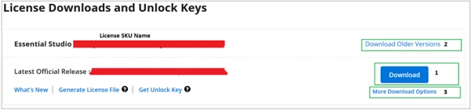
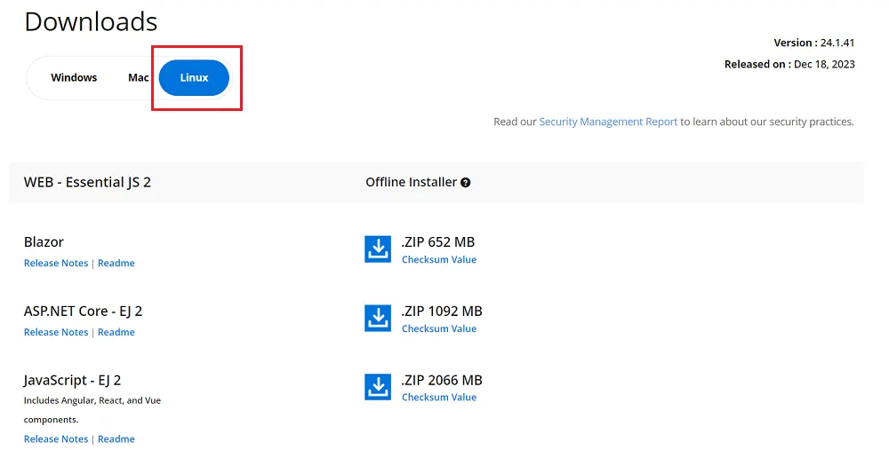

# Download the Syncfusion® Blazor Linux Installer

> **Prerequisites:**
> * Confirm that your machine meets the supported OS and .NET version requirements for the Syncfusion Blazor version you are installing. See the [system requirements](https://blazor.syncfusion.com/documentation/system-requirements) for details.
> * For licensed downloads, an active Blazor license must be assigned to your account in the Syncfusion account portal.

The Blazor Linux installer is available as a trial or a licensed installer, depending on your account status. The sections below describe both download paths. Trial downloads provide a 30‑day evaluation and only the latest version is available.

## Download the Trial Version

The 30‑day trial installer can be downloaded from your Syncfusion account. If you obtained Syncfusion components through NuGet, see [Start Trials If Using Components Through NuGet.org](https://www.nuget.org/packages?q=syncfusion).

### Download the Free Trial Setup

1. Visit the [Download Free Trial](https://www.syncfusion.com/downloads) page and select **Blazor**.
2. Complete the form or sign in with a registered Syncfusion&reg; account. After submission, the Blazor trial installer becomes available on the confirmation page.

   

3. To download the Blazor offline trial installer (ZIP format), select **More download options** on the [Trials & Downloads](https://www.syncfusion.com/account/manage-trials/downloads) page.

   

4. With a trial license, only the latest version’s trial installer can be downloaded. Historic versions are not available for trial.
5. An unlock key is not required to install the Blazor Linux trial installer.
6. During the 30‑day trial period, you can re-download the trial installer at any time from the [Trials & Downloads](https://www.syncfusion.com/account/manage-trials/downloads) page.

   

### Start Trials If Using Components Through NuGet.org

Use this path if you obtained Syncfusion components from [NuGet.org](https://www.nuget.org/packages?q=syncfusion) and only need an evaluation license key — no installer is required.

1. Start a 30‑day Blazor trial from the [Start trial](https://www.syncfusion.com/account/manage-trials/start-trials) page.
2. Sign in with a Syncfusion&reg; account, or sign up if you do not have one.
3. Select **Syncfusion Blazor** to begin the trial.

   N> If an existing Blazor trial is still active, a new trial for the same product cannot be started.

4. After starting the trial, go to the [Trials & Downloads](https://www.syncfusion.com/account/manage-trials/downloads) page to generate the [unlock key](https://www.syncfusion.com/kb/8069/how-to-generate-unlock-key-for-essentials-studio-products) and [license key](https://help.syncfusion.com/common/essential-studio/licensing/how-to-generate) at any time before the trial expires.

   

   N> A license key is required to use the trial components in your Blazor application. For more information about license keys, see the [licensing overview](https://help.syncfusion.com/common/essential-studio/licensing/overview).

5. Your current active trial products are listed on the [Trials & Downloads](https://www.syncfusion.com/account/manage-trials/downloads) page.

## Download the Licensed Version

Licensed installers are available to account holders with an active Syncfusion Essential Studio license assigned to their account.

1. Sign in to your Syncfusion&reg; account and open the [License & Downloads](https://www.syncfusion.com/account/downloads) page.
2. All licenses (both active and expired) associated with your account are listed.
3. Select **More download options** to download the Blazor Linux licensed offline installer (ZIP format).

   

4. The Linux installer is available as a ZIP file.
5. An unlock key is not required to install the Blazor Linux licensed installer.

   

## Next Steps

For step-by-step installation, see [Install the Blazor Linux Installer](https://blazor.syncfusion.com/documentation/installation/linux-installer/how-to-install).