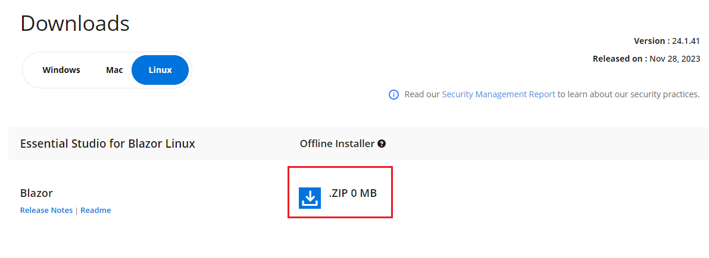
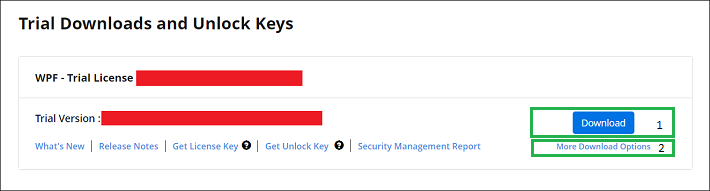

# Download the Syncfusion® Blazor Linux installer

Download the Syncfusion Blazor Linux installer from the Syncfusion website. Download options depend on the account status: trial or licensed.

- Trial installer
- Licensed installer

You can download the Syncfusion&reg; installer from [Syncfusion.com](https://www.syncfusion.com/) website.

## Download the trial version

Our 30-day trial can be downloaded in two ways.

* Download Free Trial Setup
* Start Trials if using components through [NuGet.org](https://www.nuget.org/packages?q=syncfusion)

### Download the free trial setup

1. Visit the [Download Free Trial](https://www.syncfusion.com/downloads) page and select the Blazor product.
2. Complete the form or sign in with a registered Syncfusion&reg; account to download the Blazor trial installer from the confirmation page (as shown in below screenshot).

   
   
3. With a trial license, only the latest version’s trial installer can be downloaded.
4. An unlock key is not required to install the Syncfusion&reg; Blazor Linux trial installer.
5. Before the trial expires, download the trial installer at any time from the [Trials & Downloads](https://www.syncfusion.com/account/manage-trials/downloads) page (as shown in below screenshot).
 
   

6. Select More download options (element 2 in the above screenshot) to get the Essential Studio&reg; Blazor offline trial installer (ZIP format).

   

### Start trials if using components through NuGet.org

Start an evaluation if components were obtained through [NuGet.org](https://www.nuget.org/packages?q=syncfusion).

1. Start a 30‑day Blazor trial from the [Start trial](https://www.syncfusion.com/account/manage-trials/start-trials) page.

   N> You can generate the license key for your active trial products from [Trials & Downloads](https://www.syncfusion.com/account/manage-trials/downloads) page. This license key will be mandatory to use our trial products in your application. To know more about License key, refer this [help topic](https://help.syncfusion.com/common/essential-studio/licensing/overview).

   
   
2. To access this page, sign up or log in with a Syncfusion&reg; account.
3. Begin the trial by selecting the Syncfusion&reg; product.

   N> If an existing Blazor trial is still active, a new trial for the same product cannot be started.

4. After starting the trial, go to [Trials & Downloads](https://www.syncfusion.com/account/manage-trials/downloads) to get the latest trial installer. You can generate the [unlock key](https://www.syncfusion.com/kb/8069/how-to-generate-unlock-key-for-essentials-studio-products) and [license key](https://help.syncfusion.com/common/essential-studio/licensing/how-to-generate) here at any time before the trial period expires. (as shown in below screenshot.)

   

5. You can find your current active trial products on the [Trials & Downloads](https://www.syncfusion.com/account/manage-trials/downloads) page.

## Download the licensed version

1. Licensed products are available from the [License & Downloads](https://www.syncfusion.com/account/downloads) page in the Syncfusion&reg; account.
2. You can view all the licenses (both active and expired) associated with your account.
3. Select More download options (element 3 in the screenshot below) to download the Blazor Linux licensed offline installer.

   
   
4. An unlock key is not required to install the Syncfusion&reg; Blazor Linux licensed installer.
5. For Linux, the installer is available in ZIP format (offline installer).
   
   

For step-by-step installation, see [Blazor Linux installer](https://blazor.syncfusion.com/documentation/installation/linux-installer/how-to-install).