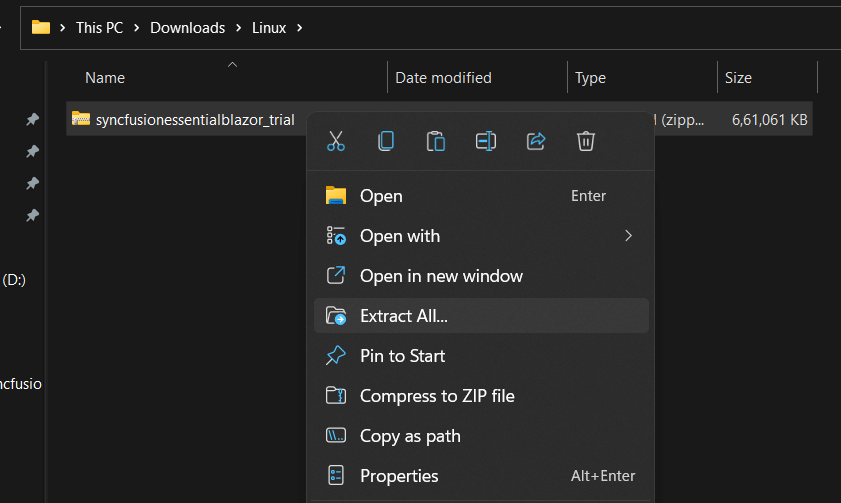
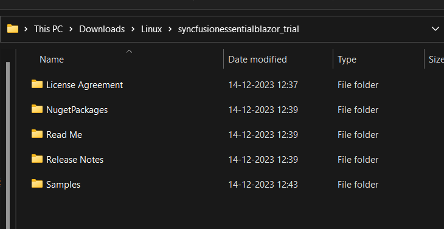

# Installing Syncfusion&reg; Blazor Linux installer

## Step-by-Step Installation

The steps below show how to install Blazor Linux installer.

1. Extract the Syncfusion&reg; Blazor Linux installer(.zip) file. The files are extracted in your machine.

   
   

2. The Linux zip file contains the following folders.

      
   
   N> The Unlock key is not required to install the Linux installer.

4. You can launch the demo source and use the NuGet packages included in the Linux installer.

## License key registration in samples

After the installation, the license key is required to register the demo source that is included in the Linux installer. To learn about the steps for license registration for the Blazor Linux installer, please refer to this.

* For server side application register the license key in Configure method of [Startup.cs](https://blazor.syncfusion.com/documentation/getting-started/license-key/how-to-register-in-an-application#blazor-server-app)
* For client side application register the license key in main method of [Program.cs](https://blazor.syncfusion.com/documentation/getting-started/license-key/how-to-register-in-an-application#blazor-webassembly-app)

You can also find the steps for getting started with Syncfusion&reg; Blazor components in Linux,

* Getting started with Syncfusion&reg; Blazor Components in [Blazor Server Side App](https://blazor.syncfusion.com/documentation/getting-started/blazor-server-side-mac/#getting-started-with-syncfusion-blazor-components-in-blazor-server-side-app-using-visual-studio-for-mac) using Visual Studio for Linux.
* Getting started with Syncfusion&reg; Blazor Components in [Web Assembly App](https://blazor.syncfusion.com/documentation/getting-started/blazor-webassembly-visual-studio-mac) using Visual Studio for Linux.

N> License key registration is required only for trial linux builds. For licensed Linux builds, there is no need to register a license key.