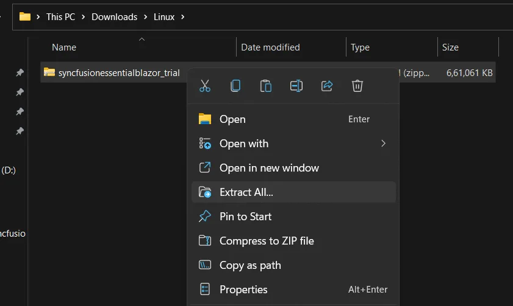
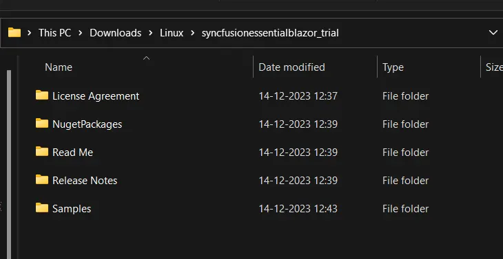

# Install the Syncfusion® Blazor Linux Installer

The steps below describe how to install and use the Blazor Linux offline installer (ZIP), review the included content, and register the license key in the bundled sample projects.

## Prerequisites

Before you begin, confirm the following:

* A supported Linux distribution is installed. Syncfusion Blazor supports the same distributions as .NET. See the [.NET supported OS list](https://learn.microsoft.com/en-us/dotnet/core/install/linux) for details.
* The .NET SDK that matches the target Syncfusion Blazor version is installed and available on `PATH`. Verify with `dotnet --version`.
* The `unzip` tool is available on the system.
* You have write permission to the installation directory.
* The downloaded Blazor Linux installer ZIP is available locally. If you have not downloaded it yet, see [Download the Blazor Linux installer](https://blazor.syncfusion.com/documentation/installation/linux-installer/how-to-download).

## Install on Linux

1. Extract the Blazor Linux installer ZIP to a folder of your choice.

   

2. Review the extracted contents. The package includes demo source, offline NuGet packages, and supporting files.

   

   > **Note:** An unlock key is not required to install or use the Blazor Linux offline installer.

3. Open the demo projects from the extracted folder using your preferred editor (for example, Visual Studio Code), and restore the included NuGet packages.
4. Build and run the sample projects to verify the installation. Use `dotnet restore`, `dotnet build`, and `dotnet run` from the project directory.

## License Key Registration in Samples

After installation, a license key is required to register the demo source included in the Linux installer. The license key is applied in the entry point of your Blazor application.

* **Blazor Server App**: Register the license key in the `Configure` method of [Startup.cs](https://blazor.syncfusion.com/documentation/getting-started/license-key/how-to-register-in-an-application#blazor-server-app).
* **Blazor WebAssembly App**: Register the license key in the `Main` method of [Program.cs](https://blazor.syncfusion.com/documentation/getting-started/license-key/how-to-register-in-an-application#blazor-webassembly-app).

For the complete registration steps, see [Register the license key in an application](https://blazor.syncfusion.com/documentation/getting-started/license-key/how-to-register-in-an-application).

## Getting Started

To learn how to use the Syncfusion&reg; Blazor components in your application, refer to the following getting started topics:

* Getting started with Syncfusion&reg; Blazor components in a [Blazor Server app](https://blazor.syncfusion.com/documentation/getting-started/blazor-server-side-mac) on Linux.
* Getting started with Syncfusion&reg; Blazor components in a [Blazor WebAssembly app](https://blazor.syncfusion.com/documentation/getting-started/blazor-webassembly-visual-studio-mac) on Linux.