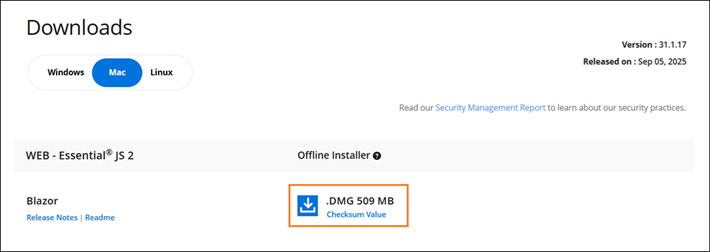

# Download the Syncfusion® Blazor Mac installer

Syncfusion&reg; provides a Blazor Mac installer for both evaluation and paid customers. Download options depend on the account status: trial or licensed.

* Trial Installer
* Licensed Installer

## Download the trial version

1. Visit the [Download Free Trial](https://www.syncfusion.com/downloads) page and select the Blazor platform.

2. After completing the required form or logging in with your registered Syncfusion&reg; account, you can download the Blazor trial installer from the confirmation page. (as shown in below screenshot.)

   

3. With a trial license, only the latest version’s trial installer can be downloaded.

4. An unlock key is not required to install the Blazor Mac trial installer.

5. Before the trial expires, download the trial installer at any time from the [Trials & Downloads](https://www.syncfusion.com/account/manage-trials/downloads) page.

   

6. Click the More Download Options (element 2 in the above screenshot) button to get the Essential Studio&reg; Blazor Offline trial installer which is available in DMG format.

   

### Start trials if using components through NuGet.org

Start an evaluation if components were obtained through [NuGet.org](https://www.nuget.org/packages?q=syncfusion).

1. Start a 30‑day Blazor trial from the [Start trials](https://www.syncfusion.com/account/manage-trials/start-trials) page.

   

2. To access this page, you must sign up/log in with your Syncfusion&reg; account.

3. Begin the trial by selecting the Blazor product.

   N> If an existing Blazor trial is still active, a new trial for the same product cannot be started.

4. After starting the trial, go to [Trials & Downloads](https://www.syncfusion.com/account/manage-trials/downloads) to get the latest trial installer. You can generate the [unlock key](https://support.syncfusion.com/kb/article/7053/how-to-generate-unlock-key-for-essentials-studio-products) and [license key](https://blazor.syncfusion.com/documentation/getting-started/license-key/how-to-generate) here at any time before the trial period expires. (as shown in below screenshot)

   

5. You can find your current active trial products on the [Trials & Downloads](https://www.syncfusion.com/account/manage-trials/downloads) page.

## Download the licensed version

1. Licensed products are available from the [License & Downloads](https://www.syncfusion.com/account/downloads) page in the Syncfusion&reg; account.

2. You can view all the licenses (both active and expired) associated with your account.

3. Select **More download options** to download the Blazor Mac licensed installer.

   

4. An unlock key is not required to install the Blazor Mac licensed installer.

5. For macOS, the installer is available in DMG format.

   

For step-by-step installation, see [Blazor Mac installation](https://blazor.syncfusion.com/documentation/installation/mac-installer/how-to-install).
