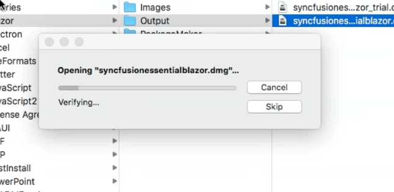
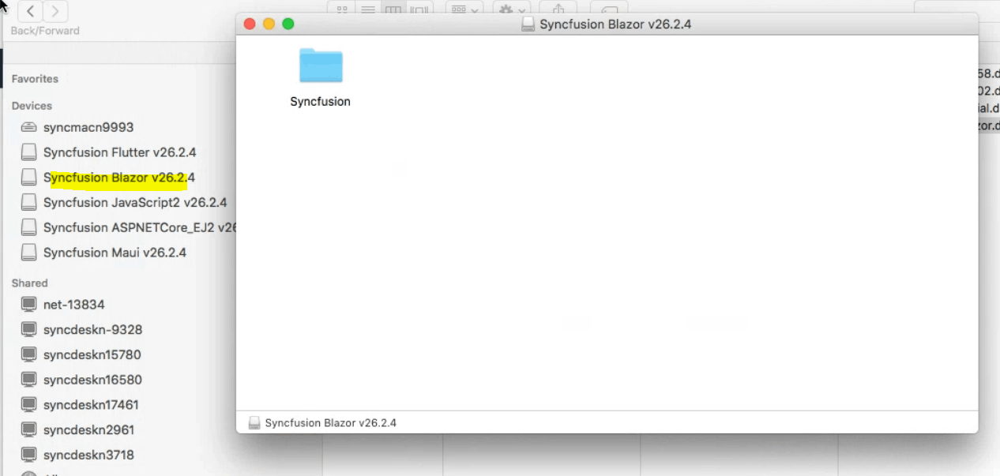
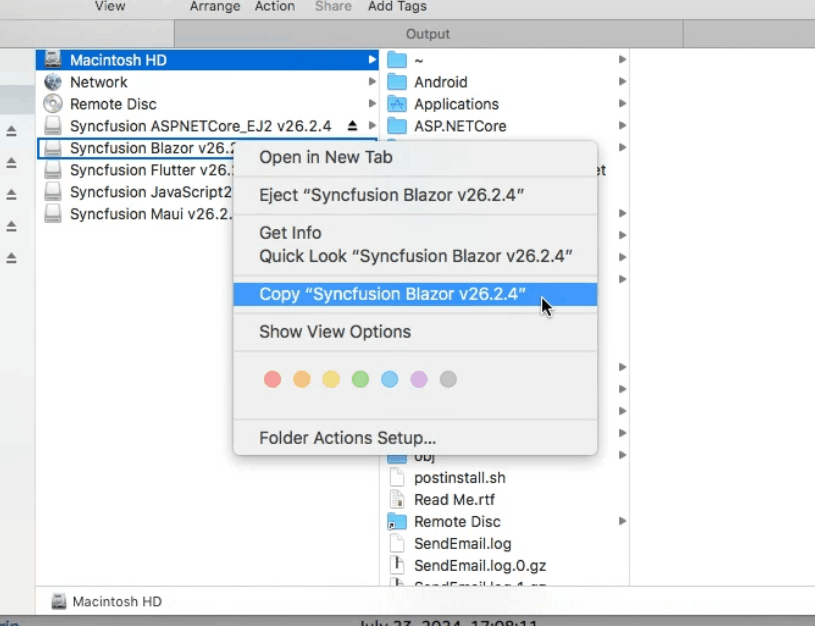
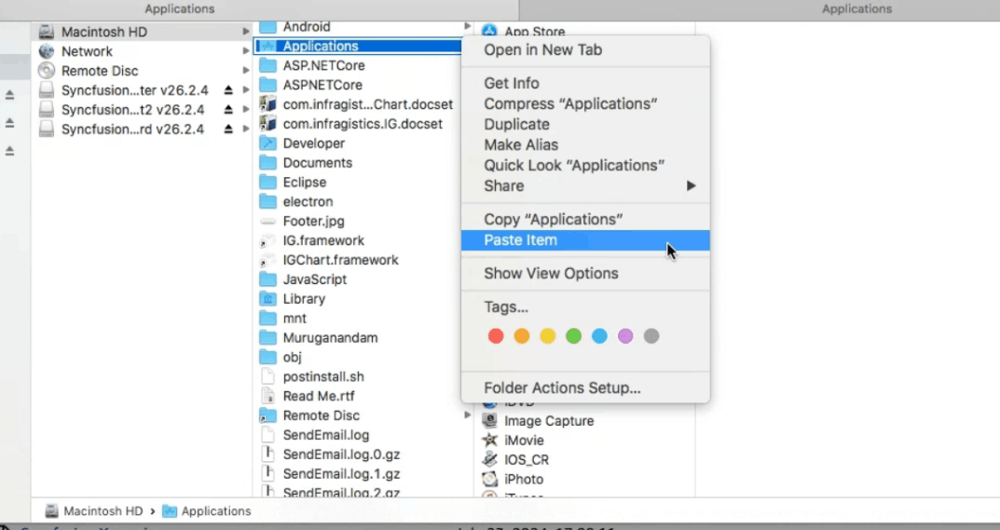
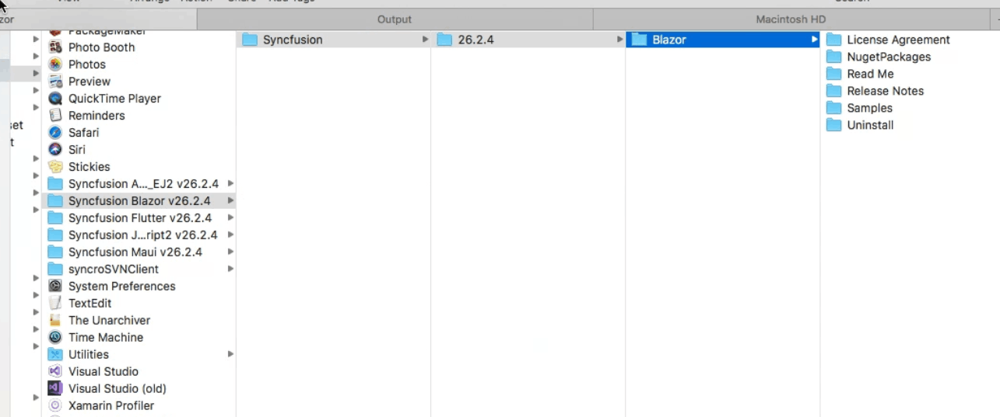
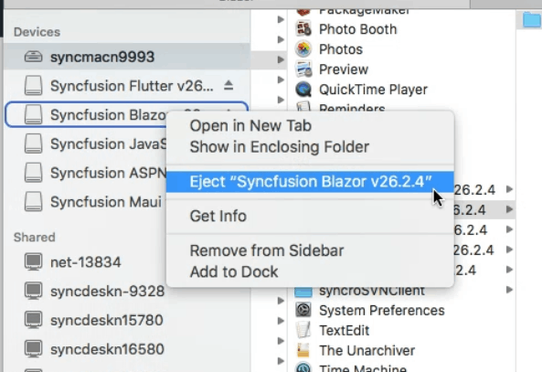

# Install the Syncfusion® Blazor Mac installer

The Essential Studio&reg; Blazor Mac installer installs the Syncfusion Blazor product on macOS (DMG) and integrates with Visual Studio for Mac. The steps below cover Gatekeeper prompts, installation, and license key registration for sample projects.

## Resolve Gatekeeper warning on macOS Catalina or later

   When running the installer on macOS Catalina or later, a Gatekeeper alert may appear.

     
     
   If this appears, follow these steps:

   1. Right‑click the downloaded DMG file.
   2. Select Open option and choose **DiskImageMounter (Default)**. The following prompt appears.

      

   3. Select Open to mount the DMG and continue.

## Install on macOS

Follow these steps to install the Essential Studio&reg; Blazor Mac installer.

1. Locate the downloaded DMG file and double‑click it to open.

   

2. The disk image mounts and a virtual drive appears on the desktop or in the Finder sidebar.

   

3. Copy the mounted disk file.

   

   N> An unlock key is not required to install the Essential Studio&reg; Blazor Mac installer.

4. And paste it in “Applications” folder.

   

5. Open the Applications folder and launch the Syncfusion installer app.

   

6. To remove the DMG, right‑click the virtual drive (desktop or Finder sidebar) and select Eject. Also delete the folder from the Applications.

   

## Register the license key in sample projects

After the installation, the license key is required to register the demo source that is included in the Mac installer. To learn about the steps for license registration for the Blazor Mac installer, please refer to this.

- **Blazor Server App**: Register the license key in [Startup.cs](https://blazor.syncfusion.com/documentation/getting-started/license-key/how-to-register-in-an-application#blazor-server-app)
- **Blazor WebAssembly App**: Register the license key in [Program.cs](https://blazor.syncfusion.com/documentation/getting-started/license-key/how-to-register-in-an-application#blazor-webassembly-app)

For development on macOS, see:
You can also find the steps for getting started with Syncfusion&reg; Blazor components in Mac,

- Getting started with Syncfusion Blazor components in a [Blazor Server App](https://blazor.syncfusion.com/documentation/getting-started/blazor-server-side-mac/#getting-started-with-syncfusion-blazor-components-in-blazor-server-side-app-using-visual-studio-for-mac) using Visual Studio for Mac.
- Getting started with Syncfusion Blazor components in a [Blazor WebAssembly App](https://blazor.syncfusion.com/documentation/getting-started/blazor-webassembly-visual-studio-mac/) using Visual Studio for Mac.