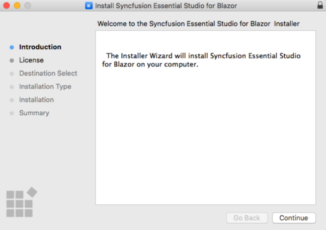
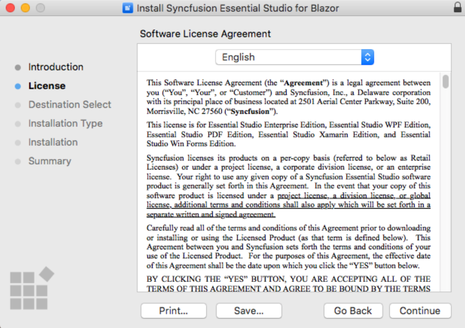
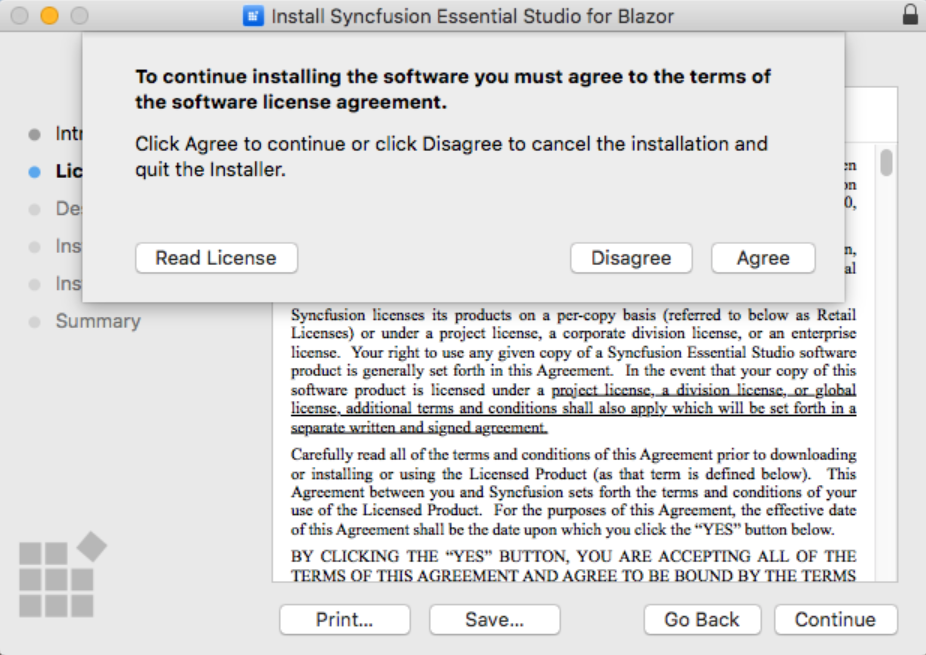
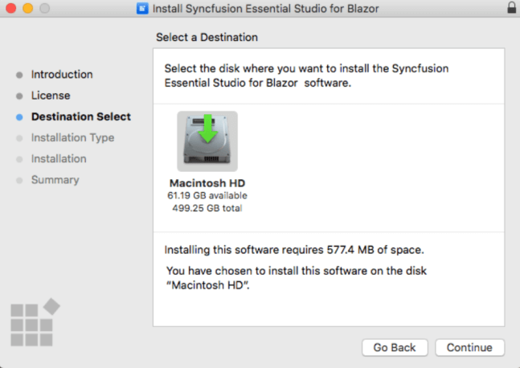
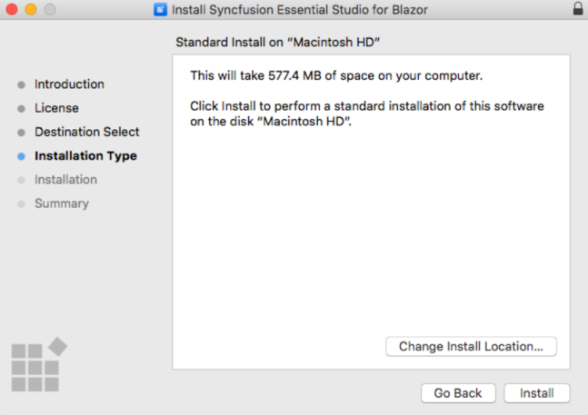
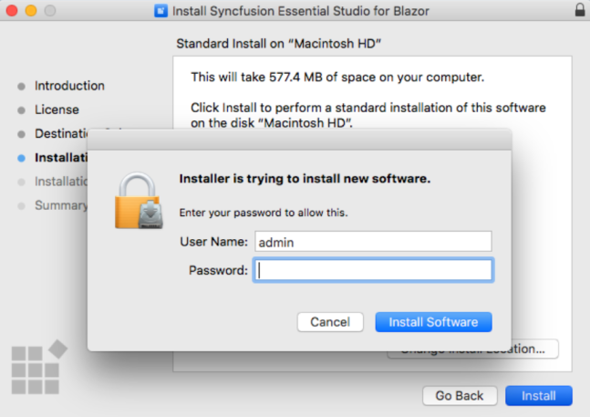
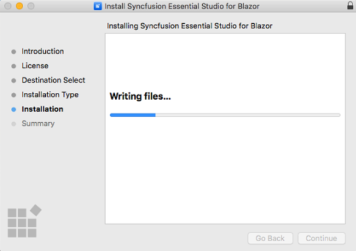
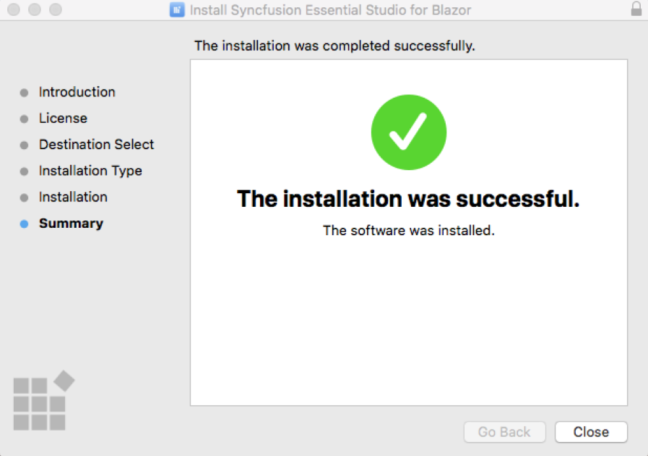
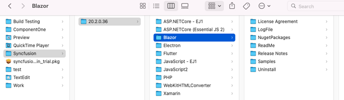

# Installing Syncfusion Blazor Mac Installer

The Essential Studio Blazor Mac installer allows you to create the Blazor application in Visual Studio for Mac with the Syncfusion Blazor components.

## Steps to resolve the warning message in Catalina OS or later

   While running Essential Studio Blazor Mac Installer on Catalina MacOS or later, the below alert will be displayed.

     
     
   If you receive this alert, follow the below steps for the easiest solution.   

   1.	Right-click the downloaded pkg file.
   2.	Select the "Open With" option and choose "Installer (Default)". The following pop-up appears.
   
		
   
   3.	When you click "Open" the installer window will be opened.

## Step-by-Step Installation

The steps below show how to install the Essential Studio Blazor Mac installer.

1. Open Syncfusion Essential Studio Blazor Mac Installer(.pkg) file. The Installer Wizard opens. Click Continue.

   

2. The Software License Agreement wizard will appear. Click the Continue button.

   

3. The License Agreement’s Confirmation window will appear. If you have read the Software License Agreement, click Agree.

   

   N> The Unlock key is not required to install the Essential Studio Blazor Mac installer.

4. The Destination select wizard will appear. You can choose which disc to install the Syncfusion Essential Studio for Blazor installer on here.

   

5. The Installation Type wizard will appear. Click Install to begin the standard installation of the Syncfusion Essential Studio Blazor Mac installer.

   

6. The Authentication window will appear. To begin the installation, enter the Mac machine’s password and click Install Software.

   

7. The installation process will begin on your machine.

   

8. Once the installation is complete, the completed screen will be displayed. To exit the installation wizard, click Close.

   

   By default, Mac installer will install the files in following location.
   Location: {Documents}/Syncfusion/{version}/Blazor

   

## License key registration in samples

After the installation, the license key is required to register the demo source that is included in the Mac installer. To learn about the steps for license registration for the Blazor Mac installer, please refer to this.

* For server side application register the license key in Configure method of [Startup.cs](https://blazor.syncfusion.com/documentation/getting-started/license-key/how-to-register-in-an-application#blazor-server-app)
* For client side application register the license key in main method of [Program.cs](https://blazor.syncfusion.com/documentation/getting-started/license-key/how-to-register-in-an-application#blazor-webassembly-app)

You can also find the steps for getting started with Syncfusion Blazor components in Mac,

* Getting started with Syncfusion Blazor Components in [Blazor Server Side App](https://blazor.syncfusion.com/documentation/getting-started/blazor-server-side-mac/#getting-started-with-syncfusion-blazor-components-in-blazor-server-side-app-using-visual-studio-for-mac) using Visual Studio for Mac.
* Getting started with Syncfusion Blazor Components in [Web Assembly App](https://blazor.syncfusion.com/documentation/getting-started/blazor-webassembly-visual-studio-mac/) using Visual Studio for Mac.