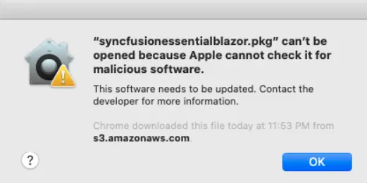
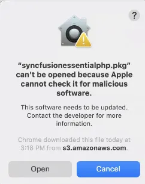
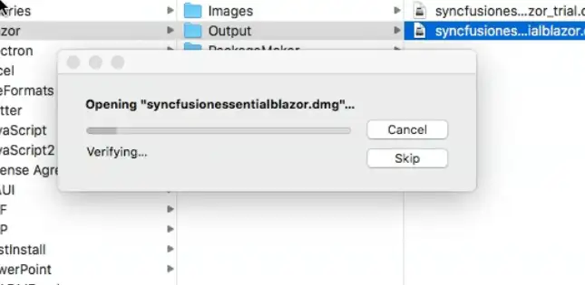
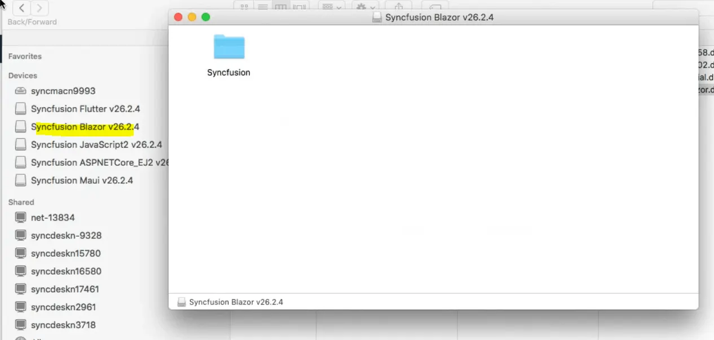
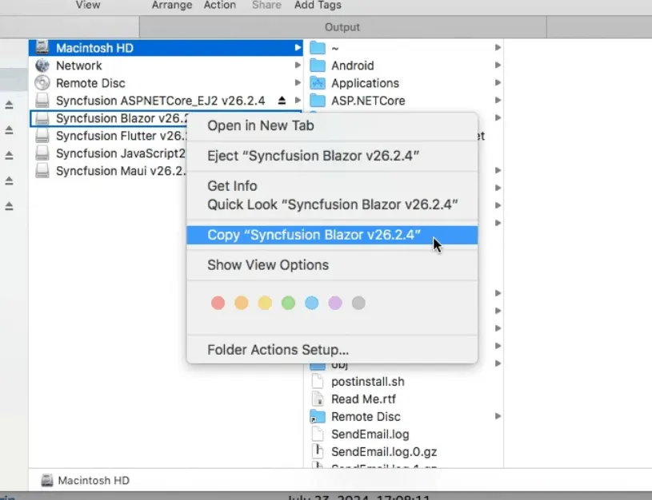
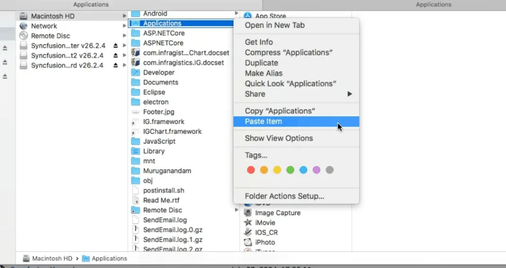
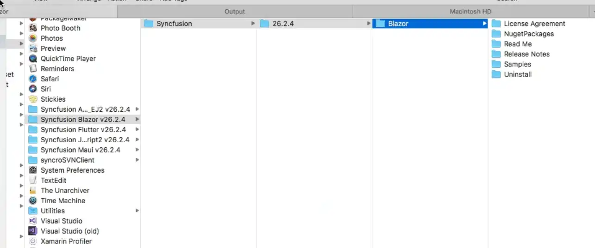
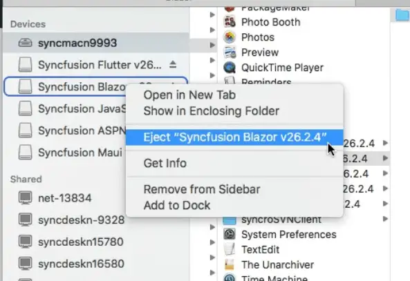

# Install the Syncfusion® Blazor Mac installer

The Essential Studio&reg; Blazor Mac installer installs the Blazor product on macOS (DMG) and integrates with Visual Studio for Mac. The steps below cover Gatekeeper prompts, installation, and license key registration for sample projects.

## Prerequisites

Before you begin, confirm the following:

* A supported version of macOS is installed. See the [.NET supported OS list](https://learn.microsoft.com/en-us/dotnet/core/install/macos) for details.
* The .NET SDK that matches the target Syncfusion Blazor version is installed and available on `PATH`. Verify with `dotnet --version`.
* You have administrator rights on the Mac to install applications and modify security settings.
* The downloaded Blazor Mac installer DMG is available locally. If you have not downloaded it yet, see [Download the Blazor Mac installer](https://blazor.syncfusion.com/documentation/installation/mac-installer/how-to-download).
* Visual Studio for Mac is installed if you intend to open the included sample projects. See [Install Visual Studio for Mac](https://learn.microsoft.com/en-us/visualstudio/mac/installation) for details.

## Resolve the Gatekeeper warning on macOS Catalina or later

When running the installer on macOS Catalina or later, a Gatekeeper alert may appear.

If this appears, follow these steps:

1. Right‑click the downloaded DMG file.
2. Select **Open** and choose **DiskImageMounter (Default)**. The following prompt appears.

   

3. Select **Open** to mount the DMG and continue.

## Install on macOS

1. Locate the downloaded DMG file and double‑click it to open.

   

2. The disk image mounts and a virtual drive appears on the desktop or in the Finder sidebar.

   

3. Copy the mounted disk file.

   

   N> An unlock key is not required to install the Essential Studio&reg; Blazor Mac installer.

4. Paste the copied file into the **Applications** folder.

   

5. Open the **Applications** folder and launch the installer app.

   

6. Eject the mounted DMG by right‑clicking the virtual drive (on the desktop or in the Finder sidebar) and selecting **Eject**. Then delete the installer file from the **Applications** folder if you do not need it.

   

## Register the license key in sample projects

After installation, a license key is required to register the demo source included in the Mac installer. The license key is applied in the entry point of your Blazor application.

* **Blazor Server App**: Register the license key in the `Configure` method of [Startup.cs](https://blazor.syncfusion.com/documentation/getting-started/license-key/how-to-register-in-an-application#blazor-server-app).
* **Blazor WebAssembly App**: Register the license key in the `Main` method of [Program.cs](https://blazor.syncfusion.com/documentation/getting-started/license-key/how-to-register-in-an-application#blazor-webassembly-app).

For the complete registration steps, see [Register the license key in an application](https://blazor.syncfusion.com/documentation/getting-started/license-key/how-to-register-in-an-application).

## Getting Started

To learn how to use the Syncfusion&reg; Blazor components in your application on macOS, refer to the following getting started topics:

* Getting started with Syncfusion&reg; Blazor components in a [Blazor Server app](https://blazor.syncfusion.com/documentation/getting-started/blazor-server-side-mac) using Visual Studio for Mac.
* Getting started with Syncfusion&reg; Blazor components in a [Blazor WebAssembly app](https://blazor.syncfusion.com/documentation/getting-started/blazor-webassembly-visual-studio-mac) using Visual Studio for Mac.