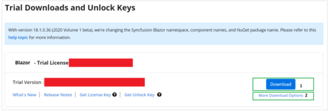
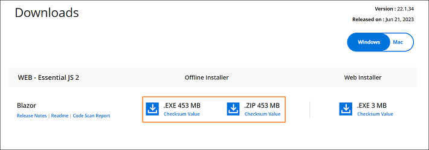
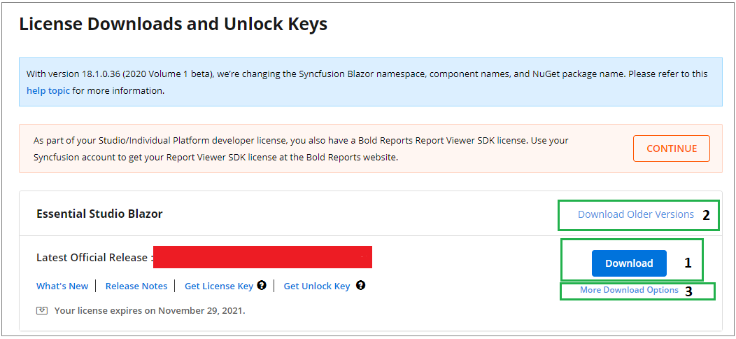

# Download the Syncfusion® Blazor offline installer

Download the offline installer from the Syncfusion&reg; website. Download options depend on the account status: trial or licensed.

* Trial Installer
* Licensed Installer

## Download the trial version

A 30‑day trial can be downloaded in two ways.

* Download Free Trial Setup
* Start Trials if using components through [NuGet.org](https://www.nuget.org/packages?q=syncfusion)

### Download the free trial setup

1. Visit the [Download Free Trial](https://www.syncfusion.com/downloads) page and select the Blazor platform.

2. Complete the form or sign in with a registered Syncfusion&reg; account to download the Blazor trial installer from the confirmation page.

   

3. With a trial license, only the latest version’s trial installer can be downloaded.

4. After downloading, unlock the installer by using either the trial unlock key or by signing in with registered Syncfusion credentials. See [How to generate an unlock key](https://www.syncfusion.com/kb/8069/how-to-generate-unlock-key-for-essentials-studio-products) for more information.

5. Before the trial expires, download the trial installer at any time from the [Trials & Downloads](https://www.syncfusion.com/account/manage-trials/downloads) page.

   

6. Select **More download options** (element 2 in the above screenshot) to get the Essential Studio&reg; Blazor offline trial installer in EXE or ZIP format.

   

### Start trials if using components through NuGet.org

Start an evaluation if components were obtained through [NuGet.org](https://www.nuget.org/packages?q=syncfusion).

1. Start a 30‑day Blazor trial from the [Start trials](https://www.syncfusion.com/account/manage-trials/start-trials) page.

   

2. To access this page, you must sign up/log in with your Syncfusion&reg; account.

3. Begin the trial by selecting the Blazor product.

   N> If an existing Blazor trial is still active, a new trial for the same product cannot be started.

4. After starting the trial, go to [Trials & Downloads](https://www.syncfusion.com/account/manage-trials/downloads) page to get the latest trial installer. Generate the installer [unlock key](https://www.syncfusion.com/kb/8069/how-to-generate-unlock-key-for-essentials-studio-products) and the project [license key](https://blazor.syncfusion.com/documentation/getting-started/license-key/how-to-generate) before the trial period expires.

   

5. You can find your current active trial products on the [Trials & Downloads](https://www.syncfusion.com/account/manage-trials/downloads) page.

## Download the licensed version

1. Licensed products are available from the [License & Downloads](https://www.syncfusion.com/account/downloads) page in the Syncfusion account.

2. You can view all the licenses (both active and expired) associated with your account.

3. Select **More download options** to download the Blazor licensed offline installer.

   

4. For Windows, EXE and ZIP formats are available for download. Both are offline installers.

   

For step-by-step installation, see [Offline installer](https://blazor.syncfusion.com/documentation/installation/offline-installer/how-to-install).
