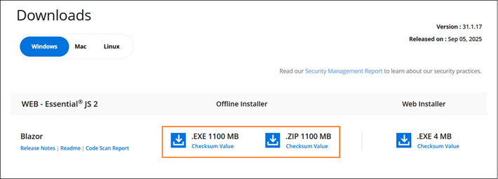

# Downloading Syncfusion Blazor offline installer

The Syncfusion Blazor offline installer can be downloaded from the [Syncfusion](https://www.syncfusion.com/blazor-components) website. You can either download the licensed installer or try our trial installer depending on your license.

* Trial Installer
* Licensed Installer

## Download the Trial Version

Our 30-day trial can be downloaded in two ways.

* Download Free Trial Setup
* Start Trials if using components through [NuGet.org](https://www.nuget.org/packages?q=syncfusion)

### Download Free Trial Setup

1. You can evaluate our 30-day free trial by visiting the [Download Free Trial](https://www.syncfusion.com/downloads) page and select the Blazor platform.

2. After completing the required form or logging in with your registered Syncfusion account, you can download the Blazor trial installer from the confirmation page. (as shown in below screenshot.)

   

3. With a trial license, only the latest version’s trial installer can be downloaded.

4. After downloading, the Syncfusion Blazor trial installer can be unlocked using either the trial unlock key or the Syncfusion registered login credential. More information on generating an unlock key can be found in [this](https://www.syncfusion.com/kb/8069/how-to-generate-unlock-key-for-essentials-studio-products) article.

5. Before the trial expires, you can download the trial installer at any time from your registered account’s [Trials & Downloads](https://www.syncfusion.com/account/manage-trials/downloads) page (as shown in below screenshot.)

   

6. Click the More Download Options (element 2 in the above screenshot) button to get the Essential Studio Blazor Offline trial installer which is available in EXE and ZIP format.

   

### Start Trials if using components through NuGet.org

You should initiate an evaluation if you have already obtained our components through [NuGet.org](https://www.nuget.org/packages?q=syncfusion)

1. You can start your 30-day free trial for Blazor from the [Start Trial](https://www.syncfusion.com/account/manage-trials/start-trials) page from your account.

   

2. To access this page, you must sign up\log in with your Syncfusion account.

3. Begin your trial by selecting the Blazor product.

   > **Note**   If you’ve already used the trial products and they haven’t expired, you won’t be able to start the trial for the same product again.

4. After you’ve started the trial, go to the [Trials & Downloads](https://www.syncfusion.com/account/manage-trials/downloads) page to get the latest version trial installer. You can generate the [unlock key](https://www.syncfusion.com/kb/8069/how-to-generate-unlock-key-for-essentials-studio-products) and [license key](https://blazor.syncfusion.com/documentation/getting-started/license-key/how-to-generate) here at any time before the trial period expires. (as shown in below screenshot.)

   

5. You can find your current active trial products on the [Trials & Downloads](https://www.syncfusion.com/account/manage-trials/downloads) page.

## Download the License Version

1. Syncfusion licensed products will be available in the [License & Downloads](https://www.syncfusion.com/account/downloads) page under your registered Syncfusion account.

2. You can view all the licenses (both active and expired) associated with your account.

3. You can download Blazor licensed offline installer by going to More Downloads Options (element 3 in the screenshot below).

   

4. For Windows OS, EXE and Zip formats are available for download. They are both Offline Installers.

   

You can also refer to the [Offline installer](https://blazor.syncfusion.com/documentation/installation/offline-installer/how-to-install) link for step-by-step installation guidelines.
