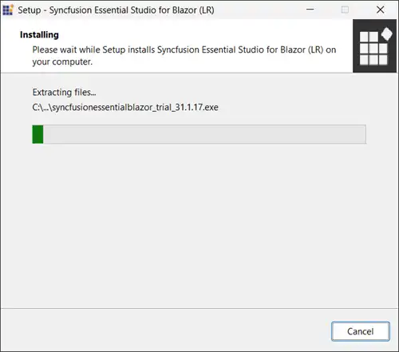
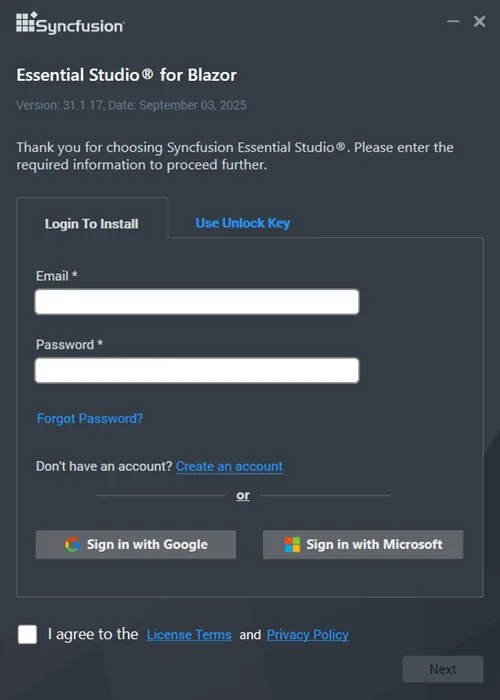
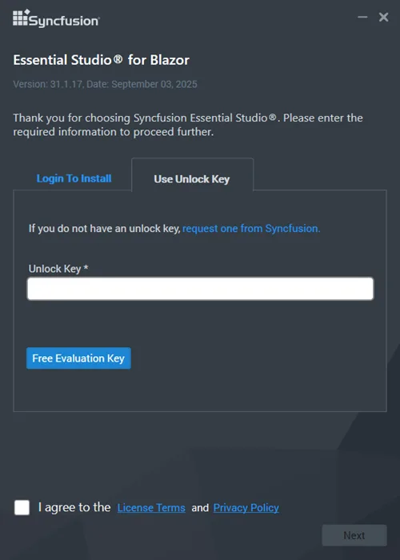
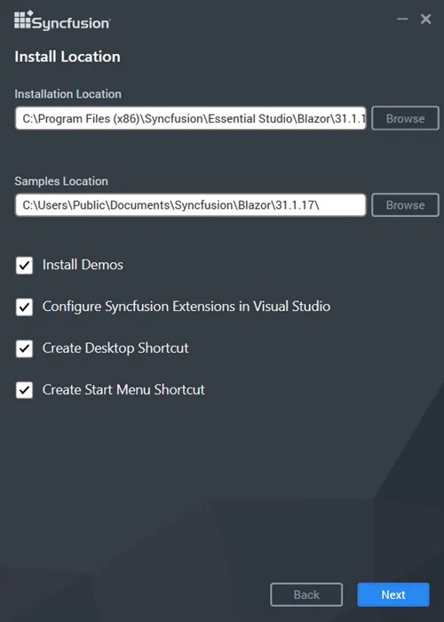
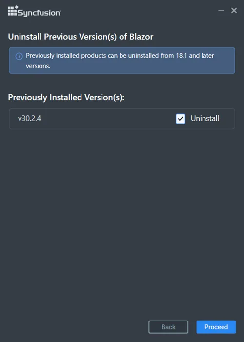
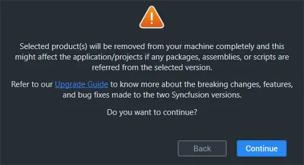
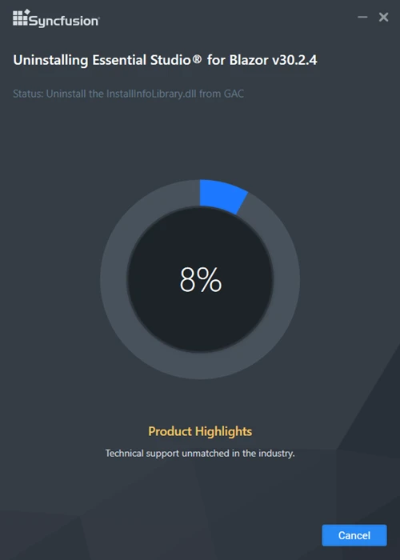
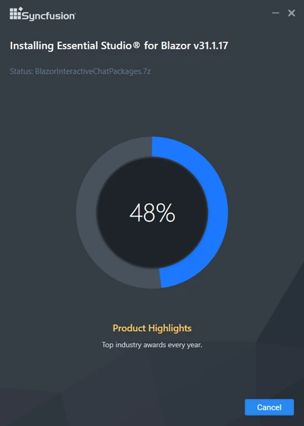
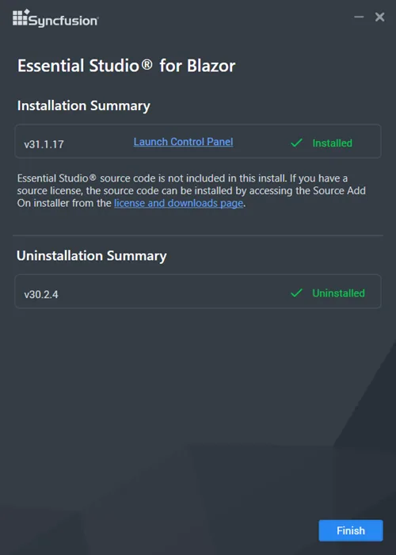

# Install the Syncfusion® Blazor Offline Installer

The Essential Studio<sup style="font-size:70%">&reg;</sup> Blazor offline installer is available in EXE or ZIP format and can be installed either through the user interface or silently from the command line. The sections below cover both approaches, including how to unlock the installer and how to uninstall from the command line.

## Prerequisites

Before you begin, confirm the following:

* A supported Windows version is installed. See the [system requirements](https://blazor.syncfusion.com/documentation/system-requirements) for details.
* The .NET SDK that matches the target Syncfusion Blazor version is installed.
* You are signed in to Windows with administrator rights.
* The downloaded Blazor offline installer is available locally. If you have not downloaded it yet, see [Download the Blazor offline installer](https://blazor.syncfusion.com/documentation/installation/offline-installer/how-to-download).
* A trial unlock key, a licensed unlock key, or valid Syncfusion<sup style="font-size:70%">&reg;</sup> account credentials are available to unlock the installer. See [How to generate an unlock key](https://www.syncfusion.com/kb/8069/how-to-generate-unlock-key-for-essentials-studio-products) for details.

## Install with the User Interface

The steps below show how to install the Essential Studio<sup style="font-size:70%">&reg;</sup> Blazor offline installer.

1. Open the Blazor offline installer (`.exe`) from the download location by double-clicking it. The installer wizard opens and extracts the package.

   

   N> The installer extracts `syncfusionessentialblazor_(version).exe` and displays the extraction progress (the unzip operation).

2. To unlock the offline installer, choose one of the following options:

   * **Login to Install**
   * **Use Unlock Key**

   **Login to Install**

   Enter your account email address and password. If you do not already have an account, you can sign up for one by selecting **Create an account**. If you have forgotten your password, select **Forgot Password** to create a new one. Once you have entered your Syncfusion<sup style="font-size:70%">&reg;</sup> email and password, select **Next**.

   

   **Use Unlock Key**

   Unlock keys unlock the Syncfusion<sup style="font-size:70%">&reg;</sup> offline installer, and they are platform and version specific. Use either a Syncfusion<sup style="font-size:70%">&reg;</sup> licensed or trial unlock key to unlock the Syncfusion Blazor installer.

   The trial unlock key is valid for 30 days; expired keys are not accepted.

   To learn how to generate an unlock key for both trial and licensed products, see the [How to generate an unlock key](https://www.syncfusion.com/kb/2326) Knowledge Base article.

   

3. Read the License Terms and Privacy Policy, then select **I agree to the License Terms and Privacy Policy** and select **Next**.
4. Change the install and sample locations as needed. Adjust additional settings if required. Select **Next** or **Install** to continue with defaults.

   

   **Additional settings**

   * Select **Install demos** to install Syncfusion<sup style="font-size:70%">&reg;</sup> samples, or clear it to skip sample installation.
   * Select **Configure Syncfusion Extensions controls in Visual Studio** to configure extensions, or clear it to skip configuration.
   * Select **Create Desktop Shortcut** to add a shortcut for Control Panel.
   * Select **Create start menu shortcut** to add a Start menu entry for Control Panel.

5. If a previous version of the current product is installed, the **Uninstall previous versions** wizard opens. Select **Uninstall** to remove the previous versions, then select **Proceed**.

   

   N> Starting with the 2021 Volume 1 release, the option to uninstall previous versions from 18.1 has been added while installing the new version. If any version is selected to uninstall, a confirmation screen will appear. If **Continue** is selected, the **Progress** screen displays the uninstall and install progress, respectively. If none of the versions are chosen to be uninstalled, only the installation progress is displayed.

   **Confirmation alert**

   

   **Uninstall progress**

   

   **Install progress**

   

   N> The **Completed** screen appears after installation. If versions were uninstalled, it shows both uninstall and install status.

   

6. After installation, select **Launch Control Panel** to open the Control Panel.
7. Select **Finish**. The Essential Studio<sup style="font-size:70%">&reg;</sup> Blazor product is installed.

## Install in Silent Mode

The Essential Studio<sup style="font-size:70%">&reg;</sup> Blazor installer supports silent installation and uninstallation via the command line.

### Command-Line Installation

To install through the command line in silent mode, follow these steps:

1. Run the Blazor installer by double-clicking it. The installer wizard opens and extracts the package.
2. The `syncfusionessentialblazor_(version).exe` file is extracted into the Temp directory.
3. Open the Temp folder by running `%temp%` from the **Run** dialog. The `syncfusionessentialblazor_(version).exe` file is located in one of the folders.
4. Copy the extracted `syncfusionessentialblazor_(version).exe` file to a local drive.
5. Exit the wizard.
6. Open Command Prompt as administrator and run the installer with the following arguments:

   **Arguments**

   ```
   "installer file path\SyncfusionEssentialStudio(product)_(version).exe" /Install silent /UNLOCKKEY:"(product unlock key)" [/log "{Log file path}"] [/InstallPath:{Location to install}] [/InstallSamples:{true/false}] [/CreateShortcut:{true/false}] [/CreateStartMenuShortcut:{true/false}]
   ```

   N> Arguments inside square brackets are optional.

   **Example**

   ```
   "D:\Temp\syncfusionessentialblazor_x.x.x.x.exe" /Install silent /UNLOCKKEY:"product unlock key" /log "C:\Temp\EssentialStudio_Product.log" /InstallPath:C:\Syncfusion\x.x.x.x /InstallSamples:true /CreateShortcut:true /CreateStartMenuShortcut:true
   ```

7. Essential Studio<sup style="font-size:70%">&reg;</sup> for Blazor is installed.

   N> Replace `x.x.x.x` with the Essential Studio<sup style="font-size:70%">&reg;</sup> version, and replace the product unlock key with the unlock key for that version.

### Command-Line Uninstallation

Essential<sup style="font-size:70%">&reg;</sup> Blazor can be uninstalled silently using the command line.

1. Run the Blazor installer by double-clicking it. The installer wizard opens and extracts the package.
2. The `syncfusionessentialblazor_(version).exe` file is extracted into the Temp directory.
3. Open the Temp folder by running `%temp%` from the **Run** dialog. The `syncfusionessentialblazor_(version).exe` file is located in one of the folders.
4. Copy the extracted `syncfusionessentialblazor_(version).exe` file to a local drive.
5. Exit the wizard.
6. Run Command Prompt in administrator mode and enter the following arguments.

   **Arguments**

   ```
   "Copied installer file path\syncfusionessentialblazor_(version).exe" /uninstall silent
   ```

   **Example**

   ```
   "D:\Temp\syncfusionessentialblazor_x.x.x.x.exe" /uninstall silent
   ```

7. Essential Studio<sup style="font-size:70%">&reg;</sup> for Blazor is uninstalled.
