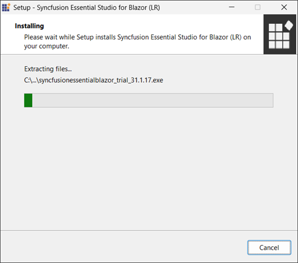
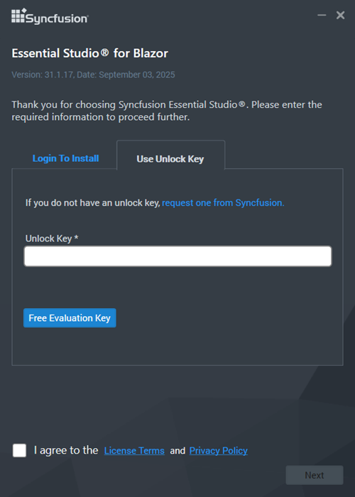
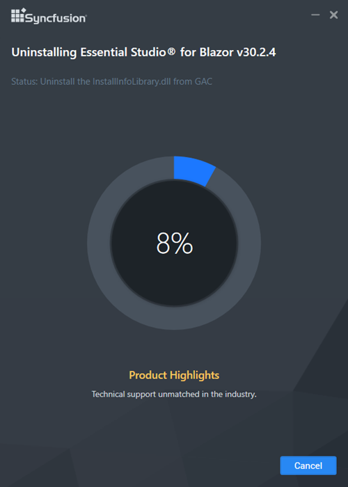
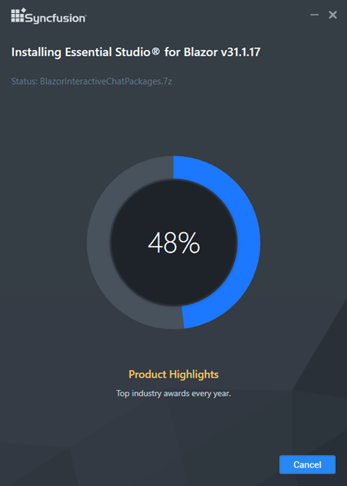

# Install the Syncfusion® Blazor offline installer

## Install with the user interface

The steps below show how to install the Essential Studio&reg; Blazor offline installer.

1. Open the Syncfusion&reg; Blazor offline installer file(.exe) from the download location by double‑clicking it. The installer wizard opens and extracts the package.

   

   N> The installer extracts syncfusionessentialblazor_(version).exe and displays the extraction progress(unzip operation).

2. To unlock the offline installer, choose one of the following options:

   * *Login To Install*
   * *Use Unlock Key*

   **Login to install:**

   Enter the Syncfusion&reg; account email address and password. If you don’t already have a Syncfusion&reg; account, you can sign up for one by clicking "**Create an account**". If you have forgotten your password, click on "**Forgot Password**" to create a new one. Once you’ve entered your Syncfusion&reg; email and password, click Next.

   

   **Use unlock key:**

   Unlock keys unlock the Syncfusion&reg; offline installer, and they are platform and version specific. You should use either Syncfusion&reg; licensed or trial Unlock key to unlock Syncfusion&reg; Blazor installer.

   The trial unlock key is valid for 30 days; expired keys are not accepted.

   To learn how to generate an unlock key for both trial and licensed products, see [this](https://www.syncfusion.com/kb/2326) Knowledge Base article.

   

3. Read the License Terms and Privacy Policy, then select **I agree to the License Terms and Privacy Policy**. Select **Next**.

4. Change the install and sample locations as needed. Adjust additional settings if required. Select **Next** or **Install** to continue with defaults.

   

   ***Additional settings***

   * Select **Install demos** to install Syncfusion&reg; samples, or clear it to skip sample installation.

   * Select **Configure Syncfusion Extensions controls in Visual Studio** to configure extensions, or clear it to skip configuration.

   * Select **Create Desktop Shortcut** to add a shortcut for Syncfusion&reg; Control Panel.

   * Select **Create Start menu shortcut** to add a shortcut to the Start menu entry for Syncfusion&reg; Control Panel.

5. If previous versions of the current product is installed, the Uninstall previous versions wizard opens. Select **Uninstall** to remove the previous versions, then select **Proceed**.

   

   N> From the 2021 Volume 1 release, Syncfusion&reg; has added the option to uninstall previous versions from 18.1 while installing the new version.     If any version is selected to uninstall, a confirmation screen will appear; if continue is selected, the Progress screen will display the uninstall and install progress, respectively. If none of the versions are chosen to be uninstalled, only the installation progress will be displayed.

   **Confirmation alert:**

   

   **Uninstall progress:**

   

   ***Install progress***

   

   N> The Completed screen appears after installation. If versions were uninstalled, it shows both uninstall and install status.

   

6. After installation, select **Launch Control Panel** to open the Syncfusion&reg; Control Panel.

7. Select **Finish**. The Syncfusion&reg; Essential Studio&reg; Blazor product is installed.

## Install in silent mode

The Syncfusion&reg; Essential Studio&reg; Blazor installer supports installation and uninstallation via the command line.

***Command-line installation***

To install through the Command Line in Silent mode, follow the steps below.

1. Run the Syncfusion&reg; Blazor installer by double-clicking it. The Installer Wizard automatically opens and extracts the package.

2. The file syncfusionessentialblazor_(version).exe file will be extracted into the Temp directory.

3. Run %temp%. The Temp folder will be opened. The syncfusionessentialblazor_(version).exe file will be located in one of the folders.

4. Copy the extracted syncfusionessentialblazor_(version).exe file in local drive.

5. Exit the Wizard.

6. Open Command Prompt as administrator and run the installer with arguments:

   **Arguments:** "installer file path\SyncfusionEssentialStudio(product)_(version).exe" /Install silent /UNLOCKKEY:"(product unlock key)" [/   log "{Log file path}"] [/InstallPath:{Location to install}] [/InstallSamples:{true/false}] [/CreateShortcut:{true/false}] [/   CreateStartMenuShortcut:{true/false}]

   N> [..] – Arguments inside the square brackets are optional.

   **Example:** "D:\Temp\syncfusionessentialblazor_x.x.x.x.exe" /Install silent /UNLOCKKEY:"product unlock key" /log    "C:\Temp\EssentialStudio_Product.log" /InstallPath:C:\Syncfusion\x.x.x.x /InstallSamples:true /CreateShortcut:true /   CreateStartMenuShortcut:true

7. Essential Studio&reg; for Blazor is installed.

   N> x.x.x.x should be replaced with the Essential Studio&reg; version and the Product Unlock Key needs to be replaced with the Unlock Key for that version.

## Command-line uninstallation

Syncfusion&reg; Essential&reg; Blazor can be uninstalled silently using the Command Line.

1. Run the Syncfusion&reg; Blazor installer by double-clicking it. The Installer Wizard automatically opens and extracts the package.

2. The file syncfusionessentialblazor_(version).exe file will be extracted into the Temp directory.

3. Run %temp%. The Temp folder will be opened. The syncfusionessentialblazor_(version).exe file will be located in one of the folders.

4. Copy the extracted syncfusionessentialblazor_(version).exe file in local drive.

5. Exit the Wizard.

6. Run Command Prompt in administrator mode and enter the following arguments.   
**Arguments:** "Copied installer file path\syncfusionessentialblazor_(version).exe" /uninstall silent    
**Example:** "D:\Temp\syncfusionessentialblazor_x.x.x.x.exe" /uninstall silent

7. Essential Studio&reg; for Blazor is uninstalled.
