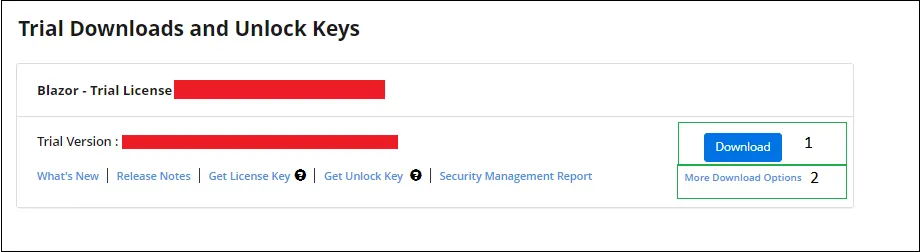
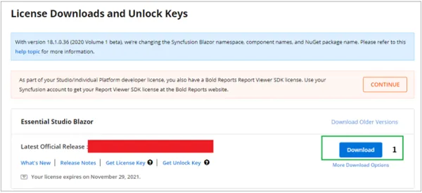
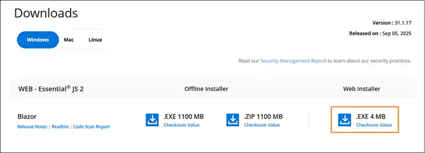

# Download the Syncfusion® Blazor Web Installer

> **Prerequisites:**
> * A registered Syncfusion&reg; account is required to download any Syncfusion Blazor installer.
> * Confirm that your machine meets the supported OS and .NET version requirements for the Syncfusion Blazor version you are installing. See the [system requirements](https://blazor.syncfusion.com/documentation/system-requirements) for details.
> * For licensed downloads, an active Blazor license must be assigned to your account in the Syncfusion account portal.

The Blazor web installer is available as a trial or a licensed installer, depending on your account status. The sections below describe both download paths. Trial downloads provide a 30‑day evaluation and only the latest version is available.

N> For Syncfusion&reg; trial and licensed products, there is no separate web installer. Based on your account license, the Syncfusion&reg; trial or licensed product is installed via the web installer.

## Download the Free Trial Version

The 30‑day trial installer can be downloaded from your Syncfusion account. If you obtained Syncfusion components through NuGet, see [Start Trials If Using Components Through NuGet.org](https://www.nuget.org/packages?q=syncfusion).

### Download the Free Trial Setup

1. Visit the [Download Free Trial](https://www.syncfusion.com/downloads) page and select **Blazor**.
2. Complete the form or sign in with a registered Syncfusion&reg; account. After submission, the Blazor trial installer becomes available on the confirmation page.

   

3. After downloading, unlock the Blazor web installer by signing in with your Syncfusion&reg; account credentials.
4. During the 30‑day trial period, you can re-download the trial installer at any time from the [Trials & Downloads](https://www.syncfusion.com/account/manage-trials/downloads) page.

   

5. Select **Download** to get the Blazor web installer.

### Start Trials If Using Components Through NuGet.org

Use this path if you obtained Syncfusion components from [NuGet.org](https://www.nuget.org/packages?q=syncfusion) and only need an evaluation license key — no installer is required.

1. Start a 30‑day Blazor trial from the [Start trials](https://www.syncfusion.com/account/manage-trials/start-trials) page.
2. Sign in with a Syncfusion&reg; account, or sign up if you do not have one.
3. Select **Syncfusion Blazor** to begin the trial.

   N> If an existing Blazor trial is still active, a new trial for the same product cannot be started.

4. After starting the trial, go to the [Trials & Downloads](https://www.syncfusion.com/account/manage-trials/downloads) page to get the latest trial installer. Generate the installer [unlock key](https://support.syncfusion.com/kb/article/7053/how-to-generate-unlock-key-for-essentials-studio-products) and the project [license key](https://blazor.syncfusion.com/documentation/getting-started/license-key/how-to-generate) before the trial expires.

   

   N> A license key is required to use the trial components in your Blazor application. For more information about license keys, see the [licensing overview](https://help.syncfusion.com/common/essential-studio/licensing/overview).

5. Your current active trial products are listed on the [Trials & Downloads](https://www.syncfusion.com/account/manage-trials/downloads) page.

## Download the Licensed Version

Licensed installers are available to account holders with an active Syncfusion Essential Studio license assigned to their account.

1. Sign in to your Syncfusion&reg; account and open the [License & Downloads](https://www.syncfusion.com/account/downloads) page.
2. All licenses (both active and expired) associated with your account are listed.
3. Select **Download** to get the Blazor web installer.

   

4. During the active license period, you can re-download the installer at any time from the [License & Downloads](https://www.syncfusion.com/account/downloads) page.

   

5. After downloading, unlock the web installer by signing in with your Syncfusion&reg; account credentials.

## Next Steps

For step-by-step installation, see [Install the Blazor Web Installer](https://blazor.syncfusion.com/documentation/installation/web-installer/how-to-install).
