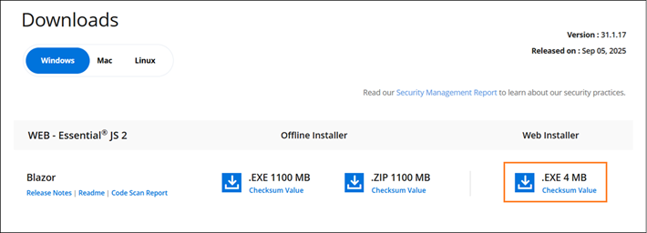

# Download the Syncfusion® Blazor web installer

Download the Syncfusion&reg; Blazor web installer from the [Syncfusion&reg; website](https://www.syncfusion.com/blazor-components). Download options depend on the account status: trial or licensed.

* Trial Installer
* Licensed Installer

## Download the free trial version

A 30‑day trial can be downloaded in two ways.

* Download Free Trial Setup
* Start Trials if using components through [NuGet.org](https://www.nuget.org/packages?q=syncfusion)

### Download the free trial setup

1. Visit the [Download Free Trial](https://www.syncfusion.com/downloads) page and select the Blazor platform.

2. After completing the required form or logging in with your registered Syncfusion&reg; account, you can download the Blazor trial installer from the confirmation page. (as shown in below screenshot.)

   

3. After downloading, unlock the Blazor web installer by signing in with the registered Syncfusion credentials.

4. Before the trial license expires, you can download the blazor installer at any time from your registered account’s [Trials & Downloads](https://www.syncfusion.com/account/manage-trials/downloads) page (as shown in below screenshot.)

5. Click Download to get the Blazor web installer.

   

### Start trials if using components through NuGet.org

Start an evaluation if components were obtained through [NuGet.org](https://www.nuget.org/packages?q=syncfusion).

1. Start a 30‑day Blazor trial from the [Start trials](https://www.syncfusion.com/account/manage-trials/start-trials) page.

   

2. To access this page, you must sign up/log in with your Syncfusion&reg; account.

3. Begin the trial by selecting the Blazor product.

   N> If an existing Blazor trial is still active, a new trial for the same product cannot be started.

4. After starting the trial, go to [Trials & Downloads](https://www.syncfusion.com/account/manage-trials/downloads) to get the latest trial installer. Generate the installer [unlock key](https://support.syncfusion.com/kb/article/7053/how-to-generate-unlock-key-for-essentials-studio-products) and the project [license key](https://blazor.syncfusion.com/documentation/getting-started/license-key/how-to-generate) before the trial period expires.

   

5. You can find your current active trial products on the [Trials & Downloads](https://www.syncfusion.com/account/manage-trials/downloads) page.

## Download the licensed version

1. Licensed products are available from the [License & Downloads](https://www.syncfusion.com/account/downloads) page in the registered Syncfusion&reg; account.

2. You can view all the licenses (both active and expired) associated with your account.

3. Click Download to get the Blazor web installer.

   

4. Before the license expires, you can download the installer at any time from your registered account’s [License & Downloads](https://www.syncfusion.com/account/downloads) page (See the screenshot below.)

   

5. After downloading, unlock the web installer by signing in with registered Syncfusion&reg; credentials.

N> For Syncfusion&reg; trial and licensed products, there is no separate web installer. Based on your account license, Syncfusion&reg; trial or licensed products will be installed via web installer.

For step-by-step installation, see Web installer: https://blazor.syncfusion.com/documentation/installation/web-installer/how-to-install
