# Install the Syncfusion® Blazor web installer

## Installation

The steps below show how to install the Essential Studio&reg; Blazor web installer.

1. Open the Syncfusion&reg; Essential Studio&reg; Blazor web installer (.exe) from the download location by double‑clicking it. The installer wizard opens and extracts the package.

   

   N> The installer extracts syncfusionessentialblazorwebinstaller_{version}.exe and displays the extraction progress.

2. The Syncfusion&reg; Blazor Web Installer’s ***welcome wizard*** will be displayed. Click **Next** button.

   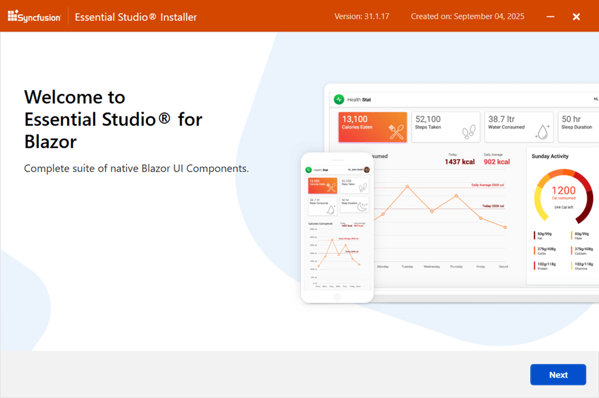

3. The ***Platform selection wizard*** appears. On the **Available** tab, select the products to install. To install all products, click **Install All**.

   ***Available***

   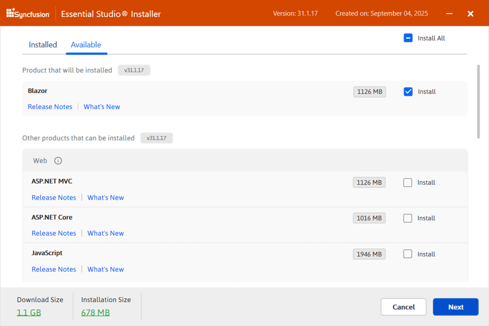

   If multiple products are already installed for the same version, they are listed under the **Installed** tab. You can also select products to uninstall from that version. Click **Next**.

   ***Installed***

   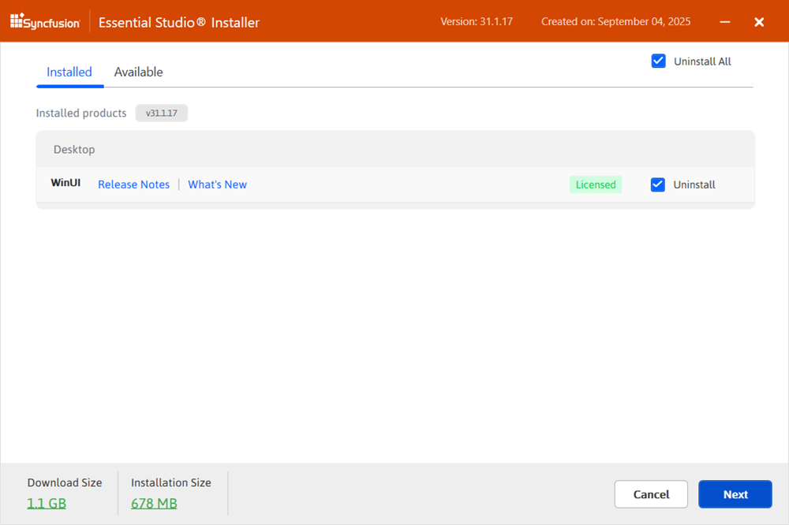

   I> If required software for a selected product is missing, an **Additional Software Required** alert appears. You can, however, continue the installation and install the necessary software later.

   ***Required Software***

   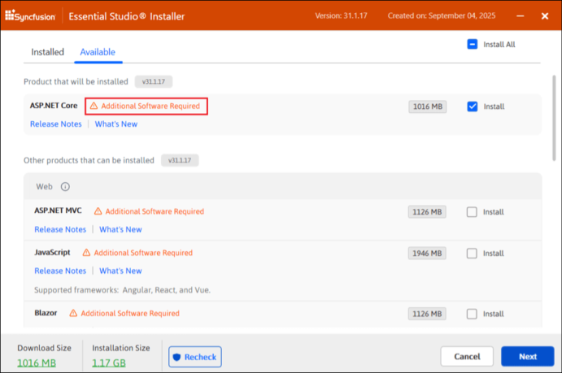

4. If previous versions of selected products are detected, the Uninstall previous versions wizard is displayed. Review the list and select **Uninstall All** to remove all prior versions. Click **Next**.

   

   N> From the 2021 Volume 1 release, Syncfusion&reg; has provided option to uninstall the previous versions from 18.1 while installing the new version.

5. A confirmation dialog is shown to uninstall the selected previous versions.

   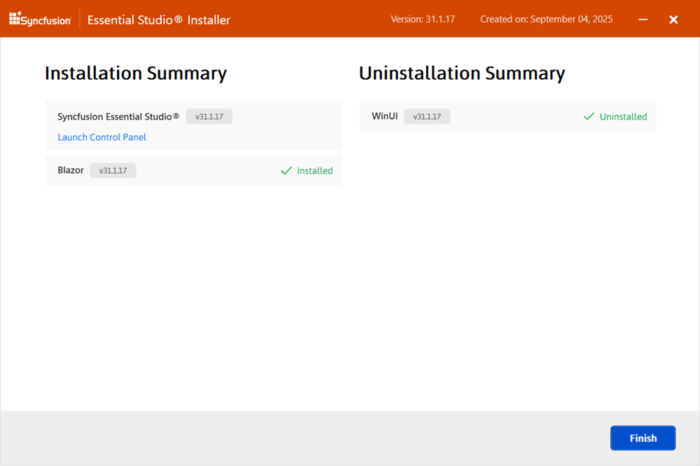

6. The ***Confirmation wizard*** lists products to be installed or uninstalled. Review and modify the list as needed.

   

   N> Click the **Download size** and **Installation size** links to view approximate sizes.

7. The ***Configuration Wizard*** will appear. You can change the Download, Install, and Demos locations from here. You can also change the Additional settings on a product-by-product basis. Click **Next** to install with the default settings.

   

   ***Additional settings***

   * Select **Install demos** to install Syncfusion samples, or clear it to skip sample installation.

   * Select **Configure Syncfusion extensions in Visual Studio** to configure extensions, or clear it to skip configuration.

   * Select **Create Desktop Shortcut** to add a shortcut for Syncfusion&reg; Control Panel.

   * Select **Create Start Menu Shortcut** to add a shortcut to the Start menu entry for Syncfusion&reg; Control Panel.

8. Read the License Terms and Privacy Policy, then select **I agree to the License Terms and Privacy Policy**. Click **Next**.

9. The Login wizard appears. Enter the Syncfusion account email and password. To create an account, select **Create an account**. To reset a password, select **Forgot password**. Click **Install**.

   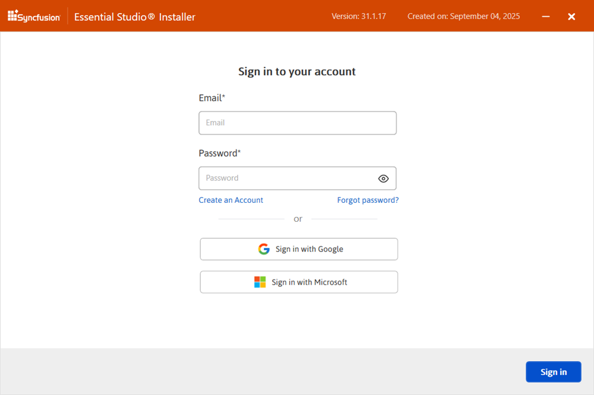

   I> Products are installed based on your syncfusion&reg; license (trial or licensed).

10. The download, installation, and uninstallation progress is displayed.
   
   To open the Syncfusion&reg; Control Panel, click **Launch Control Panel**.

11. When the installation is finished, the ***Summary wizard*** will appear. Here you can see the list of products that have been installed successfully and those that have failed. To close the Summary wizard, click **Finish**.

   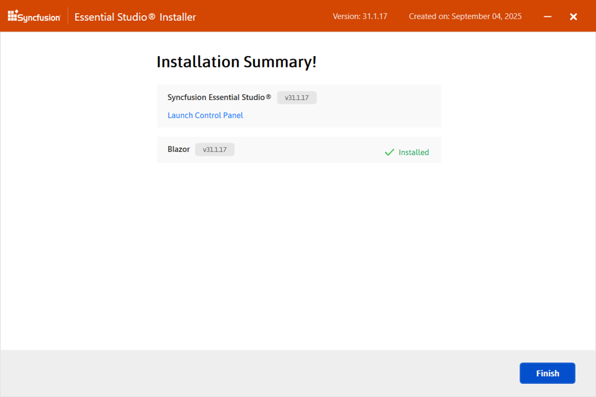

12. After installation, there will be two Syncfusion&reg; control panel entries, as shown below. The Essential Studio&reg; entry will manage all Syncfusion&reg; products installed in the same version, while the Product entry will only uninstall the specific product setup.

   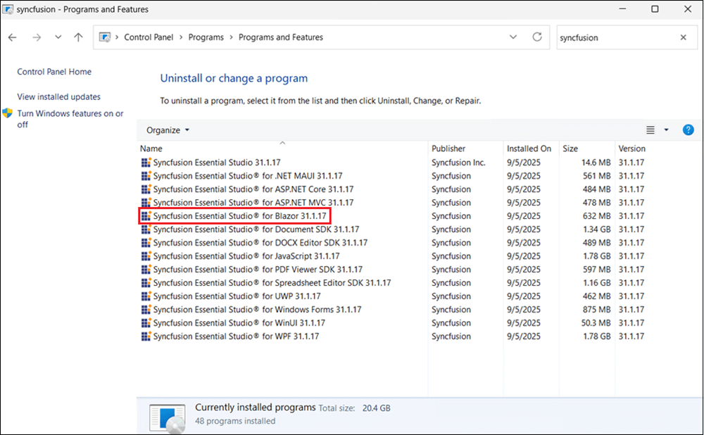

## Uninstallation

Syncfusion&reg; Blazor can be uninstalled in two ways.

* Uninstall using the Syncfusion&reg; Blazor web installer

* Uninstall from Windows Control Panel

Follow one of the options below to uninstall the Syncfusion&reg; Essential Studio&reg; Blazor installer.

**Option 1:** Uninstall using the Syncfusion&reg; Blazor web installer

Syncfusion&reg; provides the option to uninstall products of the same version directly from the Web Installer application. Open the Syncfusion&reg; Essential Studio&reg; Blazor Online Installer file from downloaded location by double-clicking it. Select the products to be uninstalled from the list, and Web Installer will uninstall them one by one.

**Option 2:** Uninstall from Windows Control Panel

You can uninstall all the installed products by selecting the **Syncfusion&reg; Essential Studio&reg; {version}** entry (element 1 in the below screenshot) from the Windows control panel, or you can uninstall Blazor alone by selecting the **Syncfusion&reg; Essential Studio&reg; for Blazor {version}** entry (element 2 in the below screenshot) from the Windows control panel.

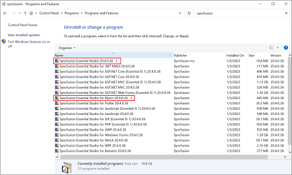

N> If the **Syncfusion&reg; Essential Studio&reg; for Blazor {version}** entry is selected from the Windows control panel, the Syncfusion&reg; Essential Studio&reg; Blazor alone will be removed and the below default MSI uninstallation window will be displayed.

1. The Blazor web installer **Welcome wizard** is displayed. Click **Next**.

   

2. The **Platform selection wizard** appears. On the **Installed** tab, select products to uninstall. To uninstall all, select **Uninstall All**. Click **Next**.

   ***Installed***

   

   You can also select products to install from the **Available** tab. Click **Next**.

   ***Available***

   

3. If other products are selected for installation, the ***Uninstall previous versions wizard*** shows any installed previous versions for those products. Select **Uninstall All** to remove all versions. Click **Next**.

   

4. A confirmation dialog is shown to uninstall the selected previous versions.

   

5. The **Confirmation Wizard** lists products to be installed or uninstalled. Review and modify as needed.

   

   N> By clicking the **Download Size and Installation** Size links, you can determine the approximate size of the download and installation.

6. The ***Configuration Wizard*** will appear. You can change the Download, Install, and Demos locations from here. You can also change the Additional settings on a product-by-product basis. Click **Next** to install with the default settings.

   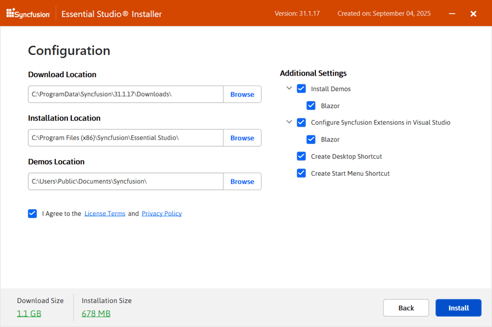

7. Read the License Terms and Privacy Policy, then select **I agree to the License Terms and Privacy Policy**. Select **Next**.

8. The **Login Wizard** appears. Enter the Syncfusion&reg; account email and password, or select **Create an account** or **Forgot password**. Click **Install**.

   

   I> The products you have chosen will be installed based on your Syncfusion&reg; License (Trial or Licensed).

9. The download, installation, and uninstallation progress is shown.

   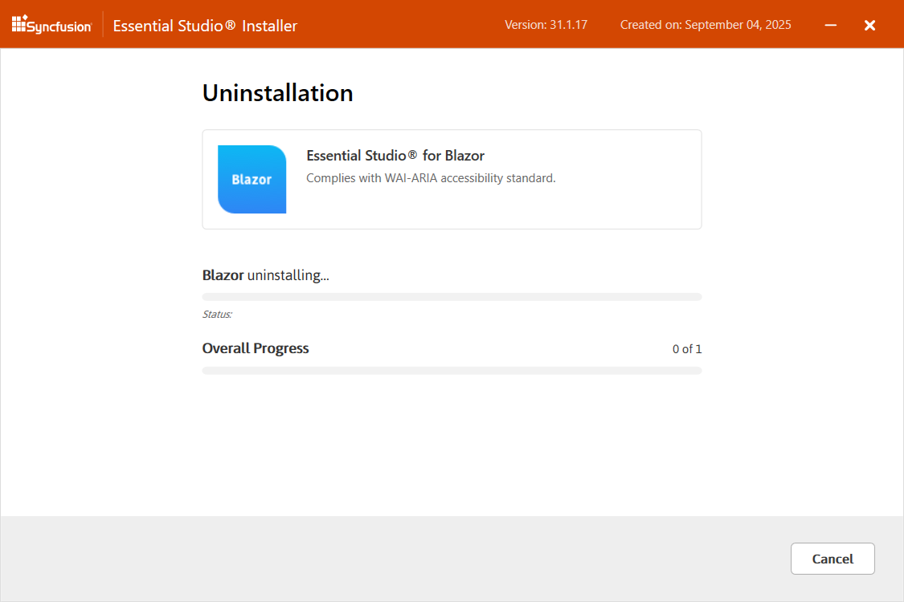

10. When the installation is finished, the ***Summary wizard*** will appear. Here you can see the list of products that have been successfully and unsuccessfully installed/uninstalled. To close the Summary wizard, click **Finish**.

   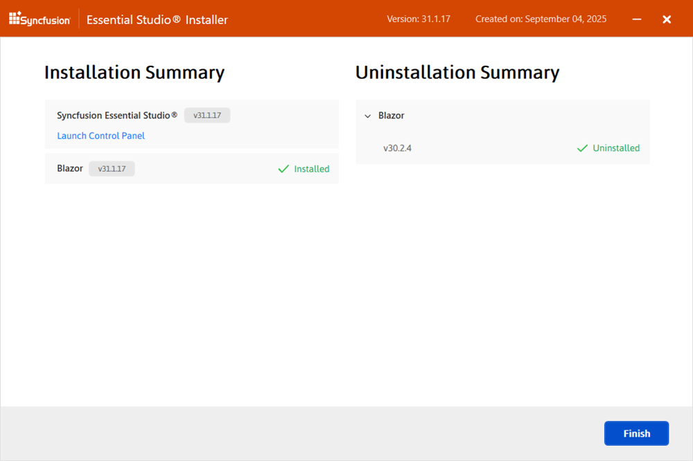

* To open the Syncfusion&reg; Control Panel, click **Launch Control Panel**.
