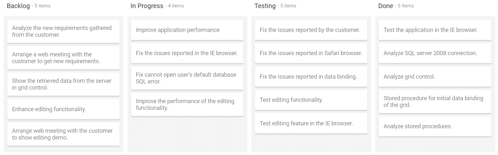
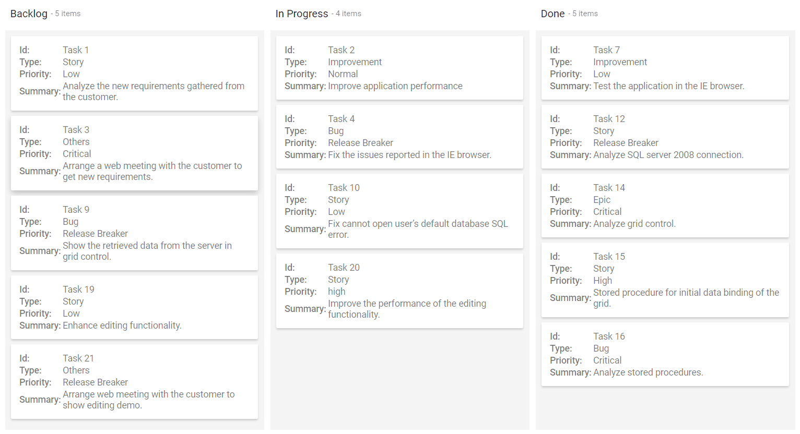
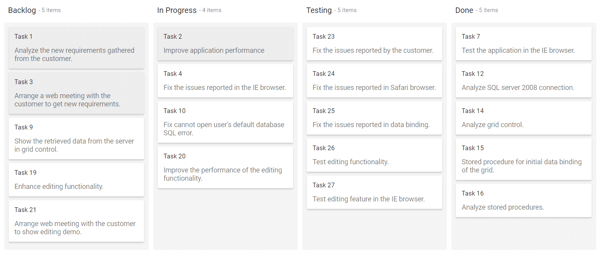

# Working with Cards in Blazor Kanban Component

The cards are main elements in the [Blazor Kanban Board](https://www.syncfusion.com/blazor-components/blazor-kanban-board), which represents the task information with header and content. The header and content of a card is fetched from the corresponding mapping fields. The card layout can be customized with template also.

## Header

The card header is achieved by mapping the `HeaderField` property, which is placed inside the `KanbanCardSettings` property. By default, the `ShowHeader` property is enabled by Kanban board that is used to display the header at the top of the card.

N> The `HeaderField` property must be a unique datasource value to avoid the duplication of card data.

In the following demo, the `ShowHeader` property is disabled on Kanban board.

```cshtml

@using Syncfusion.Blazor.Kanban

<SfKanban TValue="TasksModel" KeyField="Status" DataSource="Tasks">
    <KanbanColumns>
        <KanbanColumn HeaderText="Backlog" KeyField="@(new List<string>() {"Open"})"></KanbanColumn>
        <KanbanColumn HeaderText="In Progress" KeyField="@(new List<string>() {"InProgress"})"></KanbanColumn>
        <KanbanColumn HeaderText="Testing" KeyField="@(new List<string>() {"Testing"})"></KanbanColumn>
        <KanbanColumn HeaderText="Done" KeyField="@(new List<string>() {"Close"})"></KanbanColumn>
    </KanbanColumns>
    <KanbanCardSettings ShowHeader="false" HeaderField="Id" ContentField="Summary"></KanbanCardSettings>
</SfKanban>

@code {
    public class TasksModel
    {
        public string Id { get; set; }
        public string Title { get; set; }
        public string Status { get; set; }
        public string Summary { get; set; }
        public string Assignee { get; set; }
    }

    public List<TasksModel> Tasks = new List<TasksModel>()
    {
        new TasksModel { Id = "Task 1", Title = "BLAZ-29001", Status = "Open", Summary = "Analyze the new requirements gathered from the customer.", Assignee = "Nancy Davloio" },
        new TasksModel { Id = "Task 2", Title = "BLAZ-29002", Status = "InProgress", Summary = "Improve application performance", Assignee = "Andrew Fuller" },
        new TasksModel { Id = "Task 3", Title = "BLAZ-29003", Status = "Open", Summary = "Arrange a web meeting with the customer to get new requirements.", Assignee = "Janet Leverling" },
        new TasksModel { Id = "Task 4", Title = "BLAZ-29004", Status = "InProgress", Summary = "Fix the issues reported in the IE browser.", Assignee = "Janet Leverling" },
        new TasksModel { Id = "Task 5", Title = "BLAZ-29005", Status = "Review", Summary = "Fix the issues reported by the customer.", Assignee = "Steven walker" },
        new TasksModel { Id = "Task 6", Title = "BLAZ-29006", Status = "Review", Summary = "Fix the issues reported in Safari browser.", Assignee = "Nancy Davloio" },
        new TasksModel { Id = "Task 7", Title = "BLAZ-29007", Status = "Close", Summary = "Test the application in the IE browser.", Assignee = "Margaret hamilt" },
        new TasksModel { Id = "Task 8", Title = "BLAZ-29008", Status = "Validate", Summary = "Validate the issues reported by the customer.", Assignee = "Steven walker" },
        new TasksModel { Id = "Task 9", Title = "BLAZ-29009", Status = "Open", Summary = "Show the retrieved data from the server in grid control.", Assignee = "Margaret hamilt" },
        new TasksModel { Id = "Task 10", Title = "BLAZ-29010", Status = "InProgress", Summary = "Fix cannot open user’s default database SQL error.", Assignee = "Janet Leverling" },
        new TasksModel { Id = "Task 11", Title = "BLAZ-29011", Status = "Review", Summary = "Fix the issues reported in data binding.", Assignee = "Janet Leverling" },
        new TasksModel { Id = "Task 12", Title = "BLAZ-29012", Status = "Close", Summary = "Analyze SQL server 2008 connection.", Assignee = "Andrew Fuller" },
        new TasksModel { Id = "Task 13", Title = "BLAZ-29013", Status = "Validate", Summary = "Validate databinding issues.", Assignee = "Margaret hamilt" },
        new TasksModel { Id = "Task 14", Title = "BLAZ-29014", Status = "Close", Summary = "Analyze grid control.", Assignee = "Margaret hamilt" },
        new TasksModel { Id = "Task 15", Title = "BLAZ-29015", Status = "Close", Summary = "Stored procedure for initial data binding of the grid.", Assignee = "Steven walker" },
        new TasksModel { Id = "Task 16", Title = "BLAZ-29016", Status = "Close", Summary = "Analyze stored procedures.", Assignee = "Janet Leverling" },
        new TasksModel { Id = "Task 17", Title = "BLAZ-29017", Status = "Validate", Summary = "Validate editing issues.", Assignee = "Nancy Davloio" },
        new TasksModel { Id = "Task 18", Title = "BLAZ-29018", Status = "Review", Summary = "Test editing functionality.", Assignee = "Nancy Davloio" },
        new TasksModel { Id = "Task 19", Title = "BLAZ-29019", Status = "Open", Summary = "Enhance editing functionality.", Assignee = "Andrew Fuller" },
        new TasksModel { Id = "Task 20", Title = "BLAZ-29020", Status = "InProgress", Summary = "Improve the performance of the editing functionality.", Assignee = "Nancy Davloio" },
        new TasksModel { Id = "Task 21", Title = "BLAZ-29021", Status = "Open", Summary = "Arrange web meeting with the customer to show editing demo.", Assignee = "Steven walker" },
        new TasksModel { Id = "Task 22", Title = "BLAZ-29022", Status = "Review", Summary = "Fix the editing issues reported by the customer.", Assignee = "Janet Leverling" },
        new TasksModel { Id = "Task 23", Title = "BLAZ-29023", Status = "Testing", Summary = "Fix the issues reported by the customer.", Assignee = "Steven walker" },
        new TasksModel { Id = "Task 24", Title = "BLAZ-29024", Status = "Testing", Summary = "Fix the issues reported in Safari browser.", Assignee = "Nancy Davloio" },
        new TasksModel { Id = "Task 25", Title = "BLAZ-29025", Status = "Testing", Summary = "Fix the issues reported in data binding.", Assignee = "Janet Leverling" },
        new TasksModel { Id = "Task 26", Title = "BLAZ-29026", Status = "Testing", Summary = "Test editing functionality.", Assignee = "Nancy Davloio" },
        new TasksModel { Id = "Task 27", Title = "BLAZ-29027", Status = "Testing", Summary = "Test editing feature in the IE browser.", Assignee = "Janet Leverling" }
    };
}

```



## Content

The card's content is fetched from data source using the `ContentField` property, which is placed inside the `KanbanCardSettings` property. If the `ContentField` property is not used, card is rendered with empty content.

## Tags

The card tags are used to display the tag text with the background color. Each tag text is separated and shown below the card content. It can be achieved by mapping the data key to the `TagsField` property, which is placed inside the `KanbanCardSettings` property.

N> The mapped datasource key value contains single or multiple tags. If it is multiple tags, each tag will be separated by a comma in the datasource.

```cshtml

@using Syncfusion.Blazor.Kanban

<SfKanban TValue="TasksModel" KeyField="Status" DataSource="Tasks">
    <KanbanColumns>
        <KanbanColumn HeaderText="Backlog" KeyField="@(new List<string>() {"Open"})"></KanbanColumn>
        <KanbanColumn HeaderText="In Progress" KeyField="@(new List<string>() {"InProgress"})"></KanbanColumn>
        <KanbanColumn HeaderText="Done" KeyField="@(new List<string>() {"Close"})"></KanbanColumn>
    </KanbanColumns>
    <KanbanCardSettings HeaderField="Id" ContentField="Summary" TagsField="CardTags"></KanbanCardSettings>
</SfKanban>

@code {
    public class TasksModel
    {
        public string Id { get; set; }
        public int ListId { get; set; }
        public string Title { get; set; }
        public string Status { get; set; }
        public string Summary { get; set; }
        public string Type { get; set; }
        public string Priority { get; set; }
        public List<string> CardTags { get; set; }
        public string Tags { get; set; }
        public double Estimate { get; set; }
        public string Assignee { get; set; }
        public int RankId { get; set; }
        public string Color { get; set; }
        public string Value { get; set; }
        public string OrderID { get; set; }
        public string Size { get; set; }
        public string ImageURL { get; set; }
        public string Description { get; set; }
        public string Category { get; set; }
        public string Price { get; set; }
        public string AssigneeKey { get; set; }
        public List<string> ClassName { get; set; }
    }

    public List<TasksModel> Tasks = new List<TasksModel>()
        {
            new TasksModel { Id = "Task 1", Title = "Task  - 29001", Status = "Open", Summary = "Analyze the new requirements gathered from the customer.", Type = "Story", Priority = "Low", CardTags = new List<string>() { "Analyze", "Customer" }, Estimate = 3.5, Assignee = "Nancy Davloio", AssigneeKey = "Nancy Davloio", RankId = 1, Color = "#8b447a", ClassName = new List<string>() { "e-story", "e-low", "e-nancy" } },
            new TasksModel { Id = "Task 2", Title = "Task  - 29002", Status = "InProgress", Summary = "Improve application performance", Type = "Improvement", Priority = "Normal", CardTags = new List<string>() { "Improvement" }, Estimate = 6, Assignee = "Andrew Fuller", AssigneeKey = "Andrew Fuller", RankId = 1, Color = "#7d7297", ClassName = new List<string>() { "e-improvement", "e-normal", "e-andrew" } },
            new TasksModel { Id = "Task 3", Title = "Task  - 29003", Status = "Open", Summary = "Arrange a web meeting with the customer to get new requirements.", Type = "Others", Priority = "Critical", CardTags = new List<string>() { "Meeting" }, Estimate = 5.5, Assignee = "Janet Leverling", AssigneeKey = "Janet Leverling", RankId = 2, Color = "#27AE60", ClassName = new List<string>() { "e-others", "e-critical", "e-janet" } },
            new TasksModel { Id = "Task 4", Title = "Task  - 29004", Status = "InProgress", Summary = "Fix the issues reported in the IE browser.", Type = "Bug", Priority = "Release Breaker", CardTags = new List<string>() { "IE" }, Estimate = 2.5, Assignee = "Janet Leverling", AssigneeKey = "Janet Leverling", RankId = 2, Color = "#cc0000", ClassName = new List<string>() { "e-bug", "e-release", "e-janet" } },
            new TasksModel { Id = "Task 5", Title = "Task  - 29005", Status = "Review", Summary = "Fix the issues reported by the customer.", Type = "Bug", Priority = "Low", CardTags = new List<string>() { "Customer" }, Estimate = 3.5, Assignee = "Steven walker", AssigneeKey = "Steven walker", RankId = 1, Color = "#cc0000", ClassName = new List<string>() { "e-bug", "e-low", "e-steven" } },
            new TasksModel { Id = "Task 6", Title = "Task  - 29007", Status = "Validate", Summary = "Validate new requirements", Type = "Improvement", Priority = "Low", CardTags = new List<string>() { "Validation" }, Estimate = 1.5, Assignee = "Robert King", AssigneeKey = "Robert King", RankId = 1, Color = "#7d7297", ClassName = new List<string>() { "e-improvement", "e-low", "e-robert" } },
            new TasksModel { Id = "Task 7", Title = "Task  - 29009", Status = "Review", Summary = "Fix the issues reported in Safari browser.", Type = "Bug", Priority = "Release Breaker", CardTags = new List<string>() { "Fix", "Safari" }, Estimate = 1.5, Assignee = "Nancy Davloio", AssigneeKey = "Nancy Davloio", RankId = 2, Color = "#cc0000", ClassName = new List<string>() { "e-bug", "e-release", "e-nancy" } },
            new TasksModel { Id = "Task 8", Title = "Task  - 29010", Status = "Close", Summary = "Test the application in the IE browser.", Type = "Story", Priority = "Low", CardTags = new List<string>() { "Review", "IE" }, Estimate = 5.5, Assignee = "Margaret hamilt", AssigneeKey = "Margaret hamilt", RankId = 3, Color = "#8b447a", ClassName = new List<string>() { "e-story", "e-low", "e-Margaret" } },
            new TasksModel { Id = "Task 9", Title = "Task  - 29011", Status = "Validate", Summary = "Validate the issues reported by the customer.", Type = "Story", Priority = "High", CardTags = new List<string>() { "Validation", "Fix" }, Estimate = 1, Assignee = "Steven walker", AssigneeKey = "Steven walker", RankId = 1, Color = "#8b447a", ClassName = new List<string>() { "e-story", "e-low", "e-nancy" } },
            new TasksModel { Id = "Task 10", Title = "Task  - 29015", Status = "Open", Summary = "Show the retrieved data from the server in grid control.", Type = "Story", Priority = "High", CardTags = new List<string>() { "Database", "SQL" }, Estimate = 5.5, Assignee = "Margaret hamilt", AssigneeKey = "Margaret hamilt", RankId = 4, Color = "#8b447a", ClassName = new List<string>() { "e-story", "e-high", "e-steven" } }
    };
}

```


## Customizing left border color

Kanban card supports to custom the left border color for all the cards. This can be achieved by mapping the data key value to the `GrabberField` property, which is placed inside the `KanbanCardSettings` property. The mapped data key value will be directly assigned to each card element border left color property.

N> By default, the card border left color width is `3px`.

```cshtml

@using Syncfusion.Blazor.Kanban

<SfKanban TValue="TasksModel" KeyField="Status" DataSource="Tasks">
    <KanbanColumns>
        <KanbanColumn HeaderText="Backlog" KeyField="@(new List<string>() {"Open"})"></KanbanColumn>
        <KanbanColumn HeaderText="In Progress" KeyField="@(new List<string>() {"InProgress"})"></KanbanColumn>
        <KanbanColumn HeaderText="Done" KeyField="@(new List<string>() {"Close"})"></KanbanColumn>
    </KanbanColumns>
    <KanbanCardSettings HeaderField="Id" ContentField="Summary" GrabberField="Color"></KanbanCardSettings>
</SfKanban>

@code {
    public class TasksModel
    {
        public string Id { get; set; }
        public int ListId { get; set; }
        public string Title { get; set; }
        public string Status { get; set; }
        public string Summary { get; set; }
        public string Type { get; set; }
        public string Priority { get; set; }
        public List<string> CardTags { get; set; }
        public string Tags { get; set; }
        public double Estimate { get; set; }
        public string Assignee { get; set; }
        public int RankId { get; set; }
        public string Color { get; set; }
        public string Value { get; set; }
        public string OrderID { get; set; }
        public string Size { get; set; }
        public string ImageURL { get; set; }
        public string Description { get; set; }
        public string Category { get; set; }
        public string Price { get; set; }
        public string AssigneeKey { get; set; }
        public List<string> ClassName { get; set; }
    }

    public List<TasksModel> Tasks = new List<TasksModel>()
        {
            new TasksModel { Id = "Task 1", Title = "Task  - 29001", Status = "Open", Summary = "Analyze the new requirements gathered from the customer.", Type = "Story", Priority = "Low", CardTags = new List<string>() { "Analyze", "Customer" }, Estimate = 3.5, Assignee = "Nancy Davloio", AssigneeKey = "Nancy Davloio", RankId = 1, Color = "#8b447a", ClassName = new List<string>() { "e-story", "e-low", "e-nancy" } },
            new TasksModel { Id = "Task 2", Title = "Task  - 29002", Status = "InProgress", Summary = "Improve application performance", Type = "Improvement", Priority = "Normal", CardTags = new List<string>() { "Improvement" }, Estimate = 6, Assignee = "Andrew Fuller", AssigneeKey = "Andrew Fuller", RankId = 1, Color = "#7d7297", ClassName = new List<string>() { "e-improvement", "e-normal", "e-andrew" } },
            new TasksModel { Id = "Task 3", Title = "Task  - 29003", Status = "Open", Summary = "Arrange a web meeting with the customer to get new requirements.", Type = "Others", Priority = "Critical", CardTags = new List<string>() { "Meeting" }, Estimate = 5.5, Assignee = "Janet Leverling", AssigneeKey = "Janet Leverling", RankId = 2, Color = "#27AE60", ClassName = new List<string>() { "e-others", "e-critical", "e-janet" } },
            new TasksModel { Id = "Task 4", Title = "Task  - 29004", Status = "InProgress", Summary = "Fix the issues reported in the IE browser.", Type = "Bug", Priority = "Release Breaker", CardTags = new List<string>() { "IE" }, Estimate = 2.5, Assignee = "Janet Leverling", AssigneeKey = "Janet Leverling", RankId = 2, Color = "#cc0000", ClassName = new List<string>() { "e-bug", "e-release", "e-janet" } },
            new TasksModel { Id = "Task 5", Title = "Task  - 29005", Status = "Review", Summary = "Fix the issues reported by the customer.", Type = "Bug", Priority = "Low", CardTags = new List<string>() { "Customer" }, Estimate = 3.5, Assignee = "Steven walker", AssigneeKey = "Steven walker", RankId = 1, Color = "#cc0000", ClassName = new List<string>() { "e-bug", "e-low", "e-steven" } },
            new TasksModel { Id = "Task 6", Title = "Task  - 29007", Status = "Validate", Summary = "Validate new requirements", Type = "Improvement", Priority = "Low", CardTags = new List<string>() { "Validation" }, Estimate = 1.5, Assignee = "Robert King", AssigneeKey = "Robert King", RankId = 1, Color = "#7d7297", ClassName = new List<string>() { "e-improvement", "e-low", "e-robert" } },
            new TasksModel { Id = "Task 7", Title = "Task  - 29009", Status = "Review", Summary = "Fix the issues reported in Safari browser.", Type = "Bug", Priority = "Release Breaker", CardTags = new List<string>() { "Fix", "Safari" }, Estimate = 1.5, Assignee = "Nancy Davloio", AssigneeKey = "Nancy Davloio", RankId = 2, Color = "#cc0000", ClassName = new List<string>() { "e-bug", "e-release", "e-nancy" } },
            new TasksModel { Id = "Task 8", Title = "Task  - 29010", Status = "Close", Summary = "Test the application in the IE browser.", Type = "Story", Priority = "Low", CardTags = new List<string>() { "Review", "IE" }, Estimate = 5.5, Assignee = "Margaret hamilt", AssigneeKey = "Margaret hamilt", RankId = 3, Color = "#8b447a", ClassName = new List<string>() { "e-story", "e-low", "e-Margaret" } },
            new TasksModel { Id = "Task 9", Title = "Task  - 29011", Status = "Validate", Summary = "Validate the issues reported by the customer.", Type = "Story", Priority = "High", CardTags = new List<string>() { "Validation", "Fix" }, Estimate = 1, Assignee = "Steven walker", AssigneeKey = "Steven walker", RankId = 1, Color = "#8b447a", ClassName = new List<string>() { "e-story", "e-low", "e-nancy" } },
            new TasksModel { Id = "Task 10", Title = "Task  - 29015", Status = "Open", Summary = "Show the retrieved data from the server in grid control.", Type = "Story", Priority = "High", CardTags = new List<string>() { "Database", "SQL" }, Estimate = 5.5, Assignee = "Margaret hamilt", AssigneeKey = "Margaret hamilt", RankId = 4, Color = "#8b447a", ClassName = new List<string>() { "e-story", "e-high", "e-steven" } }
    };
}

```


## Rendering custom footer elements

The card allows to render the custom elements based on the given class names inside the `e-card-footer` element. It can be achieved by mapping the data key to the `FooterCssField` property, which is placed inside the `KanbanCardSettings` property. It will help to create your own class name elements inside the `e-card-footer` element. The mapped datasource key value contains single or multiple class names. If it is multiple class names, each class name will be separated by a comma in the datasource.

In the following demo, images and icons are rendered using the `FooterCssField` property.

```cshtml

@using Syncfusion.Blazor.Kanban

<SfKanban TValue="TasksModel" KeyField="Status" DataSource="Tasks">
    <KanbanColumns>
        <KanbanColumn HeaderText="Backlog" KeyField="@(new List<string>() {"Open"})"></KanbanColumn>
        <KanbanColumn HeaderText="In Progress" KeyField="@(new List<string>() {"InProgress"})"></KanbanColumn>
        <KanbanColumn HeaderText="Done" KeyField="@(new List<string>() {"Close"})"></KanbanColumn>
    </KanbanColumns>
    <KanbanCardSettings HeaderField="Id" ContentField="Summary" FooterCssField="ClassName"></KanbanCardSettings>
</SfKanban>
<style>
    .e-kanban .e-card .e-card-footer {
        display: flex;
        justify-content: space-between;
    }

    .e-kanban .e-card .e-card-footer > div:last-child {
        margin-left: auto;
    }

    .e-kanban .e-card .e-card-footer .e-card-footer-css {
        background-repeat: no-repeat;
        background-size: cover;
        background-position: center;
        height: 16px;
        width: 16px;
        margin-right: 8px;
    }

    .e-kanban .e-card .e-card-footer .e-card-footer-css.e-improvement {
        background-image: url(https://syncfusion.atlassian.net/secure/viewavatar?size=medium&avatarId=15507&avatarType=issuetype);
    }

    .e-kanban .e-card .e-card-footer .e-card-footer-css.e-story {
        background-image: url(https://syncfusion.atlassian.net/secure/viewavatar?size=medium&avatarId=15515&avatarType=issuetype);
    }

    .e-kanban .e-card .e-card-footer .e-card-footer-css.e-bug {
        background-image: url(https://syncfusion.atlassian.net/secure/viewavatar?size=medium&avatarId=15503&avatarType=issuetype);
    }

    .e-kanban .e-card .e-card-footer .e-card-footer-css.e-others {
        background-image: url(https://syncfusion.atlassian.net/images/icons/issuetypes/documentation.png);
    }

    .e-kanban .e-card .e-card-footer .e-card-footer-css.e-low {
        background-image: url(https://syncfusion.atlassian.net/images/icons/priorities/trivial.svg);
    }

    .e-kanban .e-card .e-card-footer .e-card-footer-css.e-high {
        background-image: url(https://syncfusion.atlassian.net/images/icons/priorities/major.svg);
    }

    .e-kanban .e-card .e-card-footer .e-card-footer-css.e-critical {
        background-image: url(https://syncfusion.atlassian.net/images/icons/priorities/critical.svg);
    }

    .e-kanban .e-card .e-card-footer .e-card-footer-css.e-release {
        background-image: url(https://syncfusion.atlassian.net/images/icons/priorities/critical.svg);
    }

    .e-kanban .e-card .e-card-footer .e-card-footer-css.e-normal {
        background-image: url(https://syncfusion.atlassian.net/images/icons/priorities/minor.svg);
    }

    .e-kanban .e-card .e-card-footer .e-card-footer-css.e-nancy {
        background-image: url(https://ej2.syncfusion.com/demos/src/kanban/images/Nancy%20Davloio.png);
    }

    .e-kanban .e-card .e-card-footer .e-card-footer-css.e-andrew {
        background-image: url(https://ej2.syncfusion.com/demos/src/kanban/images/Andrew%20Fuller.png);
    }

    .e-kanban .e-card .e-card-footer .e-card-footer-css.e-janet {
        background-image: url(https://ej2.syncfusion.com/demos/src/kanban/images/Janet%20Leverling.png);
    }

    .e-kanban .e-card .e-card-footer .e-card-footer-css.e-steven {
        background-image: url(https://ej2.syncfusion.com/demos/src/kanban/images/Steven%20walker.png);
    }

    .e-kanban .e-card .e-card-footer .e-card-footer-css.e-robert {
        background-image: url(https://ej2.syncfusion.com/demos/src/kanban/images/Robert%20King.png);
    }

    .e-kanban .e-card .e-card-footer .e-card-footer-css.e-nancy,
    .e-kanban .e-card .e-card-footer .e-card-footer-css.e-andrew,
    .e-kanban .e-card .e-card-footer .e-card-footer-css.e-janet,
    .e-kanban .e-card .e-card-footer .e-card-footer-css.e-steven,
    .e-kanban .e-card .e-card-footer .e-card-footer-css.e-robert {
        border-radius: 72px;
        height: 30px;
        width: 30px;
    }
</style>
@code {
    public class TasksModel
    {
        public string Id { get; set; }
        public int ListId { get; set; }
        public string Title { get; set; }
        public string Status { get; set; }
        public string Summary { get; set; }
        public string Type { get; set; }
        public string Priority { get; set; }
        public List<string> CardTags { get; set; }
        public string Tags { get; set; }
        public double Estimate { get; set; }
        public string Assignee { get; set; }
        public int RankId { get; set; }
        public string Color { get; set; }
        public string Value { get; set; }
        public string OrderID { get; set; }
        public string Size { get; set; }
        public string ImageURL { get; set; }
        public string Description { get; set; }
        public string Category { get; set; }
        public string Price { get; set; }
        public string AssigneeKey { get; set; }
        public List<string> ClassName { get; set; }
    }

    public List<TasksModel> Tasks = new List<TasksModel>()
        {
            new TasksModel { Id = "Task 1", Title = "Task  - 29001", Status = "Open", Summary = "Analyze the new requirements gathered from the customer.", Type = "Story", Priority = "Low", CardTags = new List<string>() { "Analyze", "Customer" }, Estimate = 3.5, Assignee = "Nancy Davloio", AssigneeKey = "Nancy Davloio", RankId = 1, Color = "#8b447a", ClassName = new List<string>() { "e-story", "e-low", "e-nancy" } },
            new TasksModel { Id = "Task 2", Title = "Task  - 29002", Status = "InProgress", Summary = "Improve application performance", Type = "Improvement", Priority = "Normal", CardTags = new List<string>() { "Improvement" }, Estimate = 6, Assignee = "Andrew Fuller", AssigneeKey = "Andrew Fuller", RankId = 1, Color = "#7d7297", ClassName = new List<string>() { "e-improvement", "e-normal", "e-andrew" } },
            new TasksModel { Id = "Task 3", Title = "Task  - 29003", Status = "Open", Summary = "Arrange a web meeting with the customer to get new requirements.", Type = "Others", Priority = "Critical", CardTags = new List<string>() { "Meeting" }, Estimate = 5.5, Assignee = "Janet Leverling", AssigneeKey = "Janet Leverling", RankId = 2, Color = "#27AE60", ClassName = new List<string>() { "e-others", "e-critical", "e-janet" } },
            new TasksModel { Id = "Task 4", Title = "Task  - 29004", Status = "InProgress", Summary = "Fix the issues reported in the IE browser.", Type = "Bug", Priority = "Release Breaker", CardTags = new List<string>() { "IE" }, Estimate = 2.5, Assignee = "Janet Leverling", AssigneeKey = "Janet Leverling", RankId = 2, Color = "#cc0000", ClassName = new List<string>() { "e-bug", "e-release", "e-janet" } },
            new TasksModel { Id = "Task 5", Title = "Task  - 29005", Status = "Review", Summary = "Fix the issues reported by the customer.", Type = "Bug", Priority = "Low", CardTags = new List<string>() { "Customer" }, Estimate = 3.5, Assignee = "Steven walker", AssigneeKey = "Steven walker", RankId = 1, Color = "#cc0000", ClassName = new List<string>() { "e-bug", "e-low", "e-steven" } },
            new TasksModel { Id = "Task 6", Title = "Task  - 29007", Status = "Validate", Summary = "Validate new requirements", Type = "Improvement", Priority = "Low", CardTags = new List<string>() { "Validation" }, Estimate = 1.5, Assignee = "Robert King", AssigneeKey = "Robert King", RankId = 1, Color = "#7d7297", ClassName = new List<string>() { "e-improvement", "e-low", "e-robert" } },
            new TasksModel { Id = "Task 7", Title = "Task  - 29009", Status = "Review", Summary = "Fix the issues reported in Safari browser.", Type = "Bug", Priority = "Release Breaker", CardTags = new List<string>() { "Fix", "Safari" }, Estimate = 1.5, Assignee = "Nancy Davloio", AssigneeKey = "Nancy Davloio", RankId = 2, Color = "#cc0000", ClassName = new List<string>() { "e-bug", "e-release", "e-nancy" } },
            new TasksModel { Id = "Task 8", Title = "Task  - 29010", Status = "Close", Summary = "Test the application in the IE browser.", Type = "Story", Priority = "Low", CardTags = new List<string>() { "Review", "IE" }, Estimate = 5.5, Assignee = "Margaret hamilt", AssigneeKey = "Margaret hamilt", RankId = 3, Color = "#8b447a", ClassName = new List<string>() { "e-story", "e-low", "e-Margaret" } },
            new TasksModel { Id = "Task 9", Title = "Task  - 29011", Status = "Validate", Summary = "Validate the issues reported by the customer.", Type = "Story", Priority = "High", CardTags = new List<string>() { "Validation", "Fix" }, Estimate = 1, Assignee = "Steven walker", AssigneeKey = "Steven walker", RankId = 1, Color = "#8b447a", ClassName = new List<string>() { "e-story", "e-low", "e-nancy" } },
            new TasksModel { Id = "Task 10", Title = "Task  - 29015", Status = "Open", Summary = "Show the retrieved data from the server in grid control.", Type = "Story", Priority = "High", CardTags = new List<string>() { "Database", "SQL" }, Estimate = 5.5, Assignee = "Margaret hamilt", AssigneeKey = "Margaret hamilt", RankId = 4, Color = "#8b447a", ClassName = new List<string>() { "e-story", "e-high", "e-steven" } }
    };
}

```


## Customizing card layout with templates

You can customize the default card layout using template as per your application needs. This can be achieved by template of the `KanbanCardSettings` property.



```cshtml

@using Syncfusion.Blazor.Kanban

<SfKanban TValue="TasksModel" KeyField="Status" DataSource="Tasks">
    <KanbanColumns>
        <KanbanColumn HeaderText="Backlog" KeyField="@(new List<string>() {"Open"})"></KanbanColumn>
        <KanbanColumn HeaderText="In Progress" KeyField="@(new List<string>() {"InProgress"})"></KanbanColumn>
        <KanbanColumn HeaderText="Done" KeyField="@(new List<string>() {"Close"})"></KanbanColumn>
    </KanbanColumns>
    <KanbanCardSettings HeaderField="Id" ContentField="Summary">
        <Template>
            @{
                TasksModel data = (TasksModel)context;
                <div class="e-card-content">
                    <table class="card-template-wrap">
                        <tbody>
                            <tr>
                                <td class="CardHeader">Id:</td>
                                <td>@data.Id</td>
                            </tr>
                            <tr>
                                <td class="CardHeader">Type:</td>
                                <td>@data.Type</td>
                            </tr>
                            <tr>
                                <td class="CardHeader">Priority:</td>
                                <td>@data.Priority</td>
                            </tr>
                            <tr>
                                <td class="CardHeader">Summary:</td>
                                <td>@data.Summary</td>
                            </tr>
                        </tbody>
                    </table>
                </div>
            }
        </Template>
    </KanbanCardSettings>
</SfKanban>

<style type="text/css">
    .e-kanban .card-template-wrap td {
        background: none !important;
    }

    .e-kanban .card-template-wrap .CardHeader {
        font-weight: 500;
    }
</style>

@code {
    public class TasksModel
    {
        public string Id { get; set; }
        public string Title { get; set; }
        public string Status { get; set; }
        public string Summary { get; set; }
        public string Type { get; set; }
        public string Priority { get; set; }
        public string Assignee { get; set; }
    }

    public List<TasksModel> Tasks = new List<TasksModel>()
    {
        new TasksModel { Id = "Task 1", Title = "BLAZ-29001", Status = "Open", Summary = "Analyze the new requirements gathered from the customer.", Assignee = "Nancy Davloio", Type = "Story", Priority = "Low" },
        new TasksModel { Id = "Task 2", Title = "BLAZ-29002", Status = "InProgress", Summary = "Improve application performance", Assignee = "Andrew Fuller", Type = "Improvement", Priority = "Normal" },
        new TasksModel { Id = "Task 3", Title = "BLAZ-29003", Status = "Open", Summary = "Arrange a web meeting with the customer to get new requirements.", Assignee = "Janet Leverling", Type = "Others", Priority = "Critical" },
        new TasksModel { Id = "Task 4", Title = "BLAZ-29004", Status = "InProgress", Summary = "Fix the issues reported in the IE browser.", Assignee = "Janet Leverling", Type = "Bug", Priority = "Release Breaker" },
        new TasksModel { Id = "Task 5", Title = "BLAZ-29005", Status = "Review", Summary = "Fix the issues reported by the customer.", Assignee = "Steven walker", Type = "Bug", Priority = "Low" },
        new TasksModel { Id = "Task 6", Title = "BLAZ-29006", Status = "Review", Summary = "Fix the issues reported in Safari browser.", Assignee = "Nancy Davloio", Type = "Others", Priority = "Low" },
        new TasksModel { Id = "Task 7", Title = "BLAZ-29007", Status = "Close", Summary = "Test the application in the IE browser.", Assignee = "Margaret hamilt", Type = "Improvement", Priority = "Low" },
        new TasksModel { Id = "Task 8", Title = "BLAZ-29008", Status = "Validate", Summary = "Validate the issues reported by the customer.", Assignee = "Steven walker", Type = "Story", Priority = "Release Breaker" },
        new TasksModel { Id = "Task 9", Title = "BLAZ-29009", Status = "Open", Summary = "Show the retrieved data from the server in grid control.", Assignee = "Margaret hamilt", Type = "Bug", Priority = "Release Breaker" },
        new TasksModel { Id = "Task 10", Title = "BLAZ-29010", Status = "InProgress", Summary = "Fix cannot open user’s default database SQL error.", Assignee = "Janet Leverling", Type = "Story", Priority = "Low" },
        new TasksModel { Id = "Task 11", Title = "BLAZ-29011", Status = "Review", Summary = "Fix the issues reported in data binding.", Assignee = "Janet Leverling", Type = "Story", Priority = "High" },
        new TasksModel { Id = "Task 12", Title = "BLAZ-29012", Status = "Close", Summary = "Analyze SQL server 2008 connection.", Assignee = "Andrew Fuller", Type = "Story", Priority = "Release Breaker" },
        new TasksModel { Id = "Task 13", Title = "BLAZ-29013", Status = "Validate", Summary = "Validate databinding issues.", Assignee = "Margaret hamilt", Type = "Improvement", Priority = "High" },
        new TasksModel { Id = "Task 14", Title = "BLAZ-29014", Status = "Close", Summary = "Analyze grid control.", Assignee = "Margaret hamilt", Type = "Epic", Priority = "Critical" },
        new TasksModel { Id = "Task 15", Title = "BLAZ-29015", Status = "Close", Summary = "Stored procedure for initial data binding of the grid.", Assignee = "Steven walker", Type = "Story", Priority = "High" },
        new TasksModel { Id = "Task 16", Title = "BLAZ-29016", Status = "Close", Summary = "Analyze stored procedures.", Assignee = "Janet Leverling", Type = "Bug", Priority = "Critical" },
        new TasksModel { Id = "Task 17", Title = "BLAZ-29017", Status = "Validate", Summary = "Validate editing issues.", Assignee = "Nancy Davloio", Type = "Story", Priority = "Normal" },
        new TasksModel { Id = "Task 18", Title = "BLAZ-29018", Status = "Review", Summary = "Test editing functionality.", Assignee = "Nancy Davloio", Type = "Story", Priority = "Release Breaker" },
        new TasksModel { Id = "Task 19", Title = "BLAZ-29019", Status = "Open", Summary = "Enhance editing functionality.", Assignee = "Andrew Fuller", Type = "Story", Priority = "Low" },
        new TasksModel { Id = "Task 20", Title = "BLAZ-29020", Status = "InProgress", Summary = "Improve the performance of the editing functionality.", Assignee = "Nancy Davloio", Type = "Story", Priority = "high" },
        new TasksModel { Id = "Task 21", Title = "BLAZ-29021", Status = "Open", Summary = "Arrange web meeting with the customer to show editing demo.", Assignee = "Steven walker", Type = "Others", Priority = "Release Breaker" },
        new TasksModel { Id = "Task 22", Title = "BLAZ-29022", Status = "Review", Summary = "Fix the editing issues reported by the customer.", Assignee = "Janet Leverling", Type = "Story", Priority = "Release Breaker" },
        new TasksModel { Id = "Task 23", Title = "BLAZ-29023", Status = "Testing", Summary = "Fix the issues reported by the customer.", Assignee = "Steven walker", Type = "Story", Priority = "Critical" },
        new TasksModel { Id = "Task 24", Title = "BLAZ-29024", Status = "Testing", Summary = "Fix the issues reported in Safari browser.", Assignee = "Nancy Davloio", Type = "Story", Priority = "Normal" },
        new TasksModel { Id = "Task 25", Title = "BLAZ-29025", Status = "Testing", Summary = "Fix the issues reported in data binding.", Assignee = "Janet Leverling", Type = "Improvement", Priority = "Low" },
        new TasksModel { Id = "Task 26", Title = "BLAZ-29026", Status = "Testing", Summary = "Test editing functionality.", Assignee = "Nancy Davloio", Type = "Story", Priority = "High" },
        new TasksModel { Id = "Task 27", Title = "BLAZ-29027", Status = "Testing", Summary = "Test editing feature in the IE browser.", Assignee = "Janet Leverling", Type = "Bug", Priority = "Normal" }
    };
}

```



## Selection

Kanban board allows to select single and multiple selection of cards when mouse or keyboard interactions using `SelectionType` property. The property contains following types.

* **None**: No cards are allowed to select from Kanban board.
* **Single**: Only one card allowed to select at a time in the Kanban board.
* **Multiple**: Multiple cards are allowed to select in a board.

### Enabling multiple card selection

Select multiple cards randomly using Ctrl + mouse click and select the multiple cards continuously using Shift + mouse click action on Kanban board. Set `SelectionType` to `Multiple` to enable multi-selection in a board.

```cshtml

@using Syncfusion.Blazor.Kanban

<SfKanban TValue="TasksModel" KeyField="Status" DataSource="Tasks">
    <KanbanColumns>
        <KanbanColumn HeaderText="Backlog" KeyField="@(new List<string>() {"Open"})"></KanbanColumn>
        <KanbanColumn HeaderText="In Progress" KeyField="@(new List<string>() {"InProgress"})"></KanbanColumn>
        <KanbanColumn HeaderText="Testing" KeyField="@(new List<string>() {"Testing"})"></KanbanColumn>
        <KanbanColumn HeaderText="Done" KeyField="@(new List<string>() {"Close"})"></KanbanColumn>
    </KanbanColumns>
    <KanbanCardSettings HeaderField="Id" ContentField="Summary" SelectionType="SelectionType.Multiple"></KanbanCardSettings>
</SfKanban>

@code {
    public class TasksModel
    {
        public string Id { get; set; }
        public string Title { get; set; }
        public string Status { get; set; }
        public string Summary { get; set; }
        public string Assignee { get; set; }
    }

    public List<TasksModel> Tasks = new List<TasksModel>()
    {
        new TasksModel { Id = "Task 1", Title = "BLAZ-29001", Status = "Open", Summary = "Analyze the new requirements gathered from the customer.", Assignee = "Nancy Davloio" },
        new TasksModel { Id = "Task 2", Title = "BLAZ-29002", Status = "InProgress", Summary = "Improve application performance", Assignee = "Andrew Fuller" },
        new TasksModel { Id = "Task 3", Title = "BLAZ-29003", Status = "Open", Summary = "Arrange a web meeting with the customer to get new requirements.", Assignee = "Janet Leverling" },
        new TasksModel { Id = "Task 4", Title = "BLAZ-29004", Status = "InProgress", Summary = "Fix the issues reported in the IE browser.", Assignee = "Janet Leverling" },
        new TasksModel { Id = "Task 5", Title = "BLAZ-29005", Status = "Review", Summary = "Fix the issues reported by the customer.", Assignee = "Steven walker" },
        new TasksModel { Id = "Task 6", Title = "BLAZ-29006", Status = "Review", Summary = "Fix the issues reported in Safari browser.", Assignee = "Nancy Davloio" },
        new TasksModel { Id = "Task 7", Title = "BLAZ-29007", Status = "Close", Summary = "Test the application in the IE browser.", Assignee = "Margaret hamilt" },
        new TasksModel { Id = "Task 8", Title = "BLAZ-29008", Status = "Validate", Summary = "Validate the issues reported by the customer.", Assignee = "Steven walker" },
        new TasksModel { Id = "Task 9", Title = "BLAZ-29009", Status = "Open", Summary = "Show the retrieved data from the server in grid control.", Assignee = "Margaret hamilt" },
        new TasksModel { Id = "Task 10", Title = "BLAZ-29010", Status = "InProgress", Summary = "Fix cannot open user’s default database SQL error.", Assignee = "Janet Leverling" },
        new TasksModel { Id = "Task 11", Title = "BLAZ-29011", Status = "Review", Summary = "Fix the issues reported in data binding.", Assignee = "Janet Leverling" },
        new TasksModel { Id = "Task 12", Title = "BLAZ-29012", Status = "Close", Summary = "Analyze SQL server 2008 connection.", Assignee = "Andrew Fuller" },
        new TasksModel { Id = "Task 13", Title = "BLAZ-29013", Status = "Validate", Summary = "Validate databinding issues.", Assignee = "Margaret hamilt" },
        new TasksModel { Id = "Task 14", Title = "BLAZ-29014", Status = "Close", Summary = "Analyze grid control.", Assignee = "Margaret hamilt" },
        new TasksModel { Id = "Task 15", Title = "BLAZ-29015", Status = "Close", Summary = "Stored procedure for initial data binding of the grid.", Assignee = "Steven walker" },
        new TasksModel { Id = "Task 16", Title = "BLAZ-29016", Status = "Close", Summary = "Analyze stored procedures.", Assignee = "Janet Leverling" },
        new TasksModel { Id = "Task 17", Title = "BLAZ-29017", Status = "Validate", Summary = "Validate editing issues.", Assignee = "Nancy Davloio" },
        new TasksModel { Id = "Task 18", Title = "BLAZ-29018", Status = "Review", Summary = "Test editing functionality.", Assignee = "Nancy Davloio" },
        new TasksModel { Id = "Task 19", Title = "BLAZ-29019", Status = "Open", Summary = "Enhance editing functionality.", Assignee = "Andrew Fuller" },
        new TasksModel { Id = "Task 20", Title = "BLAZ-29020", Status = "InProgress", Summary = "Improve the performance of the editing functionality.", Assignee = "Nancy Davloio" },
        new TasksModel { Id = "Task 21", Title = "BLAZ-29021", Status = "Open", Summary = "Arrange web meeting with the customer to show editing demo.", Assignee = "Steven walker" },
        new TasksModel { Id = "Task 22", Title = "BLAZ-29022", Status = "Review", Summary = "Fix the editing issues reported by the customer.", Assignee = "Janet Leverling" },
        new TasksModel { Id = "Task 23", Title = "BLAZ-29023", Status = "Testing", Summary = "Fix the issues reported by the customer.", Assignee = "Steven walker" },
        new TasksModel { Id = "Task 24", Title = "BLAZ-29024", Status = "Testing", Summary = "Fix the issues reported in Safari browser.", Assignee = "Nancy Davloio" },
        new TasksModel { Id = "Task 25", Title = "BLAZ-29025", Status = "Testing", Summary = "Fix the issues reported in data binding.", Assignee = "Janet Leverling" },
        new TasksModel { Id = "Task 26", Title = "BLAZ-29026", Status = "Testing", Summary = "Test editing functionality.", Assignee = "Nancy Davloio" },
        new TasksModel { Id = "Task 27", Title = "BLAZ-29027", Status = "Testing", Summary = "Test editing feature in the IE browser.", Assignee = "Janet Leverling" }
    };
}

```

