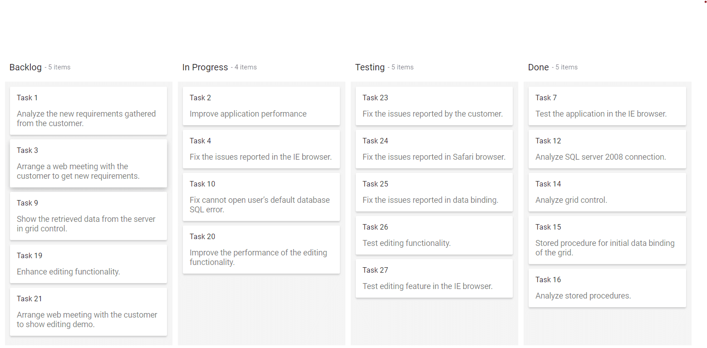
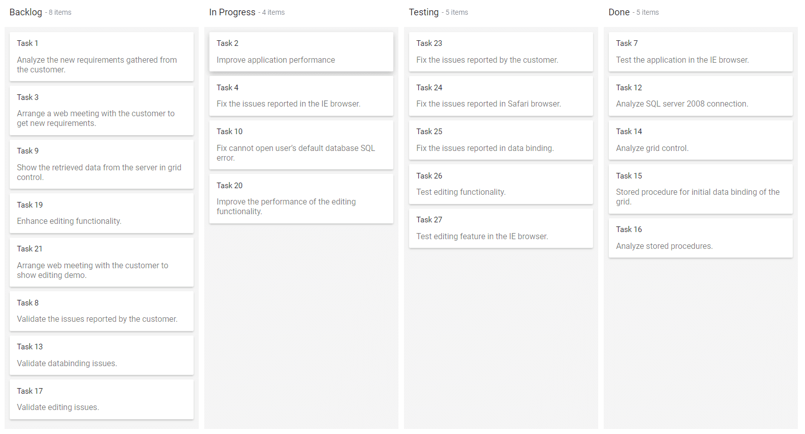
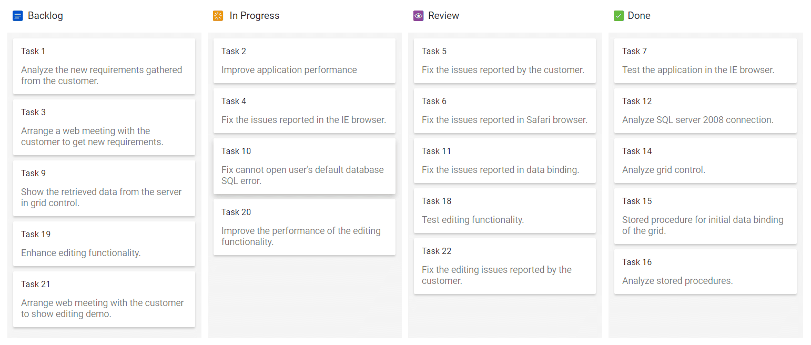
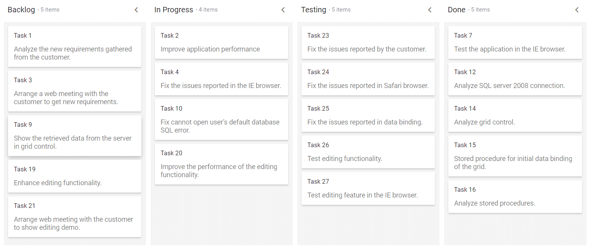
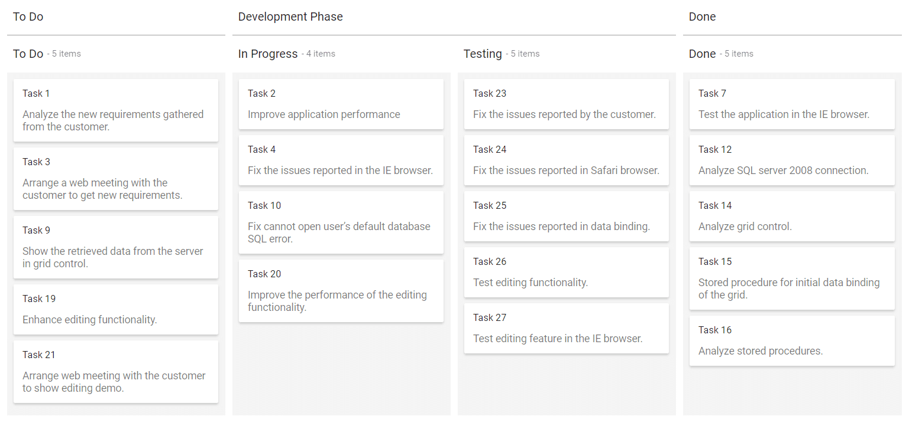

# Columns in Blazor Kanban Component

The **Kanban** columns represent the each stage of the process. The column definitions are used as the **DataSource** schema in the Kanban. The Kanban operations such as drag-and-drop, swimlane, and toggle columns are performed based on column definitions.

## Single-key mapping

Kanban columns are categorized by mapping the **key** from the datasource using the `KeyField` property. The corresponding **value** in the datasource is mapped inside the columns `KeyField`. Based on this categorization, Kanban columns are split on this board.

> The `KeyField` property is mandatory to render the columns in the Kanban board.

```cshtml

@using Syncfusion.Blazor.Kanban

<SfKanban TValue="TasksModel" KeyField="Status" DataSource="Tasks">
    <KanbanColumns>
        <KanbanColumn HeaderText="Backlog" KeyField="@(new List<string>() {"Open"})"></KanbanColumn>
        <KanbanColumn HeaderText="In Progress" KeyField="@(new List<string>() {"InProgress"})"></KanbanColumn>
        <KanbanColumn HeaderText="Testing" KeyField="@(new List<string>() {"Testing"})"></KanbanColumn>
        <KanbanColumn HeaderText="Done" KeyField="@(new List<string>() {"Close"})"></KanbanColumn>
    </KanbanColumns>
    <KanbanCardSettings HeaderField="Id" ContentField="Summary"></KanbanCardSettings>
</SfKanban>

@code {
    public class TasksModel
    {
        public string Id { get; set; }
        public string Title { get; set; }
        public string Status { get; set; }
        public string Summary { get; set; }
        public string Assignee { get; set; }
    }

    public List<TasksModel> Tasks = new List<TasksModel>()
{
        new TasksModel { Id = "Task 1", Title = "BLAZ-29001", Status = "Open", Summary = "Analyze the new requirements gathered from the customer.", Assignee = "Nancy Davloio" },
        new TasksModel { Id = "Task 2", Title = "BLAZ-29002", Status = "InProgress", Summary = "Improve application performance", Assignee = "Andrew Fuller" },
        new TasksModel { Id = "Task 3", Title = "BLAZ-29003", Status = "Open", Summary = "Arrange a web meeting with the customer to get new requirements.", Assignee = "Janet Leverling" },
        new TasksModel { Id = "Task 4", Title = "BLAZ-29004", Status = "InProgress", Summary = "Fix the issues reported in the IE browser.", Assignee = "Janet Leverling" },
        new TasksModel { Id = "Task 5", Title = "BLAZ-29005", Status = "Review", Summary = "Fix the issues reported by the customer.", Assignee = "Steven walker" },
        new TasksModel { Id = "Task 6", Title = "BLAZ-29006", Status = "Review", Summary = "Fix the issues reported in Safari browser.", Assignee = "Nancy Davloio" },
        new TasksModel { Id = "Task 7", Title = "BLAZ-29007", Status = "Close", Summary = "Test the application in the IE browser.", Assignee = "Margaret hamilt" },
        new TasksModel { Id = "Task 8", Title = "BLAZ-29008", Status = "Validate", Summary = "Validate the issues reported by the customer.", Assignee = "Steven walker" },
        new TasksModel { Id = "Task 9", Title = "BLAZ-29009", Status = "Open", Summary = "Show the retrieved data from the server in grid control.", Assignee = "Margaret hamilt" },
        new TasksModel { Id = "Task 10", Title = "BLAZ-29010", Status = "InProgress", Summary = "Fix cannot open user’s default database SQL error.", Assignee = "Janet Leverling" },
        new TasksModel { Id = "Task 11", Title = "BLAZ-29011", Status = "Review", Summary = "Fix the issues reported in data binding.", Assignee = "Janet Leverling" },
        new TasksModel { Id = "Task 12", Title = "BLAZ-29012", Status = "Close", Summary = "Analyze SQL server 2008 connection.", Assignee = "Andrew Fuller" },
        new TasksModel { Id = "Task 13", Title = "BLAZ-29013", Status = "Validate", Summary = "Validate databinding issues.", Assignee = "Margaret hamilt" },
        new TasksModel { Id = "Task 14", Title = "BLAZ-29014", Status = "Close", Summary = "Analyze grid control.", Assignee = "Margaret hamilt" },
        new TasksModel { Id = "Task 15", Title = "BLAZ-29015", Status = "Close", Summary = "Stored procedure for initial data binding of the grid.", Assignee = "Steven walker" },
        new TasksModel { Id = "Task 16", Title = "BLAZ-29016", Status = "Close", Summary = "Analyze stored procedures.", Assignee = "Janet Leverling" },
        new TasksModel { Id = "Task 17", Title = "BLAZ-29017", Status = "Validate", Summary = "Validate editing issues.", Assignee = "Nancy Davloio" },
        new TasksModel { Id = "Task 18", Title = "BLAZ-29018", Status = "Review", Summary = "Test editing functionality.", Assignee = "Nancy Davloio" },
        new TasksModel { Id = "Task 19", Title = "BLAZ-29019", Status = "Open", Summary = "Enhance editing functionality.", Assignee = "Andrew Fuller" },
        new TasksModel { Id = "Task 20", Title = "BLAZ-29020", Status = "InProgress", Summary = "Improve the performance of the editing functionality.", Assignee = "Nancy Davloio" },
        new TasksModel { Id = "Task 21", Title = "BLAZ-29021", Status = "Open", Summary = "Arrange web meeting with the customer to show editing demo.", Assignee = "Steven walker" },
        new TasksModel { Id = "Task 22", Title = "BLAZ-29022", Status = "Review", Summary = "Fix the editing issues reported by the customer.", Assignee = "Janet Leverling" },
        new TasksModel { Id = "Task 23", Title = "BLAZ-29023", Status = "Testing", Summary = "Fix the issues reported by the customer.", Assignee = "Steven walker" },
        new TasksModel { Id = "Task 24", Title = "BLAZ-29024", Status = "Testing", Summary = "Fix the issues reported in Safari browser.", Assignee = "Nancy Davloio" },
        new TasksModel { Id = "Task 25", Title = "BLAZ-29025", Status = "Testing", Summary = "Fix the issues reported in data binding.", Assignee = "Janet Leverling" },
        new TasksModel { Id = "Task 26", Title = "BLAZ-29026", Status = "Testing", Summary = "Test editing functionality.", Assignee = "Nancy Davloio" },
        new TasksModel { Id = "Task 27", Title = "BLAZ-29027", Status = "Testing", Summary = "Test editing feature in the IE browser.", Assignee = "Janet Leverling" }
    };
}

```

Output be like the below.



## Multi-key mapping

Kanban board allows to render a single column by mapping multiple keys using `KeyField` property. In below sample, specified the multiple keys(Open, Validate) to a single column.

```cshtml

@using Syncfusion.Blazor.Kanban

<SfKanban TValue="TasksModel" KeyField="Status" DataSource="Tasks">
    <KanbanColumns>
        <KanbanColumn HeaderText="Backlog" KeyField="@(new List<string>() {"Open", "Validate"})"></KanbanColumn>
        <KanbanColumn HeaderText="In Progress" KeyField="@(new List<string>() {"InProgress"})"></KanbanColumn>
        <KanbanColumn HeaderText="Testing" KeyField="@(new List<string>() {"Testing"})"></KanbanColumn>
        <KanbanColumn HeaderText="Done" KeyField="@(new List<string>() {"Close"})"></KanbanColumn>
    </KanbanColumns>
    <KanbanCardSettings HeaderField="Id" ContentField="Summary"></KanbanCardSettings>
</SfKanban>

@code {
    public class TasksModel
    {
        public string Id { get; set; }
        public string Title { get; set; }
        public string Status { get; set; }
        public string Summary { get; set; }
        public string Assignee { get; set; }
    }

    public List<TasksModel> Tasks = new List<TasksModel>()
{
        new TasksModel { Id = "Task 1", Title = "BLAZ-29001", Status = "Open", Summary = "Analyze the new requirements gathered from the customer.", Assignee = "Nancy Davloio" },
        new TasksModel { Id = "Task 2", Title = "BLAZ-29002", Status = "InProgress", Summary = "Improve application performance", Assignee = "Andrew Fuller" },
        new TasksModel { Id = "Task 3", Title = "BLAZ-29003", Status = "Open", Summary = "Arrange a web meeting with the customer to get new requirements.", Assignee = "Janet Leverling" },
        new TasksModel { Id = "Task 4", Title = "BLAZ-29004", Status = "InProgress", Summary = "Fix the issues reported in the IE browser.", Assignee = "Janet Leverling" },
        new TasksModel { Id = "Task 5", Title = "BLAZ-29005", Status = "Review", Summary = "Fix the issues reported by the customer.", Assignee = "Steven walker" },
        new TasksModel { Id = "Task 6", Title = "BLAZ-29006", Status = "Review", Summary = "Fix the issues reported in Safari browser.", Assignee = "Nancy Davloio" },
        new TasksModel { Id = "Task 7", Title = "BLAZ-29007", Status = "Close", Summary = "Test the application in the IE browser.", Assignee = "Margaret hamilt" },
        new TasksModel { Id = "Task 8", Title = "BLAZ-29008", Status = "Validate", Summary = "Validate the issues reported by the customer.", Assignee = "Steven walker" },
        new TasksModel { Id = "Task 9", Title = "BLAZ-29009", Status = "Open", Summary = "Show the retrieved data from the server in grid control.", Assignee = "Margaret hamilt" },
        new TasksModel { Id = "Task 10", Title = "BLAZ-29010", Status = "InProgress", Summary = "Fix cannot open user’s default database SQL error.", Assignee = "Janet Leverling" },
        new TasksModel { Id = "Task 11", Title = "BLAZ-29011", Status = "Review", Summary = "Fix the issues reported in data binding.", Assignee = "Janet Leverling" },
        new TasksModel { Id = "Task 12", Title = "BLAZ-29012", Status = "Close", Summary = "Analyze SQL server 2008 connection.", Assignee = "Andrew Fuller" },
        new TasksModel { Id = "Task 13", Title = "BLAZ-29013", Status = "Validate", Summary = "Validate databinding issues.", Assignee = "Margaret hamilt" },
        new TasksModel { Id = "Task 14", Title = "BLAZ-29014", Status = "Close", Summary = "Analyze grid control.", Assignee = "Margaret hamilt" },
        new TasksModel { Id = "Task 15", Title = "BLAZ-29015", Status = "Close", Summary = "Stored procedure for initial data binding of the grid.", Assignee = "Steven walker" },
        new TasksModel { Id = "Task 16", Title = "BLAZ-29016", Status = "Close", Summary = "Analyze stored procedures.", Assignee = "Janet Leverling" },
        new TasksModel { Id = "Task 17", Title = "BLAZ-29017", Status = "Validate", Summary = "Validate editing issues.", Assignee = "Nancy Davloio" },
        new TasksModel { Id = "Task 18", Title = "BLAZ-29018", Status = "Review", Summary = "Test editing functionality.", Assignee = "Nancy Davloio" },
        new TasksModel { Id = "Task 19", Title = "BLAZ-29019", Status = "Open", Summary = "Enhance editing functionality.", Assignee = "Andrew Fuller" },
        new TasksModel { Id = "Task 20", Title = "BLAZ-29020", Status = "InProgress", Summary = "Improve the performance of the editing functionality.", Assignee = "Nancy Davloio" },
        new TasksModel { Id = "Task 21", Title = "BLAZ-29021", Status = "Open", Summary = "Arrange web meeting with the customer to show editing demo.", Assignee = "Steven walker" },
        new TasksModel { Id = "Task 22", Title = "BLAZ-29022", Status = "Review", Summary = "Fix the editing issues reported by the customer.", Assignee = "Janet Leverling" },
        new TasksModel { Id = "Task 23", Title = "BLAZ-29023", Status = "Testing", Summary = "Fix the issues reported by the customer.", Assignee = "Steven walker" },
        new TasksModel { Id = "Task 24", Title = "BLAZ-29024", Status = "Testing", Summary = "Fix the issues reported in Safari browser.", Assignee = "Nancy Davloio" },
        new TasksModel { Id = "Task 25", Title = "BLAZ-29025", Status = "Testing", Summary = "Fix the issues reported in data binding.", Assignee = "Janet Leverling" },
        new TasksModel { Id = "Task 26", Title = "BLAZ-29026", Status = "Testing", Summary = "Test editing functionality.", Assignee = "Nancy Davloio" },
        new TasksModel { Id = "Task 27", Title = "BLAZ-29027", Status = "Testing", Summary = "Test editing feature in the IE browser.", Assignee = "Janet Leverling" }
    };
}

```

Output be like the below.



## Header text

You can provide the column header text of Kanban columns using the `HeaderText` property. If you have not specified any header text, it will render the header without any text.

## Header template

You can customize the column header with `Template` property as shown in the following code.

```cshtml

@using Syncfusion.Blazor.Kanban

<SfKanban TValue="TasksModel" KeyField="Status" DataSource="Tasks">
    <KanbanColumns>
        <KanbanColumn HeaderText="Backlog" KeyField="@(new List<string>() {"Open"})">
            <Template>
                @{
                    KanbanColumn column = (KanbanColumn)context;
                    <div class="header-template-wrap">
                        <div class="header-icon e-icons @column.KeyField[0]"></div>
                        <div class="header-text">@column.HeaderText</div>
                    </div>
                }
            </Template>
        </KanbanColumn>
        <KanbanColumn HeaderText="In Progress" KeyField="@(new List<string>() {"InProgress"})">
            <Template>
                @{
                    KanbanColumn column = (KanbanColumn)context;
                    <div class="header-template-wrap">
                        <div class="header-icon e-icons @column.KeyField[0]"></div>
                        <div class="header-text">@column.HeaderText</div>
                    </div>
                }
            </Template>
        </KanbanColumn>
        <KanbanColumn HeaderText="Review" KeyField="@(new List<string>() {"Review"})">
            <Template>
                @{
                    KanbanColumn column = (KanbanColumn)context;
                    <div class="header-template-wrap">
                        <div class="header-icon e-icons @column.KeyField[0]"></div>
                        <div class="header-text">@column.HeaderText</div>
                    </div>
                }
            </Template>
        </KanbanColumn>
        <KanbanColumn HeaderText="Done" KeyField="@(new List<string>() {"Close"})">
            <Template>
                @{
                    KanbanColumn column = (KanbanColumn)context;
                    <div class="header-template-wrap">
                        <div class="header-icon e-icons @column.KeyField[0]"></div>
                        <div class="header-text">@column.HeaderText</div>
                    </div>
                }
            </Template>
        </KanbanColumn>
    </KanbanColumns>
    <KanbanCardSettings HeaderField="Id" ContentField="Summary"></KanbanCardSettings>
</SfKanban>

<style type="text/css">
    .e-kanban .header-template-wrap {
        display: inline-flex;
        font-size: 15px;
        font-weight: 400;
    }

        .e-kanban .header-template-wrap .header-icon {
            font-family: "KanbanHeaderIcons";
            margin-top: 3px;
            width: 10%;
        }

        .e-kanban .header-template-wrap .header-text {
            margin-left: 15px;
        }

    .e-kanban .card-header {
        padding-left: 12px;
    }

    .e-kanban .Open::before {
        content: "\e700";
        color: #0251cc;
        font-size: 16px;
    }

    .e-kanban .InProgress::before {
        content: "\e703";
        color: #ea9713;
        font-size: 16px;
    }

    .e-kanban .Review::before {
        content: "\e701";
        color: #8e4399;
        font-size: 16px;
    }

    .e-kanban .Close::before {
        content: "\e702";
        color: #63ba3c;
        font-size: 16px;
    }

    @@font-face {
        font-family: "KanbanHeaderIcons";
        src: url(data:application/x-font-ttf;charset=utf-8;base64,AAEAAAAKAIAAAwAgT1MvMj1tSfUAAAEoAAAAVmNtYXDnE+dkAAABlAAAADxnbHlmg4weAgAAAdwAAAhQaGVhZBfH57sAAADQAAAANmhoZWEIVQQGAAAArAAAACRobXR4FAAAAAAAAYAAAAAUbG9jYQNeBi4AAAHQAAAADG1heHABGAFgAAABCAAAACBuYW1lH65UOQAACiwAAALNcG9zdFsyKlEAAAz8AAAAUgABAAAEAAAAAFwEAAAAAAAD+AABAAAAAAAAAAAAAAAAAAAABQABAAAAAQAA7pb8lF8PPPUACwQAAAAAANpY0WMAAAAA2ljRYwAAAAAD+AP4AAAACAACAAAAAAAAAAEAAAAFAVQACQAAAAAAAgAAAAoACgAAAP8AAAAAAAAAAQQAAZAABQAAAokCzAAAAI8CiQLMAAAB6wAyAQgAAAIABQMAAAAAAAAAAAAAAAAAAAAAAAAAAAAAUGZFZABA5wDnAwQAAAAAXAQAAAAAAAABAAAAAAAABAAAAAQAAAAEAAAABAAAAAQAAAAAAAACAAAAAwAAABQAAwABAAAAFAAEACgAAAAEAAQAAQAA5wP//wAA5wD//wAAAAEABAAAAAEAAgADAAQAAAAAAMwCBgKSBCgABAAAAAAD+AP4ACEAQwBlAKkAAAEfBw8HIS8HPwclHwcPByEvBz8HJR8HDwchLwc/BycRHw8hPw8RLw8hDw4CXgcGBQUEAwEBAQEDBAUFBgf+hgYGBQUEAwEBAQEDBAUFBgYCOAYGBQUEAwEBAQEDBAUFBgb9yAYGBQUEAwEBAQEDBAUFBgYCOAYGBQUEAwEBAQEDBAUFBgb9yAYGBQUEAwEBAQEDBAUFBgbcAQIDBQUHCAkKCgsMDQ0ODQLgDQ4NDQwLCgoJCAcFBQMCAQECAwUFBwgJCgoLDA0NDg39IA0ODQ0MCwoKCQgHBQUDAgFDAQEDBAUFBgYHBgUFBAMBAQEBAwQFBQYHBgYFBQQDAQG9AQEDBAUFBgcGBgUFBAMBAQEBAwQFBQYGBwYFBQQDAQG9AQEDBAUFBgYHBgUFBAMBAQEBAwQFBQYHBgYFBQQDAQGz/SANDg0NDAsKCgkIBwUFAwIBAQIDBQUHCAkKCgsMDQ0ODQLgDQ4NDQwLCgoJCAcFBQMCAQECAwUFBwgJCgoLDA0NDgAABAAAAAAD+AP4AD8AggDUARgAAAEfBw8PLw41Pw8fBicPDx8PMz8OLxAHNzMfEhUPESsBLxA9AT8UJREfDyE/DxEvDyEPDgJlCAcGBgQCAgEBAgMEBQcHCAkJCwsMDAwNDgwNDAsLCgkICAYFAwMBAQMDBQUHBwgJCQoLCwwMDA4MDAwLCgqEDg8PDw4PDw8VFBQUExMTEhUWFhYXFxgYEhMSERISEREUEBEREBESERkZGRgXFxcXEA8QEBAREREWFxYVFhUWFhIeFAsXGBkYGRkYGSATExISEhIRBQMBAgICHBkaGhscGx0UExMTExMTExoUFRQVFBUVHBoaGhkYGRkEAgIDGBQVFhYXFxcREREQEREQEQ8ODv4aAQIDBQUHCAkKCgsMDQ0ODQLgDQ4NDQwLCgoJCAcFBQMCAQECAwUFBwgJCgoLDA0NDg39IA0ODQ0MCwoKCQgHBQUDAgJXCQoKCwsMDAwNDAwMCgsJCQgHBgUEAwIBAQIDBQUHCAkJCgsMCw0MDQwLDAoLCQkJBwcGBQQCAgEBAgMEBQYIWQMEBQYGBwgJDg4PERETExUYFxUTEhAPDgkIBwUFAwEBAgIEBQYHCA0QEBMUFhcaEREQDw8NDQ0PDQsJCAYEAwEBMAIEBggJDA4PFg8PERESFBQHBwYGBgUEIBsZFhUTERAJCAYGBAMCAgQFBggJChAREhUWGBoeCAUFBAYHGxcVFBMREQ8KCQgHBgYEBAMCAYT9IA0ODQ0MCwoKCQgHBQUDAgEBAgMFBQcICQoKCwwNDQ4NAuANDg0NDAsKCgkIBwUFAwIBAQIDBQUHCAkKCgsMDQ0OAAIAAAAAA/gD+AArAG8AAAEfAhUPAwEPAy8INT8GMx8DAT8DHwIlER8PIT8PES8PIQ8OAvMEAwIBAQME/r8FBQYGBgYFBXkEAwEBAgMEBQUGBgYGBgViASoFBgYGBgYF/RoBAgMFBQcICQoKCwwNDQ4NAuANDg0NDAsKCgkIBwUFAwIBAQIDBQUHCAkKCgsMDQ0ODf0gDQ4NDQwLCgoJCAcFBQMCArQFBgYGBgYFBf7FBAMBAQEBAwR2BQUGBgYGBgUEAwEBAgMEYAElBAMBAQEBA7j9IA0ODQ0MCwoKCQgHBQUDAgEBAgMFBQcICQoKCwwNDQ4NAuANDg0NDAsKCgkIBwUFAwIBAQIDBQUHCAkKCgsMDQ0OAAAJAAAAAAP4A/gAIQBDAGUAhwCpAMsA7QEPAVMAAAEVDwcvBzU/Bx8GNx8EDwYrAS8GPQE/BTsBHwEFHwMPBysBLwU9AT8GOwEfASUfBw8HIy8HPwchHwcPByMvBz8HJR8DDwcrAS8FPQE/BjsBHwEFHwMdAQ8FKwEvBz8GOwEfASUVDwcvBzU/Bx8GJREfDyE/DxEvDyEPDgIgAQIDBAQGBgYGBgYEBAMCAQECAwQEBgYGBgYGBAQDAopiBAMCAQECAwQFBQYGBgYFBWIEAwICAwQFBQYGBgYF/t8EAwIBAQIDBGIFBQYGBgYFBQQDAgIDBGIFBQYGBgYFAdwHBgUFBAMBAQEBAwQFBQYHigYGBgQEAwIBAQIDBAQGBgb+YAYGBgQEAwIBAQIDBAQGBgaKBwYFBQQDAQEBAQMEBQUGBwJlBAMCAQECAwRiBQUGBgYGBQUEAwICAwRiBQUGBgYGBf4bYgQDAgIDBAUFBgYGBgUFYgQDAgEBAgMEBQUGBgYGBQEEAQIDBAQGBgYGBgYEBAMCAQECAwQEBgYGBgYGBAQDAv3pAQIDBQUHCAkKCgsMDQ0ODQLgDQ4NDQwLCgoJCAcFBQMCAQECAwUFBwgJCgoLDA0NDg39IA0ODQ0MCwoKCQgHBQUDAgEwigcGBQUEAwEBAQEDBAUFBgeKBgYGBAQDAgEBAgMEBAYGTWIFBQYGBgYFBQQDAgIDBGIFBQYGBgYFBQQDAgIDBAUFBgYGBgUFYgQDAgIDBAUFBgYGBgUFYgQDAgIDmQECAwQEBgYGBgYGBAQDAgEBAgMEBAYGBgYGBgQEAwIBAQIDBAQGBgYGBgYEBAMCAQECAwQEBgYGBgYGBAQDAgHrBQUGBgYGBQViBAMCAgMEBQUGBgYGBQViBAMCAgMEYgUFBgYGBgUFBAMCAgMEYgUFBgYGBgUFBAMCAgNLigYGBgQEAwIBAQIDBAQGBgaKBwYFBQQDAQEBAQMEBQUGD/0gDQ4NDQwLCgoJCAcFBQMCAQECAwUFBwgJCgoLDA0NDg0C4A0ODQ0MCwoKCQgHBQUDAgEBAgMFBQcICQoKCwwNDQ4AAAAAEgDeAAEAAAAAAAAAAQAAAAEAAAAAAAEAFQABAAEAAAAAAAIABwAWAAEAAAAAAAMAFQAdAAEAAAAAAAQAFQAyAAEAAAAAAAUACwBHAAEAAAAAAAYAFQBSAAEAAAAAAAoALABnAAEAAAAAAAsAEgCTAAMAAQQJAAAAAgClAAMAAQQJAAEAKgCnAAMAAQQJAAIADgDRAAMAAQQJAAMAKgDfAAMAAQQJAAQAKgEJAAMAAQQJAAUAFgEzAAMAAQQJAAYAKgFJAAMAAQQJAAoAWAFzAAMAAQQJAAsAJAHLIEthbmJhbiBwcmlvcml0eSBpY29uc1JlZ3VsYXJLYW5iYW4gcHJpb3JpdHkgaWNvbnNLYW5iYW4gcHJpb3JpdHkgaWNvbnNWZXJzaW9uIDEuMEthbmJhbiBwcmlvcml0eSBpY29uc0ZvbnQgZ2VuZXJhdGVkIHVzaW5nIFN5bmNmdXNpb24gTWV0cm8gU3R1ZGlvd3d3LnN5bmNmdXNpb24uY29tACAASwBhAG4AYgBhAG4AIABwAHIAaQBvAHIAaQB0AHkAIABpAGMAbwBuAHMAUgBlAGcAdQBsAGEAcgBLAGEAbgBiAGEAbgAgAHAAcgBpAG8AcgBpAHQAeQAgAGkAYwBvAG4AcwBLAGEAbgBiAGEAbgAgAHAAcgBpAG8AcgBpAHQAeQAgAGkAYwBvAG4AcwBWAGUAcgBzAGkAbwBuACAAMQAuADAASwBhAG4AYgBhAG4AIABwAHIAaQBvAHIAaQB0AHkAIABpAGMAbwBuAHMARgBvAG4AdAAgAGcAZQBuAGUAcgBhAHQAZQBkACAAdQBzAGkAbgBnACAAUwB5AG4AYwBmAHUAcwBpAG8AbgAgAE0AZQB0AHIAbwAgAFMAdAB1AGQAaQBvAHcAdwB3AC4AcwB5AG4AYwBmAHUAcwBpAG8AbgAuAGMAbwBtAAAAAAIAAAAAAAAACgAAAAAAAAAAAAAAAAAAAAAAAAAAAAAABQECAQMBBAEFAQYACFRvZG9saXN0BlJldmlldwlDb21wbGV0ZWQIUHJvZ3Jlc3MAAAAA) format("truetype");
        font-weight: normal;
        font-style: normal;
    }

    [class^="sf-icon-"],
    [class*=" sf-icon-"] {
        font-family: "KanbanHeaderIcons" !important;
        speak: none;
        font-size: 55px;
        font-style: normal;
        font-weight: normal;
        font-variant: normal;
        text-transform: none;
        line-height: 1;
        -webkit-font-smoothing: antialiased;
        -moz-osx-font-smoothing: grayscale;
    }
</style>

@code {
    public class TasksModel
    {
        public string Id { get; set; }
        public string Title { get; set; }
        public string Status { get; set; }
        public string Summary { get; set; }
        public string Assignee { get; set; }
    }

    public List<TasksModel> Tasks = new List<TasksModel>()
{
        new TasksModel { Id = "Task 1", Title = "BLAZ-29001", Status = "Open", Summary = "Analyze the new requirements gathered from the customer.", Assignee = "Nancy Davloio" },
        new TasksModel { Id = "Task 2", Title = "BLAZ-29002", Status = "InProgress", Summary = "Improve application performance", Assignee = "Andrew Fuller" },
        new TasksModel { Id = "Task 3", Title = "BLAZ-29003", Status = "Open", Summary = "Arrange a web meeting with the customer to get new requirements.", Assignee = "Janet Leverling" },
        new TasksModel { Id = "Task 4", Title = "BLAZ-29004", Status = "InProgress", Summary = "Fix the issues reported in the IE browser.", Assignee = "Janet Leverling" },
        new TasksModel { Id = "Task 5", Title = "BLAZ-29005", Status = "Review", Summary = "Fix the issues reported by the customer.", Assignee = "Steven walker" },
        new TasksModel { Id = "Task 6", Title = "BLAZ-29006", Status = "Review", Summary = "Fix the issues reported in Safari browser.", Assignee = "Nancy Davloio" },
        new TasksModel { Id = "Task 7", Title = "BLAZ-29007", Status = "Close", Summary = "Test the application in the IE browser.", Assignee = "Margaret hamilt" },
        new TasksModel { Id = "Task 8", Title = "BLAZ-29008", Status = "Validate", Summary = "Validate the issues reported by the customer.", Assignee = "Steven walker" },
        new TasksModel { Id = "Task 9", Title = "BLAZ-29009", Status = "Open", Summary = "Show the retrieved data from the server in grid control.", Assignee = "Margaret hamilt" },
        new TasksModel { Id = "Task 10", Title = "BLAZ-29010", Status = "InProgress", Summary = "Fix cannot open user’s default database SQL error.", Assignee = "Janet Leverling" },
        new TasksModel { Id = "Task 11", Title = "BLAZ-29011", Status = "Review", Summary = "Fix the issues reported in data binding.", Assignee = "Janet Leverling" },
        new TasksModel { Id = "Task 12", Title = "BLAZ-29012", Status = "Close", Summary = "Analyze SQL server 2008 connection.", Assignee = "Andrew Fuller" },
        new TasksModel { Id = "Task 13", Title = "BLAZ-29013", Status = "Validate", Summary = "Validate databinding issues.", Assignee = "Margaret hamilt" },
        new TasksModel { Id = "Task 14", Title = "BLAZ-29014", Status = "Close", Summary = "Analyze grid control.", Assignee = "Margaret hamilt" },
        new TasksModel { Id = "Task 15", Title = "BLAZ-29015", Status = "Close", Summary = "Stored procedure for initial data binding of the grid.", Assignee = "Steven walker" },
        new TasksModel { Id = "Task 16", Title = "BLAZ-29016", Status = "Close", Summary = "Analyze stored procedures.", Assignee = "Janet Leverling" },
        new TasksModel { Id = "Task 17", Title = "BLAZ-29017", Status = "Validate", Summary = "Validate editing issues.", Assignee = "Nancy Davloio" },
        new TasksModel { Id = "Task 18", Title = "BLAZ-29018", Status = "Review", Summary = "Test editing functionality.", Assignee = "Nancy Davloio" },
        new TasksModel { Id = "Task 19", Title = "BLAZ-29019", Status = "Open", Summary = "Enhance editing functionality.", Assignee = "Andrew Fuller" },
        new TasksModel { Id = "Task 20", Title = "BLAZ-29020", Status = "InProgress", Summary = "Improve the performance of the editing functionality.", Assignee = "Nancy Davloio" },
        new TasksModel { Id = "Task 21", Title = "BLAZ-29021", Status = "Open", Summary = "Arrange web meeting with the customer to show editing demo.", Assignee = "Steven walker" },
        new TasksModel { Id = "Task 22", Title = "BLAZ-29022", Status = "Review", Summary = "Fix the editing issues reported by the customer.", Assignee = "Janet Leverling" },
        new TasksModel { Id = "Task 23", Title = "BLAZ-29023", Status = "Testing", Summary = "Fix the issues reported by the customer.", Assignee = "Steven walker" },
        new TasksModel { Id = "Task 24", Title = "BLAZ-29024", Status = "Testing", Summary = "Fix the issues reported in Safari browser.", Assignee = "Nancy Davloio" },
        new TasksModel { Id = "Task 25", Title = "BLAZ-29025", Status = "Testing", Summary = "Fix the issues reported in data binding.", Assignee = "Janet Leverling" },
        new TasksModel { Id = "Task 26", Title = "BLAZ-29026", Status = "Testing", Summary = "Test editing functionality.", Assignee = "Nancy Davloio" },
        new TasksModel { Id = "Task 27", Title = "BLAZ-29027", Status = "Testing", Summary = "Test editing feature in the IE browser.", Assignee = "Janet Leverling" }
    };
}

```

Output be like the below.



## Toggle columns

Kanban allows to expand or collapse its columns using `AllowToggle` in `KanbanColumn`. When enable the property, it will render the expand or collapse icon to the column header.

> By default, collapsed column width is set to `50px`.

```cshtml

@using Syncfusion.Blazor.Kanban

<SfKanban KeyField="Status" DataSource="Tasks">
    <KanbanColumns>
        <KanbanColumn HeaderText="Backlog" KeyField="@(new List<string>() {"Open"})" AllowToggle="true"></KanbanColumn>
        <KanbanColumn HeaderText="In Progress" KeyField="@(new List<string>() {"InProgress"})" AllowToggle="true"></KanbanColumn>
        <KanbanColumn HeaderText="Testing" KeyField="@(new List<string>() {"Testing"})" AllowToggle="true"></KanbanColumn>
        <KanbanColumn HeaderText="Done" KeyField="@(new List<string>() {"Close"})" AllowToggle="true"></KanbanColumn>
    </KanbanColumns>
    <KanbanCardSettings HeaderField="Id" ContentField="Summary"></KanbanCardSettings>
</SfKanban>

@code {
    public class TasksModel
    {
        public string Id { get; set; }
        public string Title { get; set; }
        public string Status { get; set; }
        public string Summary { get; set; }
        public string Assignee { get; set; }
    }

    public List<TasksModel> Tasks = new List<TasksModel>()
    {
        new TasksModel { Id = "Task 1", Title = "BLAZ-29001", Status = "Open", Summary = "Analyze the new requirements gathered from the customer.", Assignee = "Nancy Davloio" },
        new TasksModel { Id = "Task 2", Title = "BLAZ-29002", Status = "InProgress", Summary = "Improve application performance", Assignee = "Andrew Fuller" },
        new TasksModel { Id = "Task 3", Title = "BLAZ-29003", Status = "Open", Summary = "Arrange a web meeting with the customer to get new requirements.", Assignee = "Janet Leverling" },
        new TasksModel { Id = "Task 4", Title = "BLAZ-29004", Status = "InProgress", Summary = "Fix the issues reported in the IE browser.", Assignee = "Janet Leverling" },
        new TasksModel { Id = "Task 5", Title = "BLAZ-29005", Status = "Review", Summary = "Fix the issues reported by the customer.", Assignee = "Steven walker" },
        new TasksModel { Id = "Task 6", Title = "BLAZ-29006", Status = "Review", Summary = "Fix the issues reported in Safari browser.", Assignee = "Nancy Davloio" },
        new TasksModel { Id = "Task 7", Title = "BLAZ-29007", Status = "Close", Summary = "Test the application in the IE browser.", Assignee = "Margaret hamilt" },
        new TasksModel { Id = "Task 8", Title = "BLAZ-29008", Status = "Validate", Summary = "Validate the issues reported by the customer.", Assignee = "Steven walker" },
        new TasksModel { Id = "Task 9", Title = "BLAZ-29009", Status = "Open", Summary = "Show the retrieved data from the server in grid control.", Assignee = "Margaret hamilt" },
        new TasksModel { Id = "Task 10", Title = "BLAZ-29010", Status = "InProgress", Summary = "Fix cannot open user’s default database SQL error.", Assignee = "Janet Leverling" },
        new TasksModel { Id = "Task 11", Title = "BLAZ-29011", Status = "Review", Summary = "Fix the issues reported in data binding.", Assignee = "Janet Leverling" },
        new TasksModel { Id = "Task 12", Title = "BLAZ-29012", Status = "Close", Summary = "Analyze SQL server 2008 connection.", Assignee = "Andrew Fuller" },
        new TasksModel { Id = "Task 13", Title = "BLAZ-29013", Status = "Validate", Summary = "Validate databinding issues.", Assignee = "Margaret hamilt" },
        new TasksModel { Id = "Task 14", Title = "BLAZ-29014", Status = "Close", Summary = "Analyze grid control.", Assignee = "Margaret hamilt" },
        new TasksModel { Id = "Task 15", Title = "BLAZ-29015", Status = "Close", Summary = "Stored procedure for initial data binding of the grid.", Assignee = "Steven walker" },
        new TasksModel { Id = "Task 16", Title = "BLAZ-29016", Status = "Close", Summary = "Analyze stored procedures.", Assignee = "Janet Leverling" },
        new TasksModel { Id = "Task 17", Title = "BLAZ-29017", Status = "Validate", Summary = "Validate editing issues.", Assignee = "Nancy Davloio" },
        new TasksModel { Id = "Task 18", Title = "BLAZ-29018", Status = "Review", Summary = "Test editing functionality.", Assignee = "Nancy Davloio" },
        new TasksModel { Id = "Task 19", Title = "BLAZ-29019", Status = "Open", Summary = "Enhance editing functionality.", Assignee = "Andrew Fuller" },
        new TasksModel { Id = "Task 20", Title = "BLAZ-29020", Status = "InProgress", Summary = "Improve the performance of the editing functionality.", Assignee = "Nancy Davloio" },
        new TasksModel { Id = "Task 21", Title = "BLAZ-29021", Status = "Open", Summary = "Arrange web meeting with the customer to show editing demo.", Assignee = "Steven walker" },
        new TasksModel { Id = "Task 22", Title = "BLAZ-29022", Status = "Review", Summary = "Fix the editing issues reported by the customer.", Assignee = "Janet Leverling" },
        new TasksModel { Id = "Task 23", Title = "BLAZ-29023", Status = "Testing", Summary = "Fix the issues reported by the customer.", Assignee = "Steven walker" },
        new TasksModel { Id = "Task 24", Title = "BLAZ-29024", Status = "Testing", Summary = "Fix the issues reported in Safari browser.", Assignee = "Nancy Davloio" },
        new TasksModel { Id = "Task 25", Title = "BLAZ-29025", Status = "Testing", Summary = "Fix the issues reported in data binding.", Assignee = "Janet Leverling" },
        new TasksModel { Id = "Task 26", Title = "BLAZ-29026", Status = "Testing", Summary = "Test editing functionality.", Assignee = "Nancy Davloio" },
        new TasksModel { Id = "Task 27", Title = "BLAZ-29027", Status = "Testing", Summary = "Test editing feature in the IE browser.", Assignee = "Janet Leverling" }
    };
}

```

Output be like the below.



### Initially collapsed column

By default, all columns are on expanded state when loading the Kanban board initially. But, you can render the columns with collapsed state using the `IsExpanded` property.

> The `IsExpanded` property only works when enabling the `AllowToggle` property on particular column.

In the following example, the Backlog column is collapsed on initialization of Kanban board.

```cshtml

@using Syncfusion.Blazor.Kanban

<SfKanban KeyField="Status" DataSource="Tasks">
    <KanbanColumns>
        <KanbanColumn HeaderText="Backlog" KeyField="@(new List<string>() {"Open"})" AllowToggle="true" IsExpanded="false"></KanbanColumn>
        <KanbanColumn HeaderText="In Progress" KeyField="@(new List<string>() {"InProgress"})" AllowToggle="true"></KanbanColumn>
        <KanbanColumn HeaderText="Testing" KeyField="@(new List<string>() {"Testing"})" AllowToggle="true" IsExpanded="false"></KanbanColumn>
        <KanbanColumn HeaderText="Done" KeyField="@(new List<string>() {"Close"})" AllowToggle="true"></KanbanColumn>
    </KanbanColumns>
    <KanbanCardSettings HeaderField="Id" ContentField="Summary"></KanbanCardSettings>
</SfKanban>

@code {
    public class TasksModel
    {
        public string Id { get; set; }
        public string Title { get; set; }
        public string Status { get; set; }
        public string Summary { get; set; }
        public string Assignee { get; set; }
    }

    public List<TasksModel> Tasks = new List<TasksModel>()
    {
        new TasksModel { Id = "Task 1", Title = "BLAZ-29001", Status = "Open", Summary = "Analyze the new requirements gathered from the customer.", Assignee = "Nancy Davloio" },
        new TasksModel { Id = "Task 2", Title = "BLAZ-29002", Status = "InProgress", Summary = "Improve application performance", Assignee = "Andrew Fuller" },
        new TasksModel { Id = "Task 3", Title = "BLAZ-29003", Status = "Open", Summary = "Arrange a web meeting with the customer to get new requirements.", Assignee = "Janet Leverling" },
        new TasksModel { Id = "Task 4", Title = "BLAZ-29004", Status = "InProgress", Summary = "Fix the issues reported in the IE browser.", Assignee = "Janet Leverling" },
        new TasksModel { Id = "Task 5", Title = "BLAZ-29005", Status = "Review", Summary = "Fix the issues reported by the customer.", Assignee = "Steven walker" },
        new TasksModel { Id = "Task 6", Title = "BLAZ-29006", Status = "Review", Summary = "Fix the issues reported in Safari browser.", Assignee = "Nancy Davloio" },
        new TasksModel { Id = "Task 7", Title = "BLAZ-29007", Status = "Close", Summary = "Test the application in the IE browser.", Assignee = "Margaret hamilt" },
        new TasksModel { Id = "Task 8", Title = "BLAZ-29008", Status = "Validate", Summary = "Validate the issues reported by the customer.", Assignee = "Steven walker" },
        new TasksModel { Id = "Task 9", Title = "BLAZ-29009", Status = "Open", Summary = "Show the retrieved data from the server in grid control.", Assignee = "Margaret hamilt" },
        new TasksModel { Id = "Task 10", Title = "BLAZ-29010", Status = "InProgress", Summary = "Fix cannot open user’s default database SQL error.", Assignee = "Janet Leverling" },
        new TasksModel { Id = "Task 11", Title = "BLAZ-29011", Status = "Review", Summary = "Fix the issues reported in data binding.", Assignee = "Janet Leverling" },
        new TasksModel { Id = "Task 12", Title = "BLAZ-29012", Status = "Close", Summary = "Analyze SQL server 2008 connection.", Assignee = "Andrew Fuller" },
        new TasksModel { Id = "Task 13", Title = "BLAZ-29013", Status = "Validate", Summary = "Validate databinding issues.", Assignee = "Margaret hamilt" },
        new TasksModel { Id = "Task 14", Title = "BLAZ-29014", Status = "Close", Summary = "Analyze grid control.", Assignee = "Margaret hamilt" },
        new TasksModel { Id = "Task 15", Title = "BLAZ-29015", Status = "Close", Summary = "Stored procedure for initial data binding of the grid.", Assignee = "Steven walker" },
        new TasksModel { Id = "Task 16", Title = "BLAZ-29016", Status = "Close", Summary = "Analyze stored procedures.", Assignee = "Janet Leverling" },
        new TasksModel { Id = "Task 17", Title = "BLAZ-29017", Status = "Validate", Summary = "Validate editing issues.", Assignee = "Nancy Davloio" },
        new TasksModel { Id = "Task 18", Title = "BLAZ-29018", Status = "Review", Summary = "Test editing functionality.", Assignee = "Nancy Davloio" },
        new TasksModel { Id = "Task 19", Title = "BLAZ-29019", Status = "Open", Summary = "Enhance editing functionality.", Assignee = "Andrew Fuller" },
        new TasksModel { Id = "Task 20", Title = "BLAZ-29020", Status = "InProgress", Summary = "Improve the performance of the editing functionality.", Assignee = "Nancy Davloio" },
        new TasksModel { Id = "Task 21", Title = "BLAZ-29021", Status = "Open", Summary = "Arrange web meeting with the customer to show editing demo.", Assignee = "Steven walker" },
        new TasksModel { Id = "Task 22", Title = "BLAZ-29022", Status = "Review", Summary = "Fix the editing issues reported by the customer.", Assignee = "Janet Leverling" },
        new TasksModel { Id = "Task 23", Title = "BLAZ-29023", Status = "Testing", Summary = "Fix the issues reported by the customer.", Assignee = "Steven walker" },
        new TasksModel { Id = "Task 24", Title = "BLAZ-29024", Status = "Testing", Summary = "Fix the issues reported in Safari browser.", Assignee = "Nancy Davloio" },
        new TasksModel { Id = "Task 25", Title = "BLAZ-29025", Status = "Testing", Summary = "Fix the issues reported in data binding.", Assignee = "Janet Leverling" },
        new TasksModel { Id = "Task 26", Title = "BLAZ-29026", Status = "Testing", Summary = "Test editing functionality.", Assignee = "Nancy Davloio" },
        new TasksModel { Id = "Task 27", Title = "BLAZ-29027", Status = "Testing", Summary = "Test editing feature in the IE browser.", Assignee = "Janet Leverling" }
    };
}

```

Output be like the below.


## Stacked headers

Stacked headers are the additional headers to column header that will group the similar columns. Define the grouping of columns **Key** value to the `KeyField` property and provide the custom header text name to grouped columns using the `Text` property in `KanbanStackedHeaders`.

In the following code, the kanban columns 'InProgress, Review' are grouped under 'Development Phase' category.

```cshtml

@using Syncfusion.Blazor.Kanban

<SfKanban KeyField="Status" DataSource="Tasks">
    <KanbanColumns>
        <KanbanColumn HeaderText="To Do" KeyField="@(new List<string>() {"Open"})"></KanbanColumn>
        <KanbanColumn HeaderText="In Progress" KeyField="@(new List<string>() {"InProgress"})"></KanbanColumn>
        <KanbanColumn HeaderText="Testing" KeyField="@(new List<string>() {"Testing"})"></KanbanColumn>
        <KanbanColumn HeaderText="Done" KeyField="@(new List<string>() {"Close"})"></KanbanColumn>
    </KanbanColumns>
    <KanbanStackedHeaders>
        <KanbanStackedHeader Text="To Do" KeyFields="@(new List<string>() {"Open"})"></KanbanStackedHeader>
        <KanbanStackedHeader Text="Development Phase" KeyFields="@(new List<string>() {"InProgress", "Testing"})"></KanbanStackedHeader>
        <KanbanStackedHeader Text="Done" KeyFields="@(new List<string>() {"Close"})"></KanbanStackedHeader>
    </KanbanStackedHeaders>
    <KanbanCardSettings HeaderField="Id" ContentField="Summary"></KanbanCardSettings>
</SfKanban>

@code {
    public class TasksModel
    {
        public string Id { get; set; }
        public string Title { get; set; }
        public string Status { get; set; }
        public string Summary { get; set; }
        public string Assignee { get; set; }
    }

    public List<TasksModel> Tasks = new List<TasksModel>()
    {
        new TasksModel { Id = "Task 1", Title = "BLAZ-29001", Status = "Open", Summary = "Analyze the new requirements gathered from the customer.", Assignee = "Nancy Davloio" },
        new TasksModel { Id = "Task 2", Title = "BLAZ-29002", Status = "InProgress", Summary = "Improve application performance", Assignee = "Andrew Fuller" },
        new TasksModel { Id = "Task 3", Title = "BLAZ-29003", Status = "Open", Summary = "Arrange a web meeting with the customer to get new requirements.", Assignee = "Janet Leverling" },
        new TasksModel { Id = "Task 4", Title = "BLAZ-29004", Status = "InProgress", Summary = "Fix the issues reported in the IE browser.", Assignee = "Janet Leverling" },
        new TasksModel { Id = "Task 5", Title = "BLAZ-29005", Status = "Review", Summary = "Fix the issues reported by the customer.", Assignee = "Steven walker" },
        new TasksModel { Id = "Task 6", Title = "BLAZ-29006", Status = "Review", Summary = "Fix the issues reported in Safari browser.", Assignee = "Nancy Davloio" },
        new TasksModel { Id = "Task 7", Title = "BLAZ-29007", Status = "Close", Summary = "Test the application in the IE browser.", Assignee = "Margaret hamilt" },
        new TasksModel { Id = "Task 8", Title = "BLAZ-29008", Status = "Validate", Summary = "Validate the issues reported by the customer.", Assignee = "Steven walker" },
        new TasksModel { Id = "Task 9", Title = "BLAZ-29009", Status = "Open", Summary = "Show the retrieved data from the server in grid control.", Assignee = "Margaret hamilt" },
        new TasksModel { Id = "Task 10", Title = "BLAZ-29010", Status = "InProgress", Summary = "Fix cannot open user’s default database SQL error.", Assignee = "Janet Leverling" },
        new TasksModel { Id = "Task 11", Title = "BLAZ-29011", Status = "Review", Summary = "Fix the issues reported in data binding.", Assignee = "Janet Leverling" },
        new TasksModel { Id = "Task 12", Title = "BLAZ-29012", Status = "Close", Summary = "Analyze SQL server 2008 connection.", Assignee = "Andrew Fuller" },
        new TasksModel { Id = "Task 13", Title = "BLAZ-29013", Status = "Validate", Summary = "Validate databinding issues.", Assignee = "Margaret hamilt" },
        new TasksModel { Id = "Task 14", Title = "BLAZ-29014", Status = "Close", Summary = "Analyze grid control.", Assignee = "Margaret hamilt" },
        new TasksModel { Id = "Task 15", Title = "BLAZ-29015", Status = "Close", Summary = "Stored procedure for initial data binding of the grid.", Assignee = "Steven walker" },
        new TasksModel { Id = "Task 16", Title = "BLAZ-29016", Status = "Close", Summary = "Analyze stored procedures.", Assignee = "Janet Leverling" },
        new TasksModel { Id = "Task 17", Title = "BLAZ-29017", Status = "Validate", Summary = "Validate editing issues.", Assignee = "Nancy Davloio" },
        new TasksModel { Id = "Task 18", Title = "BLAZ-29018", Status = "Review", Summary = "Test editing functionality.", Assignee = "Nancy Davloio" },
        new TasksModel { Id = "Task 19", Title = "BLAZ-29019", Status = "Open", Summary = "Enhance editing functionality.", Assignee = "Andrew Fuller" },
        new TasksModel { Id = "Task 20", Title = "BLAZ-29020", Status = "InProgress", Summary = "Improve the performance of the editing functionality.", Assignee = "Nancy Davloio" },
        new TasksModel { Id = "Task 21", Title = "BLAZ-29021", Status = "Open", Summary = "Arrange web meeting with the customer to show editing demo.", Assignee = "Steven walker" },
        new TasksModel { Id = "Task 22", Title = "BLAZ-29022", Status = "Review", Summary = "Fix the editing issues reported by the customer.", Assignee = "Janet Leverling" },
        new TasksModel { Id = "Task 23", Title = "BLAZ-29023", Status = "Testing", Summary = "Fix the issues reported by the customer.", Assignee = "Steven walker" },
        new TasksModel { Id = "Task 24", Title = "BLAZ-29024", Status = "Testing", Summary = "Fix the issues reported in Safari browser.", Assignee = "Nancy Davloio" },
        new TasksModel { Id = "Task 25", Title = "BLAZ-29025", Status = "Testing", Summary = "Fix the issues reported in data binding.", Assignee = "Janet Leverling" },
        new TasksModel { Id = "Task 26", Title = "BLAZ-29026", Status = "Testing", Summary = "Test editing functionality.", Assignee = "Nancy Davloio" },
        new TasksModel { Id = "Task 27", Title = "BLAZ-29027", Status = "Testing", Summary = "Test editing feature in the IE browser.", Assignee = "Janet Leverling" }
    };
}

```

Output be like the below.

