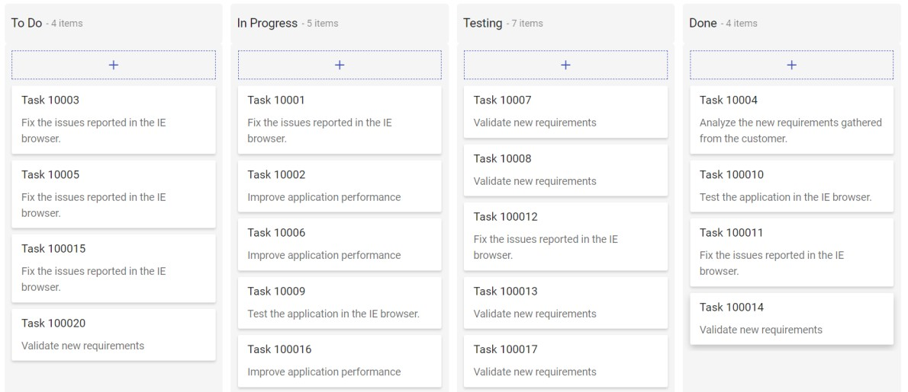
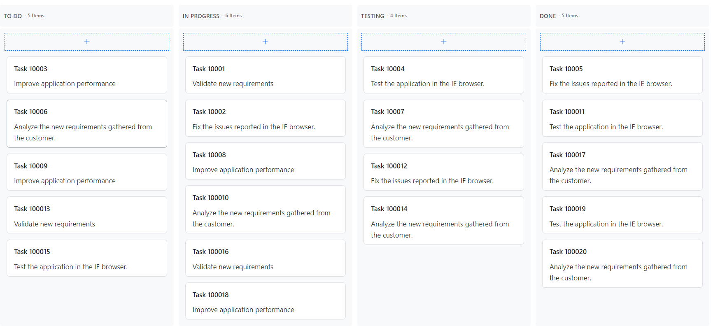
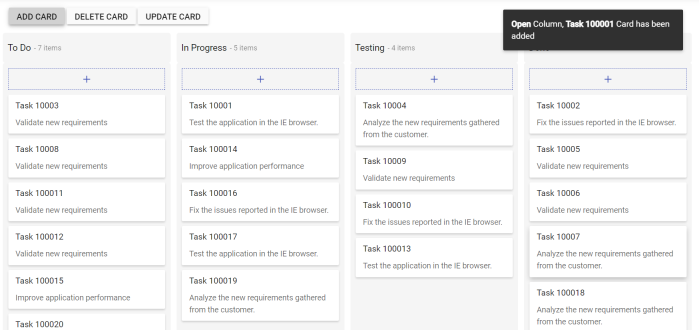
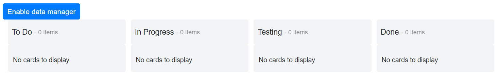
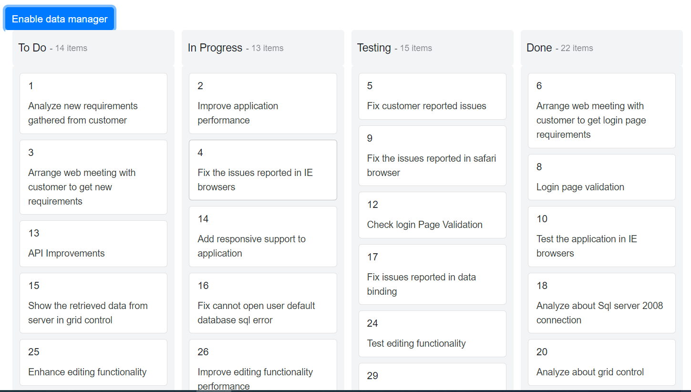
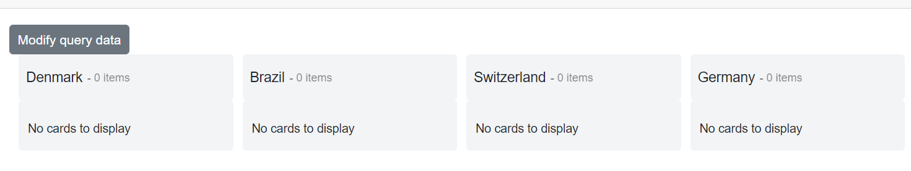
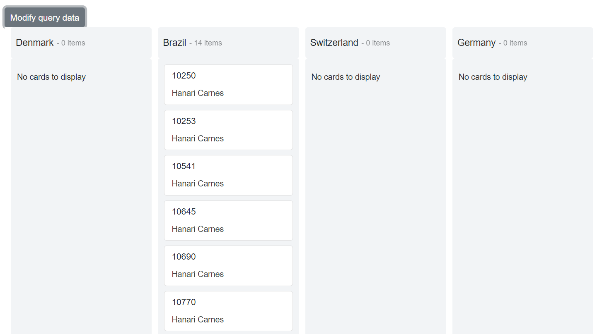
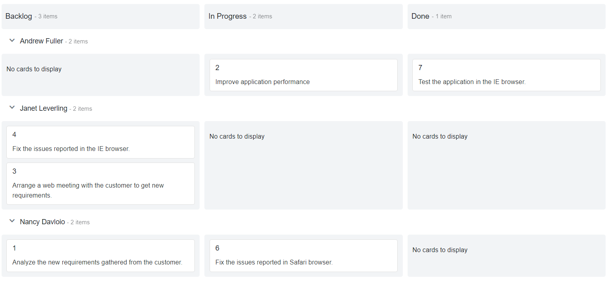

# Data Binding Overview in Blazor Kanban Component

The Kanban uses [SfDataManager](https://help.syncfusion.com/cr/blazor/Syncfusion.Blazor.Data.SfDataManager.html), which supports both RESTFUL JSON data service binding and IEnumerable binding. The [DataSource](https://help.syncfusion.com/cr/blazor/Syncfusion.Blazor.Kanban.SfKanban-1.html#Syncfusion_Blazor_Kanban_SfKanban_1_DataSource) property of Kanban can be assigned either with the instance of DataManager or a list of DataSource collection.

It supports the following types of data binding:

* Local data
* Remote data

N> **Note:** When using [DataSource](https://help.syncfusion.com/cr/blazor/Syncfusion.Blazor.Kanban.SfKanban-1.html#Syncfusion_Blazor_Kanban_SfKanban_1_DataSource) as `IEnumerable<T>`, component type(TValue) will be inferred from its value. When using [SfDataManager](https://help.syncfusion.com/cr/blazor/Syncfusion.Blazor.Data.SfDataManager.html) for data binding, the TValue must be provided explicitly in the [Blazor Kanban](https://www.syncfusion.com/blazor-components/blazor-kanban-board) component.

## Binding local data

In list binding, you can assign an IEnumerable object to the [DataSource](https://help.syncfusion.com/cr/blazor/Syncfusion.Blazor.Kanban.SfKanban-1.html#Syncfusion_Blazor_Kanban_SfKanban_1_DataSource) property. The list data source can also be provided as an instance of the [SfDataManager](https://help.syncfusion.com/cr/blazor/Syncfusion.Blazor.Data.SfDataManager.html) or by using the [SfDataManager](https://help.syncfusion.com/cr/blazor/Syncfusion.Blazor.Data.SfDataManager.html) component.

```cshtml

@using Syncfusion.Blazor.Kanban

<SfKanban TValue="TasksModel" KeyField="Status" DataSource="@Tasks">
    <KanbanColumns>
        <KanbanColumn HeaderText="To Do" KeyField="@(new List<string>() {"Open"})"></KanbanColumn>
        <KanbanColumn HeaderText="In Progress" KeyField="@(new List<string>() {"InProgress"})"></KanbanColumn>
        <KanbanColumn HeaderText="Testing" KeyField="@(new List<string>() {"Testing"})"></KanbanColumn>
        <KanbanColumn HeaderText="Done" KeyField="@(new List<string>() {"Close"})"></KanbanColumn>
    </KanbanColumns>
    <KanbanCardSettings HeaderField="Id" ContentField="Summary"></KanbanCardSettings>
</SfKanban>

@code {
    public class TasksModel
    {
        public int Id { get; set; }
        public string Status { get; set; }
        public string Summary { get; set; }
    }
    public List<TasksModel> Tasks { get; set; }

    protected override void OnInitialized()
    {
        Tasks = Enumerable.Range(1, 10).Select(x => new TasksModel()
        {
            Id = 1000 + x,
            Status = (new string[] { "Open", "InProgress", "Testing", "Close" })[new Random().Next(4)],
            Summary = (new string[] { "Analyze SQL server 2008 connection.", "Fix the issues reported in Safari browser.", "Improve application performance", "Analyze grid control." })[new Random().Next(4)],
        }).ToList();
    }
}

```

N> By default, [SfDataManager](https://help.syncfusion.com/cr/blazor/Syncfusion.Blazor.Data.SfDataManager.html) uses BlazorAdaptor for list data-binding.

### Binding with ExpandoObject

The Kanban component is strongly typed and bound to a model class.  In some cases, the model type may be unknown during compile time. In such cases, you can bind data to the Kanban as a list of ExpandoObject.

ExpandoObject can be bound to Kanban by assigning to the [DataSource](https://help.syncfusion.com/cr/blazor/Syncfusion.Blazor.Kanban.SfKanban-1.html#Syncfusion_Blazor_Kanban_SfKanban_1_DataSource) property. Kanban can also perform all kinds of supported data operations and editing in ExpandoObject.

To get started quickly with Blazor Kanban component using ExpandoObject and DynamicObject binding, you can check on this video.



```cshtml
@using Syncfusion.Blazor.Kanban
@using System.Dynamic

<div class="col-lg-12 control-section">
    <SfKanban KeyField="Status" DataSource="@Tasks">
        <KanbanColumns>
            @foreach (ColumnModel item in columnData)
            {
<KanbanColumn HeaderText="@item.HeaderText" KeyField="@item.KeyField" AllowAdding="true"></KanbanColumn>}
        </KanbanColumns>
        <KanbanCardSettings HeaderField="Id" ContentField="Summary"></KanbanCardSettings>
    </SfKanban>
</div>

@code{ 
    public List<ExpandoObject> Tasks { get; set; } = new List<ExpandoObject>();
    private List<ColumnModel> columnData = new List<ColumnModel>() {
        new ColumnModel(){ HeaderText= "To Do", KeyField= new List<string>() { "Open" } },
        new ColumnModel(){ HeaderText= "In Progress", KeyField= new List<string>() { "In Progress" } },
        new ColumnModel(){ HeaderText= "Testing", KeyField= new List<string>() { "Testing" } },
        new ColumnModel(){ HeaderText= "Done", KeyField=new List<string>() { "Close" } }
    };
    protected override void OnInitialized()
    {
        Tasks = Enumerable.Range(1, 20).Select((x) =>
        {
            dynamic d = new ExpandoObject();
            d.Id = "Task 1000" + x;
            d.Status = (new string[] { "Open", "In Progress", "Testing", "Close" })[new Random().Next(4)];
            d.Summary = (new string[] { "Analyze the new requirements gathered from the customer.", "Improve application performance", "Fix the issues reported in the IE browser.", "Validate new requirements", "Test the application in the IE browser." })[new Random().Next(5)];
            d.Assignee = (new string[] { "Nancy Davloio", "Andrew Fuller", "Janet Leverling", "Steven walker", "Margaret hamilt", "Michael Suyama", "Robert King" })[new Random().Next(7)];
            return d;
        }).Cast<ExpandoObject>().ToList<ExpandoObject>();
    } 
}

```



### Binding with DynamicObject

DynamicObject can be bound to Kanban by assigning DynamicObject to the [DataSource](https://help.syncfusion.com/cr/blazor/Syncfusion.Blazor.Kanban.SfKanban-1.html#Syncfusion_Blazor_Kanban_SfKanban_1_DataSource) property. Kanban can also perform all kinds of supported data operations and editing in DynamicObject.

N> The [GetDynamicMemberNames](https://learn.microsoft.com/en-us/dotnet/api/system.dynamic.dynamicobject.getdynamicmembernames?view=net-8.0) method of DynamicObject class must be overridden and return the property names to perform data operations and editing while using DynamicObject.

```cshtml
@using Syncfusion.Blazor.Kanban
@using System.Dynamic

<div class="col-lg-12 control-section">
    <SfKanban KeyField="Status" DataSource="@Tasks">
        <KanbanColumns>
            @foreach (ColumnModel item in columnData)
            {
<KanbanColumn HeaderText="@item.HeaderText" KeyField="@item.KeyField" AllowAdding="true"></KanbanColumn>}
        </KanbanColumns>
        <KanbanCardSettings HeaderField="Id" ContentField="Summary"></KanbanCardSettings>
    </SfKanban>
</div>

@code{ 
    private List<ColumnModel> columnData = new List<ColumnModel>() {
        new ColumnModel(){ HeaderText= "To Do", KeyField= new List<string>() { "Open" } },
        new ColumnModel(){ HeaderText= "In Progress", KeyField= new List<string>() { "In Progress" } },
        new ColumnModel(){ HeaderText= "Testing", KeyField= new List<string>() { "Testing" } },
        new ColumnModel(){ HeaderText= "Done", KeyField=new List<string>() { "Close" } }
    };
    public List<DynamicDictionary> Tasks = new List<DynamicDictionary>() { };
    protected override void OnInitialized()
    {
        Tasks = Enumerable.Range(1, 20).Select((x) =>
        {
            dynamic d = new DynamicDictionary();
            d.Id = "Task 1000" + x;
            d.Status = (new string[] { "Open", "In Progress", "Testing", "Close" })[new Random().Next(4)];
            d.Summary = (new string[] { "Analyze the new requirements gathered from the customer.", "Improve application performance", "Fix the issues reported in the IE browser.", "Validate new requirements", "Test the application in the IE browser." })[new Random().Next(5)];
            d.Assignee = (new string[] { "Nancy Davloio", "Andrew Fuller", "Janet Leverling", "Steven walker", "Margaret hamilt", "Michael Suyama", "Robert King" })[new Random().Next(7)];
            return d;
        }).Cast<DynamicDictionary>().ToList<DynamicDictionary>();
    }
    public class DynamicDictionary : System.Dynamic.DynamicObject
    {
        Dictionary<string, object> dictionary = new Dictionary<string, object>();
        public override bool TryGetMember(GetMemberBinder binder, out object result)
        {
            string name = binder.Name;
            return dictionary.TryGetValue(name, out result);
        }
        public override bool TrySetMember(SetMemberBinder binder, object value)
        {
            dictionary[binder.Name] = value;
            return true;
        }
        //The GetDynamicMemberNames method of DynamicObject class must be overridden and return the property names to perform data operation and editing while using DynamicObject.
        public override System.Collections.Generic.IEnumerable<string> GetDynamicMemberNames()
        {
            return this.dictionary?.Keys;
        }
    } 
}

```



### Binding with Observable Collection

This [ObservableCollection](https://docs.microsoft.com/en-us/dotnet/api/system.collections.objectmodel.observablecollection-1?view=netframework-4.8)(dynamic data collection) shows notifications when the items are added, removed, and moved. Implementing the [INotifyCollectionChanged](https://docs.microsoft.com/en-us/dotnet/api/system.collections.specialized.inotifycollectionchanged?view=netframework-4.8) will notify when there is any dynamic change (add, remove, move, and clear) in the collection. Implementing  the [INotifyPropertyChanged](https://docs.microsoft.com/en-us/dotnet/api/system.componentmodel.inotifypropertychanged?view=netframework-4.8) will notify when the property value has been changed on the client side.

Here, the Order class implements the interface of **INotifyPropertyChanged** and it raises the event when the Status property value was changed.

To get started quickly with Blazor Kanban component using Observable collection, you can check on this video.











## Binding Remote Data

Bind the remote data services to Kanban component by assigning service data as an instance of [SfDataManager](https://help.syncfusion.com/cr/blazor/Syncfusion.Blazor.Data.SfDataManager.html) to the [DataSource](https://help.syncfusion.com/cr/blazor/Syncfusion.Blazor.Kanban.SfKanban-1.html#Syncfusion_Blazor_Kanban_SfKanban_1_DataSource) property or by using [SfDataManager](https://help.syncfusion.com/cr/blazor/Syncfusion.Blazor.Data.SfDataManager.html) component.

N> By default, SfDataManager uses ODataAdaptor for remote data-binding.
<br/> TValue must be provided in the Kanban component when using `SfDataManager`.

### Binding with OData services

[OData](https://www.odata.org/documentation/odata-version-3-0/) is a standardized protocol for creating and consuming data. You can retrieve data from the OData service using the [SfDataManager](https://help.syncfusion.com/cr/blazor/Syncfusion.Blazor.Data.SfDataManager.html).

```cshtml
@using Syncfusion.Blazor.Data
@using Syncfusion.Blazor.Kanban

<div class="col-lg-12 control-section">
<SfKanban TValue="Order" KeyField="ShipCountry" AllowDragAndDrop="false">
    <SfDataManager Url="https://js.syncfusion.com/ejServices/Wcf/Northwind.svc/Orders" Adaptor="@Syncfusion.Blazor.Adaptors.ODataAdaptor"></SfDataManager>
    <KanbanColumns>
        @foreach (ColumnModel item in columnData)
        {
            <KanbanColumn HeaderText="@item.HeaderText" KeyField="@item.KeyField"></KanbanColumn>}
    </KanbanColumns>
    <KanbanCardSettings HeaderField="OrderID" ContentField="ShipName"></KanbanCardSettings>
    <KanbanEvents TValue="Order" DialogOpen="@((args)=> { args.Cancel = true; })"></KanbanEvents>
</SfKanban>
</div>

@code {  
    public class Order
    {
        public int? OrderID { get; set; }
        public string ShipName { get; set; }
        public string ShipCountry { get; set; }
    }
    private List<ColumnModel> columnData = new List<ColumnModel>() {
        new ColumnModel(){ HeaderText= "Denmark", KeyField= new List<string>() { "Denmark" } },
        new ColumnModel(){ HeaderText= "Brazil", KeyField= new List<string>() { "Brazil" } },
        new ColumnModel(){ HeaderText= "Switzerland", KeyField= new List<string>() { "Switzerland" } },
        new ColumnModel(){ HeaderText= "Germany", KeyField=new List<string>() { "Germany" } }
    }; 
}

```

### Binding with OData v4 services

The ODataV4 is an improved version of OData protocols to retrieve and consume OData V4 services. For more details on OData V4 services, refer to the [OData Documentation](http://docs.oasis-open.org/odata/odata/v4.0/errata03/os/complete/part1-protocol/odata-v4.0-errata03-os-part1-protocol-complete.html#_Toc453752197). To bind OData V4 service, use the ODataV4Adaptor.

```cshtml
@using Syncfusion.Blazor.Data
@using Syncfusion.Blazor.Kanban

<SfKanban TValue="Order" KeyField="ShipCountry" AllowDragAndDrop="false">
    <SfDataManager Url="https://services.odata.org/V4/Northwind/Northwind.svc/Orders/" Adaptor="@Syncfusion.Blazor.Adaptors.ODataV4Adaptor"></SfDataManager>
    <KanbanColumns>
        @foreach (ColumnModel item in columnData)
        {
            <KanbanColumn HeaderText="@item.HeaderText" KeyField="@item.KeyField"></KanbanColumn>}
    </KanbanColumns>
    <KanbanCardSettings HeaderField="OrderID" ContentField="ShipName"></KanbanCardSettings>
    <KanbanEvents TValue="Order" DialogOpen="@((args)=> { args.Cancel = true; })"></KanbanEvents>
</SfKanban>


@code {  
    public class Order
    {
        public int? OrderID { get; set; }
        public string ShipName { get; set; }
        public string ShipCountry { get; set; }
    }
    private List<ColumnModel> columnData = new List<ColumnModel>() {
        new ColumnModel(){ HeaderText= "Denmark", KeyField= new List<string>() { "Denmark" } },
        new ColumnModel(){ HeaderText= "Brazil", KeyField= new List<string>() { "Brazil" } },
        new ColumnModel(){ HeaderText= "Switzerland", KeyField= new List<string>() { "Switzerland" } },
        new ColumnModel(){ HeaderText= "Germany", KeyField=new List<string>() { "Germany" } }
    }; 
}

```

### Binding with Web API

You can use WebApiAdaptor to bind Kanban with Web API created using OData endpoint.

```cshtml
@using Syncfusion.Blazor.Data
@using Syncfusion.Blazor.Kanban

<SfKanban TValue="TasksModel" KeyField="Status" AllowDragAndDrop="false">
    <SfDataManager Url="https://blazor.syncfusion.com/services/production/api/Kanban" Adaptor="@Syncfusion.Blazor.Adaptors.WebApiAdaptor"></SfDataManager>
    <KanbanColumns>
        @foreach (ColumnModel item in columnData)
        {
            <KanbanColumn HeaderText="@item.HeaderText" KeyField="@item.KeyField"></KanbanColumn>}
    </KanbanColumns>
    <KanbanCardSettings HeaderField="Id" ContentField="Summary"></KanbanCardSettings>
    <KanbanEvents TValue="TasksModel" DialogOpen="@((args) => { args.Cancel = true; })"></KanbanEvents>
</SfKanban>

@code {
    public class TasksModel
    {
        public int Id { get; set; }
        public string Status { get; set; }
        public string Assignee { get; set; }
        public string Summary { get; set; }
    }

    private List<ColumnModel> columnData = new List<ColumnModel>() {
        new ColumnModel(){ HeaderText= "To Do", KeyField= new List<string>() { "Open" } },
        new ColumnModel(){ HeaderText= "In Progress", KeyField= new List<string>() { "InProgress" } },
        new ColumnModel(){ HeaderText= "Testing", KeyField= new List<string>() { "Testing" } },
        new ColumnModel(){ HeaderText= "Done", KeyField=new List<string>() { "Close" } }
    };
}

```

### Dynamically Enable Data Manager After Initial Render

It is possible to render the data source in Kanban after initial rendering. This can be achieved by conditionally enabling the [SfDataManager](https://help.syncfusion.com/cr/blazor/Syncfusion.Blazor.Data.SfDataManager.html) component after Kanban rendering.

The following sample code demonstrates enabling data manager condition in the Kanban component on button click.

```cshtml
@using Syncfusion.Blazor.Buttons
@using Syncfusion.Blazor.Data
@using Syncfusion.Blazor.Kanban

<SfButton OnClick="Enable" CssClass="e-primary" IsPrimary="true" Content="Enable data manager"></SfButton>
<SfKanban TValue="TasksModel" KeyField="Status" AllowDragAndDrop="false">
    @if (IsInitialRender)
    {
        <SfDataManager Url="https://blazor.syncfusion.com/services/production/api/Kanban" Adaptor="@Syncfusion.Blazor.Adaptors.WebApiAdaptor"></SfDataManager>
    }
    <KanbanColumns>
        @foreach (ColumnModel item in columnData)
        {
            <KanbanColumn HeaderText="@item.HeaderText" KeyField="@item.KeyField"></KanbanColumn>}
    </KanbanColumns>
    <KanbanCardSettings HeaderField="Id" ContentField="Summary"></KanbanCardSettings>
    <KanbanEvents TValue="TasksModel" DialogOpen="@((args) => { args.Cancel = true; })"></KanbanEvents>
</SfKanban>

@code{
    public bool IsInitialRender = false;

    public class TasksModel
    {
        public int Id { get; set; }
        public string Status { get; set; }
        public string Assignee { get; set; }
        public string Summary { get; set; }
    }

    private List<ColumnModel> columnData = new List<ColumnModel>() {
        new ColumnModel(){ HeaderText= "To Do", KeyField= new List<string>() { "Open" } },
        new ColumnModel(){ HeaderText= "In Progress", KeyField= new List<string>() { "InProgress" } },
        new ColumnModel(){ HeaderText= "Testing", KeyField= new List<string>() { "Testing" } },
        new ColumnModel(){ HeaderText= "Done", KeyField=new List<string>() { "Close" } }
    };

    public void Enable()
    {
        // Enabling condition to render the data manager
        this.IsInitialRender = true;
    }
}

```

**Before Button click**


**After Button click**


### Sending additional parameters to the server

To add a custom parameter to the data request, use the `addParams` method of Query class. Assign the Query object with additional parameters to the Kanban [Query](https://help.syncfusion.com/cr/blazor/Syncfusion.Blazor.Kanban.SfKanban-1.html#Syncfusion_Blazor_Kanban_SfKanban_1_Query) property.

The following sample code demonstrates sending additional parameters using the Query property,

```cshtml
@using Syncfusion.Blazor.Data
@using Syncfusion.Blazor.Kanban

<SfKanban TValue="TasksModel" KeyField="Status" AllowDragAndDrop="false" Query=@KanbanQuery>
    <SfDataManager Url="https://blazor.syncfusion.com/services/production/api/Kanban" Adaptor="@Syncfusion.Blazor.Adaptors.WebApiAdaptor"></SfDataManager>
    <KanbanColumns>
        @foreach (ColumnModel item in columnData)
        {
            <KanbanColumn HeaderText="@item.HeaderText" KeyField="@item.KeyField"></KanbanColumn>}
    </KanbanColumns>
    <KanbanCardSettings HeaderField="Id" ContentField="Summary"></KanbanCardSettings>
    <KanbanEvents TValue="TasksModel" DialogOpen="@((args) => { args.Cancel = true; })"></KanbanEvents>
</SfKanban>

@code{
    public string ParamValue = "true";
    public Query KanbanQuery { get; set; }
    
    protected override void OnInitialized()
    {
        KanbanQuery = new Query().AddParams("BlazorKanban", ParamValue);
    }

    public class TasksModel
    {
        public int Id { get; set; }
        public string Status { get; set; }
        public string Assignee { get; set; }
        public string Summary { get; set; }
    }

    private List<ColumnModel> columnData = new List<ColumnModel>() {
        new ColumnModel(){ HeaderText= "To Do", KeyField= new List<string>() { "Open" } },
        new ColumnModel(){ HeaderText= "In Progress", KeyField= new List<string>() { "InProgress" } },
        new ColumnModel(){ HeaderText= "Testing", KeyField= new List<string>() { "Testing" } },
        new ColumnModel(){ HeaderText= "Done", KeyField=new List<string>() { "Close" } }
    };
}

```

### Dynamically modify query parameters

It is possible to dynamically modify Kanban [Query](https://help.syncfusion.com/cr/blazor/Syncfusion.Blazor.Kanban.SfKanban-1.html#Syncfusion_Blazor_Kanban_SfKanban_1_Query) property value.

```cshtml

@using Syncfusion.Blazor.Data
@using Syncfusion.Blazor.Kanban
@using Syncfusion.Blazor.Buttons

<SfButton Content="Modify query data" OnClick="BtnClick"></SfButton>
<SfKanban TValue="Order" @ref="KanbanObj" KeyField="ShipCountry" AllowDragAndDrop="false" Query=@QueryData>
    <SfDataManager Url="https://services.odata.org/V4/Northwind/Northwind.svc/Orders/" Adaptor="@Syncfusion.Blazor.Adaptors.ODataV4Adaptor"></SfDataManager>
    <KanbanColumns>
        @foreach (ColumnModel item in columnData)
        {
            <KanbanColumn HeaderText="@item.HeaderText" KeyField="@item.KeyField"></KanbanColumn>}
    </KanbanColumns>
    <KanbanCardSettings HeaderField="OrderID" ContentField="ShipName"></KanbanCardSettings>
    <KanbanEvents TValue="Order" DialogOpen="@((args) => { args.Cancel = true; })"></KanbanEvents>
</SfKanban>

@code {
    public SfKanban<Order> KanbanObj;
    private Query QueryData = new Query().Where("CustomerID", "equal", "VINET");
    private Query UpdatedQueryData = new Query().Where("CustomerID", "equal", "HANAR");

    public class Order
    {
        public int? OrderID { get; set; }
        public string CustomerID { get; set; }
        public string ShipName { get; set; }
        public string ShipCountry { get; set; }
    }
    private List<ColumnModel> columnData = new List<ColumnModel>() {
        new ColumnModel(){ HeaderText= "Denmark", KeyField= new List<string>() { "Denmark" } },
        new ColumnModel(){ HeaderText= "Brazil", KeyField= new List<string>() { "Brazil" } },
        new ColumnModel(){ HeaderText= "Switzerland", KeyField= new List<string>() { "Switzerland" } },
        new ColumnModel(){ HeaderText= "Germany", KeyField=new List<string>() { "Germany" } }
    };
    public void BtnClick()
    {
        QueryData = UpdatedQueryData;
    }
}

```

**Before button Click**


**After button Click**


### Binding with Custom Adaptor

It is possible to create your own `CustomAdaptor` by extending the built-in available adaptors.

The following example demonstrates the custom adaptor usage and how to bind the data with custom service and the CRUD operations for custom bound data are performed using the methods of [DataAdaptor](https://blazor.syncfusion.com/documentation/data/custom-binding/) abstract class.

```cshtml

@using Syncfusion.Blazor.Data
@using Syncfusion.Blazor
@using Syncfusion.Blazor.Kanban
@using System.Collections

@inject OrderService _craftService;
<SfKanban ID="Kanban" TValue="Order" KeyField="ShipCity">
    <SfDataManager AdaptorInstance="@typeof(CustomAdaptor)" Adaptor="Adaptors.CustomAdaptor"></SfDataManager>
    <KanbanColumns>
        <KanbanColumn HeaderText="Moscow" KeyField=@(new List<string>{"Moscow"}) AllowAdding=true></KanbanColumn>
        <KanbanColumn HeaderText="London" KeyField=@(new List<string>{"London"})></KanbanColumn>
        <KanbanColumn HeaderText="Singapore" KeyField=@(new List<string>{"Singapore"})></KanbanColumn>
    </KanbanColumns>
    <KanbanCardSettings HeaderField="EmployeeID" ContentField="ShipName"></KanbanCardSettings>
</SfKanban>

@code {
    public class CustomAdaptor : DataAdaptor
    {
        OrderContext db = new OrderContext();
        public CustomAdaptor()
        {
        }
        public async override Task<object> ReadAsync(DataManagerRequest dm, string key = null)
        {
            OrderService _craftService = new OrderService();
            IEnumerable DataSource = await _craftService.GetOrdersAsync();
            int count = DataSource.Cast<Order>().Count();
            return dm.RequiresCounts ? new DataResult() { Result = DataSource, Count = count } : (object)DataSource;
        }

        public override Task<object> InsertAsync(DataManager dm, object value, string key)
        {
            (value as Order).EmployeeID = db.Orders.Select(x => x.EmployeeID).Max() + 1;
            db.Orders.Add((Order)value);
            db.SaveChangesAsync();
            return Task.Run(() =>
            {
                return value;
            });
        }

        public override async Task<object> UpdateAsync(DataManager dataManager, object value, string keyField, string key)
        {
            var data = db.Orders.Where(or => or.EmployeeID == (value as Order).EmployeeID).FirstOrDefault();
            if (data != null)
            {
                data.EmployeeID = (value as Order).EmployeeID;
                data.ShipCity = (value as Order).ShipCity;
                data.ShipName = (value as Order).ShipName;
            }
            db.SaveChangesAsync();
            return Task.Run(() =>
            {
                return value;
            });
        }

        public override async Task<object> RemoveAsync(DataManager dataManager, object value, string keyField, string key)
        {
            Order ord = db.Orders.Find(Convert.ToInt32(value));
            db.Orders.Remove(ord);
            db.SaveChangesAsync();
            return Task.Run(() =>
            {
                return value;
            });
        }

        // Performs BatchUpdate operation
        public override object BatchUpdate(DataManager dm, object Changed, object Added, object Deleted, string KeyField, string Key, int? dropIndex)
        {
            if (Changed != null)
            {
                foreach (var rec in (IEnumerable<Order>)Changed)
                {
                    Order val = db.Orders.Where(or => or.EmployeeID == rec.EmployeeID).FirstOrDefault();
                    val.EmployeeID = (rec as Order).EmployeeID;
                    val.ShipCity = (rec as Order).ShipCity;
                    val.ShipName = (rec as Order).ShipName;
                }
            }
            if (Added != null)
            {
                foreach (var rec in (IEnumerable<Order>)Added)
                {
                    db.Orders.Add(rec);
                }
            }
            if (Deleted != null)
            {
                foreach (var rec in (IEnumerable<Order>)Deleted)
                {
                    db.Orders.Remove(db.Orders.Where(or => or.EmployeeID == rec.EmployeeID).FirstOrDefault());
                }
            }
            db.SaveChanges();
            return db.Orders;
        }
    }
}

```

You can find the fully working sample [here](https://github.com/SyncfusionExamples/blazor-kanban-crud-custom-adaptor).

## Complex data binding

Kanban supports to map the complex properties to fields of [KanbanCardSettings](https://help.syncfusion.com/cr/blazor/Syncfusion.Blazor.Kanban.KanbanCardSettings.html), [KanbanSwimlaneSettings](https://help.syncfusion.com/cr/blazor/Syncfusion.Blazor.Kanban.KanbanSwimlaneSettings.html) and [KanbanSortSettings](https://help.syncfusion.com/cr/blazor/Syncfusion.Blazor.Kanban.KanbanSortSettings.html). Kanban supports to map complex properties when using `ExpandoObject` and `DynamicObject` also.

In the following sample, Kanban fields are mapped with complex data binding.








