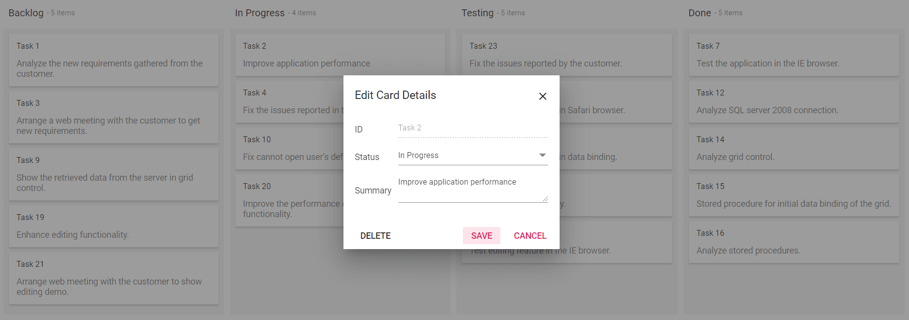
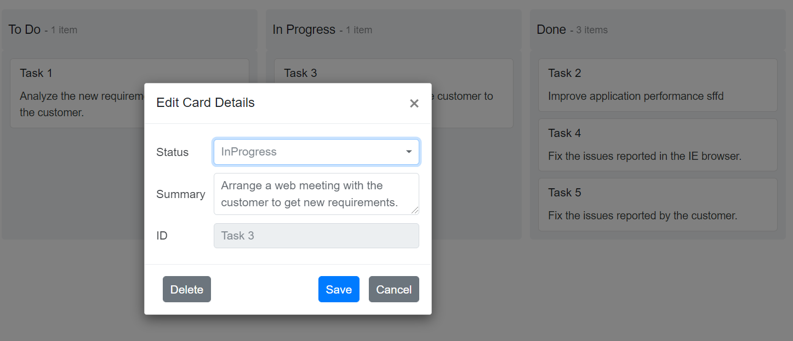
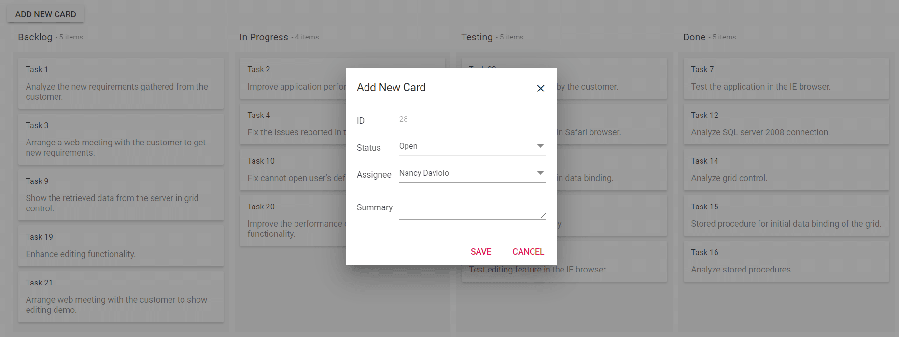

# Card Editing in Blazor Kanban Component

The [Blazor Kanban Board](https://www.syncfusion.com/blazor-components/blazor-kanban-board) provides built-in support to add, edit and delete a card using dialog module. Users can edit cards using the following methods:

* Built-in dialog module
* Dialog template

To get started quickly with Blazor Kanban Edit Dialog using Templates, you can check on this video.



## Editing Cards Using the Default Dialog

When users double-click a card, the dialog is opened with below fields to edit a card. This dialog contains `Delete`, `Save` and `Cancel` buttons.

* To edit a card, update the card details and click the `Save` button.
* To delete a card, click the `Delete` button.
* Click the `Cancel` button to discard changes and close the dialog.

The dialog displays with the following fields which mapped to dialog fields by default.

Key | Type | Text
-----|-----|----
KanbanCardSettings.HeaderField | Input | ID
KeyField | DropDown | -
KanbanCardSettings.ContentField | TextArea | -
KanbanSwimlaneSettings.KeyField (If applicable) | DropDown | -

```cshtml

@using Syncfusion.Blazor.Kanban

<SfKanban TValue="TasksModel" KeyField="Status" DataSource="Tasks">
    <KanbanColumns>
        <KanbanColumn HeaderText="Backlog" KeyField="@(new List<string>() {"Open"})"></KanbanColumn>
        <KanbanColumn HeaderText="In Progress" KeyField="@(new List<string>() {"InProgress"})"></KanbanColumn>
        <KanbanColumn HeaderText="Testing" KeyField="@(new List<string>() {"Testing"})"></KanbanColumn>
        <KanbanColumn HeaderText="Done" KeyField="@(new List<string>() {"Close"})"></KanbanColumn>
    </KanbanColumns>
    <KanbanCardSettings HeaderField="Id" ContentField="Summary"></KanbanCardSettings>
</SfKanban>

@code {
    public class TasksModel
    {
        public string Id { get; set; }
        public string Title { get; set; }
        public string Status { get; set; }
        public string Summary { get; set; }
        public string Assignee { get; set; }
    }

    public List<TasksModel> Tasks = new List<TasksModel>()
    {
        new TasksModel { Id = "Task 1", Title = "BLAZ-29001", Status = "Open", Summary = "Analyze the new requirements gathered from the customer.", Assignee = "Nancy Davloio" },
        new TasksModel { Id = "Task 2", Title = "BLAZ-29002", Status = "InProgress", Summary = "Improve application performance", Assignee = "Andrew Fuller" },
        new TasksModel { Id = "Task 3", Title = "BLAZ-29003", Status = "Open", Summary = "Arrange a web meeting with the customer to get new requirements.", Assignee = "Janet Leverling" },
        new TasksModel { Id = "Task 4", Title = "BLAZ-29004", Status = "InProgress", Summary = "Fix the issues reported in the IE browser.", Assignee = "Janet Leverling" },
        new TasksModel { Id = "Task 5", Title = "BLAZ-29005", Status = "Review", Summary = "Fix the issues reported by the customer.", Assignee = "Steven walker" },
        new TasksModel { Id = "Task 6", Title = "BLAZ-29006", Status = "Review", Summary = "Fix the issues reported in Safari browser.", Assignee = "Nancy Davloio" },
        new TasksModel { Id = "Task 7", Title = "BLAZ-29007", Status = "Close", Summary = "Test the application in the IE browser.", Assignee = "Margaret hamilt" },
        new TasksModel { Id = "Task 8", Title = "BLAZ-29008", Status = "Validate", Summary = "Validate the issues reported by the customer.", Assignee = "Steven walker" },
        new TasksModel { Id = "Task 9", Title = "BLAZ-29009", Status = "Open", Summary = "Show the retrieved data from the server in grid control.", Assignee = "Margaret hamilt" },
        new TasksModel { Id = "Task 10", Title = "BLAZ-29010", Status = "InProgress", Summary = "Fix cannot open user’s default database SQL error.", Assignee = "Janet Leverling" },
        new TasksModel { Id = "Task 11", Title = "BLAZ-29011", Status = "Review", Summary = "Fix the issues reported in data binding.", Assignee = "Janet Leverling" },
        new TasksModel { Id = "Task 12", Title = "BLAZ-29012", Status = "Close", Summary = "Analyze SQL server 2008 connection.", Assignee = "Andrew Fuller" },
        new TasksModel { Id = "Task 13", Title = "BLAZ-29013", Status = "Validate", Summary = "Validate databinding issues.", Assignee = "Margaret hamilt" },
        new TasksModel { Id = "Task 14", Title = "BLAZ-29014", Status = "Close", Summary = "Analyze grid control.", Assignee = "Margaret hamilt" },
        new TasksModel { Id = "Task 15", Title = "BLAZ-29015", Status = "Close", Summary = "Stored procedure for initial data binding of the grid.", Assignee = "Steven walker" },
        new TasksModel { Id = "Task 16", Title = "BLAZ-29016", Status = "Close", Summary = "Analyze stored procedures.", Assignee = "Janet Leverling" },
        new TasksModel { Id = "Task 17", Title = "BLAZ-29017", Status = "Validate", Summary = "Validate editing issues.", Assignee = "Nancy Davloio" },
        new TasksModel { Id = "Task 18", Title = "BLAZ-29018", Status = "Review", Summary = "Test editing functionality.", Assignee = "Nancy Davloio" },
        new TasksModel { Id = "Task 19", Title = "BLAZ-29019", Status = "Open", Summary = "Enhance editing functionality.", Assignee = "Andrew Fuller" },
        new TasksModel { Id = "Task 20", Title = "BLAZ-29020", Status = "InProgress", Summary = "Improve the performance of the editing functionality.", Assignee = "Nancy Davloio" },
        new TasksModel { Id = "Task 21", Title = "BLAZ-29021", Status = "Open", Summary = "Arrange web meeting with the customer to show editing demo.", Assignee = "Steven walker" },
        new TasksModel { Id = "Task 22", Title = "BLAZ-29022", Status = "Review", Summary = "Fix the editing issues reported by the customer.", Assignee = "Janet Leverling" },
        new TasksModel { Id = "Task 23", Title = "BLAZ-29023", Status = "Testing", Summary = "Fix the issues reported by the customer.", Assignee = "Steven walker" },
        new TasksModel { Id = "Task 24", Title = "BLAZ-29024", Status = "Testing", Summary = "Fix the issues reported in Safari browser.", Assignee = "Nancy Davloio" },
        new TasksModel { Id = "Task 25", Title = "BLAZ-29025", Status = "Testing", Summary = "Fix the issues reported in data binding.", Assignee = "Janet Leverling" },
        new TasksModel { Id = "Task 26", Title = "BLAZ-29026", Status = "Testing", Summary = "Test editing functionality.", Assignee = "Nancy Davloio" },
        new TasksModel { Id = "Task 27", Title = "BLAZ-29027", Status = "Testing", Summary = "Test editing feature in the IE browser.", Assignee = "Janet Leverling" }
    };
}

```



## Customizing Dialog Fields

You can customize the default dialog fields using the [Type](https://help.syncfusion.com/cr/blazor/Syncfusion.Blazor.Kanban.KanbanDialogSettingsField.html#Syncfusion_Blazor_Kanban_KanbanDialogSettingsField_Type) property inside the [KanbanDialogSettingsField](https://help.syncfusion.com/cr/blazor/Syncfusion.Blazor.Kanban.KanbanDialogSettingsField.html#properties) property. The [Key](https://help.syncfusion.com/cr/blazor/Syncfusion.Blazor.Kanban.KanbanDialogSettingsField.html#Syncfusion_Blazor_Kanban_KanbanDialogSettingsField_Key) property is used to map the data source value and render the corresponding component based on the specified `Type` property.

The following types are available in dialog fields.

* TextBox
* DropDown
* Numeric
* TextArea

N> Each of the above types can be used once per custom dialog. The dialog template can be used to render many multiple drop-down lists within a dialog.

```cshtml
@using Syncfusion.Blazor.Kanban

<SfKanban KeyField="Status" DataSource="@Tasks">
    <KanbanColumns>
        <KanbanColumn HeaderText="To Do" KeyField="@(new List<string>() {"Open"})"></KanbanColumn>
        <KanbanColumn HeaderText="In Progress" KeyField="@(new List<string>() {"InProgress"})"></KanbanColumn>
        <KanbanColumn HeaderText="Done" KeyField="@(new List<string>() {"Close"})"></KanbanColumn>
    </KanbanColumns>
    <KanbanCardSettings HeaderField="Id" ContentField="Summary"></KanbanCardSettings>
    <KanbanDialogSettings>
        <KanbanDialogSettingsFields>
            <KanbanDialogSettingsField Text="Status" Key="Status" Type=DialogFieldType.DropDown></KanbanDialogSettingsField>
            <KanbanDialogSettingsField Text="Summary" Key="Summary" Type=DialogFieldType.TextArea></KanbanDialogSettingsField>
            <KanbanDialogSettingsField Text="ID" Key="Id" Type=DialogFieldType.TextBox></KanbanDialogSettingsField>
        </KanbanDialogSettingsFields>
    </KanbanDialogSettings>
</SfKanban>

@code {
    public class TasksModel
    {
        public string Id { get; set; }
        public string Title { get; set; }
        public string Status { get; set; }
        public string Summary { get; set; }
        public string Assignee { get; set; }
        public string AssigneeName { get; set; }
    }


    public List<TasksModel> Tasks = new List<TasksModel>()
    {
        new TasksModel { Id = "Task 1", Title = "BLAZ-29001", Status = "Open", Summary = "Analyze the new requirements gathered from the customer.", Assignee = "Nancy Davloio", AssigneeName = "Nancy" },
        new TasksModel { Id = "Task 2", Title = "BLAZ-29002", Status = "InProgress", Summary = "Improve application performance", Assignee = "Andrew Fuller", AssigneeName = "Andrew" },
        new TasksModel { Id = "Task 3", Title = "BLAZ-29003", Status = "InProgress", Summary = "Arrange a web meeting with the customer to get new requirements.", Assignee = "Nancy Davloio", AssigneeName = "Nancy" },
        new TasksModel { Id = "Task 4", Title = "BLAZ-29004", Status = "Close", Summary = "Fix the issues reported in the IE browser.", Assignee = "Nancy Davloio", AssigneeName = "Nancy" },
        new TasksModel { Id = "Task 5", Title = "BLAZ-29005", Status = "Close", Summary = "Fix the issues reported by the customer.", Assignee = "Andrew Fuller", AssigneeName = "Andrew" }
    };
}
```



## Creating a Custom Dialog Template

Using the dialog template, you can render your own form fields with dialog by using the `Template` property.

```cshtml

@using Syncfusion.Blazor.Kanban
@using Syncfusion.Blazor.Inputs
@using Syncfusion.Blazor.DropDowns

<button class="e-btn" @onclick="@ShowAddCardDialog">Add New Card</button>

<SfKanban @ref="KanbanRef" KeyField="Status" DataSource="Tasks">
    <KanbanColumns>
        <KanbanColumn HeaderText="Backlog" KeyField="@(new List<string>() {"Open"})"></KanbanColumn>
        <KanbanColumn HeaderText="In Progress" KeyField="@(new List<string>() {"InProgress"})"></KanbanColumn>
        <KanbanColumn HeaderText="Testing" KeyField="@(new List<string>() {"Testing"})"></KanbanColumn>
        <KanbanColumn HeaderText="Done" KeyField="@(new List<string>() {"Close"})"></KanbanColumn>
    </KanbanColumns>
    <KanbanCardSettings HeaderField="Id" ContentField="Summary"></KanbanCardSettings>
    <KanbanDialogSettings>
        <Template>
            @{
                TasksModel data = (TasksModel)context;
                <table>
                    <tbody>
                        <tr>
                            <td class="e-label">ID</td>
                            <td>
                                <SfTextBox CssClass="e-field" Value="@data.Id" Enabled="false"></SfTextBox>
                            </td>
                        </tr>
                        <tr>
                            <td class="e-label">Status</td>
                            <td>
                                <SfDropDownList @ref="StatusRef" TValue="string" TItem="DropDownModel" CssClass="e-field" DataSource="@StatusData" Value="@data.Status">
                                    <DropDownListFieldSettings Text="Value" Value="Value"></DropDownListFieldSettings>
                                </SfDropDownList>
                            </td>
                        </tr>
                        <tr>
                            <td class="e-label">Assignee</td>
                            <td>
                                <SfDropDownList @ref="AssigneeRef" TValue="string" TItem="DropDownModel" CssClass="e-field" DataSource="@AssigneeData" Value="@data.Assignee">
                                    <DropDownListFieldSettings Text="Value" Value="Value"></DropDownListFieldSettings>
                                </SfDropDownList>
                            </td>
                        </tr>
                        <tr>
                            <td class="e-label">Summary</td>
                            <td>
                                <SfTextBox @ref="SummaryRef" CssClass="e-field" Multiline="true" @bind-Value="@data.Summary"></SfTextBox>
                            </td>
                        </tr>
                    </tbody>
                </table>
            }
        </Template>
    </KanbanDialogSettings>
</SfKanban>

@code {
    SfKanban<TasksModel> KanbanRef;
    SfDropDownList<string, DropDownModel> StatusRef;
    SfDropDownList<string, DropDownModel> AssigneeRef;
    SfTextBox SummaryRef;

    private List<DropDownModel> StatusData = new List<DropDownModel>()
    {
        new DropDownModel { Id = 0, Value = "Open" },
        new DropDownModel { Id = 1, Value = "InProgress" },
        new DropDownModel { Id = 2, Value = "Testing" },
        new DropDownModel { Id = 3, Value = "Close" }
    };

    private List<DropDownModel> AssigneeData = new List<DropDownModel>()
    {
        new DropDownModel { Id = 0, Value = "Nancy Davloio" },
        new DropDownModel { Id = 1, Value = "Andrew Fuller" },
        new DropDownModel { Id = 2, Value = "Janet Leverling" },
        new DropDownModel { Id = 3, Value = "Steven walker" },
        new DropDownModel { Id = 4, Value = "Robert King" },
        new DropDownModel { Id = 5, Value = "Margaret hamilt" },
        new DropDownModel { Id = 6, Value = "Michael Suyama" }
    };

    private void ShowAddCardDialog()
    {
        TasksModel data = new TasksModel()
        {
            Id = (this.Tasks.Count() + 1).ToString(),
            Title = "",
            Summary = "",
            Status = "Open",
            Assignee = "Nancy Davloio"
        };
        this.KanbanRef.OpenDialog(CurrentAction.Add, data);
    }

    private class DropDownModel
    {
        public int Id { get; set; }
        public string Value { get; set; }
    }
    public class TasksModel
    {
        public string Id { get; set; }
        public string Title { get; set; }
        public string Status { get; set; }
        public string Summary { get; set; }
        public string Assignee { get; set; }
    }

    public List<TasksModel> Tasks = new List<TasksModel>()
    {
        new TasksModel { Id = "Task 1", Title = "BLAZ-29001", Status = "Open", Summary = "Analyze the new requirements gathered from the customer.", Assignee = "Nancy Davloio" },
        new TasksModel { Id = "Task 2", Title = "BLAZ-29002", Status = "InProgress", Summary = "Improve application performance", Assignee = "Andrew Fuller" },
        new TasksModel { Id = "Task 3", Title = "BLAZ-29003", Status = "Open", Summary = "Arrange a web meeting with the customer to get new requirements.", Assignee = "Janet Leverling" },
        new TasksModel { Id = "Task 4", Title = "BLAZ-29004", Status = "InProgress", Summary = "Fix the issues reported in the IE browser.", Assignee = "Janet Leverling" },
        new TasksModel { Id = "Task 5", Title = "BLAZ-29005", Status = "Review", Summary = "Fix the issues reported by the customer.", Assignee = "Steven walker" },
        new TasksModel { Id = "Task 6", Title = "BLAZ-29006", Status = "Review", Summary = "Fix the issues reported in Safari browser.", Assignee = "Nancy Davloio" },
        new TasksModel { Id = "Task 7", Title = "BLAZ-29007", Status = "Close", Summary = "Test the application in the IE browser.", Assignee = "Margaret hamilt" },
        new TasksModel { Id = "Task 8", Title = "BLAZ-29008", Status = "Validate", Summary = "Validate the issues reported by the customer.", Assignee = "Steven walker" },
        new TasksModel { Id = "Task 9", Title = "BLAZ-29009", Status = "Open", Summary = "Show the retrieved data from the server in grid control.", Assignee = "Margaret hamilt" },
        new TasksModel { Id = "Task 10", Title = "BLAZ-29010", Status = "InProgress", Summary = "Fix cannot open user’s default database SQL error.", Assignee = "Janet Leverling" },
        new TasksModel { Id = "Task 11", Title = "BLAZ-29011", Status = "Review", Summary = "Fix the issues reported in data binding.", Assignee = "Janet Leverling" },
        new TasksModel { Id = "Task 12", Title = "BLAZ-29012", Status = "Close", Summary = "Analyze SQL server 2008 connection.", Assignee = "Andrew Fuller" },
        new TasksModel { Id = "Task 13", Title = "BLAZ-29013", Status = "Validate", Summary = "Validate databinding issues.", Assignee = "Margaret hamilt" },
        new TasksModel { Id = "Task 14", Title = "BLAZ-29014", Status = "Close", Summary = "Analyze grid control.", Assignee = "Margaret hamilt" },
        new TasksModel { Id = "Task 15", Title = "BLAZ-29015", Status = "Close", Summary = "Stored procedure for initial data binding of the grid.", Assignee = "Steven walker" },
        new TasksModel { Id = "Task 16", Title = "BLAZ-29016", Status = "Close", Summary = "Analyze stored procedures.", Assignee = "Janet Leverling" },
        new TasksModel { Id = "Task 17", Title = "BLAZ-29017", Status = "Validate", Summary = "Validate editing issues.", Assignee = "Nancy Davloio" },
        new TasksModel { Id = "Task 18", Title = "BLAZ-29018", Status = "Review", Summary = "Test editing functionality.", Assignee = "Nancy Davloio" },
        new TasksModel { Id = "Task 19", Title = "BLAZ-29019", Status = "Open", Summary = "Enhance editing functionality.", Assignee = "Andrew Fuller" },
        new TasksModel { Id = "Task 20", Title = "BLAZ-29020", Status = "InProgress", Summary = "Improve the performance of the editing functionality.", Assignee = "Nancy Davloio" },
        new TasksModel { Id = "Task 21", Title = "BLAZ-29021", Status = "Open", Summary = "Arrange web meeting with the customer to show editing demo.", Assignee = "Steven walker" },
        new TasksModel { Id = "Task 22", Title = "BLAZ-29022", Status = "Review", Summary = "Fix the editing issues reported by the customer.", Assignee = "Janet Leverling" },
        new TasksModel { Id = "Task 23", Title = "BLAZ-29023", Status = "Testing", Summary = "Fix the issues reported by the customer.", Assignee = "Steven walker" },
        new TasksModel { Id = "Task 24", Title = "BLAZ-29024", Status = "Testing", Summary = "Fix the issues reported in Safari browser.", Assignee = "Nancy Davloio" },
        new TasksModel { Id = "Task 25", Title = "BLAZ-29025", Status = "Testing", Summary = "Fix the issues reported in data binding.", Assignee = "Janet Leverling" },
        new TasksModel { Id = "Task 26", Title = "BLAZ-29026", Status = "Testing", Summary = "Test editing functionality.", Assignee = "Nancy Davloio" },
        new TasksModel { Id = "Task 27", Title = "BLAZ-29027", Status = "Testing", Summary = "Test editing feature in the IE browser.", Assignee = "Janet Leverling" }
    };
}

```



## Preventing the Dialog from Opening

The Kanban component allows preventing the dialog from opening on card double-click by enabling `args.Cancel` in [DialogOpen](https://help.syncfusion.com/cr/blazor/Syncfusion.Blazor.Kanban.DialogOpenEventArgs-1.html) event.

```cshtml

@using Syncfusion.Blazor.Kanban

<SfKanban TValue="TasksModel" KeyField="Status" DataSource="Tasks">
    <KanbanColumns>
        <KanbanColumn HeaderText="Backlog" KeyField="@(new List<string>() {"Open"})"></KanbanColumn>
        <KanbanColumn HeaderText="In Progress" KeyField="@(new List<string>() {"InProgress"})"></KanbanColumn>
        <KanbanColumn HeaderText="Testing" KeyField="@(new List<string>() {"Testing"})"></KanbanColumn>
        <KanbanColumn HeaderText="Done" KeyField="@(new List<string>() {"Close"})"></KanbanColumn>
    </KanbanColumns>
    <KanbanCardSettings HeaderField="Id" ContentField="Summary"></KanbanCardSettings>
    <KanbanEvents TValue="TasksModel" DialogOpen="@OnDialogOpen"></KanbanEvents>
</SfKanban>

@code {
    public class TasksModel
    {
        public string Id { get; set; }
        public string Title { get; set; }
        public string Status { get; set; }
        public string Summary { get; set; }
        public string Assignee { get; set; }
    }

    public List<TasksModel> Tasks = new List<TasksModel>()
    {
        new TasksModel { Id = "Task 1", Title = "BLAZ-29001", Status = "Open", Summary = "Analyze the new requirements gathered from the customer.", Assignee = "Nancy Davloio" },
        new TasksModel { Id = "Task 2", Title = "BLAZ-29002", Status = "InProgress", Summary = "Improve application performance", Assignee = "Andrew Fuller" },
        new TasksModel { Id = "Task 3", Title = "BLAZ-29003", Status = "Open", Summary = "Arrange a web meeting with the customer to get new requirements.", Assignee = "Janet Leverling" },
        new TasksModel { Id = "Task 4", Title = "BLAZ-29004", Status = "InProgress", Summary = "Fix the issues reported in the IE browser.", Assignee = "Janet Leverling" },
        new TasksModel { Id = "Task 5", Title = "BLAZ-29005", Status = "Review", Summary = "Fix the issues reported by the customer.", Assignee = "Steven walker" },
        new TasksModel { Id = "Task 6", Title = "BLAZ-29006", Status = "Review", Summary = "Fix the issues reported in Safari browser.", Assignee = "Nancy Davloio" },
        new TasksModel { Id = "Task 7", Title = "BLAZ-29007", Status = "Close", Summary = "Test the application in the IE browser.", Assignee = "Margaret hamilt" },
        new TasksModel { Id = "Task 8", Title = "BLAZ-29008", Status = "Validate", Summary = "Validate the issues reported by the customer.", Assignee = "Steven walker" },
        new TasksModel { Id = "Task 9", Title = "BLAZ-29009", Status = "Open", Summary = "Show the retrieved data from the server in grid control.", Assignee = "Margaret hamilt" },
        new TasksModel { Id = "Task 10", Title = "BLAZ-29010", Status = "InProgress", Summary = "Fix cannot open user’s default database SQL error.", Assignee = "Janet Leverling" },
        new TasksModel { Id = "Task 11", Title = "BLAZ-29011", Status = "Review", Summary = "Fix the issues reported in data binding.", Assignee = "Janet Leverling" },
        new TasksModel { Id = "Task 12", Title = "BLAZ-29012", Status = "Close", Summary = "Analyze SQL server 2008 connection.", Assignee = "Andrew Fuller" },
        new TasksModel { Id = "Task 13", Title = "BLAZ-29013", Status = "Validate", Summary = "Validate databinding issues.", Assignee = "Margaret hamilt" },
        new TasksModel { Id = "Task 14", Title = "BLAZ-29014", Status = "Close", Summary = "Analyze grid control.", Assignee = "Margaret hamilt" },
        new TasksModel { Id = "Task 15", Title = "BLAZ-29015", Status = "Close", Summary = "Stored procedure for initial data binding of the grid.", Assignee = "Steven walker" },
        new TasksModel { Id = "Task 16", Title = "BLAZ-29016", Status = "Close", Summary = "Analyze stored procedures.", Assignee = "Janet Leverling" },
        new TasksModel { Id = "Task 17", Title = "BLAZ-29017", Status = "Validate", Summary = "Validate editing issues.", Assignee = "Nancy Davloio" },
        new TasksModel { Id = "Task 18", Title = "BLAZ-29018", Status = "Review", Summary = "Test editing functionality.", Assignee = "Nancy Davloio" },
        new TasksModel { Id = "Task 19", Title = "BLAZ-29019", Status = "Open", Summary = "Enhance editing functionality.", Assignee = "Andrew Fuller" },
        new TasksModel { Id = "Task 20", Title = "BLAZ-29020", Status = "InProgress", Summary = "Improve the performance of the editing functionality.", Assignee = "Nancy Davloio" },
        new TasksModel { Id = "Task 21", Title = "BLAZ-29021", Status = "Open", Summary = "Arrange web meeting with the customer to show editing demo.", Assignee = "Steven walker" },
        new TasksModel { Id = "Task 22", Title = "BLAZ-29022", Status = "Review", Summary = "Fix the editing issues reported by the customer.", Assignee = "Janet Leverling" },
        new TasksModel { Id = "Task 23", Title = "BLAZ-29023", Status = "Testing", Summary = "Fix the issues reported by the customer.", Assignee = "Steven walker" },
        new TasksModel { Id = "Task 24", Title = "BLAZ-29024", Status = "Testing", Summary = "Fix the issues reported in Safari browser.", Assignee = "Nancy Davloio" },
        new TasksModel { Id = "Task 25", Title = "BLAZ-29025", Status = "Testing", Summary = "Fix the issues reported in data binding.", Assignee = "Janet Leverling" },
        new TasksModel { Id = "Task 26", Title = "BLAZ-29026", Status = "Testing", Summary = "Test editing functionality.", Assignee = "Nancy Davloio" },
        new TasksModel { Id = "Task 27", Title = "BLAZ-29027", Status = "Testing", Summary = "Test editing feature in the IE browser.", Assignee = "Janet Leverling" }
    };

    private void OnDialogOpen(DialogOpenEventArgs<TasksModel> args)
    {
        args.Cancel = true;
    }
}

```

## Persisting data in server

The modified card data can be persisted in the database using the RESTful web services. All the CRUD operations in the Kanban are done through SfDataManager. The SfDataManager has an option to bind all the CRUD related data on the server-side.

The following section explains how to retrieve edited card data on the server-side using the [UrlAdaptor](https://blazor.syncfusion.com/documentation/data/adaptors#url-adaptor).

### Using URL Adaptor for Server-Side CRUD Operations

Use the [UrlAdaptor](https://blazor.syncfusion.com/documentation/data/adaptors#url-adaptor) of `SfDataManager` when binding data source for remote data. During the initial load of Kanban, data are fetched from remote data and bound to the Kanban using the [Url](https://help.syncfusion.com/cr/blazor/Syncfusion.Blazor.DataManager.html#Syncfusion_Blazor_DataManager_Url) property of `SfDataManager`.

CRUD operations in Kanban can be mapped to server-side controller actions by using the properties [InsertUrl](https://help.syncfusion.com/cr/blazor/Syncfusion.Blazor.DataManager.html#Syncfusion_Blazor_DataManager_InsertUrl), [RemoveUrl](https://help.syncfusion.com/cr/blazor/Syncfusion.Blazor.DataManager.html#Syncfusion_Blazor_DataManager_RemoveUrl), [UpdateUrl](https://help.syncfusion.com/cr/blazor/Syncfusion.Blazor.DataManager.html#Syncfusion_Blazor_DataManager_UpdateUrl), and [CrudUrl](https://help.syncfusion.com/cr/blazor/Syncfusion.Blazor.DataManager.html#Syncfusion_Blazor_DataManager_CrudUrl).

* `InsertUrl` – Performs a single insertion operation on the server-side.
* `UpdateUrl` – Updates a single record on the server-side.
* `RemoveUrl` – Removes a single record on the server-side.
* `CrudUrl` – Performs bulk data operations on the server-side.

```cshtml
@using Syncfusion.Blazor.Data
@using Syncfusion.Blazor.Kanban
<SfKanban ID="Kanban" TValue="Order" KeyField="ShipCity">
    <SfDataManager Url="/api/Default" UpdateUrl="/api/Default/Update" RemoveUrl="/api/Default/Delete" InsertUrl="/api/Default/Add" Adaptor="Adaptors.UrlAdaptor"></SfDataManager>
    <KanbanColumns>
        <KanbanColumn HeaderText="Brazil" KeyField=@(new List<string>{"Brazil"}) AllowAdding=true></KanbanColumn>
        <KanbanColumn HeaderText="Sweden" KeyField=@(new List<string>{"Sweden"})></KanbanColumn>
        <KanbanColumn HeaderText="India" KeyField=@(new List<string>{"India"})></KanbanColumn>
    </KanbanColumns>
    <KanbanCardSettings HeaderField="EmployeeID" ContentField="ShipName"></KanbanCardSettings>
</SfKanban>
```

The server-side controller code to handle the CRUD operations is as follows.

```cshtml
namespace Blazor_Kanban_Crud_UrlAdaptor.Controllers
{
    [ApiController]
    public class DefaultController : ControllerBase
    {
        OrderDataAccessLayer db = new OrderDataAccessLayer();
        //    OrderContext db = new OrderContext();
        // GET: api/Default
        [HttpPost]
        [Route("api/[controller]")]
        public object Post([FromBody] DataManagerRequest dm)
        {
            IEnumerable data = db.GetAllOrders();   //call the method to fetch data from db and return to client
            int count = data.Cast<Order>().Count();
            return dm.RequiresCounts ? new DataResult() { Result = data, Count = count } : (object)data;
        }

        [HttpPost]
        [Route("api/Default/Add")]
        public void Add([FromBody] CRUDModel<Order> value)
        {
            db.AddOrder(value.Value);        
        }

        [HttpPost]
        [Route("api/Default/Update")]
        public void Update([FromBody] CRUDModel<Order> value)
        {
             db.UpdateOrder(value.Value);
        }

        [HttpPost]
        [Route("api/Default/Delete")]
        public void Delete([FromBody] CRUDModel<Order> value)
        {
            db.DeleteOrder(Convert.ToInt32(Convert.ToString(value.Key)));
        }

        public class CRUDModel<T> where T : class
        {

            [JsonProperty("action")]
            public string Action { get; set; }
            [JsonProperty("table")]
            public string Table { get; set; }
            [JsonProperty("keyColumn")]
            public string KeyColumn { get; set; }
            [JsonProperty("key")]
            public object Key { get; set; }
            [JsonProperty("value")]
            public T Value { get; set; }
            [JsonProperty("added")]
            public List<T> Added { get; set; }
            [JsonProperty("changed")]
            public List<T> Changed { get; set; }
            [JsonProperty("deleted")]
            public List<T> Deleted { get; set; }
            [JsonProperty("params")]
            public IDictionary<string, object> Params { get; set; }
        }
    }
}

```

### Inserting a card

Using the `InsertUrl` property, you can specify the controller action mapping URL to perform insert operation on the server-side.

```cshtml
        [HttpPost]
        [Route("api/Default/Add")]
        public void Add([FromBody] CRUDModel<Order> value)
        {
            db.AddOrder(value.Value);        
        }
```

The newly added card data is available in the `value` parameter..

### Updating a card

Using the `UpdateUrl` property, the controller action mapping URL can be specified to perform save/update operation on the server-side.


```cshtml
        [HttpPost]
        [Route("api/Default/Update")]
        public void Update([FromBody] CRUDModel<Order> value)
        {
             db.UpdateOrder(value.Value);
        }
```

The updated card data is available in the `value` parameter.

### Deleting a card

Using the `RemoveUrl` property, the controller action mapping URL can be specified to perform a delete operation on the server-side.

```cshtml
        [HttpPost]
        [Route("api/Default/Delete")]
        public void Delete([FromBody] CRUDModel<Order> value)
        {
            db.DeleteOrder(Convert.ToInt32(Convert.ToString(value.Key)));
        }
```

The primary key of the card to be deleted is available in the `Key` parameter.

### Performing Bulk updates

Using the [CrudUrl](https://help.syncfusion.com/cr/blazor/Syncfusion.Blazor.DataManager.html#Syncfusion_Blazor_DataManager_CrudUrl) property, the controller action mapping URL can be specified to perform all the CRUD operations at the server-side using a single method instead of specifying a separate controller action method for CRUD (insert, update, and delete) operations.

The `action` parameter of `CrudUrl` identifies the corresponding CRUD operation.

N> The `CrudUrl` is used to update the bulk data sent to the server-side. Multiple selections and [SortBy](https://help.syncfusion.com/cr/blazor/Syncfusion.Blazor.Kanban.KanbanSortSettings.html#Syncfusion_Blazor_Kanban_KanbanSortSettings_SortBy) as [Index](https://help.syncfusion.com/cr/blazor/Syncfusion.Blazor.Kanban.SortOrderBy.html#Syncfusion_Blazor_Kanban_SortOrderBy_Index) properties are used for `CrudUrl` properties to update the modified bulk data to the server-side.

```cshtml
@using Syncfusion.Blazor.Data
@using Syncfusion.Blazor
@using Syncfusion.Blazor.Kanban
<SfKanban ID="Kanban" TValue="Order" KeyField="ShipCity">
    <SfDataManager Url="/api/Default" UpdateUrl="/api/Default/Update" RemoveUrl="/api/Default/Delete" InsertUrl="/api/Default/Add" CrudUrl="/api/Default/Batch" Adaptor="Adaptors.UrlAdaptor"></SfDataManager>
    <KanbanColumns>
        <KanbanColumn HeaderText="Brazil" KeyField=@(new List<string>{"Brazil"}) AllowAdding=true></KanbanColumn>
        <KanbanColumn HeaderText="Sweden" KeyField=@(new List<string>{"Sweden"})></KanbanColumn>
        <KanbanColumn HeaderText="India" KeyField=@(new List<string>{"India"})></KanbanColumn>
    </KanbanColumns>
    <KanbanCardSettings HeaderField="EmployeeID" ContentField="ShipName"></KanbanCardSettings>
</SfKanban>
```

```cshtml
namespace Blazor_Kanban_Crud_UrlAdaptor.Controllers
{
    [ApiController]
    public class DefaultController : ControllerBase
    {
        OrderDataAccessLayer db = new OrderDataAccessLayer();
        //    OrderContext db = new OrderContext();
        // GET: api/Default
        [HttpPost]
        [Route("api/[controller]")]
        public object Post([FromBody] DataManagerRequest dm)
        {
            IEnumerable data = db.GetAllOrders();   //call the method to fetch data from db and return to client
            int count = data.Cast<Order>().Count();
            return dm.RequiresCounts ? new DataResult() { Result = data, Count = count } : (object)data;
        }

        [HttpPost]
        [Route("api/Default/Add")]
        public void Add([FromBody] CRUDModel<Order> value)
        {
            db.AddOrder(value.Value);        
        }

        [HttpPost]
        [Route("api/Default/Update")]
        public void Update([FromBody] CRUDModel<Order> value)
        {
             db.UpdateOrder(value.Value);
        }

        [HttpPost]
        [Route("api/Default/Delete")]
        public void Delete([FromBody] CRUDModel<Order> value)
        {
            db.DeleteOrder(Convert.ToInt32(Convert.ToString(value.Key)));
        }

        [HttpPost]
        [Route("api/Default/Batch")]
        public void Batch([FromBody] CRUDModel<Order> value)
        {
            if (value.Changed.Count > 0)
            {
                foreach (Order rec in value.Changed)
                {
                    db.UpdateOrder(rec);
                }
            }
            if (value.Added.Count > 0)
            {
                foreach (Order rec in value.Added)
                {
                    db.AddOrder(rec);
                }
            }
            if (value.Deleted.Count > 0)
            {
                foreach (Order rec in value.Deleted)
                {
                    db.DeleteOrder(rec.EmployeeID);
                }
            }
        }

        public class CRUDModel<T> where T : class
        {

            [JsonProperty("action")]
            public string Action { get; set; }
            [JsonProperty("table")]
            public string Table { get; set; }
            [JsonProperty("keyColumn")]
            public string KeyColumn { get; set; }
            [JsonProperty("key")]
            public object Key { get; set; }
            [JsonProperty("value")]
            public T Value { get; set; }
            [JsonProperty("added")]
            public List<T> Added { get; set; }
            [JsonProperty("changed")]
            public List<T> Changed { get; set; }
            [JsonProperty("deleted")]
            public List<T> Deleted { get; set; }
            [JsonProperty("params")]
            public IDictionary<string, object> Params { get; set; }
        }
    }
}
```

Explore the complete working sample [here](https://github.com/SyncfusionExamples/blazor-kanban-crud-url-adaptor).
