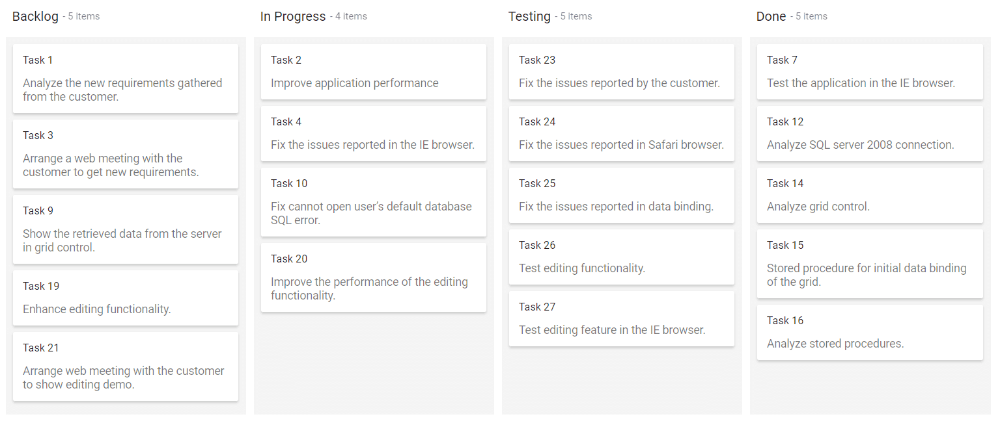
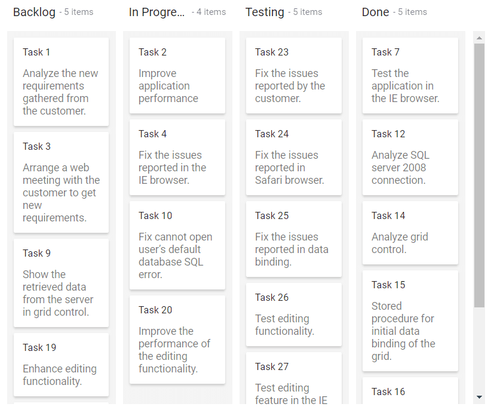
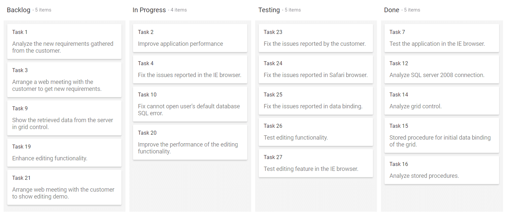

# Dimensions in Blazor Kanban Component

This section explains how to configure the height and width of the Syncfusion Blazor Kanban component to achieve responsive and fixed layouts.

The [Blazor Kanban](https://www.syncfusion.com/blazor-components/blazor-kanban-board) component allows customization of its overall layout dimensions height and width using three value types:

* Auto
* Pixel
* Percentage

## Auto height and width

Use `auto` values when you want the Kanban component to adapt to its content and parent container dynamically.

When the Kanban's height and width are set to `auto`, it automatically adjusts to fit the size of its parent container. This ensures the Kanban layout expands or contracts based on its content and surrounding elements. By default, the Kanban component uses `auto` for both [Height](https://help.syncfusion.com/cr/blazor/Syncfusion.Blazor.Kanban.SfKanban-1.html#Syncfusion_Blazor_Kanban_SfKanban_1_Height) and [Width](https://help.syncfusion.com/cr/blazor/Syncfusion.Blazor.Kanban.SfKanban-1.html#Syncfusion_Blazor_Kanban_SfKanban_1_Width), allowing it to adapt seamlessly to its container.

```cshtml

@using Syncfusion.Blazor.Kanban

<SfKanban TValue="TasksModel" KeyField="Status" DataSource="Tasks" Width="auto" Height="auto">
    <KanbanColumns>
        <KanbanColumn HeaderText="Backlog" KeyField="@(new List<string>() {"Open"})"></KanbanColumn>
        <KanbanColumn HeaderText="In Progress" KeyField="@(new List<string>() {"InProgress"})"></KanbanColumn>
        <KanbanColumn HeaderText="Testing" KeyField="@(new List<string>() {"Testing"})"></KanbanColumn>
        <KanbanColumn HeaderText="Done" KeyField="@(new List<string>() {"Close"})"></KanbanColumn>
    </KanbanColumns>
    <KanbanCardSettings HeaderField="Id" ContentField="Summary"></KanbanCardSettings>
</SfKanban>

@code {
    public class TasksModel
    {
        public string Id { get; set; }
        public string Title { get; set; }
        public string Status { get; set; }
        public string Summary { get; set; }
        public string Assignee { get; set; }
    }

    public List<TasksModel> Tasks = new List<TasksModel>()
{
        new TasksModel { Id = "Task 1", Title = "BLAZ-29001", Status = "Open", Summary = "Analyze the new requirements gathered from the customer.", Assignee = "Nancy Davloio" },
        new TasksModel { Id = "Task 2", Title = "BLAZ-29002", Status = "InProgress", Summary = "Improve application performance", Assignee = "Andrew Fuller" },
        new TasksModel { Id = "Task 3", Title = "BLAZ-29003", Status = "Open", Summary = "Arrange a web meeting with the customer to get new requirements.", Assignee = "Janet Leverling" },
        new TasksModel { Id = "Task 4", Title = "BLAZ-29004", Status = "InProgress", Summary = "Fix the issues reported in the IE browser.", Assignee = "Janet Leverling" },
        new TasksModel { Id = "Task 5", Title = "BLAZ-29005", Status = "Review", Summary = "Fix the issues reported by the customer.", Assignee = "Steven walker" },
        new TasksModel { Id = "Task 6", Title = "BLAZ-29006", Status = "Review", Summary = "Fix the issues reported in Safari browser.", Assignee = "Nancy Davloio" },
        new TasksModel { Id = "Task 7", Title = "BLAZ-29007", Status = "Close", Summary = "Test the application in the IE browser.", Assignee = "Margaret hamilt" },
        new TasksModel { Id = "Task 8", Title = "BLAZ-29008", Status = "Validate", Summary = "Validate the issues reported by the customer.", Assignee = "Steven walker" },
        new TasksModel { Id = "Task 9", Title = "BLAZ-29009", Status = "Open", Summary = "Show the retrieved data from the server in grid control.", Assignee = "Margaret hamilt" },
        new TasksModel { Id = "Task 10", Title = "BLAZ-29010", Status = "InProgress", Summary = "Fix cannot open user’s default database SQL error.", Assignee = "Janet Leverling" },
        new TasksModel { Id = "Task 11", Title = "BLAZ-29011", Status = "Review", Summary = "Fix the issues reported in data binding.", Assignee = "Janet Leverling" },
        new TasksModel { Id = "Task 12", Title = "BLAZ-29012", Status = "Close", Summary = "Analyze SQL server 2008 connection.", Assignee = "Andrew Fuller" },
        new TasksModel { Id = "Task 13", Title = "BLAZ-29013", Status = "Validate", Summary = "Validate databinding issues.", Assignee = "Margaret hamilt" },
        new TasksModel { Id = "Task 14", Title = "BLAZ-29014", Status = "Close", Summary = "Analyze grid control.", Assignee = "Margaret hamilt" },
        new TasksModel { Id = "Task 15", Title = "BLAZ-29015", Status = "Close", Summary = "Stored procedure for initial data binding of the grid.", Assignee = "Steven walker" },
        new TasksModel { Id = "Task 16", Title = "BLAZ-29016", Status = "Close", Summary = "Analyze stored procedures.", Assignee = "Janet Leverling" },
        new TasksModel { Id = "Task 17", Title = "BLAZ-29017", Status = "Validate", Summary = "Validate editing issues.", Assignee = "Nancy Davloio" },
        new TasksModel { Id = "Task 18", Title = "BLAZ-29018", Status = "Review", Summary = "Test editing functionality.", Assignee = "Nancy Davloio" },
        new TasksModel { Id = "Task 19", Title = "BLAZ-29019", Status = "Open", Summary = "Enhance editing functionality.", Assignee = "Andrew Fuller" },
        new TasksModel { Id = "Task 20", Title = "BLAZ-29020", Status = "InProgress", Summary = "Improve the performance of the editing functionality.", Assignee = "Nancy Davloio" },
        new TasksModel { Id = "Task 21", Title = "BLAZ-29021", Status = "Open", Summary = "Arrange web meeting with the customer to show editing demo.", Assignee = "Steven walker" },
        new TasksModel { Id = "Task 22", Title = "BLAZ-29022", Status = "Review", Summary = "Fix the editing issues reported by the customer.", Assignee = "Janet Leverling" },
        new TasksModel { Id = "Task 23", Title = "BLAZ-29023", Status = "Testing", Summary = "Fix the issues reported by the customer.", Assignee = "Steven walker" },
        new TasksModel { Id = "Task 24", Title = "BLAZ-29024", Status = "Testing", Summary = "Fix the issues reported in Safari browser.", Assignee = "Nancy Davloio" },
        new TasksModel { Id = "Task 25", Title = "BLAZ-29025", Status = "Testing", Summary = "Fix the issues reported in data binding.", Assignee = "Janet Leverling" },
        new TasksModel { Id = "Task 26", Title = "BLAZ-29026", Status = "Testing", Summary = "Test editing functionality.", Assignee = "Nancy Davloio" },
        new TasksModel { Id = "Task 27", Title = "BLAZ-29027", Status = "Testing", Summary = "Test editing feature in the IE browser.", Assignee = "Janet Leverling" }
    };
}

```



## Fixed dimensions using pixel values

Define explicit dimensions in pixels to maintain consistent sizing regardless of screen size or container.

When pixel values are specified for the Kanban's [Height](https://help.syncfusion.com/cr/blazor/Syncfusion.Blazor.Kanban.SfKanban-1.html#Syncfusion_Blazor_Kanban_SfKanban_1_Height) and [Width](https://help.syncfusion.com/cr/blazor/Syncfusion.Blazor.Kanban.SfKanban-1.html#Syncfusion_Blazor_Kanban_SfKanban_1_Width), the component renders with exact dimensions. These values can be provided as either strings (e.g., `'650px'`) or numbers (e.g., `650`).

```cshtml

@using Syncfusion.Blazor.Kanban

<SfKanban TValue="TasksModel" KeyField="Status" DataSource="Tasks" Width="650px" Height="550px">
    <KanbanColumns>
        <KanbanColumn HeaderText="Backlog" KeyField="@(new List<string>() {"Open"})"></KanbanColumn>
        <KanbanColumn HeaderText="In Progress" KeyField="@(new List<string>() {"InProgress"})"></KanbanColumn>
        <KanbanColumn HeaderText="Testing" KeyField="@(new List<string>() {"Testing"})"></KanbanColumn>
        <KanbanColumn HeaderText="Done" KeyField="@(new List<string>() {"Close"})"></KanbanColumn>
    </KanbanColumns>
    <KanbanCardSettings HeaderField="Id" ContentField="Summary"></KanbanCardSettings>
</SfKanban>

@code {
    public class TasksModel
    {
        public string Id { get; set; }
        public string Title { get; set; }
        public string Status { get; set; }
        public string Summary { get; set; }
        public string Assignee { get; set; }
    }

    public List<TasksModel> Tasks = new List<TasksModel>()
{
        new TasksModel { Id = "Task 1", Title = "BLAZ-29001", Status = "Open", Summary = "Analyze the new requirements gathered from the customer.", Assignee = "Nancy Davloio" },
        new TasksModel { Id = "Task 2", Title = "BLAZ-29002", Status = "InProgress", Summary = "Improve application performance", Assignee = "Andrew Fuller" },
        new TasksModel { Id = "Task 3", Title = "BLAZ-29003", Status = "Open", Summary = "Arrange a web meeting with the customer to get new requirements.", Assignee = "Janet Leverling" },
        new TasksModel { Id = "Task 4", Title = "BLAZ-29004", Status = "InProgress", Summary = "Fix the issues reported in the IE browser.", Assignee = "Janet Leverling" },
        new TasksModel { Id = "Task 5", Title = "BLAZ-29005", Status = "Review", Summary = "Fix the issues reported by the customer.", Assignee = "Steven walker" },
        new TasksModel { Id = "Task 6", Title = "BLAZ-29006", Status = "Review", Summary = "Fix the issues reported in Safari browser.", Assignee = "Nancy Davloio" },
        new TasksModel { Id = "Task 7", Title = "BLAZ-29007", Status = "Close", Summary = "Test the application in the IE browser.", Assignee = "Margaret hamilt" },
        new TasksModel { Id = "Task 8", Title = "BLAZ-29008", Status = "Validate", Summary = "Validate the issues reported by the customer.", Assignee = "Steven walker" },
        new TasksModel { Id = "Task 9", Title = "BLAZ-29009", Status = "Open", Summary = "Show the retrieved data from the server in grid control.", Assignee = "Margaret hamilt" },
        new TasksModel { Id = "Task 10", Title = "BLAZ-29010", Status = "InProgress", Summary = "Fix cannot open user’s default database SQL error.", Assignee = "Janet Leverling" },
        new TasksModel { Id = "Task 11", Title = "BLAZ-29011", Status = "Review", Summary = "Fix the issues reported in data binding.", Assignee = "Janet Leverling" },
        new TasksModel { Id = "Task 12", Title = "BLAZ-29012", Status = "Close", Summary = "Analyze SQL server 2008 connection.", Assignee = "Andrew Fuller" },
        new TasksModel { Id = "Task 13", Title = "BLAZ-29013", Status = "Validate", Summary = "Validate databinding issues.", Assignee = "Margaret hamilt" },
        new TasksModel { Id = "Task 14", Title = "BLAZ-29014", Status = "Close", Summary = "Analyze grid control.", Assignee = "Margaret hamilt" },
        new TasksModel { Id = "Task 15", Title = "BLAZ-29015", Status = "Close", Summary = "Stored procedure for initial data binding of the grid.", Assignee = "Steven walker" },
        new TasksModel { Id = "Task 16", Title = "BLAZ-29016", Status = "Close", Summary = "Analyze stored procedures.", Assignee = "Janet Leverling" },
        new TasksModel { Id = "Task 17", Title = "BLAZ-29017", Status = "Validate", Summary = "Validate editing issues.", Assignee = "Nancy Davloio" },
        new TasksModel { Id = "Task 18", Title = "BLAZ-29018", Status = "Review", Summary = "Test editing functionality.", Assignee = "Nancy Davloio" },
        new TasksModel { Id = "Task 19", Title = "BLAZ-29019", Status = "Open", Summary = "Enhance editing functionality.", Assignee = "Andrew Fuller" },
        new TasksModel { Id = "Task 20", Title = "BLAZ-29020", Status = "InProgress", Summary = "Improve the performance of the editing functionality.", Assignee = "Nancy Davloio" },
        new TasksModel { Id = "Task 21", Title = "BLAZ-29021", Status = "Open", Summary = "Arrange web meeting with the customer to show editing demo.", Assignee = "Steven walker" },
        new TasksModel { Id = "Task 22", Title = "BLAZ-29022", Status = "Review", Summary = "Fix the editing issues reported by the customer.", Assignee = "Janet Leverling" },
        new TasksModel { Id = "Task 23", Title = "BLAZ-29023", Status = "Testing", Summary = "Fix the issues reported by the customer.", Assignee = "Steven walker" },
        new TasksModel { Id = "Task 24", Title = "BLAZ-29024", Status = "Testing", Summary = "Fix the issues reported in Safari browser.", Assignee = "Nancy Davloio" },
        new TasksModel { Id = "Task 25", Title = "BLAZ-29025", Status = "Testing", Summary = "Fix the issues reported in data binding.", Assignee = "Janet Leverling" },
        new TasksModel { Id = "Task 26", Title = "BLAZ-29026", Status = "Testing", Summary = "Test editing functionality.", Assignee = "Nancy Davloio" },
        new TasksModel { Id = "Task 27", Title = "BLAZ-29027", Status = "Testing", Summary = "Test editing feature in the IE browser.", Assignee = "Janet Leverling" }
    };
}

```



## Responsive dimensions using percentage

Use percentage values to make the Kanban component scale proportionally within its parent container.

Specifying [Height](https://help.syncfusion.com/cr/blazor/Syncfusion.Blazor.Kanban.SfKanban-1.html#Syncfusion_Blazor_Kanban_SfKanban_1_Height) and [Width](https://help.syncfusion.com/cr/blazor/Syncfusion.Blazor.Kanban.SfKanban-1.html#Syncfusion_Blazor_Kanban_SfKanban_1_Width) in percentage makes the Kanban component scale relative to its parent container, ensuring responsive behavior across different screen sizes.

```cshtml

@using Syncfusion.Blazor.Kanban

<SfKanban TValue="TasksModel" KeyField="Status" DataSource="Tasks" Width="100%" Height="100%">
    <KanbanColumns>
        <KanbanColumn HeaderText="Backlog" KeyField="@(new List<string>() {"Open"})"></KanbanColumn>
        <KanbanColumn HeaderText="In Progress" KeyField="@(new List<string>() {"InProgress"})"></KanbanColumn>
        <KanbanColumn HeaderText="Testing" KeyField="@(new List<string>() {"Testing"})"></KanbanColumn>
        <KanbanColumn HeaderText="Done" KeyField="@(new List<string>() {"Close"})"></KanbanColumn>
    </KanbanColumns>
    <KanbanCardSettings HeaderField="Id" ContentField="Summary"></KanbanCardSettings>
</SfKanban>

@code {
    public class TasksModel
    {
        public string Id { get; set; }
        public string Title { get; set; }
        public string Status { get; set; }
        public string Summary { get; set; }
        public string Assignee { get; set; }
    }

    public List<TasksModel> Tasks = new List<TasksModel>()
    {
        new TasksModel { Id = "Task 1", Title = "BLAZ-29001", Status = "Open", Summary = "Analyze the new requirements gathered from the customer.", Assignee = "Nancy Davloio" },
        new TasksModel { Id = "Task 2", Title = "BLAZ-29002", Status = "InProgress", Summary = "Improve application performance", Assignee = "Andrew Fuller" },
        new TasksModel { Id = "Task 3", Title = "BLAZ-29003", Status = "Open", Summary = "Arrange a web meeting with the customer to get new requirements.", Assignee = "Janet Leverling" },
        new TasksModel { Id = "Task 4", Title = "BLAZ-29004", Status = "InProgress", Summary = "Fix the issues reported in the IE browser.", Assignee = "Janet Leverling" },
        new TasksModel { Id = "Task 5", Title = "BLAZ-29005", Status = "Review", Summary = "Fix the issues reported by the customer.", Assignee = "Steven walker" },
        new TasksModel { Id = "Task 6", Title = "BLAZ-29006", Status = "Review", Summary = "Fix the issues reported in Safari browser.", Assignee = "Nancy Davloio" },
        new TasksModel { Id = "Task 7", Title = "BLAZ-29007", Status = "Close", Summary = "Test the application in the IE browser.", Assignee = "Margaret hamilt" },
        new TasksModel { Id = "Task 8", Title = "BLAZ-29008", Status = "Validate", Summary = "Validate the issues reported by the customer.", Assignee = "Steven walker" },
        new TasksModel { Id = "Task 9", Title = "BLAZ-29009", Status = "Open", Summary = "Show the retrieved data from the server in grid control.", Assignee = "Margaret hamilt" },
        new TasksModel { Id = "Task 10", Title = "BLAZ-29010", Status = "InProgress", Summary = "Fix cannot open user’s default database SQL error.", Assignee = "Janet Leverling" },
        new TasksModel { Id = "Task 11", Title = "BLAZ-29011", Status = "Review", Summary = "Fix the issues reported in data binding.", Assignee = "Janet Leverling" },
        new TasksModel { Id = "Task 12", Title = "BLAZ-29012", Status = "Close", Summary = "Analyze SQL server 2008 connection.", Assignee = "Andrew Fuller" },
        new TasksModel { Id = "Task 13", Title = "BLAZ-29013", Status = "Validate", Summary = "Validate databinding issues.", Assignee = "Margaret hamilt" },
        new TasksModel { Id = "Task 14", Title = "BLAZ-29014", Status = "Close", Summary = "Analyze grid control.", Assignee = "Margaret hamilt" },
        new TasksModel { Id = "Task 15", Title = "BLAZ-29015", Status = "Close", Summary = "Stored procedure for initial data binding of the grid.", Assignee = "Steven walker" },
        new TasksModel { Id = "Task 16", Title = "BLAZ-29016", Status = "Close", Summary = "Analyze stored procedures.", Assignee = "Janet Leverling" },
        new TasksModel { Id = "Task 17", Title = "BLAZ-29017", Status = "Validate", Summary = "Validate editing issues.", Assignee = "Nancy Davloio" },
        new TasksModel { Id = "Task 18", Title = "BLAZ-29018", Status = "Review", Summary = "Test editing functionality.", Assignee = "Nancy Davloio" },
        new TasksModel { Id = "Task 19", Title = "BLAZ-29019", Status = "Open", Summary = "Enhance editing functionality.", Assignee = "Andrew Fuller" },
        new TasksModel { Id = "Task 20", Title = "BLAZ-29020", Status = "InProgress", Summary = "Improve the performance of the editing functionality.", Assignee = "Nancy Davloio" },
        new TasksModel { Id = "Task 21", Title = "BLAZ-29021", Status = "Open", Summary = "Arrange web meeting with the customer to show editing demo.", Assignee = "Steven walker" },
        new TasksModel { Id = "Task 22", Title = "BLAZ-29022", Status = "Review", Summary = "Fix the editing issues reported by the customer.", Assignee = "Janet Leverling" },
        new TasksModel { Id = "Task 23", Title = "BLAZ-29023", Status = "Testing", Summary = "Fix the issues reported by the customer.", Assignee = "Steven walker" },
        new TasksModel { Id = "Task 24", Title = "BLAZ-29024", Status = "Testing", Summary = "Fix the issues reported in Safari browser.", Assignee = "Nancy Davloio" },
        new TasksModel { Id = "Task 25", Title = "BLAZ-29025", Status = "Testing", Summary = "Fix the issues reported in data binding.", Assignee = "Janet Leverling" },
        new TasksModel { Id = "Task 26", Title = "BLAZ-29026", Status = "Testing", Summary = "Test editing functionality.", Assignee = "Nancy Davloio" },
        new TasksModel { Id = "Task 27", Title = "BLAZ-29027", Status = "Testing", Summary = "Test editing feature in the IE browser.", Assignee = "Janet Leverling" }
    };
}

```

