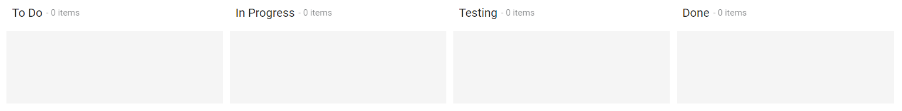

<!-- markdownlint-disable MD024 -->

# Getting Started with Blazor Kanban Component

This section briefly explains how to include a Kanban component in your Blazor Server-side application. You can refer to our Getting Started with [Syncfusion Blazor for Server-Side in Visual Studio 2019 page](../getting-started/blazor-server-side-visual-studio-2019/) for the introduction and configuring the common specifications.

## Importing Syncfusion Blazor component in the application

1. Install **Syncfusion.Blazor.Kanban** NuGet package to the application by using the **NuGet Package Manager**.

2. You can add the client-side style resources from [NuGet](https://blazor.syncfusion.com/documentation/appearance/themes#static-web-assets) package in the **HEAD** element of the **~/Pages/_Host.cshtml** page.

```cshtml
<head>
    <environment include="Development">
    ....
    ....
        <link href="_content/Syncfusion.Blazor/styles/fabric.css" rel="stylesheet" />
        <!---CDN--->
        @*<link href="https://cdn.syncfusion.com/blazor/18.4.42/styles/fabric.css" rel="stylesheet" />*@
   </environment>
</head>

```

> For Internet Explorer 11 kindly refer the polyfills. Refer the [documentation](../common/how-to/render-blazor-server-app-in-ie/) for more information.

```cshtml
<head>
   <environment include="Development">
      <link href="_content/Syncfusion.Blazor/styles/fabric.css" rel="stylesheet" />
      <script src="https://github.com/Daddoon/Blazor.Polyfill/releases/download/3.0.1/blazor.polyfill.min.js"></script>
  </environment>
</head>

```

## Adding component package to the application

Open **~/_Imports.razor** file and import the **Syncfusion.Blazor.Kanban** package.

```cshtml

@using Syncfusion.Blazor.Kanban

```

## Add SyncfusionBlazor service in Startup.cs

Open the **Startup.cs** file and add services required by Syncfusion components using **services.AddSyncfusionBlazor()** method. Add this method in the **ConfigureServices** function as follows.

```csharp

using Syncfusion.Blazor;
namespace BlazorApplication
{
    public class Startup
    {
        ....
        ....
        public void ConfigureServices(IServiceCollection services)
        {
            ....
            ....
            services.AddSyncfusionBlazor();
        }
    }
}

```

## Add Kanban component

To initialize the Kanban component, add the below code to your **Index.razor** view page which is present under **~/Pages** folder.

```cshtml

@using Syncfusion.Blazor.Kanban

<SfKanban TValue="TasksModel">
    <KanbanColumns>
        <KanbanColumn HeaderText="To Do" KeyField="@(new List<string>() {"Open"})"></KanbanColumn>
        <KanbanColumn HeaderText="In Progress" KeyField="@(new List<string>() {"InProgress"})"></KanbanColumn>
        <KanbanColumn HeaderText="Testing" KeyField="@(new List<string>() {"Testing"})"></KanbanColumn>
        <KanbanColumn HeaderText="Done" KeyField="@(new List<string>() {"Close"})"></KanbanColumn>
    </KanbanColumns>
</SfKanban>

@code {
    public class TasksModel
    {
        public string Id { get; set; }
        public string Title { get; set; }
        public string Status { get; set; }
        public string Summary { get; set; }
    }
}

```

## Run the application

After successful compilation of your application, run the application.

The output will be as follows.



## Populating cards

To populate the empty Kanban with cards, define the Enumerable object or remote data using the `DataSource` property. To define `DataSource`, the mandatory fields in object or remote data should be relevant to `KeyField`. In the following example, you can see the cards defined with default fields such as ID, Summary, and Status.

```cshtml

@using Syncfusion.Blazor.Kanban

<SfKanban TValue="TasksModel" KeyField="Status" DataSource="Tasks">
    <KanbanColumns>
        <KanbanColumn HeaderText="To Do" KeyField="@(new List<string>() {"Open"})"></KanbanColumn>
        <KanbanColumn HeaderText="In Progress" KeyField="@(new List<string>() {"InProgress"})"></KanbanColumn>
        <KanbanColumn HeaderText="Testing" KeyField="@(new List<string>() {"Testing"})"></KanbanColumn>
        <KanbanColumn HeaderText="Done" KeyField="@(new List<string>() {"Close"})"></KanbanColumn>
    </KanbanColumns>
    <KanbanCardSettings HeaderField="Title" ContentField="Summary"></KanbanCardSettings>
</SfKanban>

@code {
    public class TasksModel
    {
        public string Id { get; set; }
        public string Title { get; set; }
        public string Status { get; set; }
        public string Summary { get; set; }
    }

    public List<TasksModel> Tasks = new List<TasksModel>()
    {
        new TasksModel { Id = "Task 1", Title = "BLAZ-29001", Status = "Open", Summary = "Analyze the new requirements gathered from the customer." },
        new TasksModel { Id = "Task 2", Title = "BLAZ-29002", Status = "Open", Summary = "Show the retrieved data from the server in grid control." },
        new TasksModel { Id = "Task 3", Title = "BLAZ-29003", Status = "InProgress", Summary = "Improve application performance" },
        new TasksModel { Id = "Task 4", Title = "BLAZ-29004", Status = "Testing", Summary = "Fix the issues reported by the customer." },
        new TasksModel { Id = "Task 5", Title = "BLAZ-29005", Status = "Testing", Summary = "Fix the issues reported in Safari browser." },
        new TasksModel { Id = "Task 6", Title = "BLAZ-29006", Status = "Close", Summary = "Analyze SQL server 2008 connection." },
        new TasksModel { Id = "Task 7", Title = "BLAZ-29007", Status = "Close", Summary = "Analyze grid control." },
        new TasksModel { Id = "Task 8", Title = "BLAZ-29008", Status = "Close", Summary = "Stored procedure for initial data binding of the grid." }
    };
}

```

The output will be as follows.


## Enable Swimlane

`Swimlane` can be enabled by mapping the fields `KanbanSwimlaneSettings.KeyField` to appropriate column name in DataSource. This enables the grouping of the cards based on the mapped column values.

```cshtml

@using Syncfusion.Blazor.Kanban

<SfKanban TValue="TasksModel" KeyField="Status" DataSource="Tasks">
    <KanbanColumns>
        <KanbanColumn HeaderText="To Do" KeyField="@(new List<string>() {"Open"})"></KanbanColumn>
        <KanbanColumn HeaderText="In Progress" KeyField="@(new List<string>() {"InProgress"})"></KanbanColumn>
        <KanbanColumn HeaderText="Testing" KeyField="@(new List<string>() {"Testing"})"></KanbanColumn>
        <KanbanColumn HeaderText="Done" KeyField="@(new List<string>() {"Close"})"></KanbanColumn>
    </KanbanColumns>
    <KanbanCardSettings HeaderField="Title" ContentField="Summary"></KanbanCardSettings>
    <KanbanSwimlaneSettings KeyField="Assignee"></KanbanSwimlaneSettings>
</SfKanban>

@code {
    public class TasksModel
    {
        public string Id { get; set; }
        public string Title { get; set; }
        public string Status { get; set; }
        public string Summary { get; set; }
        public string Assignee { get; set; }
    }

    public List<TasksModel> Tasks = new List<TasksModel>()
    {
        new TasksModel { Id = "Task 1", Title = "BLAZ-29001", Status = "Open", Summary = "Analyze the new requirements gathered from the customer.", Assignee = "Nancy Davloio" },
        new TasksModel { Id = "Task 2", Title = "BLAZ-29002", Status = "InProgress", Summary = "Improve application performance", Assignee = "Andrew Fuller" },
        new TasksModel { Id = "Task 3", Title = "BLAZ-29003", Status = "Open", Summary = "Arrange a web meeting with the customer to get new requirements.", Assignee = "Janet Leverling" },
        new TasksModel { Id = "Task 4", Title = "BLAZ-29004", Status = "InProgress", Summary = "Fix the issues reported in the IE browser.", Assignee = "Janet Leverling" },
        new TasksModel { Id = "Task 5", Title = "BLAZ-29005", Status = "Review", Summary = "Fix the issues reported by the customer.", Assignee = "Steven walker" },
        new TasksModel { Id = "Task 6", Title = "BLAZ-29006", Status = "Review", Summary = "Fix the issues reported in Safari browser.", Assignee = "Nancy Davloio" },
        new TasksModel { Id = "Task 7", Title = "BLAZ-29007", Status = "Close", Summary = "Test the application in the IE browser.", Assignee = "Margaret hamilt" },
        new TasksModel { Id = "Task 8", Title = "BLAZ-29008", Status = "Validate", Summary = "Validate the issues reported by the customer.", Assignee = "Steven walker" },
        new TasksModel { Id = "Task 9", Title = "BLAZ-29009", Status = "Open", Summary = "Show the retrieved data from the server in grid control.", Assignee = "Margaret hamilt" },
        new TasksModel { Id = "Task 10", Title = "BLAZ-29010", Status = "InProgress", Summary = "Fix cannot open user’s default database SQL error.", Assignee = "Janet Leverling" },
        new TasksModel { Id = "Task 11", Title = "BLAZ-29011", Status = "Review", Summary = "Fix the issues reported in data binding.", Assignee = "Janet Leverling" },
        new TasksModel { Id = "Task 12", Title = "BLAZ-29012", Status = "Close", Summary = "Analyze SQL server 2008 connection.", Assignee = "Andrew Fuller" },
        new TasksModel { Id = "Task 13", Title = "BLAZ-29013", Status = "Validate", Summary = "Validate databinding issues.", Assignee = "Margaret hamilt" },
        new TasksModel { Id = "Task 14", Title = "BLAZ-29014", Status = "Close", Summary = "Analyze grid control.", Assignee = "Margaret hamilt" },
        new TasksModel { Id = "Task 15", Title = "BLAZ-29015", Status = "Close", Summary = "Stored procedure for initial data binding of the grid.", Assignee = "Steven walker" },
        new TasksModel { Id = "Task 16", Title = "BLAZ-29016", Status = "Close", Summary = "Analyze stored procedures.", Assignee = "Janet Leverling" },
        new TasksModel { Id = "Task 17", Title = "BLAZ-29017", Status = "Validate", Summary = "Validate editing issues.", Assignee = "Nancy Davloio" },
        new TasksModel { Id = "Task 18", Title = "BLAZ-29018", Status = "Review", Summary = "Test editing functionality.", Assignee = "Nancy Davloio" },
        new TasksModel { Id = "Task 19", Title = "BLAZ-29019", Status = "Open", Summary = "Enhance editing functionality.", Assignee = "Andrew Fuller" },
        new TasksModel { Id = "Task 20", Title = "BLAZ-29020", Status = "InProgress", Summary = "Improve the performance of the editing functionality.", Assignee = "Nancy Davloio" },
        new TasksModel { Id = "Task 21", Title = "BLAZ-29021", Status = "Open", Summary = "Arrange web meeting with the customer to show editing demo.", Assignee = "Steven walker" },
        new TasksModel { Id = "Task 22", Title = "BLAZ-29022", Status = "Review", Summary = "Fix the editing issues reported by the customer.", Assignee = "Janet Leverling" },
        new TasksModel { Id = "Task 23", Title = "BLAZ-29023", Status = "Testing", Summary = "Fix the issues reported by the customer.", Assignee = "Steven walker" },
        new TasksModel { Id = "Task 24", Title = "BLAZ-29024", Status = "Testing", Summary = "Fix the issues reported in Safari browser.", Assignee = "Nancy Davloio" },
        new TasksModel { Id = "Task 25", Title = "BLAZ-29025", Status = "Testing", Summary = "Fix the issues reported in data binding.", Assignee = "Janet Leverling" },
        new TasksModel { Id = "Task 26", Title = "BLAZ-29026", Status = "Testing", Summary = "Test editing functionality.", Assignee = "Nancy Davloio" },
        new TasksModel { Id = "Task 27", Title = "BLAZ-29027", Status = "Testing", Summary = "Test editing feature in the IE browser.", Assignee = "Janet Leverling" }
    };
}

```

The output will be as follows.


## See Also

* [Getting Started with Syncfusion Blazor for client-side in .NET Core CLI](../getting-started/blazor-webassembly-dotnet-cli/)

* [Getting Started with Syncfusion Blazor for server-side in Visual Studio 2019](../getting-started/blazor-server-side-visual-studio-2019/)

* [Getting Started with Syncfusion Blazor for server-side in .NET Core CLI](../getting-started/blazor-server-side-dotnet-cli)