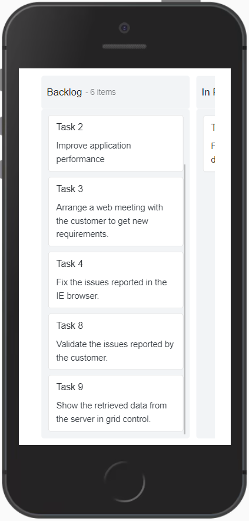
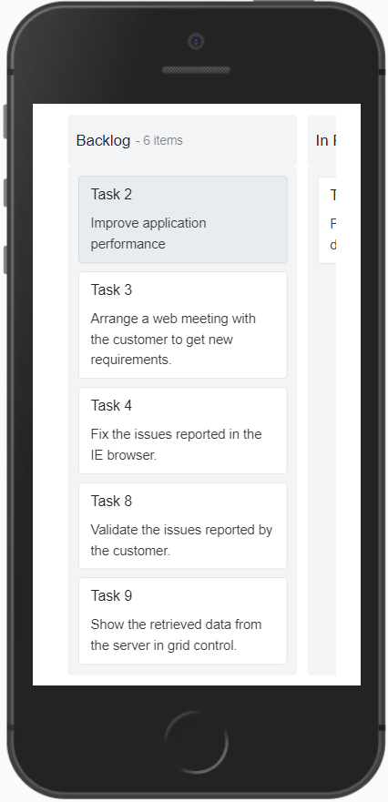

# Responsive Layout in Blazor Kanban Component

The [Blazor Kanban Board](https://www.syncfusion.com/blazor-components/blazor-kanban-board) component supports responsive behavior, automatically adapting its layout based on the width and height of the client’s browser.

## Available layouts

The Kanban component provides the following responsive layouts:

* **Default Layout**
* **Swimlane Layout**

### Default Layout

In responsive mode, the Kanban user interface is optimized for smaller screens. The layout is adjusted so that:

- The first column occupies 80% of the screen width.
- The second column occupies 20% of the screen width.
- Users can **tap and hold** a Kanban card to initiate drag-and-drop.
- **Swipe left or right** to navigate between columns.

### Swimlane Layout

In responsive mode, the swimlane header is displayed with a menu icon at the top of the Kanban board. When the icon is clicked:

- A popup displays all available swimlane group headers.
- Selecting a swimlane group updates the Kanban board to show the corresponding cards.
- By default, the first swimlane group is selected and displayed.

## Scrolling

Column scrolling will be shown when exceeding the screen size in the columns.

## Selection

Select particular cards in the Kanban board by tapping the card.

### Single Selection

Single card will be selected when you tap the card once and the selection will be removed when you select another card.

