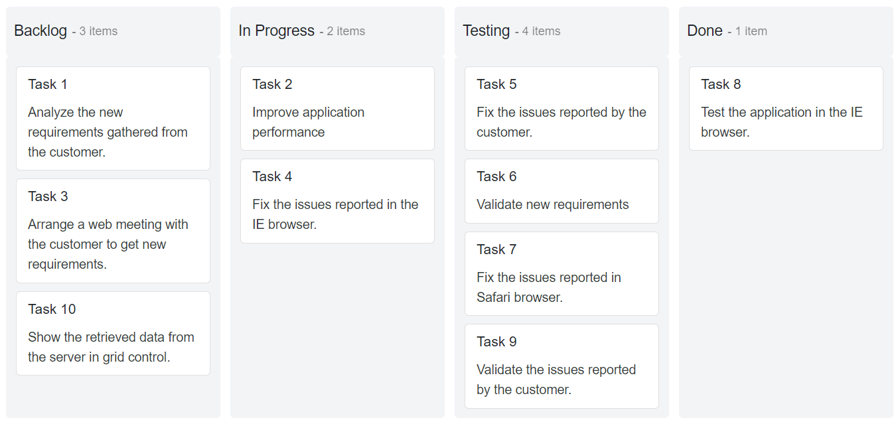
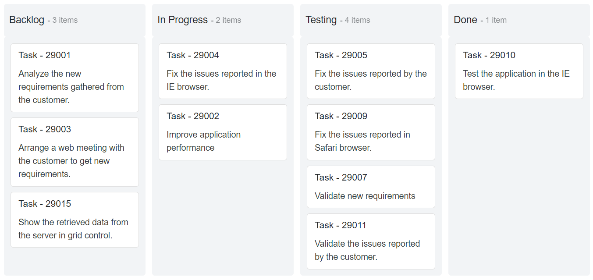
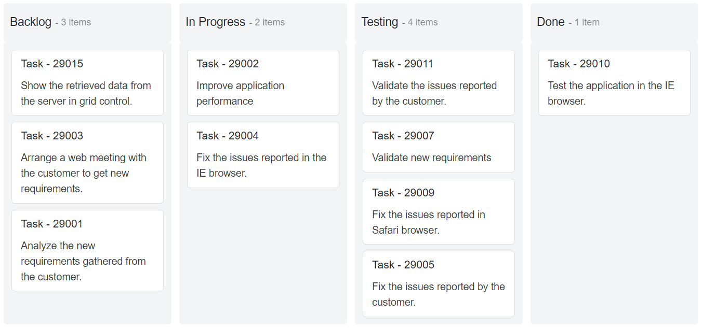

# How to Sort Cards in the Blazor Kanban Component

The [Blazor Kanban](https://www.syncfusion.com/blazor-components/blazor-kanban-board) provides built-in support to arrange the cards in their columns based on the JSON data order and drop the cards in the columns based on the dropped clone.

## Using the SortBy Property

Initially, users can change the arrangement of cards in the columns and position of the dropped card by using the [SortBy](https://help.syncfusion.com/cr/blazor/Syncfusion.Blazor.Kanban.KanbanSortSettings.html#Syncfusion_Blazor_Kanban_KanbanSortSettings_SortBy) property. The `SortBy` property contains three enumeration values as follows,

* DataSourceOrder
* Index
* Custom

### DataSource Order

The SortBy [DataSourceOrder] property does not require any `Field` mapping. In this behavior, cards are loaded based on the JSON data order, and also cards are dropped based on the JSON data order.

N> By default, the `SortBy` property is `DataSourceOrder`.

```cshtml

@using Syncfusion.Blazor.Kanban;

<SfKanban TValue="TasksModel" KeyField="Status" DataSource="Tasks">
    <KanbanColumns>
        <KanbanColumn HeaderText="Backlog" KeyField="@(new List<string>() {"Open"})"></KanbanColumn>
        <KanbanColumn HeaderText="In Progress" KeyField="@(new List<string>() {"InProgress"})"></KanbanColumn>
        <KanbanColumn HeaderText="Testing" KeyField="@(new List<string>() {"Testing"})"></KanbanColumn>
        <KanbanColumn HeaderText="Done" KeyField="@(new List<string>() {"Close"})"></KanbanColumn>
    </KanbanColumns>
    <KanbanCardSettings HeaderField="Id" ContentField="Summary"></KanbanCardSettings>
</SfKanban>

@code {
    public class TasksModel
    {
        public string Id { get; set; }
        public int ListId { get; set; }
        public string Title { get; set; }
        public string Status { get; set; }
        public string Summary { get; set; }
        public string Type { get; set; }
        public string Priority { get; set; }
        public List<string> CardTags { get; set; }
        public string Tags { get; set; }
        public double Estimate { get; set; }
        public string Assignee { get; set; }
        public int RankId { get; set; }
        public string Color { get; set; }
        public string Value { get; set; }
        public string OrderID { get; set; }
        public string Size { get; set; }
        public string ImageURL { get; set; }
        public string Description { get; set; }
        public string Category { get; set; }
        public string Price { get; set; }
        public string AssigneeKey { get; set; }
        public List<string> ClassName { get; set; }
    }

    public List<TasksModel> Tasks = new List<TasksModel>()
        {
            new TasksModel { Id = "Task 1", Title = "Task  - 29001", Status = "Open", Summary = "Analyze the new requirements gathered from the customer.", Type = "Story", Priority = "Low", CardTags = new List<string>() { "Analyze", "Customer" }, Estimate = 3.5, Assignee = "Nancy Davloio", AssigneeKey = "Nancy Davloio", RankId = 1, Color = "#8b447a", ClassName = new List<string>() { "e-story", "e-low", "e-nancy" } },
            new TasksModel { Id = "Task 2", Title = "Task  - 29002", Status = "InProgress", Summary = "Improve application performance", Type = "Improvement", Priority = "Normal", CardTags = new List<string>() { "Improvement" }, Estimate = 6, Assignee = "Andrew Fuller", AssigneeKey = "Andrew Fuller", RankId = 1, Color = "#7d7297", ClassName = new List<string>() { "e-improvement", "e-normal", "e-andrew" } },
            new TasksModel { Id = "Task 3", Title = "Task  - 29003", Status = "Open", Summary = "Arrange a web meeting with the customer to get new requirements.", Type = "Others", Priority = "Critical", CardTags = new List<string>() { "Meeting" }, Estimate = 5.5, Assignee = "Janet Leverling", AssigneeKey = "Janet Leverling", RankId = 2, Color = "#27AE60", ClassName = new List<string>() { "e-others", "e-critical", "e-janet" } },
            new TasksModel { Id = "Task 4", Title = "Task  - 29004", Status = "InProgress", Summary = "Fix the issues reported in the IE browser.", Type = "Bug", Priority = "Release Breaker", CardTags = new List<string>() { "IE" }, Estimate = 2.5, Assignee = "Janet Leverling", AssigneeKey = "Janet Leverling", RankId = 2, Color = "#cc0000", ClassName = new List<string>() { "e-bug", "e-release", "e-janet" } },
            new TasksModel { Id = "Task 5", Title = "Task  - 29005", Status = "Testing", Summary = "Fix the issues reported by the customer.", Type = "Bug", Priority = "Low", CardTags = new List<string>() { "Customer" }, Estimate = 3.5, Assignee = "Steven walker", AssigneeKey = "Steven walker", RankId = 1, Color = "#cc0000", ClassName = new List<string>() { "e-bug", "e-low", "e-steven" } },
            new TasksModel { Id = "Task 6", Title = "Task  - 29007", Status = "Testing", Summary = "Validate new requirements", Type = "Improvement", Priority = "Low", CardTags = new List<string>() { "Validation" }, Estimate = 1.5, Assignee = "Robert King", AssigneeKey = "Robert King", RankId = 1, Color = "#7d7297", ClassName = new List<string>() { "e-improvement", "e-low", "e-robert" } },
            new TasksModel { Id = "Task 7", Title = "Task  - 29009", Status = "Testing", Summary = "Fix the issues reported in Safari browser.", Type = "Bug", Priority = "Release Breaker", CardTags = new List<string>() { "Fix", "Safari" }, Estimate = 1.5, Assignee = "Nancy Davloio", AssigneeKey = "Nancy Davloio", RankId = 2, Color = "#cc0000", ClassName = new List<string>() { "e-bug", "e-release", "e-nancy" } },
            new TasksModel { Id = "Task 8", Title = "Task  - 29010", Status = "Close", Summary = "Test the application in the IE browser.", Type = "Story", Priority = "Low", CardTags = new List<string>() { "Review", "IE" }, Estimate = 5.5, Assignee = "Margaret hamilt", AssigneeKey = "Margaret hamilt", RankId = 3, Color = "#8b447a", ClassName = new List<string>() { "e-story", "e-low", "e-Margaret" } },
            new TasksModel { Id = "Task 9", Title = "Task  - 29011", Status = "Testing", Summary = "Validate the issues reported by the customer.", Type = "Story", Priority = "High", CardTags = new List<string>() { "Validation", "Fix" }, Estimate = 1, Assignee = "Steven walker", AssigneeKey = "Steven walker", RankId = 1, Color = "#8b447a", ClassName = new List<string>() { "e-story", "e-low", "e-nancy" } },
            new TasksModel { Id = "Task 10", Title = "Task  - 29015", Status = "Open", Summary = "Show the retrieved data from the server in grid control.", Type = "Story", Priority = "High", CardTags = new List<string>() { "Database", "SQL" }, Estimate = 5.5, Assignee = "Margaret hamilt", AssigneeKey = "Margaret hamilt", RankId = 4, Color = "#8b447a", ClassName = new List<string>() { "e-story", "e-high", "e-steven" } }
    };
}

```



### Sorting by Index Field

SortBy `Index` property must require datasource `Field` mapping. In this behavior, cards are loaded based on mapping `Field` values, and cards are dropped based on the dropped clone.

Cards are placed in a particular position in the columns where you can drop the cards by specifying the `Field` property, which is mapped from the data source. This property allows the users to drop the cards in the Kanban board where the dropped clone is created exactly. It is also helpful to render the cards based on the `Field` property value.

N> The `Field` property mapping key value must be in `number` format.

The following cases will dynamically change their `Field` value when dropping the cards.

* If the cell has no cards, the dropped card `Field` value does not change.

* If the cell has one card and dropped a card to the last position or previous/next cards that do not have continuous order, then the dropped card `Field` value will be changed based on their previous card value.

* If the cell has one card and dropped a card on the previous position, then it will compare both the values, and the dropped card `Field` value will be changed if the cards have continuous order otherwise values will not be changed.

* When the previous and next cards do not have continuous order, the dropped card `Field` value will be changed based on the previous card value.

* When the previous and next cards have continuous order or odd/even value, then the `Field` value of the dropped card and the cards followed by the dropped card will be changed based on the **previous** card value with continuous order.

For Example,

**Continuous Order** - Consider,  Column A has Card A with priority value `1`, Card B with priority value `2`, and Card C with priority value `3`, and Column B has Card D with priority value `5`, then the dropped Card D will be placed between Card A and Card B. Now, the Cards D, B, and C will be dynamically changed to the priority values as `2, 3, and 4` respectively.

**Odd/Even order** - Consider, Column A has Card A with priority value `1`, Card B with priority value `3`, and Card C with priority value `5`, and Column B has Card D with priority value `5`, then the Dropped Card D will be placed between Card A and Card B. Now, the Cards D, B, and C will be dynamically changed to the priority values as `2, 3, and 5` respectively.

```cshtml

@using Syncfusion.Blazor.Kanban;

<SfKanban TValue="TasksModel" KeyField="Status" DataSource="Tasks">
    <KanbanColumns>
        <KanbanColumn HeaderText="Backlog" KeyField="@(new List<string>() {"Open"})"></KanbanColumn>
        <KanbanColumn HeaderText="In Progress" KeyField="@(new List<string>() {"InProgress"})"></KanbanColumn>
        <KanbanColumn HeaderText="Testing" KeyField="@(new List<string>() {"Testing"})"></KanbanColumn>
        <KanbanColumn HeaderText="Done" KeyField="@(new List<string>() {"Close"})"></KanbanColumn>
    </KanbanColumns>
    <KanbanCardSettings ContentField="Summary" HeaderField="Title">
        <Template>
            @{
                TasksModel card = (TasksModel)context;
                <div class="card-template @card.Priority">
                    <div class="e-card-header">
                        <div class="e-card-header-caption">
                            <div class="e-card-header-title e-tooltip-text">@card.Title</div>
                        </div>
                    </div>
                    <div class="e-card-content">
                        <div class="e-text e-tooltip-text">@card.Summary</div>
                    </div>
                    <div class="e-card-footer" style="font-size: 12px">
                        <div class="e-text">RankId: @card.RankId</div>
                    </div>
                </div>
            }
        </Template>
    </KanbanCardSettings>
    <KanbanSortSettings SortBy="SortOrderBy.Index" Field="RankId"></KanbanSortSettings>
</SfKanban>

@code {
    public class TasksModel
    {
        public string Id { get; set; }
        public int ListId { get; set; }
        public string Title { get; set; }
        public string Status { get; set; }
        public string Summary { get; set; }
        public string Type { get; set; }
        public string Priority { get; set; }
        public List<string> CardTags { get; set; }
        public string Tags { get; set; }
        public double Estimate { get; set; }
        public string Assignee { get; set; }
        public int RankId { get; set; }
        public string Color { get; set; }
        public string Value { get; set; }
        public string OrderID { get; set; }
        public string Size { get; set; }
        public string ImageURL { get; set; }
        public string Description { get; set; }
        public string Category { get; set; }
        public string Price { get; set; }
        public string AssigneeKey { get; set; }
        public List<string> ClassName { get; set; }
    }

    public List<TasksModel> Tasks = new List<TasksModel>()
        {
            new TasksModel { Id = "Task 1", Title = "Task  - 29001", Status = "Open", Summary = "Analyze the new requirements gathered from the customer.", Type = "Story", Priority = "Low", CardTags = new List<string>() { "Analyze", "Customer" }, Estimate = 3.5, Assignee = "Nancy Davloio", AssigneeKey = "Nancy Davloio", RankId = 1, Color = "#8b447a", ClassName = new List<string>() { "e-story", "e-low", "e-nancy" } },
            new TasksModel { Id = "Task 2", Title = "Task  - 29002", Status = "InProgress", Summary = "Improve application performance", Type = "Improvement", Priority = "Normal", CardTags = new List<string>() { "Improvement" }, Estimate = 6, Assignee = "Andrew Fuller", AssigneeKey = "Andrew Fuller", RankId = 1, Color = "#7d7297", ClassName = new List<string>() { "e-improvement", "e-normal", "e-andrew" } },
            new TasksModel { Id = "Task 3", Title = "Task  - 29003", Status = "Open", Summary = "Arrange a web meeting with the customer to get new requirements.", Type = "Others", Priority = "Critical", CardTags = new List<string>() { "Meeting" }, Estimate = 5.5, Assignee = "Janet Leverling", AssigneeKey = "Janet Leverling", RankId = 2, Color = "#27AE60", ClassName = new List<string>() { "e-others", "e-critical", "e-janet" } },
            new TasksModel { Id = "Task 4", Title = "Task  - 29004", Status = "InProgress", Summary = "Fix the issues reported in the IE browser.", Type = "Bug", Priority = "Release Breaker", CardTags = new List<string>() { "IE" }, Estimate = 2.5, Assignee = "Janet Leverling", AssigneeKey = "Janet Leverling", RankId = 2, Color = "#cc0000", ClassName = new List<string>() { "e-bug", "e-release", "e-janet" } },
            new TasksModel { Id = "Task 5", Title = "Task  - 29005", Status = "Testing", Summary = "Fix the issues reported by the customer.", Type = "Bug", Priority = "Low", CardTags = new List<string>() { "Customer" }, Estimate = 3.5, Assignee = "Steven walker", AssigneeKey = "Steven walker", RankId = 1, Color = "#cc0000", ClassName = new List<string>() { "e-bug", "e-low", "e-steven" } },
            new TasksModel { Id = "Task 6", Title = "Task  - 29007", Status = "Testing", Summary = "Validate new requirements", Type = "Improvement", Priority = "Low", CardTags = new List<string>() { "Validation" }, Estimate = 1.5, Assignee = "Robert King", AssigneeKey = "Robert King", RankId = 1, Color = "#7d7297", ClassName = new List<string>() { "e-improvement", "e-low", "e-robert" } },
            new TasksModel { Id = "Task 7", Title = "Task  - 29009", Status = "Testing", Summary = "Fix the issues reported in Safari browser.", Type = "Bug", Priority = "Release Breaker", CardTags = new List<string>() { "Fix", "Safari" }, Estimate = 1.5, Assignee = "Nancy Davloio", AssigneeKey = "Nancy Davloio", RankId = 2, Color = "#cc0000", ClassName = new List<string>() { "e-bug", "e-release", "e-nancy" } },
            new TasksModel { Id = "Task 8", Title = "Task  - 29010", Status = "Close", Summary = "Test the application in the IE browser.", Type = "Story", Priority = "Low", CardTags = new List<string>() { "Review", "IE" }, Estimate = 5.5, Assignee = "Margaret hamilt", AssigneeKey = "Margaret hamilt", RankId = 3, Color = "#8b447a", ClassName = new List<string>() { "e-story", "e-low", "e-Margaret" } },
            new TasksModel { Id = "Task 9", Title = "Task  - 29011", Status = "Testing", Summary = "Validate the issues reported by the customer.", Type = "Story", Priority = "High", CardTags = new List<string>() { "Validation", "Fix" }, Estimate = 1, Assignee = "Steven walker", AssigneeKey = "Steven walker", RankId = 1, Color = "#8b447a", ClassName = new List<string>() { "e-story", "e-low", "e-nancy" } },
            new TasksModel { Id = "Task 10", Title = "Task  - 29015", Status = "Open", Summary = "Show the retrieved data from the server in grid control.", Type = "Story", Priority = "High", CardTags = new List<string>() { "Database", "SQL" }, Estimate = 5.5, Assignee = "Margaret hamilt", AssigneeKey = "Margaret hamilt", RankId = 4, Color = "#8b447a", ClassName = new List<string>() { "e-story", "e-high", "e-steven" } }
    };
}

```


### Custom

The SortBy `Custom` property must require datasource `Field` mapping. In this behavior, cards are loaded based on the `Field` mapping value and also cards are dropped based on the `Field` mapping value.

```cshtml

@using Syncfusion.Blazor.Kanban;

<SfKanban TValue="TasksModel" KeyField="Status" DataSource="Tasks">
    <KanbanColumns>
        <KanbanColumn HeaderText="Backlog" KeyField="@(new List<string>() {"Open"})"></KanbanColumn>
        <KanbanColumn HeaderText="In Progress" KeyField="@(new List<string>() {"InProgress"})"></KanbanColumn>
        <KanbanColumn HeaderText="Testing" KeyField="@(new List<string>() {"Testing"})"></KanbanColumn>
        <KanbanColumn HeaderText="Done" KeyField="@(new List<string>() {"Close"})"></KanbanColumn>
    </KanbanColumns>
    <KanbanCardSettings ContentField="Summary" HeaderField="Title"></KanbanCardSettings>
    <KanbanSortSettings SortBy="SortOrderBy.Custom" Field="Summary"></KanbanSortSettings>
</SfKanban>

@code {
    public class TasksModel
    {
        public string Id { get; set; }
        public int ListId { get; set; }
        public string Title { get; set; }
        public string Status { get; set; }
        public string Summary { get; set; }
        public string Type { get; set; }
        public string Priority { get; set; }
        public List<string> CardTags { get; set; }
        public string Tags { get; set; }
        public double Estimate { get; set; }
        public string Assignee { get; set; }
        public int RankId { get; set; }
        public string Color { get; set; }
        public string Value { get; set; }
        public string OrderID { get; set; }
        public string Size { get; set; }
        public string ImageURL { get; set; }
        public string Description { get; set; }
        public string Category { get; set; }
        public string Price { get; set; }
        public string AssigneeKey { get; set; }
        public List<string> ClassName { get; set; }
    }

    public List<TasksModel> Tasks = new List<TasksModel>()
        {
            new TasksModel { Id = "Task 1", Title = "Task  - 29001", Status = "Open", Summary = "Analyze the new requirements gathered from the customer.", Type = "Story", Priority = "Low", CardTags = new List<string>() { "Analyze", "Customer" }, Estimate = 3.5, Assignee = "Nancy Davloio", AssigneeKey = "Nancy Davloio", RankId = 1, Color = "#8b447a", ClassName = new List<string>() { "e-story", "e-low", "e-nancy" } },
            new TasksModel { Id = "Task 2", Title = "Task  - 29002", Status = "InProgress", Summary = "Improve application performance", Type = "Improvement", Priority = "Normal", CardTags = new List<string>() { "Improvement" }, Estimate = 6, Assignee = "Andrew Fuller", AssigneeKey = "Andrew Fuller", RankId = 1, Color = "#7d7297", ClassName = new List<string>() { "e-improvement", "e-normal", "e-andrew" } },
            new TasksModel { Id = "Task 3", Title = "Task  - 29003", Status = "Open", Summary = "Arrange a web meeting with the customer to get new requirements.", Type = "Others", Priority = "Critical", CardTags = new List<string>() { "Meeting" }, Estimate = 5.5, Assignee = "Janet Leverling", AssigneeKey = "Janet Leverling", RankId = 2, Color = "#27AE60", ClassName = new List<string>() { "e-others", "e-critical", "e-janet" } },
            new TasksModel { Id = "Task 4", Title = "Task  - 29004", Status = "InProgress", Summary = "Fix the issues reported in the IE browser.", Type = "Bug", Priority = "Release Breaker", CardTags = new List<string>() { "IE" }, Estimate = 2.5, Assignee = "Janet Leverling", AssigneeKey = "Janet Leverling", RankId = 2, Color = "#cc0000", ClassName = new List<string>() { "e-bug", "e-release", "e-janet" } },
            new TasksModel { Id = "Task 5", Title = "Task  - 29005", Status = "Testing", Summary = "Fix the issues reported by the customer.", Type = "Bug", Priority = "Low", CardTags = new List<string>() { "Customer" }, Estimate = 3.5, Assignee = "Steven walker", AssigneeKey = "Steven walker", RankId = 1, Color = "#cc0000", ClassName = new List<string>() { "e-bug", "e-low", "e-steven" } },
            new TasksModel { Id = "Task 6", Title = "Task  - 29007", Status = "Testing", Summary = "Validate new requirements", Type = "Improvement", Priority = "Low", CardTags = new List<string>() { "Validation" }, Estimate = 1.5, Assignee = "Robert King", AssigneeKey = "Robert King", RankId = 1, Color = "#7d7297", ClassName = new List<string>() { "e-improvement", "e-low", "e-robert" } },
            new TasksModel { Id = "Task 7", Title = "Task  - 29009", Status = "Testing", Summary = "Fix the issues reported in Safari browser.", Type = "Bug", Priority = "Release Breaker", CardTags = new List<string>() { "Fix", "Safari" }, Estimate = 1.5, Assignee = "Nancy Davloio", AssigneeKey = "Nancy Davloio", RankId = 2, Color = "#cc0000", ClassName = new List<string>() { "e-bug", "e-release", "e-nancy" } },
            new TasksModel { Id = "Task 8", Title = "Task  - 29010", Status = "Close", Summary = "Test the application in the IE browser.", Type = "Story", Priority = "Low", CardTags = new List<string>() { "Review", "IE" }, Estimate = 5.5, Assignee = "Margaret hamilt", AssigneeKey = "Margaret hamilt", RankId = 3, Color = "#8b447a", ClassName = new List<string>() { "e-story", "e-low", "e-Margaret" } },
            new TasksModel { Id = "Task 9", Title = "Task  - 29011", Status = "Testing", Summary = "Validate the issues reported by the customer.", Type = "Story", Priority = "High", CardTags = new List<string>() { "Validation", "Fix" }, Estimate = 1, Assignee = "Steven walker", AssigneeKey = "Steven walker", RankId = 1, Color = "#8b447a", ClassName = new List<string>() { "e-story", "e-low", "e-nancy" } },
            new TasksModel { Id = "Task 10", Title = "Task  - 29015", Status = "Open", Summary = "Show the retrieved data from the server in grid control.", Type = "Story", Priority = "High", CardTags = new List<string>() { "Database", "SQL" }, Estimate = 5.5, Assignee = "Margaret hamilt", AssigneeKey = "Margaret hamilt", RankId = 4, Color = "#8b447a", ClassName = new List<string>() { "e-story", "e-high", "e-steven" } }
    };
}

```



## Sorting Direction Configuration

Kanban board also provides support for aligning the cards in the columns using the [Direction](https://help.syncfusion.com/cr/blazor/Syncfusion.Blazor.Kanban.KanbanSortSettings.html#Syncfusion_Blazor_Kanban_KanbanSortSettings_Direction) property inside the `KanbanSortSettings` property. Based on this, cards can be aligned in the columns either in `Ascending` or `Descending` order. Sorting direction will be performed based on `SortBy` property.

N> By default, cards are aligned in the columns based on `Ascending` order.

In the following sample, cards are aligned in `Descending` order.

```cshtml

@using Syncfusion.Blazor.Kanban;

<SfKanban TValue="TasksModel" KeyField="Status" DataSource="Tasks">
    <KanbanColumns>
        <KanbanColumn HeaderText="Backlog" KeyField="@(new List<string>() {"Open"})"></KanbanColumn>
        <KanbanColumn HeaderText="In Progress" KeyField="@(new List<string>() {"InProgress"})"></KanbanColumn>
        <KanbanColumn HeaderText="Testing" KeyField="@(new List<string>() {"Testing"})"></KanbanColumn>
        <KanbanColumn HeaderText="Done" KeyField="@(new List<string>() {"Close"})"></KanbanColumn>
    </KanbanColumns>
    <KanbanCardSettings ContentField="Summary" HeaderField="Title"></KanbanCardSettings>
    <KanbanSortSettings SortBy="SortOrderBy.Custom" Field="Summary"></KanbanSortSettings>
</SfKanban>

@code {
    public class TasksModel
    {
        public string Id { get; set; }
        public int ListId { get; set; }
        public string Title { get; set; }
        public string Status { get; set; }
        public string Summary { get; set; }
        public string Type { get; set; }
        public string Priority { get; set; }
        public List<string> CardTags { get; set; }
        public string Tags { get; set; }
        public double Estimate { get; set; }
        public string Assignee { get; set; }
        public int RankId { get; set; }
        public string Color { get; set; }
        public string Value { get; set; }
        public string OrderID { get; set; }
        public string Size { get; set; }
        public string ImageURL { get; set; }
        public string Description { get; set; }
        public string Category { get; set; }
        public string Price { get; set; }
        public string AssigneeKey { get; set; }
        public List<string> ClassName { get; set; }
    }

    public List<TasksModel> Tasks = new List<TasksModel>()
        {
            new TasksModel { Id = "Task 1", Title = "Task  - 29001", Status = "Open", Summary = "Analyze the new requirements gathered from the customer.", Type = "Story", Priority = "Low", CardTags = new List<string>() { "Analyze", "Customer" }, Estimate = 3.5, Assignee = "Nancy Davloio", AssigneeKey = "Nancy Davloio", RankId = 1, Color = "#8b447a", ClassName = new List<string>() { "e-story", "e-low", "e-nancy" } },
            new TasksModel { Id = "Task 2", Title = "Task  - 29002", Status = "InProgress", Summary = "Improve application performance", Type = "Improvement", Priority = "Normal", CardTags = new List<string>() { "Improvement" }, Estimate = 6, Assignee = "Andrew Fuller", AssigneeKey = "Andrew Fuller", RankId = 1, Color = "#7d7297", ClassName = new List<string>() { "e-improvement", "e-normal", "e-andrew" } },
            new TasksModel { Id = "Task 3", Title = "Task  - 29003", Status = "Open", Summary = "Arrange a web meeting with the customer to get new requirements.", Type = "Others", Priority = "Critical", CardTags = new List<string>() { "Meeting" }, Estimate = 5.5, Assignee = "Janet Leverling", AssigneeKey = "Janet Leverling", RankId = 2, Color = "#27AE60", ClassName = new List<string>() { "e-others", "e-critical", "e-janet" } },
            new TasksModel { Id = "Task 4", Title = "Task  - 29004", Status = "InProgress", Summary = "Fix the issues reported in the IE browser.", Type = "Bug", Priority = "Release Breaker", CardTags = new List<string>() { "IE" }, Estimate = 2.5, Assignee = "Janet Leverling", AssigneeKey = "Janet Leverling", RankId = 2, Color = "#cc0000", ClassName = new List<string>() { "e-bug", "e-release", "e-janet" } },
            new TasksModel { Id = "Task 5", Title = "Task  - 29005", Status = "Testing", Summary = "Fix the issues reported by the customer.", Type = "Bug", Priority = "Low", CardTags = new List<string>() { "Customer" }, Estimate = 3.5, Assignee = "Steven walker", AssigneeKey = "Steven walker", RankId = 1, Color = "#cc0000", ClassName = new List<string>() { "e-bug", "e-low", "e-steven" } },
            new TasksModel { Id = "Task 6", Title = "Task  - 29007", Status = "Testing", Summary = "Validate new requirements", Type = "Improvement", Priority = "Low", CardTags = new List<string>() { "Validation" }, Estimate = 1.5, Assignee = "Robert King", AssigneeKey = "Robert King", RankId = 1, Color = "#7d7297", ClassName = new List<string>() { "e-improvement", "e-low", "e-robert" } },
            new TasksModel { Id = "Task 7", Title = "Task  - 29009", Status = "Testing", Summary = "Fix the issues reported in Safari browser.", Type = "Bug", Priority = "Release Breaker", CardTags = new List<string>() { "Fix", "Safari" }, Estimate = 1.5, Assignee = "Nancy Davloio", AssigneeKey = "Nancy Davloio", RankId = 2, Color = "#cc0000", ClassName = new List<string>() { "e-bug", "e-release", "e-nancy" } },
            new TasksModel { Id = "Task 8", Title = "Task  - 29010", Status = "Close", Summary = "Test the application in the IE browser.", Type = "Story", Priority = "Low", CardTags = new List<string>() { "Review", "IE" }, Estimate = 5.5, Assignee = "Margaret hamilt", AssigneeKey = "Margaret hamilt", RankId = 3, Color = "#8b447a", ClassName = new List<string>() { "e-story", "e-low", "e-Margaret" } },
            new TasksModel { Id = "Task 9", Title = "Task  - 29011", Status = "Testing", Summary = "Validate the issues reported by the customer.", Type = "Story", Priority = "High", CardTags = new List<string>() { "Validation", "Fix" }, Estimate = 1, Assignee = "Steven walker", AssigneeKey = "Steven walker", RankId = 1, Color = "#8b447a", ClassName = new List<string>() { "e-story", "e-low", "e-nancy" } },
            new TasksModel { Id = "Task 10", Title = "Task  - 29015", Status = "Open", Summary = "Show the retrieved data from the server in grid control.", Type = "Story", Priority = "High", CardTags = new List<string>() { "Database", "SQL" }, Estimate = 5.5, Assignee = "Margaret hamilt", AssigneeKey = "Margaret hamilt", RankId = 4, Color = "#8b447a", ClassName = new List<string>() { "e-story", "e-high", "e-steven" } }
    };
}

```

