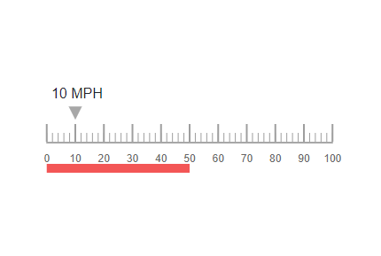

# Animation in Blazor Linear Gauge Component

Elements in the Linear Gauge—axis lines, ticks, labels, ranges, pointers, and annotations—can be animated sequentially by using the [AnimationDuration](https://help.syncfusion.com/cr/blazor/Syncfusion.Blazor.LinearGauge.SfLinearGauge.html#Syncfusion_Blazor_Linear_Gauge_SfLinearGauge_AnimationDuration) property. Animation is enabled when `AnimationDuration` is set to a nonzero value in milliseconds, providing a smooth rendering effect. When `AnimationDuration` is set to **0** (default), animation is disabled. When enabled, elements animate in the following sequence:

1. Axis line, ticks, labels, and ranges animate concurrently.
2. If present, pointers animate as described in [pointer animation](https://blazor.syncfusion.com/documentation/linear-gauge/pointers#pointer-animation).
3. If present, annotations animate.

The following example demonstrates Linear Gauge animation.

```cshtml

@using Syncfusion.Blazor.LinearGauge;

<SfLinearGauge Orientation="Orientation.Horizontal" AnimationDuration="3000">
        <LinearGaugeAxes>
            <LinearGaugeAxis>
                <LinearGaugeAxisLabelStyle Offset="48">
                    <LinearGaugeAxisLabelFont FontFamily="inherit"></LinearGaugeAxisLabelFont>
                </LinearGaugeAxisLabelStyle>
                <LinearGaugeMajorTicks Color="#9E9E9E" Interval="10" Height="20" />
                <LinearGaugeMinorTicks Color="#9E9E9E" Interval="2" Height="10" />
                <LinearGaugeAnnotations>
                    <LinearGaugeAnnotation AxisIndex="0" AxisValue="10" X="10" Y="-70" ZIndex="1">
                        <ContentTemplate>
                            <div style="width: 70px;margin-left: -53%;margin-top: 5%;font-size: 16px;">10 MPH</div>
                        </ContentTemplate>
                    </LinearGaugeAnnotation>
                </LinearGaugeAnnotations>
                <LinearGaugePointers>
                    <LinearGaugePointer PointerValue="10" Height="15" Width="15" Placement="Placement.Near" Offset="-40" MarkerType="MarkerType.Triangle" />
                </LinearGaugePointers>
            <LinearGaugeRanges>
                <LinearGaugeRange Start="0" End="50" StartWidth="10" EndWidth="10" Color="#F45656" Offset="35" />
            </LinearGaugeRanges>
            </LinearGaugeAxis>
        </LinearGaugeAxes>
    </SfLinearGauge>

```



N> Only the pointer can be animated individually. For pointer-only animation, refer to [pointer animation](https://blazor.syncfusion.com/documentation/linear-gauge/pointers#pointer-animation).
