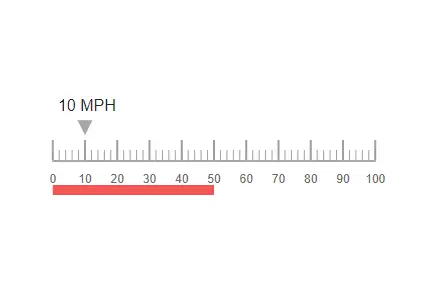

# Blazor Linear Gauge Animation

All of the elements in the Linear Gauge, such as the axis lines, ticks, labels, ranges, pointers, and annotations, can be animated by using the [AnimationDuration](https://help.syncfusion.com/cr/blazor/Syncfusion.Blazor.LinearGauge.SfLinearGauge.html#Syncfusion_Blazor_LinearGauge_SfLinearGauge_AnimationDuration) property. The animation for the Linear Gauge is enabled when the `AnimationDuration` property is set to a value in milliseconds, providing a smooth rendering effect for the component. The default value of `AnimationDuration` is **0**, which disables the animation effect. When animation is enabled, the component renders in the following order.

1. The axis line, ticks, labels, and ranges are all animated at the same time.
2. If available, pointers are animated in the same way as [pointer animation](https://blazor.syncfusion.com/documentation/linear-gauge/pointers#pointer-animation).
3. If available, annotations are animated.

The animation of the Linear Gauge is demonstrated in the following example.

```cshtml

@using Syncfusion.Blazor.LinearGauge;

<SfLinearGauge Orientation="Orientation.Horizontal" AnimationDuration="3000">
        <LinearGaugeAxes>
            <LinearGaugeAxis>
                <LinearGaugeAxisLabelStyle Offset="48">
                    <LinearGaugeAxisLabelFont FontFamily="inherit"></LinearGaugeAxisLabelFont>
                </LinearGaugeAxisLabelStyle>
                <LinearGaugeMajorTicks Color="#9E9E9E" Interval="10" Height="20" />
                <LinearGaugeMinorTicks Color="#9E9E9E" Interval="2" Height="10" />
                <LinearGaugeAnnotations>
                    <LinearGaugeAnnotation AxisIndex="0" AxisValue="10" X="10" Y="-70" ZIndex="1">
                        <ContentTemplate>
                            <div style="width: 70px;margin-left: -53%;margin-top: 5%;font-size: 16px;">10 MPH</div>
                        </ContentTemplate>
                    </LinearGaugeAnnotation>
                </LinearGaugeAnnotations>
                <LinearGaugePointers>
                    <LinearGaugePointer PointerValue="10" Height="15" Width="15" Placement="Placement.Near" Offset="-40" MarkerType="MarkerType.Triangle" />
                </LinearGaugePointers>
                <LinearGaugeRanges>
                    <LinearGaugeRange Start="0" End="50" StartWidth="10" EndWidth="10" Color="#F45656" Offset="35" />
                </LinearGaugeRanges>
            </LinearGaugeAxis>
        </LinearGaugeAxes>
    </SfLinearGauge>

```



N> Only the pointer of the Linear Gauge can be animated individually, not the axis lines, ticks, labels, ranges, and annotations. Refer to this [link](https://blazor.syncfusion.com/documentation/linear-gauge/pointers#pointer-animation) to enable only pointer animation.

## See also

* [Blazor Linear Gauge Pointers](https://blazor.syncfusion.com/documentation/linear-gauge/pointers)
* [Blazor Linear Gauge Annotations](https://blazor.syncfusion.com/documentation/linear-gauge/annotations)

