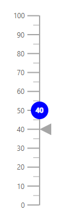

# Annotations in Blazor Linear Gauge Component

Annotations mark specific areas of interest in the Linear Gauge using text, HTML elements, or images. Any number of annotations can be added to the Linear Gauge component.

## Adding annotation

To render custom HTML elements in the Linear Gauge, use the [ContentTemplate](https://help.syncfusion.com/cr/blazor/Syncfusion.Blazor.LinearGauge.LinearGaugeAnnotation.html#Syncfusion_Blazor_LinearGauge_LinearGaugeAnnotation_ContentTemplate) property of [LinearGaugeAnnotation](https://help.syncfusion.com/cr/blazor/Syncfusion.Blazor.LinearGauge.LinearGaugeAnnotation.html). The [Content](https://help.syncfusion.com/cr/blazor/Syncfusion.Blazor.LinearGauge.LinearGaugeAnnotation.html#Syncfusion_Blazor_LinearGauge_LinearGaugeAnnotation_Content) property can be used to render the element as an annotation in the Linear Gauge.

```cshtml

@using Syncfusion.Blazor.LinearGauge

<SfLinearGauge>
    <LinearGaugeAnnotations>
        <LinearGaugeAnnotation AxisValue="0" ZIndex="1">
            <ContentTemplate>
                <div class="custom-annotation">40</div>
            </ContentTemplate>
        </LinearGaugeAnnotation>
    </LinearGaugeAnnotations>
    <LinearGaugeAxes>
        <LinearGaugeAxis>
            <LinearGaugePointers>
                <LinearGaugePointer PointerValue="40"></LinearGaugePointer>
            </LinearGaugePointers>
        </LinearGaugeAxis>
    </LinearGaugeAxes>
</SfLinearGauge>

<style type="text/css">
    .custom-annotation {
        color: white;
        background-color: blue;
        height: 30px;
        width: 30px;
        border-radius: 15px;
        padding: 4px 0 0 6px;
        font-weight: bold;
    }
</style>

```


## Customization

The following properties are used to customize annotations:

* [ZIndex](https://help.syncfusion.com/cr/blazor/Syncfusion.Blazor.LinearGauge.LinearGaugeAnnotation.html#Syncfusion_Blazor_LinearGauge_LinearGaugeAnnotation_ZIndex) - Controls the stacking order when an annotation overlaps other elements.
* [AxisValue](https://help.syncfusion.com/cr/blazor/Syncfusion.Blazor.LinearGauge.LinearGaugeAnnotation.html#Syncfusion_Blazor_LinearGauge_LinearGaugeAnnotation_AxisValue) - Positions the annotation at the specified value on the selected axis.
* [AxisIndex](https://help.syncfusion.com/cr/blazor/Syncfusion.Blazor.LinearGauge.LinearGaugeAnnotation.html#Syncfusion_Blazor_LinearGauge_LinearGaugeAnnotation_AxisIndex) - Selects the axis on which the annotation is placed.
* [HorizontalAlignment](https://help.syncfusion.com/cr/blazor/Syncfusion.Blazor.LinearGauge.LinearGaugeAnnotation.html#Syncfusion_Blazor_LinearGauge_LinearGaugeAnnotation_HorizontalAlignment) - Aligns the annotation horizontally.
* [VerticalAlignment](https://help.syncfusion.com/cr/blazor/Syncfusion.Blazor.LinearGauge.LinearGaugeAnnotation.html#Syncfusion_Blazor_LinearGauge_LinearGaugeAnnotation_VerticalAlignment) - Aligns the annotation vertically.
* [X](https://help.syncfusion.com/cr/blazor/Syncfusion.Blazor.LinearGauge.LinearGaugeAnnotation.html#Syncfusion_Blazor_LinearGauge_LinearGaugeAnnotation_X), [Y](https://help.syncfusion.com/cr/blazor/Syncfusion.Blazor.LinearGauge.LinearGaugeAnnotation.html#Syncfusion_Blazor_LinearGauge_LinearGaugeAnnotation_Y) - Sets pixel offsets to place the annotation at an exact location.

<!-- markdownlint-disable MD036 -->

### Changing the z-index

To change the stack order of an annotation element, use the [ZIndex](https://help.syncfusion.com/cr/blazor/Syncfusion.Blazor.LinearGauge.LinearGaugeAnnotation.html#Syncfusion_Blazor_LinearGauge_LinearGaugeAnnotation_ZIndex) property of [LinearGaugeAnnotation](https://help.syncfusion.com/cr/blazor/Syncfusion.Blazor.LinearGauge.LinearGaugeAnnotation.html).

```cshtml

@using Syncfusion.Blazor.LinearGauge

<SfLinearGauge>
    <LinearGaugeAnnotations>
        <LinearGaugeAnnotation AxisValue="0" ZIndex="1">
            <ContentTemplate>
                <div class="custom-annotation">40</div>
            </ContentTemplate>
        </LinearGaugeAnnotation>
    </LinearGaugeAnnotations>
    <LinearGaugeAxes>
        <LinearGaugeAxis>
            <LinearGaugePointers>
                <LinearGaugePointer PointerValue="40"></LinearGaugePointer>
            </LinearGaugePointers>
        </LinearGaugeAxis>
    </LinearGaugeAxes>
</SfLinearGauge>

<style type="text/css">
    .custom-annotation {
        color: white;
        background-color: blue;
        height: 30px;
        width: 30px;
        border-radius: 15px;
        padding: 4px 0 0 6px;
        font-weight: bold;
    }
</style>

```


<!-- markdownlint-disable MD036 -->

### Positioning an annotation

Place an annotation anywhere in the Linear Gauge by setting pixel values for the [X](https://help.syncfusion.com/cr/blazor/Syncfusion.Blazor.LinearGauge.LinearGaugeAnnotation.html#Syncfusion_Blazor_LinearGauge_LinearGaugeAnnotation_X) and [Y](https://help.syncfusion.com/cr/blazor/Syncfusion.Blazor.LinearGauge.LinearGaugeAnnotation.html#Syncfusion_Blazor_LinearGauge_LinearGaugeAnnotation_Y) properties in [LinearGaugeAnnotation](https://help.syncfusion.com/cr/blazor/Syncfusion.Blazor.LinearGauge.LinearGaugeAnnotation.html).

```cshtml

@using Syncfusion.Blazor.LinearGauge

<SfLinearGauge>
    <LinearGaugeAnnotations>
        <LinearGaugeAnnotation AxisValue="0" ZIndex="1" X="50" Y="-100">
            <ContentTemplate>
                <div class="custom-annotation">40</div>
            </ContentTemplate>
        </LinearGaugeAnnotation>
    </LinearGaugeAnnotations>
    <LinearGaugeAxes>
        <LinearGaugeAxis>
            <LinearGaugePointers>
                <LinearGaugePointer PointerValue="40"></LinearGaugePointer>
            </LinearGaugePointers>
        </LinearGaugeAxis>
    </LinearGaugeAxes>
</SfLinearGauge>

<style type="text/css">
    .custom-annotation {
        color: white;
        background-color: blue;
        height: 30px;
        width: 30px;
        border-radius: 15px;
        padding: 4px 0 0 6px;
        font-weight: bold;
    }
</style>

```


### Alignment of annotation

Annotations can be aligned horizontally and vertically using the [HorizontalAlignment](https://help.syncfusion.com/cr/blazor/Syncfusion.Blazor.LinearGauge.LinearGaugeAnnotation.html#Syncfusion_Blazor_LinearGauge_LinearGaugeAnnotation_HorizontalAlignment) and [VerticalAlignment](https://help.syncfusion.com/cr/blazor/Syncfusion.Blazor.LinearGauge.LinearGaugeAnnotation.html#Syncfusion_Blazor_LinearGauge_LinearGaugeAnnotation_VerticalAlignment) properties. The possible values are [Center](https://help.syncfusion.com/cr/blazor/Syncfusion.Blazor.LinearGauge.Placement.html#Syncfusion_Blazor_LinearGauge_Placement_Center), [Far](https://help.syncfusion.com/cr/blazor/Syncfusion.Blazor.LinearGauge.Placement.html#Syncfusion_Blazor_LinearGauge_Placement_Far), [Near](https://help.syncfusion.com/cr/blazor/Syncfusion.Blazor.LinearGauge.Placement.html#Syncfusion_Blazor_LinearGauge_Placement_Near), and [None](https://help.syncfusion.com/cr/blazor/Syncfusion.Blazor.LinearGauge.Placement.html#Syncfusion_Blazor_LinearGauge_Placement_None). The [HorizontalAlignment](https://help.syncfusion.com/cr/blazor/Syncfusion.Blazor.LinearGauge.LinearGaugeAnnotation.html#Syncfusion_Blazor_LinearGauge_LinearGaugeAnnotation_HorizontalAlignment) and [VerticalAlignment](https://help.syncfusion.com/cr/blazor/Syncfusion.Blazor.LinearGauge.LinearGaugeAnnotation.html#Syncfusion_Blazor_LinearGauge_LinearGaugeAnnotation_VerticalAlignment) properties do not apply when [X](https://help.syncfusion.com/cr/blazor/Syncfusion.Blazor.LinearGauge.LinearGaugeAnnotation.html#Syncfusion_Blazor_LinearGauge_LinearGaugeAnnotation_X) and [Y](https://help.syncfusion.com/cr/blazor/Syncfusion.Blazor.LinearGauge.LinearGaugeAnnotation.html#Syncfusion_Blazor_LinearGauge_LinearGaugeAnnotation_Y) values are set.

```cshtml

@using Syncfusion.Blazor.LinearGauge

<SfLinearGauge>
    <LinearGaugeAnnotations>
        <LinearGaugeAnnotation ZIndex="1"
                               HorizontalAlignment="Placement.Center"
                               VerticalAlignment="Placement.Center">
            <ContentTemplate>
                <div class="custom-annotation">40</div>
            </ContentTemplate>
        </LinearGaugeAnnotation>
    </LinearGaugeAnnotations>
    <LinearGaugeAxes>
        <LinearGaugeAxis>
            <LinearGaugePointers>
                <LinearGaugePointer PointerValue="40"></LinearGaugePointer>
            </LinearGaugePointers>
        </LinearGaugeAxis>
    </LinearGaugeAxes>
</SfLinearGauge>

<style type="text/css">
    .custom-annotation {
        color: white;
        background-color: blue;
        height: 30px;
        width: 30px;
        border-radius: 15px;
        padding: 4px 0 0 6px;
        font-weight: bold;
    }
</style>

```



## Multiple annotations

Multiple annotations can be added by declaring multiple [LinearGaugeAnnotation](https://help.syncfusion.com/cr/blazor/Syncfusion.Blazor.LinearGauge.LinearGaugeAnnotation.html) elements inside [LinearGaugeAnnotations](https://help.syncfusion.com/cr/blazor/Syncfusion.Blazor.LinearGauge.LinearGaugeAnnotations.html). Each annotation can be customized independently using the available properties.

```cshtml

@using Syncfusion.Blazor.LinearGauge

<SfLinearGauge>
    <LinearGaugeAnnotations>
        <LinearGaugeAnnotation ZIndex="1" AxisValue="100"
                               X="-110" Y="-35">
            <ContentTemplate>
                <div class="custom-annotation">Speed to get higher milage</div>
            </ContentTemplate>
        </LinearGaugeAnnotation>
        <LinearGaugeAnnotation AxisValue="0" ZIndex="1">
            <ContentTemplate>
                <div class="speed">40</div>
            </ContentTemplate>
        </LinearGaugeAnnotation>
    </LinearGaugeAnnotations>
    <LinearGaugeAxes>
        <LinearGaugeAxis>
            <LinearGaugePointers>
                <LinearGaugePointer PointerValue="40"></LinearGaugePointer>
            </LinearGaugePointers>
        </LinearGaugeAxis>
    </LinearGaugeAxes>
</SfLinearGauge>

<style type="text/css">
    .speed {
        color: white;
        background-color: blue;
        height: 30px;
        width: 30px;
        border-radius: 15px;
        padding: 4px 0 0 6px;
        font-weight: bold;
    }

    .custom-annotation {
        background-color: lightgray;
        width: 210px;
        padding: 2px 5px;
    }
</style>

```


