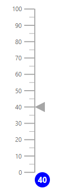
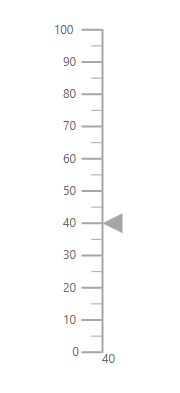
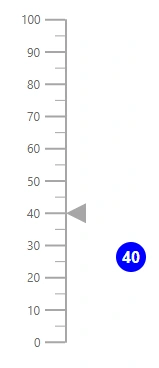
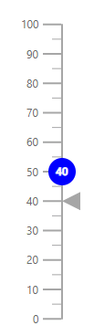
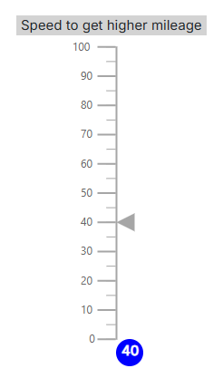

# Blazor Linear Gauge Annotations

Annotations are used to highlight a specific area of interest in the Linear Gauge with text, HTML elements, or images. Any number of annotations can be added to the Linear Gauge component.

## Adding an annotation

To render the custom HTML elements in the Linear Gauge component, use the [ContentTemplate](https://help.syncfusion.com/cr/blazor/Syncfusion.Blazor.LinearGauge.LinearGaugeAnnotation.html#Syncfusion_Blazor_LinearGauge_LinearGaugeAnnotation_ContentTemplate) property in the [LinearGaugeAnnotation](https://help.syncfusion.com/cr/blazor/Syncfusion.Blazor.LinearGauge.LinearGaugeAnnotation.html). The [Content](https://help.syncfusion.com/cr/blazor/Syncfusion.Blazor.LinearGauge.LinearGaugeAnnotation.html#Syncfusion_Blazor_LinearGauge_LinearGaugeAnnotation_Content) property in [LinearGaugeAnnotation](https://help.syncfusion.com/cr/blazor/Syncfusion.Blazor.LinearGauge.LinearGaugeAnnotation.html) can be used to render the element as an annotation in the Linear Gauge.

```cshtml
@using Syncfusion.Blazor.LinearGauge

<SfLinearGauge>
    <LinearGaugeAnnotations>
        <LinearGaugeAnnotation AxisValue="0" ZIndex="1">
            <ContentTemplate>
                <div class="custom-annotation">40</div>
            </ContentTemplate>
        </LinearGaugeAnnotation>
    </LinearGaugeAnnotations>
    <LinearGaugeAxes>
        <LinearGaugeAxis>
            <LinearGaugePointers>
                <LinearGaugePointer PointerValue="40"></LinearGaugePointer>
            </LinearGaugePointers>
        </LinearGaugeAxis>
    </LinearGaugeAxes>
</SfLinearGauge>

<style type="text/css">
    .custom-annotation {
        color: white;
        background-color: blue;
        height: 30px;
        width: 30px;
        border-radius: 15px;
        padding: 4px 0 0 6px;
        font-weight: bold;
    }
</style>
```



The example below uses the [Content](https://help.syncfusion.com/cr/blazor/Syncfusion.Blazor.LinearGauge.LinearGaugeAnnotation.html#Syncfusion_Blazor_LinearGauge_LinearGaugeAnnotation_Content) property to render a plain-text annotation, which is useful when no custom HTML structure is required.

```cshtml
@using Syncfusion.Blazor.LinearGauge

<SfLinearGauge>
    <LinearGaugeAnnotations>
        <LinearGaugeAnnotation AxisValue="0" ZIndex="1" Content="40">
        </LinearGaugeAnnotation>
    </LinearGaugeAnnotations>
    <LinearGaugeAxes>
        <LinearGaugeAxis>
            <LinearGaugePointers>
                <LinearGaugePointer PointerValue="40"></LinearGaugePointer>
            </LinearGaugePointers>
        </LinearGaugeAxis>
    </LinearGaugeAxes>
</SfLinearGauge>
```



## Customization

The following table lists the properties available on the [LinearGaugeAnnotation](https://help.syncfusion.com/cr/blazor/Syncfusion.Blazor.LinearGauge.LinearGaugeAnnotation.html) that are used to customize the annotation.

| Property | Type | Default | Description |
|----------|------|---------|-------------|
| [ZIndex](https://help.syncfusion.com/cr/blazor/Syncfusion.Blazor.LinearGauge.LinearGaugeAnnotation.html#Syncfusion_Blazor_LinearGauge_LinearGaugeAnnotation_ZIndex) | `string` | `0` | Brings the annotation to the front or back when it overlaps with another element. |
| [AxisValue](https://help.syncfusion.com/cr/blazor/Syncfusion.Blazor.LinearGauge.LinearGaugeAnnotation.html#Syncfusion_Blazor_LinearGauge_LinearGaugeAnnotation_AxisValue) | `double` | `0` | Places the annotation at the specified axis value on the axis referenced by [AxisIndex](https://help.syncfusion.com/cr/blazor/Syncfusion.Blazor.LinearGauge.LinearGaugeAnnotation.html#Syncfusion_Blazor_LinearGauge_LinearGaugeAnnotation_AxisIndex). |
| [AxisIndex](https://help.syncfusion.com/cr/blazor/Syncfusion.Blazor.LinearGauge.LinearGaugeAnnotation.html#Syncfusion_Blazor_LinearGauge_LinearGaugeAnnotation_AxisIndex) | `int` | `0` | Targets the axis at the specified index; the annotation is placed at the `AxisValue` on that axis. |
| [HorizontalAlignment](https://help.syncfusion.com/cr/blazor/Syncfusion.Blazor.LinearGauge.LinearGaugeAnnotation.html#Syncfusion_Blazor_LinearGauge_LinearGaugeAnnotation_HorizontalAlignment) | `Placement` | `Placement.Center` | Aligns the annotation horizontally. |
| [VerticalAlignment](https://help.syncfusion.com/cr/blazor/Syncfusion.Blazor.LinearGauge.LinearGaugeAnnotation.html#Syncfusion_Blazor_LinearGauge_LinearGaugeAnnotation_VerticalAlignment) | `Placement` | `Placement.Center` | Aligns the annotation vertically. |
| [X](https://help.syncfusion.com/cr/blazor/Syncfusion.Blazor.LinearGauge.LinearGaugeAnnotation.html#Syncfusion_Blazor_LinearGauge_LinearGaugeAnnotation_X) | `double` | `0` | Positions the annotation at the specified horizontal pixel offset from the default location. |
| [Y](https://help.syncfusion.com/cr/blazor/Syncfusion.Blazor.LinearGauge.LinearGaugeAnnotation.html#Syncfusion_Blazor_LinearGauge_LinearGaugeAnnotation_Y) | `double` | `0` | Positions the annotation at the specified vertical pixel offset from the default location. |

### Changing the z-index

To change the stack order of an annotation element, use the [ZIndex](https://help.syncfusion.com/cr/blazor/Syncfusion.Blazor.LinearGauge.LinearGaugeAnnotation.html#Syncfusion_Blazor_LinearGauge_LinearGaugeAnnotation_ZIndex) property of the [LinearGaugeAnnotation](https://help.syncfusion.com/cr/blazor/Syncfusion.Blazor.LinearGauge.LinearGaugeAnnotation.html).

```cshtml
@using Syncfusion.Blazor.LinearGauge

<SfLinearGauge>
    <LinearGaugeAnnotations>
        <LinearGaugeAnnotation AxisValue="0" ZIndex="1">
            <ContentTemplate>
                <div class="custom-annotation">40</div>
            </ContentTemplate>
        </LinearGaugeAnnotation>
    </LinearGaugeAnnotations>
    <LinearGaugeAxes>
        <LinearGaugeAxis>
            <LinearGaugePointers>
                <LinearGaugePointer PointerValue="40"></LinearGaugePointer>
            </LinearGaugePointers>
        </LinearGaugeAxis>
    </LinearGaugeAxes>
</SfLinearGauge>

<style type="text/css">
    .custom-annotation {
        color: white;
        background-color: blue;
        height: 30px;
        width: 30px;
        border-radius: 15px;
        padding: 4px 0 0 6px;
        font-weight: bold;
    }
</style>
```


### Positioning an annotation

The annotation can be placed anywhere in the Linear Gauge by setting the pixel value to the [X](https://help.syncfusion.com/cr/blazor/Syncfusion.Blazor.LinearGauge.LinearGaugeAnnotation.html#Syncfusion_Blazor_LinearGauge_LinearGaugeAnnotation_X) and [Y](https://help.syncfusion.com/cr/blazor/Syncfusion.Blazor.LinearGauge.LinearGaugeAnnotation.html#Syncfusion_Blazor_LinearGauge_LinearGaugeAnnotation_Y) properties in the [LinearGaugeAnnotation](https://help.syncfusion.com/cr/blazor/Syncfusion.Blazor.LinearGauge.LinearGaugeAnnotation.html).

```cshtml
@using Syncfusion.Blazor.LinearGauge

<SfLinearGauge>
    <LinearGaugeAnnotations>
        <LinearGaugeAnnotation AxisValue="0" ZIndex="1" X="50" Y="-100">
            <ContentTemplate>
                <div class="custom-annotation">40</div>
            </ContentTemplate>
        </LinearGaugeAnnotation>
    </LinearGaugeAnnotations>
    <LinearGaugeAxes>
        <LinearGaugeAxis>
            <LinearGaugePointers>
                <LinearGaugePointer PointerValue="40"></LinearGaugePointer>
            </LinearGaugePointers>
        </LinearGaugeAxis>
    </LinearGaugeAxes>
</SfLinearGauge>

<style type="text/css">
    .custom-annotation {
        color: white;
        background-color: blue;
        height: 30px;
        width: 30px;
        border-radius: 15px;
        padding: 4px 0 0 6px;
        font-weight: bold;
    }
</style>
```



### Alignment of annotation

The annotation can be aligned horizontally and vertically by using the [HorizontalAlignment](https://help.syncfusion.com/cr/blazor/Syncfusion.Blazor.LinearGauge.LinearGaugeAnnotation.html#Syncfusion_Blazor_LinearGauge_LinearGaugeAnnotation_HorizontalAlignment) and [VerticalAlignment](https://help.syncfusion.com/cr/blazor/Syncfusion.Blazor.LinearGauge.LinearGaugeAnnotation.html#Syncfusion_Blazor_LinearGauge_LinearGaugeAnnotation_VerticalAlignment) properties respectively. The possible values can be [Center](https://help.syncfusion.com/cr/blazor/Syncfusion.Blazor.LinearGauge.Placement.html#Syncfusion_Blazor_LinearGauge_Placement_Center), [Far](https://help.syncfusion.com/cr/blazor/Syncfusion.Blazor.LinearGauge.Placement.html#Syncfusion_Blazor_LinearGauge_Placement_Far), [Near](https://help.syncfusion.com/cr/blazor/Syncfusion.Blazor.LinearGauge.Placement.html#Syncfusion_Blazor_LinearGauge_Placement_Near), and [None](https://help.syncfusion.com/cr/blazor/Syncfusion.Blazor.LinearGauge.Placement.html#Syncfusion_Blazor_LinearGauge_Placement_None). The [HorizontalAlignment](https://help.syncfusion.com/cr/blazor/Syncfusion.Blazor.LinearGauge.LinearGaugeAnnotation.html#Syncfusion_Blazor_LinearGauge_LinearGaugeAnnotation_HorizontalAlignment) and [VerticalAlignment](https://help.syncfusion.com/cr/blazor/Syncfusion.Blazor.LinearGauge.LinearGaugeAnnotation.html#Syncfusion_Blazor_LinearGauge_LinearGaugeAnnotation_VerticalAlignment) properties are not applicable when the [X](https://help.syncfusion.com/cr/blazor/Syncfusion.Blazor.LinearGauge.LinearGaugeAnnotation.html#Syncfusion_Blazor_LinearGauge_LinearGaugeAnnotation_X) and [Y](https://help.syncfusion.com/cr/blazor/Syncfusion.Blazor.LinearGauge.LinearGaugeAnnotation.html#Syncfusion_Blazor_LinearGauge_LinearGaugeAnnotation_Y) properties are set in the [LinearGaugeAnnotation](https://help.syncfusion.com/cr/blazor/Syncfusion.Blazor.LinearGauge.LinearGaugeAnnotation.html).

```cshtml
@using Syncfusion.Blazor.LinearGauge

<SfLinearGauge>
    <LinearGaugeAnnotations>
        <LinearGaugeAnnotation ZIndex="1"
                               HorizontalAlignment="Placement.Center"
                               VerticalAlignment="Placement.Center">
            <ContentTemplate>
                <div class="custom-annotation">40</div>
            </ContentTemplate>
        </LinearGaugeAnnotation>
    </LinearGaugeAnnotations>
    <LinearGaugeAxes>
        <LinearGaugeAxis>
            <LinearGaugePointers>
                <LinearGaugePointer PointerValue="40"></LinearGaugePointer>
            </LinearGaugePointers>
        </LinearGaugeAxis>
    </LinearGaugeAxes>
</SfLinearGauge>

<style type="text/css">
    .custom-annotation {
        color: white;
        background-color: blue;
        height: 30px;
        width: 30px;
        border-radius: 15px;
        padding: 4px 0 0 6px;
        font-weight: bold;
    }
</style>
```



The table below summarizes the available [Placement](https://help.syncfusion.com/cr/blazor/Syncfusion.Blazor.LinearGauge.Placement.html) values for `HorizontalAlignment` and `VerticalAlignment`.

| Value | Description |
|-------|-------------|
| [Center](https://help.syncfusion.com/cr/blazor/Syncfusion.Blazor.LinearGauge.Placement.html#Syncfusion_Blazor_LinearGauge_Placement_Center) | Aligns the annotation to the center of the anchor point. |
| [Far](https://help.syncfusion.com/cr/blazor/Syncfusion.Blazor.LinearGauge.Placement.html#Syncfusion_Blazor_LinearGauge_Placement_Far) | Aligns the annotation to the far side of the anchor point. |
| [Near](https://help.syncfusion.com/cr/blazor/Syncfusion.Blazor.LinearGauge.Placement.html#Syncfusion_Blazor_LinearGauge_Placement_Near) | Aligns the annotation to the near side of the anchor point. |
| [None](https://help.syncfusion.com/cr/blazor/Syncfusion.Blazor.LinearGauge.Placement.html#Syncfusion_Blazor_LinearGauge_Placement_None) | Removes the alignment behavior. |

## Multiple annotations

Use cases such as thresholds, contextual labels, or tooltips may require more than one annotation on the same gauge. Multiple annotations can be added by including multiple [LinearGaugeAnnotation](https://help.syncfusion.com/cr/blazor/Syncfusion.Blazor.LinearGauge.LinearGaugeAnnotation.html) elements inside [LinearGaugeAnnotations](https://help.syncfusion.com/cr/blazor/Syncfusion.Blazor.LinearGauge.LinearGaugeAnnotations.html). Each annotation can be customized independently using the [LinearGaugeAnnotation](https://help.syncfusion.com/cr/blazor/Syncfusion.Blazor.LinearGauge.LinearGaugeAnnotation.html) properties.

```cshtml
@using Syncfusion.Blazor.LinearGauge

<SfLinearGauge>
    <LinearGaugeAnnotations>
        <LinearGaugeAnnotation ZIndex="1" AxisValue="100"
                               X="-110" Y="-35">
            <ContentTemplate>
                <div class="custom-annotation">Speed to get higher mileage</div>
            </ContentTemplate>
        </LinearGaugeAnnotation>
        <LinearGaugeAnnotation AxisValue="0" ZIndex="1">
            <ContentTemplate>
                <div class="speed">40</div>
            </ContentTemplate>
        </LinearGaugeAnnotation>
    </LinearGaugeAnnotations>
    <LinearGaugeAxes>
        <LinearGaugeAxis>
            <LinearGaugePointers>
                <LinearGaugePointer PointerValue="40"></LinearGaugePointer>
            </LinearGaugePointers>
        </LinearGaugeAxis>
    </LinearGaugeAxes>
</SfLinearGauge>

<style type="text/css">
    .speed {
        color: white;
        background-color: blue;
        height: 30px;
        width: 30px;
        border-radius: 15px;
        padding: 4px 0 0 6px;
        font-weight: bold;
    }

    .custom-annotation {
        background-color: lightgray;
        width: 210px;
        padding: 2px 5px;
    }
</style>
```



## See also

* [Axis in Blazor Linear Gauge](axis.md)
* [Pointers in Blazor Linear Gauge](pointers.md)
* [Ranges in Blazor Linear Gauge](ranges.md)
* [Events in Blazor Linear Gauge](events.md)
* [Methods in Blazor Linear Gauge](methods.md)