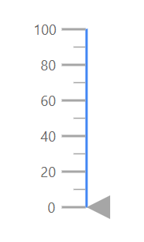
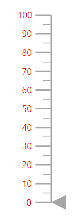
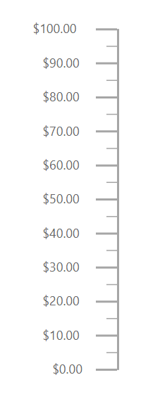
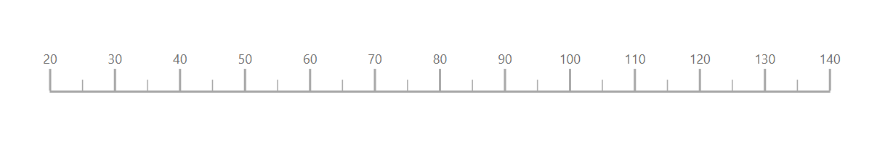

# Axes

Axes is a collection of linear axis which can be used to indicate the numeric values. Line, ticks, labels, ranges and pointers are the sub elements of an axis.

## Line Customization

The `LinearGaugeLine` tag of an axis provides options to customize the `Height`, `Width`,`Color` and `Offset` of the axis line.

```csharp
<SfLinearGauge>
    <LinearGaugeAxes>
        <LinearGaugeAxis>
            <LinearGaugeLine Height="150"
                             Width="2"
                             Color="#4286f4"
                             Offset="2">
            </LinearGaugeLine>
        </LinearGaugeAxis>
    </LinearGaugeAxes>
</SfLinearGauge>
```



## Ticks Customization

You can customize the `Height`, `Color` and `Width` of major and minor ticks, by using `LinearGaugeMajorTicks` and `LinearGaugeMinorTicks` tag. By default, interval for major ticks will be calculated automatically and also you can customize the interval for major and minor ticks using `Interval` property.

```csharp
<SfLinearGauge>
    <LinearGaugeAxes>
        <LinearGaugeAxis Minimum =20 Maximum =140>
            <LinearGaugeMajorTicks Color="#9e9e9e" Interval="20" Height="20">
            </LinearGaugeMajorTicks>
            <LinearGaugeMinorTicks Color="red" Interval="5" Height="10">
            </LinearGaugeMinorTicks>
        </LinearGaugeAxis>
    </LinearGaugeAxes>
</SfLinearGauge>
```


<!-- markdownlint-disable MD036 -->
**Tick Position**

The minor and major ticks can be positioned by using [`Offset`](https://help.syncfusion.com/cr/blazor/Syncfusion.Blazor.LinearGauge.LinearGaugeTickSettings.html#Syncfusion_Blazor_LinearGauge_LinearGaugeTickSettings_Offset) and [`Position`](https://help.syncfusion.com/cr/blazor/Syncfusion.Blazor.LinearGauge.LinearGaugeTickSettings.html#Syncfusion_Blazor_LinearGauge_LinearGaugeTickSettings_Position) property. The offset defines the difference between the axis and the ticks. By default, the offset value is 0. The `Position` specifies the position of the ticks. Its possible values are ['Inside'](https://help.syncfusion.com/cr/blazor/Syncfusion.Blazor.LinearGauge.Position.html#Syncfusion_Blazor_LinearGauge_Position_Inside), ['Outside'](https://help.syncfusion.com/cr/blazor/Syncfusion.Blazor.LinearGauge.Position.html#Syncfusion_Blazor_LinearGauge_Position_Outside) and ['Cross'](https://help.syncfusion.com/cr/blazor/Syncfusion.Blazor.LinearGauge.Position.html#Syncfusion_Blazor_LinearGauge_Position_Cross). By default, ticks will be placed inside the axis.

```csharp
<SfLinearGauge>
    <LinearGaugeAxes>
        <LinearGaugeAxis Minimum="0" Maximum="160">
           <LinearGaugeMajorTicks Interval="10" Color="red" Height="10" Width="3" Position="Position.Outside">
           </LinearGaugeMajorTicks>
            <LinearGaugeMinorTicks Interval="5" Color="green" Height="5" Width="2" Position="Position.Cross">
            </LinearGaugeMinorTicks>
        </LinearGaugeAxis>
    </LinearGaugeAxes>
</SfLinearGauge>
```


## Labels Customization

Labels can be customized using the folllowing properties in [`LinearGaugeAxisLabelStyle`](https://help.syncfusion.com/cr/blazor/Syncfusion.Blazor~Syncfusion.Blazor.LinearGauge.LinearGaugeAxisLabelStyle_members.html)

* [`Format`](https://help.syncfusion.com/cr/blazor/Syncfusion.Blazor~Syncfusion.Blazor.LinearGauge.LinearGaugeAxisLabelStyle~Format.html) - Specifies the format for the labels.
* [`Offset`](https://help.syncfusion.com/cr/blazor/Syncfusion.Blazor~Syncfusion.Blazor.LinearGauge.LinearGaugeAxisLabelStyle~Offset.html) - Specifies the offset from its default position.
* [`LinearGaugeAxisLabelFont`](https://help.syncfusion.com/cr/blazor/Syncfusion.Blazor~Syncfusion.Blazor.LinearGauge.LinearGaugeAxisLabelFont_members.html) - Specifies the font for of the label.

```csharp
<SfLinearGauge>
    <LinearGaugeAxes>
        <LinearGaugeAxis>
            <LinearGaugeAxisLabelStyle>
                <LinearGaugeAxisLabelFont Color="red"></LinearGaugeAxisLabelFont>
            </LinearGaugeAxisLabelStyle>
        </LinearGaugeAxis>
    </LinearGaugeAxes>
</SfLinearGauge>
```



<!-- markdownlint-disable MD036 -->
**Label Position**

Labels can be positioned by using [`Offset`](https://help.syncfusion.com/cr/blazor/Syncfusion.Blazor~Syncfusion.Blazor.LinearGauge.LinearGaugeAxisLabelStyle~Offset.html) or [`Position`](https://help.syncfusion.com/cr/blazor/Syncfusion.Blazor.LinearGauge.LinearGaugeAxisLabelStyle.html#Syncfusion_Blazor_LinearGauge_LinearGaugeAxisLabelStyle_Position) property. The [`Offset`](https://help.syncfusion.com/cr/blazor/Syncfusion.Blazor~Syncfusion.Blazor.LinearGauge.LinearGaugeAxisLabelStyle~Offset.html) defines the distance between the labels and ticks. By default, the offset value is 0.
The [`Position`](https://help.syncfusion.com/cr/blazor/Syncfusion.Blazor.LinearGauge.LinearGaugeAxisLabelStyle.html#Syncfusion_Blazor_LinearGauge_LinearGaugeAxisLabelStyle_Position) specifies the label position. Its possible values are ['Inside'](https://help.syncfusion.com/cr/blazor/Syncfusion.Blazor.LinearGauge.Position.html#Syncfusion_Blazor_LinearGauge_Position_Inside), ['Outside'](https://help.syncfusion.com/cr/blazor/Syncfusion.Blazor.LinearGauge.Position.html#Syncfusion_Blazor_LinearGauge_Position_Outside) and ['Cross'](https://help.syncfusion.com/cr/blazor/Syncfusion.Blazor.LinearGauge.Position.html#Syncfusion_Blazor_LinearGauge_Position_Cross). By default, labels will be placed `Inside` the axis.

```csharp
<SfLinearGauge>
    <LinearGaugeAxes>
        <LinearGaugeAxis>
            <LinearGaugeAxisLabelStyle Position="Position.Cross">
            </LinearGaugeAxisLabelStyle>
        </LinearGaugeAxis>
    </LinearGaugeAxes>
</SfLinearGauge>
```


<!-- markdownlint-disable MD036 -->
**Customize the display of the last label**

If the last label is not in the visible range, it will be hidden by default. If you want to show the last label, set the [`ShowLastLabel`](https://help.syncfusion.com/cr/blazor/Syncfusion.Blazor.LinearGauge.LinearGaugeAxis.html#Syncfusion_Blazor_LinearGauge_LinearGaugeAxis_ShowLastLabel) property to **true** in the [`LinearGaugeAxis`](https://help.syncfusion.com/cr/blazor/Syncfusion.Blazor~Syncfusion.Blazor.LinearGauge.LinearGaugeAxisShowLastLabel_members.html).

```csharp
<SfLinearGauge>
    <LinearGaugeAxes>
        <LinearGaugeAxis Minimum="0" Maximum="170" ShowLastLabel="true">
        </LinearGaugeAxis>
    </LinearGaugeAxes>
</SfLinearGauge>
```


<!-- markdownlint-disable MD036 -->
**Label Format**

Axis labels in the Linear Gauge control can be formatted using the [`Format`](https://help.syncfusion.com/cr/blazor/Syncfusion.Blazor.LinearGauge.LinearGaugeAxisLabelStyle.html#Syncfusion_Blazor_LinearGauge_LinearGaugeAxisLabelStyle_Format) property in the [`LinearGaugeAxisLabelStyle`](https://help.syncfusion.com/cr/blazor/Syncfusion.Blazor.LinearGauge.LinearGaugeAxisLabelStyle.html) class. It is used to render the axis labels in a certain format or to add a user-defined unit in the label. It works with the help of placeholder like **{value}°C**, where **"value"** represents the axis value. e.g. 20°C.

```csharp
<SfLinearGauge>
    <LinearGaugeAxes>
        <LinearGaugeAxis Minimum =20 Maximum =140>
            <LinearGaugeLabel Format= "{value}°C">
            </LinearGaugeLabel>
        </LinearGaugeAxis>
    </LinearGaugeAxes>
</SfLinearGauge>
```


**Displaying numeric format in labels**

The numeric formats such as currency, percentage, and so on can be displayed in the labels of the Linear Gauge using the [`Format`](https://help.syncfusion.com/cr/blazor/Syncfusion.Blazor.LinearGauge.SfLinearGauge.html#Syncfusion_Blazor_LinearGauge_SfLinearGauge_Format) property in the [`SfLinearGauge`](https://help.syncfusion.com/cr/blazor/Syncfusion.Blazor.LinearGauge.SfLinearGauge.html) class. The following table describes the result of applying some commonly used label formats on numeric values.

<!-- markdownlint-disable MD033 -->
<table>
<tr>
<td><b>Label Value</b></td>
<td><b>Label Format property value</b></td>
<td><b>Result </b></td>
<td><b>Description </b></td>
</tr>
<tr>
<td>1000</td>
<td>n1</td>
<td>1000.0</td>
<td>The number is rounded to 1 decimal place</td>
</tr>
<tr>
<td>1000</td>
<td>n2</td>
<td>1000.00</td>
<td>The number is rounded to 2 decimal place</td>
</tr>
<tr>
<td>1000</td>
<td>n3</td>
<td>1000.000</td>
<td>The number is rounded to 3 decimal place</td>
</tr>
<tr>
<td>0.01</td>
<td>p1</td>
<td>1.0%</td>
<td>The number is converted to percentage with 1 decimal place</td>
</tr>
<tr>
<td>0.01</td>
<td>p2</td>
<td>1.00%</td>
<td>The number is converted to percentage with 2 decimal place</td>
</tr>
<tr>
<td>0.01</td>
<td>p3</td>
<td>1.000%</td>
<td>The number is converted to percentage with 3 decimal place</td>
</tr>
<tr>
<td>1000</td>
<td>c1</td>
<td>$1,000.0</td>
<td>The currency symbol is appended to number and number is rounded to 1 decimal place</td>
</tr>
<tr>
<td>1000</td>
<td>c2</td>
<td>$1,000.00</td>
<td>The currency symbol is appended to number and number is rounded to 2 decimal place</td>
</tr>
</table>

<!-- markdownlint-disable MD036 -->

```cshtml
@using Syncfusion.Blazor.LinearGauge

<SfLinearGauge Format="c">
    <LinearGaugeAxes>
        <LinearGaugeAxis>
        </LinearGaugeAxis>
    </LinearGaugeAxes>
</SfLinearGauge>
```



## Orientation

By default, the Linear Gauge is rendered vertically. To change its orientation, the [`Orientation`](https://help.syncfusion.com/cr/blazor/Syncfusion.Blazor.LinearGauge.Orientation.html)property must be set **"Horizontal"**

```csharp
<SfLinearGauge Orientation="Orientation.Horizontal">
    <LinearGaugeAxes>
        <LinearGaugeAxis Minimum="20" Maximum="140"></LinearGauge>
    </LinearGaugeAxes>
</SfLinearGauge>
```



## Inverted Axes

`IsInversed` property is used to choose the rendering of axis either bottom to top or top to bottom direction.

```csharp
<SfLinearGauge>
    <LinearGaugeAxes>
        <LinearGaugeAxis IsInversed=true>
        </LinearGaugeAxis>
    </LinearGaugeAxes>
</SfLinearGauge>
```


## Opposed Axes

To place an axis opposite from its original position, set `OpposedPosition` property as true in the axis.

```csharp
<SfLinearGauge>
    <LinearGaugeAxes>
        <LinearGaugeAxis OpposedPosition=true>
        </LinearGaugeAxis>
    </LinearGaugeAxes>
</SfLinearGauge>
```


## Multiple Axes

You can render any number of axis for a Linear Gauge by using array of axis objects.
Each axis will have its own ranges, pointers, annotations and customization options.

```csharp
<SfLinearGauge>
    <LinearGaugeAxes>
        <LinearGaugeAxis Minimum=20 Maximum=100>
            <LinearGaugeLabel Format="{value}°C">
            </LinearGaugeLabel>
        </LinearGaugeAxis>
        <LinearGaugeAxis Minimum=20 Maximum=100 OpposedPosition=true>
            <LinearGaugeMajorTicks Interval="20" Height="20">
            </LinearGaugeMajorTicks>
            <LinearGaugeMinorTicks Interval="5" Height="10">
            </LinearGaugeMinorTicks>
            <LinearGaugeLabel Format="{value}°C">
            </LinearGaugeLabel>
        </LinearGaugeAxis>
    </LinearGaugeAxes>
</SfLinearGauge>
```

