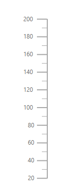
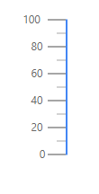
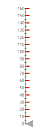
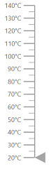
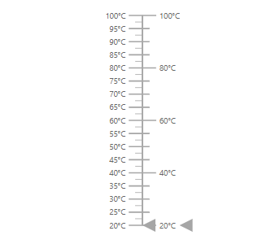

# Axes in Blazor Linear Gauge Component

An axis displays numeric values along the linear scale. The Linear Gauge component supports any number of axes. Axis sub-elements include line, ticks, labels, ranges and pointers.

## Setting the start value and end value of the axis

Set the start and end values using the [Minimum](https://help.syncfusion.com/cr/blazor/Syncfusion.Blazor.LinearGauge.LinearGaugeAxis.html#Syncfusion_Blazor_LinearGauge_LinearGaugeAxis_Minimum) and [Maximum](https://help.syncfusion.com/cr/blazor/Syncfusion.Blazor.LinearGauge.LinearGaugeAxis.html#Syncfusion_Blazor_LinearGauge_LinearGaugeAxis_Maximum) properties of [LinearGaugeAxis](https://help.syncfusion.com/cr/blazor/Syncfusion.Blazor.LinearGauge.LinearGaugeAxis.html). By default, the start value is **0** and the end value is **100**.

```cshtml

@using Syncfusion.Blazor.LinearGauge

<SfLinearGauge>
    <LinearGaugeAxes>
        <LinearGaugeAxis Minimum="20" Maximum="200">
        </LinearGaugeAxis>
    </LinearGaugeAxes>
</SfLinearGauge>

```



## Line Customization

Use the following properties of [LinearGaugeLine](https://help.syncfusion.com/cr/blazor/Syncfusion.Blazor.LinearGauge.LinearGaugeLine.html) to customize the axis line:

* [Height](https://help.syncfusion.com/cr/blazor/Syncfusion.Blazor.LinearGauge.LinearGaugeLine.html#Syncfusion_Blazor_LinearGauge_LinearGaugeLine_Height) — Sets the length of the axis line.
* [Width](https://help.syncfusion.com/cr/blazor/Syncfusion.Blazor.LinearGauge.LinearGaugeLine.html#Syncfusion_Blazor_LinearGauge_LinearGaugeLine_Width) — Sets the thickness of the axis line.
* [Color](https://help.syncfusion.com/cr/blazor/Syncfusion.Blazor.LinearGauge.LinearGaugeLine.html#Syncfusion_Blazor_LinearGauge_LinearGaugeLine_Color) — Sets the color of the axis line.
* [Offset](https://help.syncfusion.com/cr/blazor/Syncfusion.Blazor.LinearGauge.LinearGaugeLine.html#Syncfusion_Blazor_LinearGauge_LinearGaugeLine_Offset) — Renders the axis line at a specified distance from the Linear Gauge.

```cshtml

@using Syncfusion.Blazor.LinearGauge

<SfLinearGauge>
    <LinearGaugeAxes>
        <LinearGaugeAxis>
            <LinearGaugeLine Height="150" Width="2" Color="#4286f4" Offset="2">
            </LinearGaugeLine>
        </LinearGaugeAxis>
    </LinearGaugeAxes>
</SfLinearGauge>

```



## Ticks Customization

Ticks indicate intervals along the axis and are of two types: major and minor. Customize them using the properties of [LinearGaugeMajorTicks](https://help.syncfusion.com/cr/blazor/Syncfusion.Blazor.LinearGauge.LinearGaugeMajorTicks.html) and [LinearGaugeMinorTicks](https://help.syncfusion.com/cr/blazor/Syncfusion.Blazor.LinearGauge.LinearGaugeMinorTicks.html):

* [Height](https://help.syncfusion.com/cr/blazor/Syncfusion.Blazor.LinearGauge.LinearGaugeTickSettings.html#Syncfusion_Blazor_LinearGauge_LinearGaugeTickSettings_Height) — Sets the length of major and minor ticks in pixels.
* [Color](https://help.syncfusion.com/cr/blazor/Syncfusion.Blazor.LinearGauge.LinearGaugeTickSettings.html#Syncfusion_Blazor_LinearGauge_LinearGaugeTickSettings_Color) — Sets the color of major and minor ticks.
* [Width](https://help.syncfusion.com/cr/blazor/Syncfusion.Blazor.LinearGauge.LinearGaugeTickSettings.html#Syncfusion_Blazor_LinearGauge_LinearGaugeTickSettings_Width) — Sets the thickness of major and minor ticks in pixels.
* [Interval](https://help.syncfusion.com/cr/blazor/Syncfusion.Blazor.LinearGauge.LinearGaugeTickSettings.html#Syncfusion_Blazor_LinearGauge_LinearGaugeTickSettings_Interval) — Sets the interval for major and minor ticks.

```cshtml

@using Syncfusion.Blazor.LinearGauge

<SfLinearGauge>
    <LinearGaugeAxes>
        <LinearGaugeAxis Minimum=20 Maximum=140>
            <LinearGaugeMajorTicks Color="red" Interval="20" Height="20" Width="3">
            </LinearGaugeMajorTicks>
            <LinearGaugeMinorTicks Color="Orange" Interval="5" Height="10">
            </LinearGaugeMinorTicks>
            <LinearGaugePointers>
                <LinearGaugePointer></LinearGaugePointer>
            </LinearGaugePointers>
        </LinearGaugeAxis>
    </LinearGaugeAxes>
</SfLinearGauge>

```


<!-- markdownlint-disable MD036 -->
### Positioning the ticks

Position major and minor ticks using the [Offset](https://help.syncfusion.com/cr/blazor/Syncfusion.Blazor.LinearGauge.LinearGaugeTickSettings.html#Syncfusion_Blazor_LinearGauge_LinearGaugeTickSettings_Offset) and [Position](https://help.syncfusion.com/cr/blazor/Syncfusion.Blazor.LinearGauge.LinearGaugeTickSettings.html#Syncfusion_Blazor_LinearGauge_LinearGaugeTickSettings_Position) properties. [Offset](https://help.syncfusion.com/cr/blazor/Syncfusion.Blazor.LinearGauge.LinearGaugeTickSettings.html#Syncfusion_Blazor_LinearGauge_LinearGaugeTickSettings_Offset) specifies the distance from the axis (default is **0**). The [Position](https://help.syncfusion.com/cr/blazor/Syncfusion.Blazor.LinearGauge.Position.html) values are "[Inside](https://help.syncfusion.com/cr/blazor/Syncfusion.Blazor.LinearGauge.Position.html#Syncfusion_Blazor_LinearGauge_Position_Inside)", "[Outside](https://help.syncfusion.com/cr/blazor/Syncfusion.Blazor.LinearGauge.Position.html#Syncfusion_Blazor_LinearGauge_Position_Outside)", "[Cross](https://help.syncfusion.com/cr/blazor/Syncfusion.Blazor.LinearGauge.Position.html#Syncfusion_Blazor_LinearGauge_Position_Cross)" and "[Auto](https://help.syncfusion.com/cr/blazor/Syncfusion.Blazor.LinearGauge.Position.html#Syncfusion_Blazor_LinearGauge_Position_Auto)". By default, ticks are placed inside the axis.

```cshtml

@using Syncfusion.Blazor.LinearGauge

<SfLinearGauge>
    <LinearGaugeAxes>
        <LinearGaugeAxis Minimum="0" Maximum="160">
           <LinearGaugeMajorTicks Interval="10" Color="red" Height="10" Width="3"
                                  Position="Position.Outside">
           </LinearGaugeMajorTicks>
            <LinearGaugeMinorTicks Interval="5" Color="green" Height="5" Width="2"
                                   Position="Position.Cross">
            </LinearGaugeMinorTicks>
            <LinearGaugePointers>
                <LinearGaugePointer></LinearGaugePointer>
            </LinearGaugePointers>
        </LinearGaugeAxis>
    </LinearGaugeAxes>
</SfLinearGauge>

```



## Labels Customization

Customize label style using the properties of [LinearGaugeAxisLabelFont](https://help.syncfusion.com/cr/blazor/Syncfusion.Blazor.LinearGauge.LinearGaugeAxisLabelFont.html) within [LinearGaugeAxisLabelStyle](https://help.syncfusion.com/cr/blazor/Syncfusion.Blazor.LinearGauge.LinearGaugeAxisLabelStyle.html):

* [Color](https://help.syncfusion.com/cr/blazor/Syncfusion.Blazor.LinearGauge.LinearGaugeFontSettings.html#Syncfusion_Blazor_LinearGauge_LinearGaugeFontSettings_Color) — Sets the label color.
* [FontFamily](https://help.syncfusion.com/cr/blazor/Syncfusion.Blazor.LinearGauge.LinearGaugeFontSettings.html#Syncfusion_Blazor_LinearGauge_LinearGaugeFontSettings_FontFamily) — Sets the label font family.
* [FontStyle](https://help.syncfusion.com/cr/blazor/Syncfusion.Blazor.LinearGauge.LinearGaugeFontSettings.html#Syncfusion_Blazor_LinearGauge_LinearGaugeFontSettings_FontStyle) — Sets the label font style.
* [FontWeight](https://help.syncfusion.com/cr/blazor/Syncfusion.Blazor.LinearGauge.LinearGaugeFontSettings.html#Syncfusion_Blazor_LinearGauge_LinearGaugeFontSettings_FontWeight) — Sets the label font weight.
* [Opacity](https://help.syncfusion.com/cr/blazor/Syncfusion.Blazor.LinearGauge.LinearGaugeFontSettings.html#Syncfusion_Blazor_LinearGauge_LinearGaugeFontSettings_Opacity) — Sets the label opacity.
* [Size](https://help.syncfusion.com/cr/blazor/Syncfusion.Blazor.LinearGauge.LinearGaugeFontSettings.html#Syncfusion_Blazor_LinearGauge_LinearGaugeFontSettings_Size) — Sets the label font size.

```cshtml

@using Syncfusion.Blazor.LinearGauge

<SfLinearGauge>
    <LinearGaugeAxes>
        <LinearGaugeAxis>
            <LinearGaugeAxisLabelStyle>
                <LinearGaugeAxisLabelFont Color="red"></LinearGaugeAxisLabelFont>
            </LinearGaugeAxisLabelStyle>
        </LinearGaugeAxis>
    </LinearGaugeAxes>
</SfLinearGauge>

```


<!-- markdownlint-disable MD036 -->

### Positioning the axis label

Position labels using the [Offset](https://help.syncfusion.com/cr/blazor/Syncfusion.Blazor.LinearGauge.LinearGaugeAxisLabelStyle.html#Syncfusion_Blazor_LinearGauge_LinearGaugeAxisLabelStyle_Offset) and [Position](https://help.syncfusion.com/cr/blazor/Syncfusion.Blazor.LinearGauge.LinearGaugeAxisLabelStyle.html#Syncfusion_Blazor_LinearGauge_LinearGaugeAxisLabelStyle_Position) properties of [LinearGaugeAxisLabelStyle](https://help.syncfusion.com/cr/blazor/Syncfusion.Blazor.LinearGauge.LinearGaugeAxisLabelStyle.html). [Offset](https://help.syncfusion.com/cr/blazor/Syncfusion.Blazor.LinearGauge.LinearGaugeAxisLabelStyle.html#Syncfusion_Blazor_LinearGauge_LinearGaugeAxisLabelStyle_Offset) defines the distance between labels and ticks (default is **0**). [Position](https://help.syncfusion.com/cr/blazor/Syncfusion.Blazor.LinearGauge.Position.html) values are "[Inside](https://help.syncfusion.com/cr/blazor/Syncfusion.Blazor.LinearGauge.Position.html#Syncfusion_Blazor_LinearGauge_Position_Inside)", "[Outside](https://help.syncfusion.com/cr/blazor/Syncfusion.Blazor.LinearGauge.Position.html#Syncfusion_Blazor_LinearGauge_Position_Outside)", "[Cross](https://help.syncfusion.com/cr/blazor/Syncfusion.Blazor.LinearGauge.Position.html#Syncfusion_Blazor_LinearGauge_Position_Cross)" and "[Auto](https://help.syncfusion.com/cr/blazor/Syncfusion.Blazor.LinearGauge.Position.html#Syncfusion_Blazor_LinearGauge_Position_Auto)". By default, labels are placed inside the axis.

```cshtml

@using Syncfusion.Blazor.LinearGauge

<SfLinearGauge>
    <LinearGaugeAxes>
        <LinearGaugeAxis>
            <LinearGaugeAxisLabelStyle Offset="55" Position="Position.Cross">
            </LinearGaugeAxisLabelStyle>
            <LinearGaugePointers>
                <LinearGaugePointer></LinearGaugePointer>
            </LinearGaugePointers>
        </LinearGaugeAxis>
    </LinearGaugeAxes>
</SfLinearGauge>

```


<!-- markdownlint-disable MD036 -->

### Customizing the display of the last label

If the last label falls outside the visible range, it is hidden by default. To display it, set [ShowLastLabel](https://help.syncfusion.com/cr/blazor/Syncfusion.Blazor.LinearGauge.LinearGaugeAxis.html#Syncfusion_Blazor_LinearGauge_LinearGaugeAxis_ShowLastLabel) property to **true** in [LinearGaugeAxis](https://help.syncfusion.com/cr/blazor/Syncfusion.Blazor.LinearGauge.LinearGaugeAxis.html).

```cshtml

@using Syncfusion.Blazor.LinearGauge

<SfLinearGauge>
    <LinearGaugeAxes>
        <LinearGaugeAxis Minimum="0" Maximum="170" ShowLastLabel="true">
            <LinearGaugePointers>
                <LinearGaugePointer></LinearGaugePointer>
            </LinearGaugePointers>
        </LinearGaugeAxis>
    </LinearGaugeAxes>
</SfLinearGauge>

```


<!-- markdownlint-disable MD036 -->

### Label Format

Axis labels can be formatted using the [Format](https://help.syncfusion.com/cr/blazor/Syncfusion.Blazor.LinearGauge.LinearGaugeAxisLabelStyle.html#Syncfusion_Blazor_LinearGauge_LinearGaugeAxisLabelStyle_Format) property in [LinearGaugeAxisLabelStyle](https://help.syncfusion.com/cr/blazor/Syncfusion.Blazor.LinearGauge.LinearGaugeAxisLabelStyle.html). Use placeholders to render labels in a specific format or to append units, for example, **{value}°C** renders values such as 20°C.

```cshtml

@using Syncfusion.Blazor.LinearGauge

<SfLinearGauge>
    <LinearGaugeAxes>
        <LinearGaugeAxis Minimum =20 Maximum =140>
            <LinearGaugeAxisLabelStyle Format= "{value}°C">
            </LinearGaugeAxisLabelStyle>
            <LinearGaugePointers>
                <LinearGaugePointer></LinearGaugePointer>
            </LinearGaugePointers>
        </LinearGaugeAxis>
    </LinearGaugeAxes>
</SfLinearGauge>

```



### Displaying numeric format in labels

Display numeric formats such as currency and percentage using the [Format](https://help.syncfusion.com/cr/blazor/Syncfusion.Blazor.LinearGauge.SfLinearGauge.html#Syncfusion_Blazor_LinearGauge_SfLinearGauge_Format) property of [SfLinearGauge](https://help.syncfusion.com/cr/blazor/Syncfusion.Blazor.LinearGauge.SfLinearGauge.html). The following table shows commonly used formats and their results.

<!-- markdownlint-disable MD033 -->
<table>
<tr>
<td><b>Label Value</b></td>
<td><b>Label Format property value</b></td>
<td><b>Result </b></td>
<td><b>Description </b></td>
</tr>
<tr>
<td>1000</td>
<td>n1</td>
<td>1000.0</td>
<td>The number is rounded to 1 decimal place.</td>
</tr>
<tr>
<td>1000</td>
<td>n2</td>
<td>1000.00</td>
<td>The number is rounded to 2 decimal places.</td>
</tr>
<tr>
<td>1000</td>
<td>n3</td>
<td>1000.000</td>
<td>The number is rounded to 3 decimal places.</td>
</tr>
<tr>
<td>0.01</td>
<td>p1</td>
<td>1.0%</td>
<td>The number is converted to percentage with 1 decimal place.</td>
</tr>
<tr>
<td>0.01</td>
<td>p2</td>
<td>1.00%</td>
<td>The number is converted to percentage with 2 decimal places.</td>
</tr>
<tr>
<td>0.01</td>
<td>p3</td>
<td>1.000%</td>
<td>The number is converted to percentage with 3 decimal places.</td>
</tr>
<tr>
<td>1000</td>
<td>c1</td>
<td>$1,000.0</td>
<td>The currency symbol is appended to number and number is rounded to 1 decimal place.</td>
</tr>
<tr>
<td>1000</td>
<td>c2</td>
<td>$1,000.00</td>
<td>The currency symbol is appended to number and number is rounded to 2 decimal places.</td>
</tr>
</table>

<!-- markdownlint-disable MD036 -->

```cshtml

@using Syncfusion.Blazor.LinearGauge

<SfLinearGauge Format="c">
    <LinearGaugeAxes>
        <LinearGaugeAxis>
        </LinearGaugeAxis>
    </LinearGaugeAxes>
</SfLinearGauge>

```


## Orientation

By default, the Linear Gauge renders vertically. To change the orientation, set the [Orientation](https://help.syncfusion.com/cr/blazor/Syncfusion.Blazor.LinearGauge.SfLinearGauge.html#Syncfusion_Blazor_LinearGauge_SfLinearGauge_Orientation) property to **Horizontal**.

```cshtml

@using Syncfusion.Blazor.LinearGauge

<SfLinearGauge Orientation="Orientation.Horizontal">
    <LinearGaugeAxes>
        <LinearGaugeAxis Minimum="20" Maximum="140">
            <LinearGaugeMajorTicks Interval="10"></LinearGaugeMajorTicks>
        </LinearGaugeAxis>
    </LinearGaugeAxes>
</SfLinearGauge>

```


## Inverted Axis

Invert the axis by setting [IsInversed](https://help.syncfusion.com/cr/blazor/Syncfusion.Blazor.LinearGauge.LinearGaugeAxis.html#Syncfusion_Blazor_LinearGauge_LinearGaugeAxis_IsInversed) to **true** in [LinearGaugeAxis](https://help.syncfusion.com/cr/blazor/Syncfusion.Blazor.LinearGauge.LinearGaugeAxis.html).

```cshtml

@using Syncfusion.Blazor.LinearGauge

<SfLinearGauge>
    <LinearGaugeAxes>
        <LinearGaugeAxis IsInversed="true">
            <LinearGaugePointers>
                <LinearGaugePointer></LinearGaugePointer>
            </LinearGaugePointers>
        </LinearGaugeAxis>
    </LinearGaugeAxes>
</SfLinearGauge>

```


## Opposed Axis

Place an axis on the opposite side by setting [OpposedPosition](https://help.syncfusion.com/cr/blazor/Syncfusion.Blazor.LinearGauge.LinearGaugeAxis.html#Syncfusion_Blazor_LinearGauge_LinearGaugeAxis_OpposedPosition) property to **true** in [LinearGaugeAxis](https://help.syncfusion.com/cr/blazor/Syncfusion.Blazor.LinearGauge.LinearGaugeAxis.html).

```cshtml

@using Syncfusion.Blazor.LinearGauge

<SfLinearGauge>
    <LinearGaugeAxes>
        <LinearGaugeAxis OpposedPosition="true">
            <LinearGaugePointers>
                <LinearGaugePointer></LinearGaugePointer>
            </LinearGaugePointers>
        </LinearGaugeAxis>
    </LinearGaugeAxes>
</SfLinearGauge>

```


## Multiple Axes

Add multiple axes by including multiple [LinearGaugeAxis](https://help.syncfusion.com/cr/blazor/Syncfusion.Blazor.LinearGauge.LinearGaugeAxis.html) instances within [LinearGaugeAxes](https://help.syncfusion.com/cr/blazor/Syncfusion.Blazor.LinearGauge.LinearGaugeAxes.html). Each axis can be customized independently.

```cshtml

@using Syncfusion.Blazor.LinearGauge

<SfLinearGauge>
    <LinearGaugeAxes>
        <LinearGaugeAxis Minimum=20 Maximum=100>
            <LinearGaugeAxisLabelStyle Format="{value}°C">
            </LinearGaugeAxisLabelStyle>
            <LinearGaugePointers>
                <LinearGaugePointer PointerValue=20></LinearGaugePointer>
            </LinearGaugePointers>
        </LinearGaugeAxis>
        <LinearGaugeAxis Minimum=20 Maximum=100 OpposedPosition=true>
            <LinearGaugeMajorTicks Interval="20" Height="20">
            </LinearGaugeMajorTicks>
            <LinearGaugeMinorTicks Interval="5" Height="10">
            </LinearGaugeMinorTicks>
            <LinearGaugeAxisLabelStyle Format="{value}°C">
            </LinearGaugeAxisLabelStyle>
            <LinearGaugePointers>
                <LinearGaugePointer PointerValue=20></LinearGaugePointer>
            </LinearGaugePointers>
        </LinearGaugeAxis>
    </LinearGaugeAxes>
</SfLinearGauge>

```


