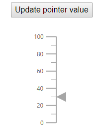

# Events

## Using events in Linear Gauge component

In the following example, the event ValueChange binds to the linear gauge component, so the event handler UpdatePointerValue will be called when you drag the pointer and update the pointer value in the div element.

```csharp
@using Syncfusion.Blazor.LinearGauge

<div style="width:250px">
    <div style="text-align: center">@pointerValue</div>
    <SfLinearGauge Height="250px">
        <LinearGaugeEvents ValueChange="@UpdatePointerValue"></LinearGaugeEvents>
        <LinearGaugeAxes>
            <LinearGaugeAxis>
                <LinearGaugePointers>
                    <LinearGaugePointer EnableDrag="true" Value="10"></LinearGaugePointer>
                </LinearGaugePointers>
            </LinearGaugeAxis>
        </LinearGaugeAxes>
    </SfLinearGauge>
</div>

@code {
    private double pointerValue = 10;
    void UpdatePointerValue(IValueChangeEventArgs args)
    {
        pointerValue = args.Value;
    }
}
```



## Available events

### AnimationCompleted

Description: Triggers, after animation is completed.

|   Argument name      |   Description                         |
|----------------------| --------------------------------------|
|   Pointer            |   Specifies the pointer instance |
|   Name               |   Specifies the name of the event |
|   Cancel             |   Specifies the event cancel status |

### AnnotationRendering

Description: Triggers, before rendering on each annotation. You can customize annotations using
these arguments.

|   Argument name      |   Description                         |
|----------------------| --------------------------------------|
|   Annotation         |   Specifies the annotation instance |
|   Content            |   Specifies the annotation content     |
|   TextStyle          |   To customize the text style          |
|   Name               |   Specifies the name of the event |
|   Cancel             |   Specifies the event cancel status |

### Loaded

Description: Triggers, after the gauge component has been loaded.

### OnGaugeMouseDown

Description: Triggers, when you click the mouse on the gauge.

|   Argument name      |   Description                         |
|----------------------| --------------------------------------|
|   Target             |   Defines current mouse event target id   |
|   X                  |   Defines the current mouse x location    |
|   Y                  |   Defines the current mouse y location    |
|   Name               |   Specifies the name of the event |
|   Cancel             |   Specifies the event cancel status |

### OnGaugeMouseLeave

Description: Triggers, when the mouse pointer is moved out of the gauge.

### OnGaugeMouseMove

Description: Triggers on cursor moving on the gauge.

|   Argument name      |   Description                         |
|----------------------| --------------------------------------|
|   Target             |   Defines current mouse event target id    |
|   X                  |   Define the gauge x value            |
|   Y                  |   Define the gauge Y value            |
|   Name               |   Specifies the name of the event |
|   Cancel             |   Specifies the event cancel status |

### OnGaugeMouseUp

Description: Triggers, when you releasing a mouse on the gauge.

|   Argument name      |   Description                         |
|----------------------| --------------------------------------|
|   Target             |   Defines current mouse event target id    |
|   X                  |   Define the current mouse x location      |
|   Y                  |   Define the current mouse y location      |
|   Name               |   Specifies the name of the event |
|   Cancel             |   Specifies the event cancel status |

### OnLoad

Description: Triggers, before rendering the gauge. Gauge will trigger this event first.

### Resizing

Description: Triggers, when you resize the gauges.

|   Argument name      |   Description                          |
|----------------------| ---------------------------------------|
|   CurrentSize        |   Define the current size of the gauge  |
|   PreviousSize       |   Define the previous size of the gauge    |
|   Name               |   Specifies the name of the event |
|   Cancel             |   Specifies the event cancel status |