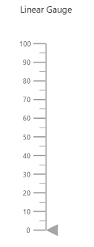

# Getting Started in Blazor Linear Gauge

This section briefly explains how to include a Linear Gauge component in your Blazor server-side application. You can refer to our [Getting Started with Syncfusion Blazor for server-side in Visual Studio 2019](https://blazor.syncfusion.com/documentation/getting-started/blazor-server-side-visual-studio-2019/) page for introduction and configuring common specifications.

## Importing Syncfusion Blazor Linear Gauge component in the application

1. Install **Syncfusion.Blazor.LinearGauge** NuGet package in the application using the **NuGet Package Manager**.

2. You can add the client-side resources through CDN or local npm package in the `<head>` element of the **~/Pages/_Host.cshtml** page.

```html
    <head>
        <link href="_content/Syncfusion.Blazor.Themes/bootstrap4.css" rel="stylesheet" />
        <!---CDN--->
        @*<link href="https://cdn.syncfusion.com/blazor/{:version:}/styles/bootstrap4.css" rel="stylesheet" />*@
    </head>
```

> For Internet Explorer 11, kindly refer the polyfills. Refer the [documentation](https://blazor.syncfusion.com/documentation/common/how-to/render-blazor-server-app-in-ie/) for more information.

 ```html
    <head>
        <link href="https://cdn.syncfusion.com/blazor/{:version:}/styles/bootstrap4.css" rel="stylesheet" />
        <script src="https://github.com/Daddoon/Blazor.Polyfill/releases/download/3.0.1/blazor.polyfill.min.js"></script>
    </head>
```

## Adding component package to the application

Open the **~/_Imports.razor** file and include the **Syncfusion.Blazor.LinearGauge** namespace.

```csharp
@using Syncfusion.Blazor.LinearGauge
```

## Adding SyncfusionBlazor Service in Startup.cs

Open the **Startup.cs** file and add services required by Syncfusion components using **services.AddSyncfusionBlazor()** method. Add this method in the **ConfigureServices** function as follows.

```csharp
using Syncfusion.Blazor;

namespace BlazorApplication
{
    public class Startup
    {
        ....
        ....
        public void ConfigureServices(IServiceColloection services)
        {
            ....
            ....
            services.AddSyncfusionBlazor();
        }
    }
}
```

> To enable custom client-side source loading from CRG or CDN, please refer to the section about [custom resources in Blazor application](https://blazor.syncfusion.com/documentation/common/custom-resource-generator/#how-to-use-custom-resources-in-the-blazor-application).

## Adding Linear Gauge component

The Syncfusion Linear Gauge component can be initialized in any razor page inside the **~/Pages** folder. For example, the Linear Gauge component is added to the **~/Pages/Index.razor** page. In a new application, if **Index.razor** page has any default content template, then those content can be completely removed and following code can be added.

```csharp
@page "/"

<SfLinearGauge>
    <LinearGaugeAxes>
        <LinearGaugeAxis>
            <LinearGaugePointers>
                <LinearGaugePointer></LinearGaugePointer>
            </LinearGaugePointers>
        </LinearGaugeAxis>
    </LinearGaugeAxes>
</SfLinearGauge>
```

On successful compilation of your application, the Syncfusion Blazor Linear Gauge component will render in the web browser as shown below.


## Set pointer value

Pointers are used to indicate values on an axis. You can change the pointer value using the [`PointerValue`](https://help.syncfusion.com/cr/blazor/Syncfusion.Blazor.LinearGauge.LinearGaugePointer.html#Syncfusion_Blazor_LinearGauge_LinearGaugePointer_PointerValue) property in the [`LinearGaugePointer`](https://help.syncfusion.com/cr/blazor/Syncfusion.Blazor.LinearGauge.LinearGaugePointer.html).

> In Linear Gauge, you can configure multiple axes. On each axis, you can add a pointer.

```csharp
@using Syncfusion.Blazor.LinearGauge

<SfLinearGauge>
    <LinearGaugeAxes>
        <LinearGaugeAxis>
            <LinearGaugePointers>
                <LinearGaugePointer PointerValue="40">
                </LinearGaugePointer>
            </LinearGaugePointers>
        </LinearGaugeAxis>
    </LinearGaugeAxes>
</SfLinearGauge>
```


## Adding title for Linear Gauge

Title can be added to the linear gauge to provide a quick information to the users about the context of the rendered linear gauge. You can add title to the linear gauge using [`Title`](https://help.syncfusion.com/cr/blazor/Syncfusion.Blazor.LinearGauge.SfLinearGauge.html#Syncfusion_Blazor_LinearGauge_SfLinearGauge_Title) property in [`SfLinearGauge`](https://help.syncfusion.com/cr/blazor/Syncfusion.Blazor.LinearGauge.SfLinearGauge.html).

```csharp
<SfLinearGauge Title="Linear Gauge">
    <LinearGaugeAxes>
        <LinearGaugeAxis>
            <LinearGaugePointers>
                <LinearGaugePointer></LinearGaugePointer>
            </LinearGaugePointers>
        </LinearGaugeAxis>
    </LinearGaugeAxes>
</SfLinearGauge>
```



## Adding ranges in the Linear Gauge

Range is used to specify a group of scale values in the gauge. We can set the range start and end using [`Start`](https://help.syncfusion.com/cr/blazor/Syncfusion.Blazor.LinearGauge.LinearGaugeRange.html#Syncfusion_Blazor_LinearGauge_LinearGaugeRange_Start) and [`End`](https://help.syncfusion.com/cr/blazor/Syncfusion.Blazor.LinearGauge.LinearGaugeRange.html#Syncfusion_Blazor_LinearGauge_LinearGaugeRange_End) properties in the [`LinearGaugeRange`](https://help.syncfusion.com/cr/blazor/Syncfusion.Blazor.LinearGauge.LinearGaugeRange.html). You can add any number of ranges for an axis using [`LinearGaugeRange`](https://help.syncfusion.com/cr/blazor/Syncfusion.Blazor.LinearGauge.LinearGaugeRange.html).

```csharp
<SfLinearGauge>
    <LinearGaugeAxes>
        <LinearGaugeAxis Minimum="0" Maximum="200">
            <LinearGaugeAxisLabelStyle Format="{value}°C"></LinearGaugeAxisLabelStyle>
            <LinearGaugePointers>
                <LinearGaugePointer PointerValue="140">
                </LinearGaugePointer>
            </LinearGaugePointers>
            <LinearGaugeRanges>
                <LinearGaugeRange Start="0" End="80" Color="#ff5985"></LinearGaugeRange>
                <LinearGaugeRange Start="80" End="120" Color="#ffb133"></LinearGaugeRange>
                <LinearGaugeRange Start="120" End="140" Color="#fcde0b"></LinearGaugeRange>
                <LinearGaugeRange Start="140" End="200" Color="#27d5ff"></LinearGaugeRange>
            </LinearGaugeRanges>
        </LinearGaugeAxis>
    </LinearGaugeAxes>
</SfLinearGauge>
```


## See also

* [Getting Started with Syncfusion Blazor for Client-Side in .NET Core CLI](https://blazor.syncfusion.com/documentation/getting-started/dotnet-cli-blazor/)

* [Getting Started with Syncfusion Blazor for Server-Side in Visual Studio 2019](https://blazor.syncfusion.com/documentation/getting-started/blazor-server-side-visual-studio-2019/)

* [Getting Started with Syncfusion Blazor for Server-Side in .NET Core CLI](https://blazor.syncfusion.com/documentation/getting-started/dotnet-cli-blazor-server/)
