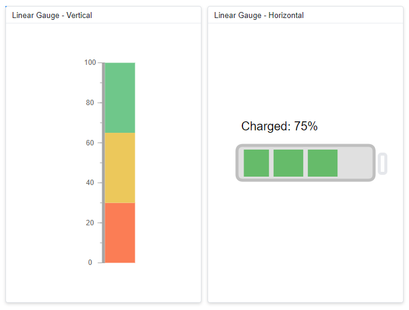
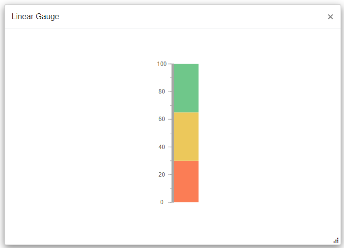
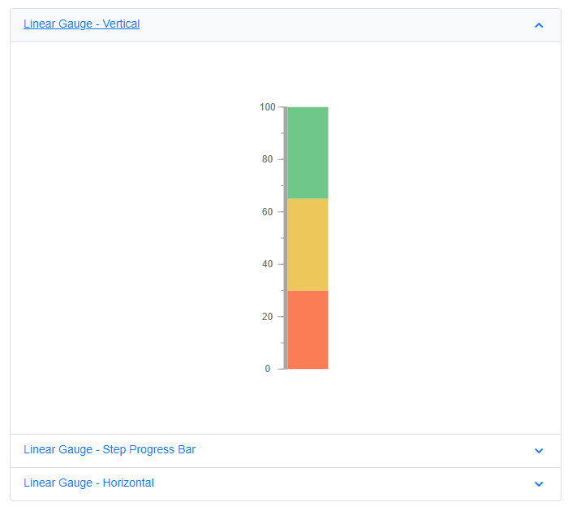

# Render Linear Gauge component inside other components

The Linear Gauge can be rendered within components such as the Dashboard Layout, Tabs, Dialog, and others. In general, the Linear Gauge component renders before other components, so a boolean variable ((i.e. boolean flag) is used to determine when to begin rendering the Linear Gauge component.

## Linear Gauge component inside Dashboard Layout

When the Linear Gauge component renders within a panel of the Dashboard Layout component, its rendering begins concurrently with the Dashboard Layout component's rendering. As a result, the size of the Linear Gauge component will not be proper. To properly render the Linear Gauge component, a boolean variable (i.e. **IsInitialRender**) must be created and it is used to determine the Linear Gauge component's rendering. The boolean variable is set to **false** by default, so the Linear Gauge component will not be rendered initially. When the Dashboard Layout component is rendered, its [Created](https://help.syncfusion.com/cr/blazor/Syncfusion.Blazor.Layouts.DashboardLayoutEvents.html#Syncfusion_Blazor_Layouts_DashboardLayoutEvents_Created) event is fired, and the boolean variable (i.e. **IsInitialRender**) in this event must be changed to **true** to initiate the render of the Linear Gauge component.

When you drag and resize the Dashboard Layout's panel, the Linear Gauge component is not notified, so the Linear Gauge is not properly rendered within the panel. To avoid this scenario, the Linear Gauge component's [RefreshAsync](https://help.syncfusion.com/cr/blazor/Syncfusion.Blazor.LinearGauge.SfLinearGauge.html#Syncfusion_Blazor_LinearGauge_SfLinearGauge_RefreshAsync) method must be called in the Dashboard Layout's [Resizing](https://help.syncfusion.com/cr/blazor/Syncfusion.Blazor.Layouts.DashboardLayoutEvents.html#Syncfusion_Blazor_Layouts_DashboardLayoutEvents_Resizing) and [OnResizeStop](https://help.syncfusion.com/cr/blazor/Syncfusion.Blazor.Layouts.DashboardLayoutEvents.html#Syncfusion_Blazor_Layouts_DashboardLayoutEvents_OnResizeStop) events. Because the panel size of the Dashboard Layout is determined after a delay, a 100 millisecond delay must be provided before refreshing the Linear Gauge component.

On window resizing, the Linear Gauge component is not notified, so the Linear Gauge is not properly rendered within the panel. To avoid this scenario, the Dashboard Layout component's [RefreshAsync](https://help.syncfusion.com/cr/blazor/Syncfusion.Blazor.Layouts.SfDashboardLayout.html#Syncfusion_Blazor_Layouts_SfDashboardLayout_RefreshAsync) and  the Linear Gauge component's [RefreshAsync](https://help.syncfusion.com/cr/blazor/Syncfusion.Blazor.LinearGauge.SfLinearGauge.html#Syncfusion_Blazor_LinearGauge_SfLinearGauge_RefreshAsync) method must be called in the Dashboard Layout's [OnWindowResize](https://help.syncfusion.com/cr/blazor/Syncfusion.Blazor.Layouts.DashboardLayoutEvents.html#Syncfusion_Blazor_Layouts_DashboardLayoutEvents_OnWindowResize) events.

```cshtml

@using Syncfusion.Blazor.LinearGauge
@using Syncfusion.Blazor.Layouts

<SfDashboardLayout ID="DashBoard" @ref="DashboardLayout" AllowResizing="true" AllowFloating="true" CellSpacing="@CellSpacing" Columns="20">
<DashboardLayoutEvents Created="Created" OnResizeStop="@ResizingHandler" OnWindowResize="@ResizingWindow" Resizing="ResizingHandler"></DashboardLayoutEvents>
    <DashboardLayoutPanels>
        <DashboardLayoutPanel Id="LayoutOne" Row="0" Col="5" SizeX="5" SizeY="7">
            <HeaderTemplate><div> Linear Gauge - Vertical</div></HeaderTemplate>
            <ContentTemplate>
                @if (IsInitialRender)
                {
                     <SfLinearGauge ID="GaugeOne" @ref="GaugeOne" Orientation="@GaugeOrientation" Height="100%" Background="transparent">
                           <LinearGaugeTitleStyle FontWeight="499" FontFamily="inherit" />
                           <LinearGaugeAxes>
                               <LinearGaugeAxis Minimum="0" Maximum="100" OpposedPosition="true">
                                   <LinearGaugeLine Width="5" />
                                   <LinearGaugeMajorTicks Interval="20" Height="7" Width="1" Position="Position.Outside" />
                                   <LinearGaugeMinorTicks Color="#9e9e9e" Interval="10" Height="3" Position="Position.Outside" />
                                   <LinearGaugeAxisLabelStyle Position="Position.Outside">
                                       <LinearGaugeAxisLabelFont FontFamily="inherit" />
                                   </LinearGaugeAxisLabelStyle>
                                   <LinearGaugeRanges>
                                       <LinearGaugeRange Start="0" End="30" StartWidth="50" EndWidth="50" Color="#FB7D55" Offset="5" />
                                       <LinearGaugeRange Start="30" End="65" StartWidth="50" EndWidth="50" Color="#ECC85B" Offset="5" />
                                       <LinearGaugeRange Start="65" End="100" StartWidth="50" EndWidth="50" Color="#6FC78A" Offset="5" />
                                   </LinearGaugeRanges>
                                   <LinearGaugePointers>
                                       <LinearGaugePointer Width="0" />
                                   </LinearGaugePointers>
                               </LinearGaugeAxis>
                           </LinearGaugeAxes>
                     </SfLinearGauge> 
                }
            </ContentTemplate>
        </DashboardLayoutPanel> 
        <DashboardLayoutPanel Id="LayoutTwo" Row="1" Col="5" SizeX="5" SizeY="7">
            <HeaderTemplate><div>  Linear Gauge - Step Progress Bar </div></HeaderTemplate>
            <ContentTemplate>
                @if (IsInitialRender)
                {
                     <SfLinearGauge ID="GaugeTwo" @ref="GaugeTwo" Height="100%"  Orientation="@GaugeOrientation"  Background="transparent">
                        <LinearGaugeTitleStyle FontWeight="499" FontFamily="inherit"></LinearGaugeTitleStyle>
                            <LinearGaugeAxes>
                                <LinearGaugeAxis Minimum="5" Maximum="20" OpposedPosition="true">
                                    <LinearGaugeLine Width="5" />
                                    <LinearGaugeMajorTicks Interval="5" Height="0" />
                                    <LinearGaugeMinorTicks Interval="2.5" Height="0" />
                                    <LinearGaugeAxisLabelStyle Offset="10">
                                        <LinearGaugeAxisLabelFont FontFamily="inherit"></LinearGaugeAxisLabelFont>
                                    </LinearGaugeAxisLabelStyle>
                                    <LinearGaugePointers>
                                        <LinearGaugePointer PointerValue="5" Height="15" Width="15" Color="#0DC9AB" Placement="Syncfusion.Blazor.LinearGauge.Placement.Near" MarkerType="MarkerType.Circle" Offset="7" />
                                        <LinearGaugePointer PointerValue="10" Height="15" Width="15" Color="#0DC9AB" Placement="Syncfusion.Blazor.LinearGauge.Placement.Near" MarkerType="MarkerType.Circle" Offset="7" />
                                        <LinearGaugePointer PointerValue="15" Height="15" Width="15" Color="#0DC9AB" Placement="Syncfusion.Blazor.LinearGauge.Placement.Near" MarkerType="MarkerType.Circle" Offset="7" />
                                        <LinearGaugePointer PointerValue="20" Height="15" Width="15" Color="@DeliveredPointerColor" Placement="Syncfusion.Blazor.LinearGauge.Placement.Near" MarkerType="MarkerType.Circle" Offset="7" />
                                    </LinearGaugePointers>
                                    <LinearGaugeRanges>
                                        <LinearGaugeRange Start="5" End="10" StartWidth="5" EndWidth="5" Color="#0DC9AB" />
                                        <LinearGaugeRange Start="10" End="15" StartWidth="5" EndWidth="5" Color="#0DC9AB" />
                                        <LinearGaugeRange Start="15" End="20" StartWidth="5" EndWidth="5" Color="@DeliveredPointerColor" />
                                    </LinearGaugeRanges>
                                </LinearGaugeAxis>
                            </LinearGaugeAxes>
                    </SfLinearGauge>
                }
            </ContentTemplate>
        </DashboardLayoutPanel>
        <DashboardLayoutPanel Id="LayoutThree" Row="2" Col="5" SizeX="5" SizeY="7">
            <HeaderTemplate><div> Linear Gauge - Horizontal </div></HeaderTemplate>
            <ContentTemplate>
                @if (IsInitialRender)
                {
                    <SfLinearGauge ID="GaugeThree" @ref="GaugeThree" Orientation="Syncfusion.Blazor.LinearGauge.Orientation.Horizontal" Height="100%" Background="transparent">
                            <LinearGaugeContainer Width="58" Type="ContainerType.RoundedRectangle">
                            <LinearGaugeContainerBorder Width="5"></LinearGaugeContainerBorder>
                            <LinearGaugeAxes>
                                <LinearGaugeAxis Minimum="0" Maximum="60">
                                    <LinearGaugeLine Width="0" />
                                    <LinearGaugeMajorTicks Interval="15" Height="0" />
                                    <LinearGaugeMinorTicks Interval="5" Height="0" />
                                    <LinearGaugeAxisLabelStyle>
                                        <LinearGaugeAxisLabelFont Size="0"></LinearGaugeAxisLabelFont>
                                    </LinearGaugeAxisLabelStyle>
                                    <LinearGaugePointers>
                                        <LinearGaugePointer Width="0" />
                                    </LinearGaugePointers>
                                    <LinearGaugeRanges>
                                        <LinearGaugeRange Start="3" End="14" StartWidth="45" EndWidth="45" Color="#66BB6A" Offset="52" />
                                        <LinearGaugeRange Start="16" End="29" StartWidth="45" EndWidth="45" Color="#66BB6A" Offset="52" />
                                        <LinearGaugeRange Start="31" End="44" StartWidth="45" EndWidth="45" Color="#66BB6A" Offset="52" />
                                    </LinearGaugeRanges>
                                    <LinearGaugeAnnotations>
                                        <LinearGaugeAnnotation AxisIndex="0" AxisValue="60" X="0" Y="0" ZIndex="1">
                                            <ContentTemplate>
                                                <div style="width: 16px;height: 37px;border: 5px solid @BorderColor;margin-left: 6px;margin-top: 12px;border-radius: 6px;" />
                                            </ContentTemplate>
                                        </LinearGaugeAnnotation>
                                        <LinearGaugeAnnotation AxisIndex="0" AxisValue="0" X="0" Y="0" ZIndex="1">
                                            <ContentTemplate>
                                                <div style="width: 134px;font-size: 20px;margin-top: -47px;margin-left: 7px;color: @TextColor;">Charged: 75%</div>
                                            </ContentTemplate>
                                        </LinearGaugeAnnotation>
                                    </LinearGaugeAnnotations>
                                </LinearGaugeAxis>
                            </LinearGaugeAxes>
                            </LinearGaugeContainer>
                        </SfLinearGauge> 
                }
            </ContentTemplate>
        </DashboardLayoutPanel>
    </DashboardLayoutPanels>
</SfDashboardLayout>

@code {
    SfLinearGauge GaugeOne;
    SfLinearGauge GaugeTwo;
    SfLinearGauge GaugeThree;
    SfDashboardLayout DashboardLayout;

    public double[] CellSpacing = { 10, 10 };
    public string BorderColor = "#E5E7EB";
    public string TextColor = "#000000";
    public Syncfusion.Blazor.LinearGauge.Orientation GaugeOrientation = Syncfusion.Blazor.LinearGauge.Orientation.Vertical;
    public string DeliveredPointerColor = "#E5E7EB";

    public bool IsInitialRender { get; set; }


    public async void Created(Object args)
    {
        IsInitialRender = true;
    }

    public async Task ResizingWindow(ResizeArgs args)
    {
        await DashboardLayout.RefreshAsync();
        await GaugeOne.RefreshAsync();
        await GaugeTwo.RefreshAsync();
        await GaugeThree.RefreshAsync();
    }

    public async Task ResizingHandler(ResizeArgs args)
    {
        if (args.Id == "LayoutOne")
        {
            await Task.Delay(100);
            await GaugeOne.RefreshAsync();
        } else if (args.Id == "LayoutTwo")
        {
            await Task.Delay(100);
            await GaugeTwo.RefreshAsync();
        } else if (args.Id == "LayoutThree")
        {
            await Task.Delay(100);
            await GaugeThree.RefreshAsync();
        }
    }
}

```


## Linear Gauge component inside Tab

When the Linear Gauge component renders within the Tab component, its rendering begins concurrently with the Tab component's rendering. As a result, the size of the Linear Gauge component will not be proper. To properly render the Linear Gauge component, a boolean variable (i.e. **IsInitialRender**) must be created and it is used to determine the Linear Gauge component's rendering. The boolean variable is set to **false** by default, so the Linear Gauge component will not be rendered initially. When the Tab component is rendered, its [Created](https://help.syncfusion.com/cr/blazor/Syncfusion.Blazor.Navigations.TabEvents.html#Syncfusion_Blazor_Navigations_TabEvents_Created) event is fired, and the boolean variable (i.e. **IsInitialRender**) in this event must be changed to **true** to initiate the render of the Linear Gauge component.

```cshtml

@using Syncfusion.Blazor.Navigations
@using Syncfusion.Blazor.LinearGauge
@using Syncfusion.Blazor.Inputs

    <SfTab CssClass="default-tab">
        <TabEvents Created="Created"></TabEvents>
        <TabItems>
            <TabItem>
                <ChildContent>
                    <TabHeader Text="Linear Gauge - Vertical"></TabHeader>
                </ChildContent>
                <ContentTemplate>
                 @if (IsInitialRender)
                 {
                        <SfLinearGauge ID="GaugeOne" @ref="GaugeOne" Orientation="@GaugeOrientation" Width="100%" Background="transparent">
                           <LinearGaugeTitleStyle FontWeight="499" FontFamily="inherit" />
                           <LinearGaugeAxes>
                               <LinearGaugeAxis Minimum="0" Maximum="100" OpposedPosition="true">
                                   <LinearGaugeLine Width="5" />
                                   <LinearGaugeMajorTicks Interval="20" Height="7" Width="1" Position="Position.Outside" />
                                   <LinearGaugeMinorTicks Color="#9e9e9e" Interval="10" Height="3" Position="Position.Outside" />
                                   <LinearGaugeAxisLabelStyle Position="Position.Outside">
                                       <LinearGaugeAxisLabelFont FontFamily="inherit" />
                                   </LinearGaugeAxisLabelStyle>
                                   <LinearGaugeRanges>
                                       <LinearGaugeRange Start="0" End="30" StartWidth="50" EndWidth="50" Color="#FB7D55" Offset="5" />
                                       <LinearGaugeRange Start="30" End="65" StartWidth="50" EndWidth="50" Color="#ECC85B" Offset="5" />
                                       <LinearGaugeRange Start="65" End="100" StartWidth="50" EndWidth="50" Color="#6FC78A" Offset="5" />
                                   </LinearGaugeRanges>
                                   <LinearGaugePointers>
                                       <LinearGaugePointer Width="0" />
                                   </LinearGaugePointers>
                               </LinearGaugeAxis>
                           </LinearGaugeAxes>
                     </SfLinearGauge> 
                 }   
                 </ContentTemplate>
            </TabItem>
            <TabItem>
                <ChildContent>
                    <TabHeader Text="Linear Gauge - Step Progress Bar"></TabHeader>
                </ChildContent>
                 <ContentTemplate>
                 @if (IsInitialRender)
                 {
                         <SfLinearGauge ID="GaugeTwo" @ref="GaugeTwo" Width="100%"  Orientation="@GaugeOrientation"  Background="transparent">
                            <LinearGaugeTitleStyle FontWeight="499" FontFamily="inherit"></LinearGaugeTitleStyle>
                            <LinearGaugeAxes>
                                <LinearGaugeAxis Minimum="5" Maximum="20" OpposedPosition="true">
                                    <LinearGaugeLine Width="5" />
                                    <LinearGaugeMajorTicks Interval="5" Height="0" />
                                    <LinearGaugeMinorTicks Interval="2.5" Height="0" />
                                    <LinearGaugeAxisLabelStyle Offset="10">
                                        <LinearGaugeAxisLabelFont FontFamily="inherit"></LinearGaugeAxisLabelFont>
                                    </LinearGaugeAxisLabelStyle>
                                    <LinearGaugePointers>
                                        <LinearGaugePointer PointerValue="5" Height="15" Width="15" Color="#0DC9AB" Placement="Syncfusion.Blazor.LinearGauge.Placement.Near" MarkerType="MarkerType.Circle" Offset="7" />
                                        <LinearGaugePointer PointerValue="10" Height="15" Width="15" Color="#0DC9AB" Placement="Syncfusion.Blazor.LinearGauge.Placement.Near" MarkerType="MarkerType.Circle" Offset="7" />
                                        <LinearGaugePointer PointerValue="15" Height="15" Width="15" Color="#0DC9AB" Placement="Syncfusion.Blazor.LinearGauge.Placement.Near" MarkerType="MarkerType.Circle" Offset="7" />
                                        <LinearGaugePointer PointerValue="20" Height="15" Width="15" Color="@DeliveredPointerColor" Placement="Syncfusion.Blazor.LinearGauge.Placement.Near" MarkerType="MarkerType.Circle" Offset="7" />
                                    </LinearGaugePointers>
                                    <LinearGaugeRanges>
                                        <LinearGaugeRange Start="5" End="10" StartWidth="5" EndWidth="5" Color="#0DC9AB" />
                                        <LinearGaugeRange Start="10" End="15" StartWidth="5" EndWidth="5" Color="#0DC9AB" />
                                        <LinearGaugeRange Start="15" End="20" StartWidth="5" EndWidth="5" Color="@DeliveredPointerColor" />
                                    </LinearGaugeRanges>
                                </LinearGaugeAxis>
                            </LinearGaugeAxes>
                        </SfLinearGauge>
                 }   
                 </ContentTemplate>
            </TabItem>
            <TabItem>
                <ChildContent>
                    <TabHeader Text="Linear Gauge - Horizontal"></TabHeader>
                </ChildContent>
                 <ContentTemplate>
                 @if (IsInitialRender)
                 {
                     <SfLinearGauge ID="GaugeThree" @ref="GaugeThree" Orientation="Syncfusion.Blazor.LinearGauge.Orientation.Horizontal" Height="100%" Background="transparent">
                            <LinearGaugeContainer Width="58" Type="ContainerType.RoundedRectangle">
                            <LinearGaugeContainerBorder Width="5"></LinearGaugeContainerBorder>
                            <LinearGaugeAxes>
                                <LinearGaugeAxis Minimum="0" Maximum="60">
                                    <LinearGaugeLine Width="0" />
                                    <LinearGaugeMajorTicks Interval="15" Height="0" />
                                    <LinearGaugeMinorTicks Interval="5" Height="0" />
                                    <LinearGaugeAxisLabelStyle>
                                        <LinearGaugeAxisLabelFont Size="0"></LinearGaugeAxisLabelFont>
                                    </LinearGaugeAxisLabelStyle>
                                    <LinearGaugePointers>
                                        <LinearGaugePointer Width="0" />
                                    </LinearGaugePointers>
                                    <LinearGaugeRanges>
                                        <LinearGaugeRange Start="3" End="14" StartWidth="45" EndWidth="45" Color="#66BB6A" Offset="52" />
                                        <LinearGaugeRange Start="16" End="29" StartWidth="45" EndWidth="45" Color="#66BB6A" Offset="52" />
                                        <LinearGaugeRange Start="31" End="44" StartWidth="45" EndWidth="45" Color="#66BB6A" Offset="52" />
                                    </LinearGaugeRanges>
                                    <LinearGaugeAnnotations>
                                        <LinearGaugeAnnotation AxisIndex="0" AxisValue="60" X="0" Y="0" ZIndex="1">
                                            <ContentTemplate>
                                                <div style="width: 16px;height: 37px;border: 5px solid @BorderColor;margin-left: 6px;margin-top: 12px;border-radius: 6px;" />
                                            </ContentTemplate>
                                        </LinearGaugeAnnotation>
                                        <LinearGaugeAnnotation AxisIndex="0" AxisValue="0" X="0" Y="0" ZIndex="1">
                                            <ContentTemplate>
                                                <div style="width: 134px;font-size: 20px;margin-top: -47px;margin-left: 7px;color: @TextColor;">Charged: 75%</div>
                                            </ContentTemplate>
                                        </LinearGaugeAnnotation>
                                    </LinearGaugeAnnotations>
                                </LinearGaugeAxis>
                            </LinearGaugeAxes>
                            </LinearGaugeContainer>
                        </SfLinearGauge> 
                 }   
                 </ContentTemplate>
            </TabItem>
        </TabItems>
    </SfTab>

@code{
    SfLinearGauge GaugeOne;
    SfLinearGauge GaugeTwo;
    SfLinearGauge GaugeThree;

    public Syncfusion.Blazor.LinearGauge.Orientation GaugeOrientation = Syncfusion.Blazor.LinearGauge.Orientation.Vertical;
    public string DeliveredPointerColor = "#E5E7EB";
    public string BorderColor = "#E5E7EB";
    public string TextColor = "#000000";

    public bool IsInitialRender { get; set; }

    public void Created()
    {
        IsInitialRender = true;
    }
}

```


## Linear Gauge component inside Dialog

When the Linear Gauge component renders within the Dialog component, its rendering begins concurrently with the Dialog component's rendering. As a result, the size of the Linear Gauge component will not be proper. To properly render the Linear Gauge component, a boolean variable (i.e. **IsInitialRender**) must be created and it is used to determine the Linear Gauge component's rendering. The boolean variable is set to **false** by default, so the Linear Gauge component will not be rendered initially. When the Dialog component is being opened, its [OnOpen](https://help.syncfusion.com/cr/blazor/Syncfusion.Blazor.Popups.DialogEvents.html#Syncfusion_Blazor_Popups_DialogEvents_OnOpen) event is fired, and the boolean variable (i.e. **IsInitialRender**) in this event must be changed to **true** to initiate the render of the Linear Gauge component. When the Dialog component is closed, its [Closed](https://help.syncfusion.com/cr/blazor/Syncfusion.Blazor.Popups.DialogEvents.html#Syncfusion_Blazor_Popups_DialogEvents_Closed) event is fired, and the boolean variable (i.e. **IsInitialRender**) in this event must be changed to **false**.

When you drag and resize the Dialog component, the Linear Gauge component is not notified, so the Linear Gauge is not properly rendered within the Dialog. To avoid this scenario, the Linear Gauge component's `RefreshAsync` method must be called in the Dialog's [Resizing](https://help.syncfusion.com/cr/blazor/Syncfusion.Blazor.Popups.DialogEvents.html#Syncfusion_Blazor_Popups_DialogEvents_Resizing) and [OnResizeStop](https://help.syncfusion.com/cr/blazor/Syncfusion.Blazor.Popups.DialogEvents.html#Syncfusion_Blazor_Popups_DialogEvents_OnResizeStop) events. Because the size of the Dialog is determined after a delay, a 100 millisecond delay must be provided before refreshing the Linear Gauge component.

```cshtml

@using Syncfusion.Blazor.LinearGauge;
@using Syncfusion.Blazor.Popups;

<div class="col-lg-12 control-section" id="target">
    <div>
        @if (this.ShowButton)
        {
            <button class="e-btn" @onclick="@OnClicked">Open</button>
        }
    </div>
    <SfDialog ResizeHandles="@DialogResizeDirections" AllowDragging="true" Height="400px" Width="500px" EnableResize="true" ShowCloseIcon="true" @bind-Visible="Visibility">
        <DialogEvents OnResizeStop="@OnResizeStopHandler" Resizing="OnResizeStopHandler" OnOpen="@DialogOpen" Closed="@DialogClose"></DialogEvents>
        <DialogTemplates>
            <Header>Linear Gauge</Header>
            <Content> 
                @if(IsInitialRender)
                { 
                   <SfLinearGauge ID="GaugeOne" @ref="GaugeOne" Orientation="@GaugeOrientation" Width="100%" Height="100%" Background="transparent">
                           <LinearGaugeTitleStyle FontWeight="499" FontFamily="inherit" />
                           <LinearGaugeAxes>
                               <LinearGaugeAxis Minimum="0" Maximum="100" OpposedPosition="true">
                                   <LinearGaugeLine Width="5" />
                                   <LinearGaugeMajorTicks Interval="20" Height="7" Width="1" Position="Syncfusion.Blazor.LinearGauge.Position.Outside" />
                                   <LinearGaugeMinorTicks Color="#9e9e9e" Interval="10" Height="3" Position="Syncfusion.Blazor.LinearGauge.Position.Outside" />
                                   <LinearGaugeAxisLabelStyle Position="Syncfusion.Blazor.LinearGauge.Position.Outside">
                                       <LinearGaugeAxisLabelFont FontFamily="inherit" />
                                   </LinearGaugeAxisLabelStyle>
                                   <LinearGaugeRanges>
                                       <LinearGaugeRange Start="0" End="30" StartWidth="50" EndWidth="50" Color="#FB7D55" Offset="5" />
                                       <LinearGaugeRange Start="30" End="65" StartWidth="50" EndWidth="50" Color="#ECC85B" Offset="5" />
                                       <LinearGaugeRange Start="65" End="100" StartWidth="50" EndWidth="50" Color="#6FC78A" Offset="5" />
                                   </LinearGaugeRanges>
                                   <LinearGaugePointers>
                                       <LinearGaugePointer Width="0" />
                                   </LinearGaugePointers>
                               </LinearGaugeAxis>
                           </LinearGaugeAxes>
                     </SfLinearGauge> 
                }
            </Content>
        </DialogTemplates>
    </SfDialog>
</div>
<style>
    #target {
        min-height: 400px; 
    }
   
</style>
@code {
    SfLinearGauge GaugeOne;
    public bool IsInitialRender { get; set; }
    public bool Visibility { get; set; } = true;
    public bool ShowButton { get; set; } = false;
    public ResizeDirection[] DialogResizeDirections { get; set; } = new ResizeDirection[] { ResizeDirection.All };
    public Syncfusion.Blazor.LinearGauge.Orientation GaugeOrientation = Syncfusion.Blazor.LinearGauge.Orientation.Vertical;

    public async Task OnResizeStopHandler(Microsoft.AspNetCore.Components.Web.MouseEventArgs args)
    {
        await Task.Delay(100);
        GaugeOne.RefreshAsync();
    }

    private void DialogOpen(Object args)
    {
        this.ShowButton = false;
        IsInitialRender = true;
    }
    private void DialogClose(Object args)
    {
        this.ShowButton = true;
        IsInitialRender = false;
    }
    private void OnClicked()
    {
        this.Visibility = true;
    }
}

```



## Linear Gauge component inside Accordion

When the Linear Gauge component renders within the Accordion component, its rendering begins concurrently with the Accordion component's rendering. As a result, the size of the Linear Gauge component will not be proper. To properly render the Linear Gauge component, a boolean variable (i.e. **IsInitialRender**) must be created and it is used to determine the Linear Gauge component's rendering. The boolean variable is set to **false** by default, so the Linear Gauge component will not be rendered initially. When the Accordion component is rendered, its [Created](https://help.syncfusion.com/cr/blazor/Syncfusion.Blazor.Navigations.AccordionEvents.html#Syncfusion_Blazor_Navigations_AccordionEvents_Created) event is fired, and the boolean variable (i.e. **IsInitialRender**) in this event must be changed to **true** to initiate the render of the Linear Gauge component.

When you expand the Accordion component, the Linear Gauge component is not notified, so the Linear Gauge is not properly rendered within the Accordion. To avoid this scenario, the Linear Gauge component's `RefreshAsync` method must be called in the Accordion's [Expanded](https://help.syncfusion.com/cr/blazor/Syncfusion.Blazor.Navigations.AccordionEvents.html#Syncfusion_Blazor_Navigations_AccordionEvents_Expanded) event.

```cshtml

@using Syncfusion.Blazor.Navigations
@using Syncfusion.Blazor.LinearGauge
@using Syncfusion.Blazor.Inputs

<div class="control-section accordion-control-section">
    <SfAccordion>
        <AccordionEvents Created="Created" Expanded="Expand"></AccordionEvents>
        <AccordionItems>
            <AccordionItem Expanded="true">
                <HeaderTemplate>Linear Gauge - Vertical</HeaderTemplate>
                <ContentTemplate>
                 @if (IsInitialRender)
                 {
                      <SfLinearGauge ID="GaugeOne" @ref="GaugeOne" Orientation="@GaugeOrientation" Width="100%" Background="transparent">
                           <LinearGaugeTitleStyle FontWeight="499" FontFamily="inherit" />
                           <LinearGaugeAxes>
                               <LinearGaugeAxis Minimum="0" Maximum="100" OpposedPosition="true">
                                   <LinearGaugeLine Width="5" />
                                   <LinearGaugeMajorTicks Interval="20" Height="7" Width="1" Position="Position.Outside" />
                                   <LinearGaugeMinorTicks Color="#9e9e9e" Interval="10" Height="3" Position="Position.Outside" />
                                   <LinearGaugeAxisLabelStyle Position="Position.Outside">
                                       <LinearGaugeAxisLabelFont FontFamily="inherit" />
                                   </LinearGaugeAxisLabelStyle>
                                   <LinearGaugeRanges>
                                       <LinearGaugeRange Start="0" End="30" StartWidth="50" EndWidth="50" Color="#FB7D55" Offset="5" />
                                       <LinearGaugeRange Start="30" End="65" StartWidth="50" EndWidth="50" Color="#ECC85B" Offset="5" />
                                       <LinearGaugeRange Start="65" End="100" StartWidth="50" EndWidth="50" Color="#6FC78A" Offset="5" />
                                   </LinearGaugeRanges>
                                   <LinearGaugePointers>
                                       <LinearGaugePointer Width="0" />
                                   </LinearGaugePointers>
                               </LinearGaugeAxis>
                           </LinearGaugeAxes>
                     </SfLinearGauge>        
                 }
                </ContentTemplate>
            </AccordionItem>
            <AccordionItem>
                <HeaderTemplate>Linear Gauge - Step Progress Bar</HeaderTemplate>
                <ContentTemplate>
                    @if (IsInitialRender)
                    {
                         <SfLinearGauge ID="GaugeTwo" @ref="GaugeTwo"  Width="100%"  Orientation="@GaugeOrientation"  Background="transparent">
                            <LinearGaugeTitleStyle FontWeight="499" FontFamily="inherit"></LinearGaugeTitleStyle>
                            <LinearGaugeAxes>
                                <LinearGaugeAxis Minimum="5" Maximum="20" OpposedPosition="true">
                                    <LinearGaugeLine Width="5" />
                                    <LinearGaugeMajorTicks Interval="5" Height="0" />
                                    <LinearGaugeMinorTicks Interval="2.5" Height="0" />
                                    <LinearGaugeAxisLabelStyle Offset="10">
                                        <LinearGaugeAxisLabelFont FontFamily="inherit"></LinearGaugeAxisLabelFont>
                                    </LinearGaugeAxisLabelStyle>
                                    <LinearGaugePointers>
                                        <LinearGaugePointer PointerValue="5" Height="15" Width="15" Color="#0DC9AB" Placement="Syncfusion.Blazor.LinearGauge.Placement.Near" MarkerType="MarkerType.Circle" Offset="7" />
                                        <LinearGaugePointer PointerValue="10" Height="15" Width="15" Color="#0DC9AB" Placement="Syncfusion.Blazor.LinearGauge.Placement.Near" MarkerType="MarkerType.Circle" Offset="7" />
                                        <LinearGaugePointer PointerValue="15" Height="15" Width="15" Color="#0DC9AB" Placement="Syncfusion.Blazor.LinearGauge.Placement.Near" MarkerType="MarkerType.Circle" Offset="7" />
                                        <LinearGaugePointer PointerValue="20" Height="15" Width="15" Color="@DeliveredPointerColor" Placement="Syncfusion.Blazor.LinearGauge.Placement.Near" MarkerType="MarkerType.Circle" Offset="7" />
                                    </LinearGaugePointers>
                                    <LinearGaugeRanges>
                                        <LinearGaugeRange Start="5" End="10" StartWidth="5" EndWidth="5" Color="#0DC9AB" />
                                        <LinearGaugeRange Start="10" End="15" StartWidth="5" EndWidth="5" Color="#0DC9AB" />
                                        <LinearGaugeRange Start="15" End="20" StartWidth="5" EndWidth="5" Color="@DeliveredPointerColor" />
                                    </LinearGaugeRanges>
                                </LinearGaugeAxis>
                            </LinearGaugeAxes>
                        </SfLinearGauge>
                    }      
                </ContentTemplate>
            </AccordionItem>
            <AccordionItem>
                <HeaderTemplate>Linear Gauge - Horizontal</HeaderTemplate>
                <ContentTemplate>
                     @if (IsInitialRender)
                     {
                         <SfLinearGauge ID="GaugeThree" @ref="GaugeThree" Orientation="Syncfusion.Blazor.LinearGauge.Orientation.Horizontal" Width="100%" Background="transparent">
                            <LinearGaugeContainer Width="58" Type="ContainerType.RoundedRectangle">
                            <LinearGaugeContainerBorder Width="5"></LinearGaugeContainerBorder>
                            <LinearGaugeAxes>
                                <LinearGaugeAxis Minimum="0" Maximum="60">
                                    <LinearGaugeLine Width="0" />
                                    <LinearGaugeMajorTicks Interval="15" Height="0" />
                                    <LinearGaugeMinorTicks Interval="5" Height="0" />
                                    <LinearGaugeAxisLabelStyle>
                                        <LinearGaugeAxisLabelFont Size="0"></LinearGaugeAxisLabelFont>
                                    </LinearGaugeAxisLabelStyle>
                                    <LinearGaugePointers>
                                        <LinearGaugePointer Width="0" />
                                    </LinearGaugePointers>
                                    <LinearGaugeRanges>
                                        <LinearGaugeRange Start="3" End="14" StartWidth="45" EndWidth="45" Color="#66BB6A" Offset="52" />
                                        <LinearGaugeRange Start="16" End="29" StartWidth="45" EndWidth="45" Color="#66BB6A" Offset="52" />
                                        <LinearGaugeRange Start="31" End="44" StartWidth="45" EndWidth="45" Color="#66BB6A" Offset="52" />
                                    </LinearGaugeRanges>
                                    <LinearGaugeAnnotations>
                                        <LinearGaugeAnnotation AxisIndex="0" AxisValue="60" X="0" Y="0" ZIndex="1">
                                            <ContentTemplate>
                                                <div style="width: 16px;height: 37px;border: 5px solid @BorderColor;margin-left: 6px;margin-top: 12px;border-radius: 6px;" />
                                            </ContentTemplate>
                                        </LinearGaugeAnnotation>
                                        <LinearGaugeAnnotation AxisIndex="0" AxisValue="0" X="0" Y="0" ZIndex="1">
                                            <ContentTemplate>
                                                <div style="width: 134px;font-size: 20px;margin-top: -47px;margin-left: 7px;color: @TextColor;">Charged: 75%</div>
                                            </ContentTemplate>
                                        </LinearGaugeAnnotation>
                                    </LinearGaugeAnnotations>
                                </LinearGaugeAxis>
                            </LinearGaugeAxes>
                            </LinearGaugeContainer>
                        </SfLinearGauge>  
                     }   
                </ContentTemplate>
            </AccordionItem>
        </AccordionItems>
    </SfAccordion>
</div>
<style>
    @@-moz-document url-prefix() {
        .e-accordion .e-content table {
            border-collapse: initial;
        }
    }
    .e-accordion table {
        width: 100%;
    }
    #nested-accordion.e-accordion {
        padding: 4px;
    }
    .e-accordion table th,
    .e-accordion table td {
        padding: 5px;
        border: 1px solid #ddd;
    }
    .accordion-control-section {
        margin: 0 10% 0 10%;
        padding-bottom: 25px;
    }
    .source-link {
        padding-bottom: 25px;
    }
</style>

@code{
    SfLinearGauge GaugeOne;
    SfLinearGauge GaugeTwo;
    SfLinearGauge GaugeThree;

    public Syncfusion.Blazor.LinearGauge.Orientation GaugeOrientation = Syncfusion.Blazor.LinearGauge.Orientation.Vertical;
    public string DeliveredPointerColor = "#E5E7EB";
    public string BorderColor = "#E5E7EB";
    public string TextColor = "#000000";
    
    public bool IsInitialRender { get; set; }

    public void Created(Object args)
    {
        IsInitialRender = true;
    }

    public async Task Expand(ExpandedEventArgs args)
    {
        if (args.Index == 0)
        {
            await GaugeOne.RefreshAsync();

        } else if (args.Index == 1)
        {
            await GaugeTwo.RefreshAsync();

        } else if (args.Index == 2)
        {
            await GaugeThree.RefreshAsync();
        } 
    }
}

```
