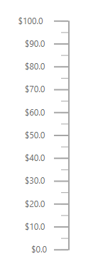

# Globalization in Blazor Linear Gauge Component

Localization enables translating default text content in Blazor components. For more information about localization, refer to the documentation.

## Globalization

Globalization is the process of designing and developing a component that works across different cultures. In the Linear Gauge, numeric content can be internationalized using the [Format](https://help.syncfusion.com/cr/blazor/Syncfusion.Blazor.LinearGauge.SfLinearGauge.html#Syncfusion_Blazor_LinearGauge_SfLinearGauge_Format) property of the [SfLinearGauge](https://help.syncfusion.com/cr/blazor/Syncfusion.Blazor.LinearGauge.SfLinearGauge.html). Static text appears in features such as:

* Axis label
* Tooltip

These texts can be localized for cultures such as Arabic, German, and French.

### Numeric Format

Axis labels and tooltips can display numeric values in formats such as currency, percentage, and more. To learn more about numeric formats in axis labels, refer to the [axis labels formatting](axis/#displaying-numeric-format-in-labels) section. In the following example, axis labels are displayed in the currency format.

```cshtml

@using Syncfusion.Blazor.LinearGauge

<SfLinearGauge Format="c">
    <LinearGaugeAxes>
        <LinearGaugeAxis>
            <LinearGaugePointers>
                <LinearGaugePointer></LinearGaugePointer>
            </LinearGaugePointers>
        </LinearGaugeAxis>
    </LinearGaugeAxes>
</SfLinearGauge>

```


