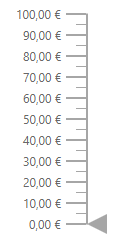

# Internationalization

Linear gauge provide supports for internationalization for below gauge elements.

* Axis label
* Tooltip

For more information about number and date formatter you can refer `internationalization`.

## Globalization

Globalization is the process of designing and developing an component that works in different cultures/locales. Internationalization library is used to globalize number in Linear Gauge component using `LoadCldrData`, `SetCulture` and `SetCurrencyCode` methods.

### Numeric Format

In the below example axis labels are `globalized` to EUR.

```csharp
<SfLinearGauge Width ="650px" Height ="300px" >
    <LinearGaugeAxes>
        <LinearGaugeAxis>
            <LinearGaugeLabel Format="c">
                <LinearGaugeFontSettings>
                    <LinearGaugeFont Color="red"></LinearGaugeFont>
                </LinearGaugeFontSettings>
            </LinearGaugeLabel>
        </LinearGaugeAxis>
    </LinearGaugeAxes>
</SfLinearGauge>

@code {
    [Inject]
    protected IJSRuntime JsRuntime { get; set; }
    protected override void OnAfterRender()
    {
        this.JsRuntime.Sf().LoadCldrData(new string[]{"ca-gregorian.json",
        "currencies.json","numbers.json","timeZoneNames.json"}).SetCulture("de").SetCurrencyCode("EUR");
    }
}
```

