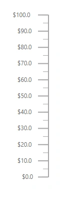

# Globalization in Blazor Linear Gauge Component

## Globalization

Globalization is an essential concept in modern application development, especially when building user interfaces that are expected to serve users from multiple regions, languages, and cultural backgrounds. In the context of the Blazor Linear Gauge component provided by Syncfusion, globalization ensures that the component behaves correctly and displays content appropriately based on different cultural settings. This includes formatting numbers, adjusting static text, and ensuring that the overall presentation aligns with the expectations of users from various locales.

Localization and globalization are closely related but serve different purposes. Localization focuses on adapting user interface text, such as labels, tooltips, and messages, into different languages. Globalization, on the other hand, refers to designing the component in such a way that it can seamlessly support different cultures without requiring major changes in the codebase. In the Syncfusion Blazor Linear Gauge component, localization allows developers to translate text content, while globalization enables formatting and representation of values based on regional preferences.

Globalization is the process of designing and developing a component that works in different cultures. Internationalization is used to globalize the number content in Linear Gauge component using [Format](https://help.syncfusion.com/cr/blazor/Syncfusion.Blazor.LinearGauge.SfLinearGauge.html#Syncfusion_Blazor_LinearGauge_SfLinearGauge_Format) property in [SfLinearGauge](https://help.syncfusion.com/cr/blazor/Syncfusion.Blazor.LinearGauge.SfLinearGauge.html). It has static text on some features such as,

* Axis label
* Tooltip

The static text on above features can be changed to any culture such as Arabic, Deutsch and French.

### Numeric Format

The text in axis labels and tooltip can be displayed in the numeric format such as currency, percentage and so on. To know more about the numeric formats in axis labels, refer [here](axis/#displaying-numeric-format-in-labels). In the below example, the axis label is displayed in the currency format.

```cshtml
@using Syncfusion.Blazor.LinearGauge

<SfLinearGauge Format="c">
    <LinearGaugeAxes>
        <LinearGaugeAxis>
            <LinearGaugePointers>
                <LinearGaugePointer></LinearGaugePointer>
            </LinearGaugePointers>
        </LinearGaugeAxis>
    </LinearGaugeAxes>
</SfLinearGauge>
```



The SfLinearGauge component supports globalization through properties like Format, which plays a crucial role in defining how numerical values are displayed. The gauge contains certain static text elements, including axis labels and tooltips, which can be adapted to reflect different cultures. For example, in some regions, currency symbols appear before the number (e.g., $100), while in others, they may appear after the number or use a completely different symbol (e.g., 100€). Similarly, number formatting such as decimal separators (comma vs. period) can vary widely across cultures.

One of the key features of globalization in the Linear Gauge is the numeric formatting capability. By using the Format property, developers can display values in various formats such as currency (c), percentage (p), or general number formats. This ensures that the gauge is not only visually appealing but also culturally accurate. For instance, when the Format="c" is applied, the values displayed on the axis and in tooltips automatically adapt to the currency format of the current culture setting. This is particularly useful in financial dashboards where users expect to see values represented in their local currency format.

In conclusion, globalization in the Blazor Linear Gauge component enables developers to build flexible, culturally aware applications. By leveraging features like numeric formatting and integrating with localization practices, the component ensures that users across different regions can interact with data in a familiar and meaningful way. This not only improves usability but also enhances the overall accessibility and professionalism of the application.
