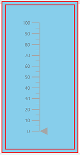
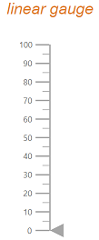
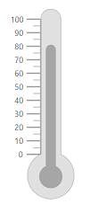

# Appearance in Blazor Linear Gauge Component

## Linear Gauge Area Customization

### Customize the Linear Gauge background

Using `Background` property and `LinearGaugeBorder` tag, you can change the background color and border of the Linear Gauge.

```csharp
<SfLinearGauge Width ="200px" Height ="400px" Background= "skyblue">
    <LinearGaugeBorder Color="#FF0000" Width="2">
    </LinearGaugeBorder>
</SfLinearGauge>
```



## Linear Gauge Title

The title for the Linear Gauge can be set through [`Title`](https://help.syncfusion.com/cr/blazor/Syncfusion.Blazor~Syncfusion.Blazor.LinearGauge.SfLinearGauge~Title.html) property in [`SfLinearGauge`](https://help.syncfusion.com/cr/blazor/Syncfusion.Blazor~Syncfusion.Blazor.LinearGauge.SfLinearGauge_members.html). Its appearance can be customized using the [`LinearGaugeTitleStyle`](https://help.syncfusion.com/cr/blazor/Syncfusion.Blazor~Syncfusion.Blazor.LinearGauge.LinearGaugeTitleStyle_members.html) with the below properties.

    * [`Color`](https://help.syncfusion.com/cr/cref_files/aspnetcore-blazor/Syncfusion.Blazor~Syncfusion.Blazor.LinearGaugeFontSettings~Color.html) - Specifies the title text color
    * [`FontStyle`](https://help.syncfusion.com/cr/cref_files/aspnetcore-blazor/Syncfusion.Blazor~Syncfusion.Blazor.LinearGaugeFontSettings~FontStyle.html) - Specifies font style for the title
    * [`FontWeight`](https://help.syncfusion.com/cr/cref_files/aspnetcore-blazor/Syncfusion.Blazor~Syncfusion.Blazor.LinearGaugeFontSettings~FontWeight.html) - Specifies font weight for the title
    * [`Size`](https://help.syncfusion.com/cr/cref_files/aspnetcore-blazor/Syncfusion.Blazor~Syncfusion.Blazor.LinearGaugeFontSettings~Size.html) - Specifies font size for the title
    * [`Opacity`](https://help.syncfusion.com/cr/cref_files/aspnetcore-blazor/Syncfusion.Blazor~Syncfusion.Blazor.LinearGaugeFontSettings~Opacity.html) - Specifies font opacity for the title
    * [`FontFamily`](https://help.syncfusion.com/cr/cref_files/aspnetcore-blazor/Syncfusion.Blazor~Syncfusion.Blazor.LinearGaugeFontSettings~FontFamily.html) - Specifies font family for the title

```csharp
<SfLinearGauge Title="Linear Gauge">
   <LinearGaugeTitleStyle FontFamily="Arial"
                          FontWeight="regular"
                          FontStyle="italic"
                          Color="#E27F2D"
                          Size="23px">
    </LinearGaugeTitleStyle>
</SfLinearGauge>
```



## Linear Gauge Container

The area used to render the ranges and pointers at the center position of the gauge is called `Container`. It can be customized by using `Type`, `Offset`, `Width`, `Height` and `BackgroundColor` properties in `LinearGaugeContainer`. It is of three types namely,

* Normal
* Rounded Rectangle
* Thermometer

### Normal

The normal type will render the container as rectangle and this is the default container type.

```csharp
<SfLinearGauge>
    <LinearGaugeContainer Width="30">
        <LinearGaugeAxes>
            <LinearGaugeAxis>
                <LinearGaugePointers>
                    <LinearGaugePointer Value="50" Width="15" Type="Point.Bar">
                    </LinearGaugePointer>
                </LinearGaugePointers>
            </LinearGaugeAxis>
        </LinearGaugeAxes>
    </LinearGaugeContainer>
</SfLinearGauge>
```


### Rounded Rectangle

The rounded rectangle type will render the container as rectangle with rounded corners.

```csharp
<SfLinearGauge>
    <LinearGaugeContainer Width="30" Type="ContainerType.RoundedRectangle">
        <LinearGaugeAxes>
            <LinearGaugeAxis>
                <LinearGaugePointers>
                    <LinearGaugePointer Value="50" Width="15" Type="Point.Bar">
                    </LinearGaugePointer>
                </LinearGaugePointers>
            </LinearGaugeAxis>
        </LinearGaugeAxes>
    </LinearGaugeContainer>
</SfLinearGauge>
```


### Thermometer

This type is used to render the container similar to the thermometer appearance.

```csharp
<SfLinearGauge>
    <LinearGaugeContainer Width="30" Type="ContainerType.Thermometer">
        <LinearGaugeAxes>
            <LinearGaugeAxis>
                <LinearGaugePointers>
                    <LinearGaugePointer Value="80" Width="15" Type="Point.Bar">
                    </LinearGaugePointer>
                </LinearGaugePointers>
            </LinearGaugeAxis>
        </LinearGaugeAxes>
    </LinearGaugeContainer>
</SfLinearGauge>
```

