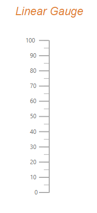
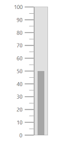
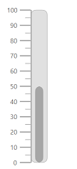
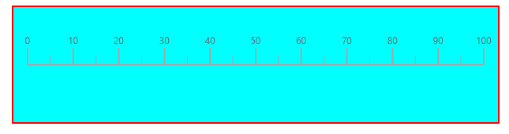

# Appearance in Blazor Linear Gauge Component

## Customizing the Linear Gauge area

The following property and components in [SfLinearGauge](https://help.syncfusion.com/cr/blazor/Syncfusion.Blazor.LinearGauge.SfLinearGauge.html) customize the Linear Gauge area:

* [Background](https://help.syncfusion.com/cr/blazor/Syncfusion.Blazor.LinearGauge.SfLinearGauge.html#Syncfusion_Blazor_LinearGauge_SfLinearGauge_Background) - Applies the background color for the Linear Gauge.
* [LinearGaugeBorder](https://help.syncfusion.com/cr/blazor/Syncfusion.Blazor.LinearGauge.LinearGaugeBorder.html) - Customizes the border color and width of the Linear Gauge.
* [LinearGaugeMargin](https://help.syncfusion.com/cr/blazor/Syncfusion.Blazor.LinearGauge.LinearGaugeMargin.html) - Configures the margins of the Linear Gauge.

```cshtml
@using Syncfusion.Blazor.LinearGauge

<SfLinearGauge Width="200px" Height="400px" Background="skyblue">
    <LinearGaugeBorder Color="#FF0000" Width="2"></LinearGaugeBorder>
    <LinearGaugeMargin Left="20" Right="20" Top="20" Bottom="20"></LinearGaugeMargin>
    <LinearGaugeAxes>
        <LinearGaugeAxis>
        </LinearGaugeAxis>
    </LinearGaugeAxes>
</SfLinearGauge>
```


## Setting up the Linear Gauge title

Set the title using the [Title](https://help.syncfusion.com/cr/blazor/Syncfusion.Blazor.LinearGauge.SfLinearGauge.html#Syncfusion_Blazor_LinearGauge_SfLinearGauge_Title) property in [SfLinearGauge](https://help.syncfusion.com/cr/blazor/Syncfusion.Blazor.LinearGauge.SfLinearGauge.html). Customize its appearance using [LinearGaugeTitleStyle](https://help.syncfusion.com/cr/blazor/Syncfusion.Blazor.LinearGauge.LinearGaugeTitleStyle.html) with the following properties:

* [Color](https://help.syncfusion.com/cr/blazor/Syncfusion.Blazor.LinearGauge.LinearGaugeFontSettings.html#Syncfusion_Blazor_LinearGauge_LinearGaugeFontSettings_Color) - Sets the title text color.
* [FontStyle](https://help.syncfusion.com/cr/blazor/Syncfusion.Blazor.LinearGauge.LinearGaugeFontSettings.html#Syncfusion_Blazor_LinearGauge_LinearGaugeFontSettings_FontStyle) - Sets the title font style.
* [FontWeight](https://help.syncfusion.com/cr/blazor/Syncfusion.Blazor.LinearGauge.LinearGaugeFontSettings.html#Syncfusion_Blazor_LinearGauge_LinearGaugeFontSettings_FontWeight) - Sets the title font weight.
* [Size](https://help.syncfusion.com/cr/blazor/Syncfusion.Blazor.LinearGauge.LinearGaugeFontSettings.html#Syncfusion_Blazor_LinearGauge_LinearGaugeFontSettings_Size) - Sets the title font size.
* [Opacity](https://help.syncfusion.com/cr/blazor/Syncfusion.Blazor.LinearGauge.LinearGaugeFontSettings.html#Syncfusion_Blazor_LinearGauge_LinearGaugeFontSettings_Opacity) - Sets the title opacity.
* [FontFamily](https://help.syncfusion.com/cr/blazor/Syncfusion.Blazor.LinearGauge.LinearGaugeFontSettings.html#Syncfusion_Blazor_LinearGauge_LinearGaugeFontSettings_FontFamily) - Sets the title font family.

```cshtml

@using Syncfusion.Blazor.LinearGauge

<SfLinearGauge Title="Linear Gauge">
    <LinearGaugeTitleStyle FontFamily="Arial" FontWeight="regular" FontStyle="italic" Color="#E27F2D" Size="23px">
    </LinearGaugeTitleStyle>
    <LinearGaugeAxes>
        <LinearGaugeAxis>
        </LinearGaugeAxis>
    </LinearGaugeAxes>
</SfLinearGauge>

```



## Customizing the Linear Gauge container

The container is the area used to render ranges and pointers at the center of the gauge. The following container types are available in Linear Gauge:

* Normal
* Rounded Rectangle
* Thermometer

Modify the container type using the [Type](https://help.syncfusion.com/cr/blazor/Syncfusion.Blazor.LinearGauge.LinearGaugeContainer.html#Syncfusion_Blazor_LinearGauge_LinearGaugeContainer_Type) property in [LinearGaugeContainer](https://help.syncfusion.com/cr/blazor/Syncfusion.Blazor.LinearGauge.LinearGaugeContainer.html). Customize the container using these properties and component:

* [Offset](https://help.syncfusion.com/cr/blazor/Syncfusion.Blazor.LinearGauge.LinearGaugeContainer.html#Syncfusion_Blazor_LinearGauge_LinearGaugeContainer_Offset) - Positions the container at a specified distance from the Linear Gauge axis.
* [Width](https://help.syncfusion.com/cr/blazor/Syncfusion.Blazor.LinearGauge.LinearGaugeContainer.html#Syncfusion_Blazor_LinearGauge_LinearGaugeContainer_Width) - Sets the container thickness.
* [Height](https://help.syncfusion.com/cr/blazor/Syncfusion.Blazor.LinearGauge.LinearGaugeContainer.html#Syncfusion_Blazor_LinearGauge_LinearGaugeContainer_Height) - Sets the container length.
* [BackgroundColor](https://help.syncfusion.com/cr/blazor/Syncfusion.Blazor.LinearGauge.LinearGaugeContainer.html#Syncfusion_Blazor_LinearGauge_LinearGaugeContainer_BackgroundColor) - Sets the container background color.
* [LinearGaugeContainerBorder](https://help.syncfusion.com/cr/blazor/Syncfusion.Blazor.LinearGauge.LinearGaugeContainerBorder.html) - Sets the border color and width of the container.

### Normal

The [Normal](https://help.syncfusion.com/cr/blazor/Syncfusion.Blazor.LinearGauge.ContainerType.html#Syncfusion_Blazor_LinearGauge_ContainerType_Normal) type renders the container as a rectangle. This is the default container type.

```cshtml

@using Syncfusion.Blazor.LinearGauge

<SfLinearGauge>
    <LinearGaugeContainer Width="30">
        <LinearGaugeAxes>
            <LinearGaugeAxis>
                <LinearGaugePointers>
                    <LinearGaugePointer PointerValue="50" Width="15" Type="Point.Bar"
                                        Color="#a6a6a6">
                    </LinearGaugePointer>
                </LinearGaugePointers>
            </LinearGaugeAxis>
        </LinearGaugeAxes>
    </LinearGaugeContainer>
</SfLinearGauge>

```



### Rounded Rectangle

The [RoundedRectangle](https://help.syncfusion.com/cr/blazor/Syncfusion.Blazor.LinearGauge.ContainerType.html#Syncfusion_Blazor_LinearGauge_ContainerType_RoundedRectangle) type renders the container as a rectangle with rounded corners. Configure the corner radius using the [RoundedCornerRadius](https://help.syncfusion.com/cr/blazor/Syncfusion.Blazor.LinearGauge.LinearGaugeContainer.html#Syncfusion_Blazor_LinearGauge_LinearGaugeContainer_RoundedCornerRadius) property in [LinearGaugeContainer](https://help.syncfusion.com/cr/blazor/Syncfusion.Blazor.LinearGauge.LinearGaugeContainer.html).

```cshtml

@using Syncfusion.Blazor.LinearGauge

<SfLinearGauge>
    <LinearGaugeContainer Width="30" Type="ContainerType.RoundedRectangle">
        <LinearGaugeAxes>
            <LinearGaugeAxis>
                <LinearGaugePointers>
                    <LinearGaugePointer PointerValue="50" Width="15" Type="Point.Bar"
                                        Color="#a6a6a6">
                    </LinearGaugePointer>
                </LinearGaugePointers>
            </LinearGaugeAxis>
        </LinearGaugeAxes>
    </LinearGaugeContainer>
</SfLinearGauge>

```



### Thermometer

The [Thermometer](https://help.syncfusion.com/cr/blazor/Syncfusion.Blazor.LinearGauge.ContainerType.html#Syncfusion_Blazor_LinearGauge_ContainerType_Thermometer) type renders the container with a thermometer like appearance.

```cshtml

@using Syncfusion.Blazor.LinearGauge

<SfLinearGauge>
    <LinearGaugeContainer Width="30" Type="ContainerType.Thermometer">
        <LinearGaugeAxes>
            <LinearGaugeAxis>
                <LinearGaugePointers>
                    <LinearGaugePointer PointerValue="80" Width="15" Type="Point.Bar"
                                        Color="#a6a6a6">
                    </LinearGaugePointer>
                </LinearGaugePointers>
            </LinearGaugeAxis>
        </LinearGaugeAxes>
    </LinearGaugeContainer>
</SfLinearGauge>

```


## Fitting the Linear Gauge to the control

By default, the Linear Gauge is rendered with margins. To remove the margin around the Linear Gauge, set the [AllowMargin](https://help.syncfusion.com/cr/blazor/Syncfusion.Blazor.LinearGauge.SfLinearGauge.html#Syncfusion_Blazor_LinearGauge_SfLinearGauge_AllowMargin) property in [SfLinearGauge](https://help.syncfusion.com/cr/blazor/Syncfusion.Blazor.LinearGauge.SfLinearGauge.html) to **false**.

```cshtml

@using Syncfusion.Blazor.LinearGauge

<SfLinearGauge AllowMargin="false" Width="100%" Height="100%"
               Orientation="Orientation.Horizontal" Background="#04fbfb">
    <LinearGaugeBorder Color="#FF0000" Width="2"></LinearGaugeBorder>
    <LinearGaugeMargin Left="0" Right="0" Top="0" Bottom="0"></LinearGaugeMargin>
    <LinearGaugeAxes>
        <LinearGaugeAxis>
        </LinearGaugeAxis>
    </LinearGaugeAxes>
</SfLinearGauge>

```



N> To use this feature, set the [AllowMargin](https://help.syncfusion.com/cr/blazor/Syncfusion.Blazor.LinearGauge.SfLinearGauge.html#Syncfusion_Blazor_LinearGauge_SfLinearGauge_AllowMargin) property to **false**, the [Width](https://help.syncfusion.com/cr/blazor/Syncfusion.Blazor.LinearGauge.SfLinearGauge.html#Syncfusion_Blazor_LinearGauge_SfLinearGauge_Width) property to **100%**, and the properties of [LinearGaugeMargin](https://help.syncfusion.com/cr/blazor/Syncfusion.Blazor.LinearGauge.LinearGaugeMargin.html) to **0**.
