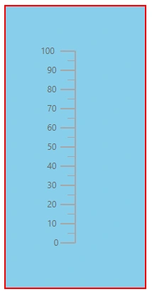
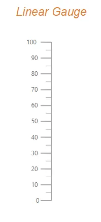
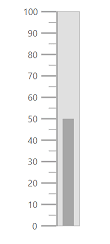
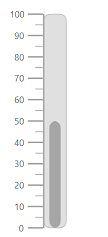
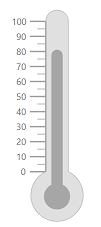
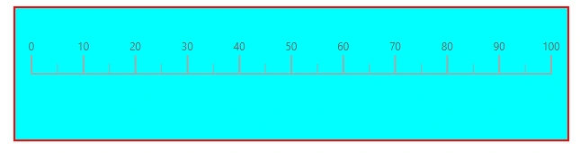

# Blazor Linear Gauge Appearance

## Customizing the Linear Gauge area

The following properties and components are available in the [SfLinearGauge](https://help.syncfusion.com/cr/blazor/Syncfusion.Blazor.LinearGauge.SfLinearGauge.html) to customize the Linear Gauge area.

* [Background](https://help.syncfusion.com/cr/blazor/Syncfusion.Blazor.LinearGauge.SfLinearGauge.html#Syncfusion_Blazor_LinearGauge_SfLinearGauge_Background) - Applies the background color for the Linear Gauge.
* [LinearGaugeBorder](https://help.syncfusion.com/cr/blazor/Syncfusion.Blazor.LinearGauge.LinearGaugeBorder.html) - Customizes the color and width of the border in the Linear Gauge.
* [LinearGaugeMargin](https://help.syncfusion.com/cr/blazor/Syncfusion.Blazor.LinearGauge.LinearGaugeMargin.html) - Customizes the margins of the Linear Gauge.

```cshtml
@using Syncfusion.Blazor.LinearGauge

<SfLinearGauge Width="200px" Height="400px" Background="skyblue">
    <LinearGaugeBorder Color="#FF0000" Width="2"></LinearGaugeBorder>
    <LinearGaugeMargin Left="20" Right="20" Top="20" Bottom="20"></LinearGaugeMargin>
    <LinearGaugeAxes>
        <LinearGaugeAxis>
        </LinearGaugeAxis>
    </LinearGaugeAxes>
</SfLinearGauge>
```



## Setting up the Linear Gauge title

The title for the Linear Gauge can be set using the [Title](https://help.syncfusion.com/cr/blazor/Syncfusion.Blazor.LinearGauge.SfLinearGauge.html#Syncfusion_Blazor_LinearGauge_SfLinearGauge_Title) property in [SfLinearGauge](https://help.syncfusion.com/cr/blazor/Syncfusion.Blazor.LinearGauge.SfLinearGauge.html). Its appearance can be customized using [LinearGaugeTitleStyle](https://help.syncfusion.com/cr/blazor/Syncfusion.Blazor.LinearGauge.LinearGaugeTitleStyle.html) with the following properties.

* [Color](https://help.syncfusion.com/cr/blazor/Syncfusion.Blazor.LinearGauge.LinearGaugeFontSettings.html#Syncfusion_Blazor_LinearGauge_LinearGaugeFontSettings_Color) - Specifies the text color of the title.
* [FontStyle](https://help.syncfusion.com/cr/blazor/Syncfusion.Blazor.LinearGauge.LinearGaugeFontSettings.html#Syncfusion_Blazor_LinearGauge_LinearGaugeFontSettings_FontStyle) - Specifies the font style of the title.
* [FontWeight](https://help.syncfusion.com/cr/blazor/Syncfusion.Blazor.LinearGauge.LinearGaugeFontSettings.html#Syncfusion_Blazor_LinearGauge_LinearGaugeFontSettings_FontWeight) - Specifies the font weight of the title text.
* [Size](https://help.syncfusion.com/cr/blazor/Syncfusion.Blazor.LinearGauge.LinearGaugeFontSettings.html#Syncfusion_Blazor_LinearGauge_LinearGaugeFontSettings_Size) - Specifies the font size of the title.
* [Opacity](https://help.syncfusion.com/cr/blazor/Syncfusion.Blazor.LinearGauge.LinearGaugeFontSettings.html#Syncfusion_Blazor_LinearGauge_LinearGaugeFontSettings_Opacity) - Specifies the opacity of the title.
* [FontFamily](https://help.syncfusion.com/cr/blazor/Syncfusion.Blazor.LinearGauge.LinearGaugeFontSettings.html#Syncfusion_Blazor_LinearGauge_LinearGaugeFontSettings_FontFamily) - Specifies the font family of the title.

```cshtml
@using Syncfusion.Blazor.LinearGauge

<SfLinearGauge Title="Linear Gauge">
    <LinearGaugeTitleStyle FontFamily="Arial" FontWeight="regular" FontStyle="italic" Color="#E27F2D" Size="23px">
    </LinearGaugeTitleStyle>
    <LinearGaugeAxes>
        <LinearGaugeAxis>
        </LinearGaugeAxis>
    </LinearGaugeAxes>
</SfLinearGauge>
```



## Customizing the Linear Gauge container

The area used to render the ranges and pointers at the center position of the gauge is called the **container**. The following container types are available in the Linear Gauge.

* Normal
* Rounded Rectangle
* Thermometer

The container type can be modified by using the [Type](https://help.syncfusion.com/cr/blazor/Syncfusion.Blazor.LinearGauge.LinearGaugeContainer.html#Syncfusion_Blazor_LinearGauge_LinearGaugeContainer_Type) property in [LinearGaugeContainer](https://help.syncfusion.com/cr/blazor/Syncfusion.Blazor.LinearGauge.LinearGaugeContainer.html). The container can be customized by using the following properties and child component in [LinearGaugeContainer](https://help.syncfusion.com/cr/blazor/Syncfusion.Blazor.LinearGauge.LinearGaugeContainer.html):

* [Offset](https://help.syncfusion.com/cr/blazor/Syncfusion.Blazor.LinearGauge.LinearGaugeContainer.html#Syncfusion_Blazor_LinearGauge_LinearGaugeContainer_Offset) - Places the container at the specified distance from the axis of the Linear Gauge.
* [Width](https://help.syncfusion.com/cr/blazor/Syncfusion.Blazor.LinearGauge.LinearGaugeContainer.html#Syncfusion_Blazor_LinearGauge_LinearGaugeContainer_Width) - Sets the thickness of the container.
* [Height](https://help.syncfusion.com/cr/blazor/Syncfusion.Blazor.LinearGauge.LinearGaugeContainer.html#Syncfusion_Blazor_LinearGauge_LinearGaugeContainer_Height) - Sets the length of the container.
* [BackgroundColor](https://help.syncfusion.com/cr/blazor/Syncfusion.Blazor.LinearGauge.LinearGaugeContainer.html#Syncfusion_Blazor_LinearGauge_LinearGaugeContainer_BackgroundColor) - Sets the background color of the container.
* [LinearGaugeContainerBorder](https://help.syncfusion.com/cr/blazor/Syncfusion.Blazor.LinearGauge.LinearGaugeContainerBorder.html) - Sets the color and width of the container border.

### Normal

The [Normal](https://help.syncfusion.com/cr/blazor/Syncfusion.Blazor.LinearGauge.ContainerType.html#Syncfusion_Blazor_LinearGauge_ContainerType_Normal) type renders the container as a rectangle and is the default container type.

```cshtml
@using Syncfusion.Blazor.LinearGauge

<SfLinearGauge>
    <LinearGaugeContainer Width="30">
        <LinearGaugeAxes>
            <LinearGaugeAxis>
                <LinearGaugePointers>
                    <LinearGaugePointer PointerValue="50" Width="15" Type="Point.Bar"
                                        Color="#a6a6a6">
                    </LinearGaugePointer>
                </LinearGaugePointers>
            </LinearGaugeAxis>
        </LinearGaugeAxes>
    </LinearGaugeContainer>
</SfLinearGauge>
```



### Rounded Rectangle

The [RoundedRectangle](https://help.syncfusion.com/cr/blazor/Syncfusion.Blazor.LinearGauge.ContainerType.html#Syncfusion_Blazor_LinearGauge_ContainerType_RoundedRectangle) type renders the container as a rectangle with rounded corner radius. The corner radius can be customized using the [RoundedCornerRadius](https://help.syncfusion.com/cr/blazor/Syncfusion.Blazor.LinearGauge.LinearGaugeContainer.html#Syncfusion_Blazor_LinearGauge_LinearGaugeContainer_RoundedCornerRadius) property in [LinearGaugeContainer](https://help.syncfusion.com/cr/blazor/Syncfusion.Blazor.LinearGauge.LinearGaugeContainer.html).

```cshtml
@using Syncfusion.Blazor.LinearGauge

<SfLinearGauge>
    <LinearGaugeContainer Width="30" Type="ContainerType.RoundedRectangle">
        <LinearGaugeAxes>
            <LinearGaugeAxis>
                <LinearGaugePointers>
                    <LinearGaugePointer PointerValue="50" Width="15" Type="Point.Bar"
                                        Color="#a6a6a6">
                    </LinearGaugePointer>
                </LinearGaugePointers>
            </LinearGaugeAxis>
        </LinearGaugeAxes>
    </LinearGaugeContainer>
</SfLinearGauge>
```



### Thermometer

The [Thermometer](https://help.syncfusion.com/cr/blazor/Syncfusion.Blazor.LinearGauge.ContainerType.html#Syncfusion_Blazor_LinearGauge_ContainerType_Thermometer) type renders the container similar to the appearance of a thermometer.

```cshtml
@using Syncfusion.Blazor.LinearGauge

<SfLinearGauge>
    <LinearGaugeContainer Width="30" Type="ContainerType.Thermometer">
        <LinearGaugeAxes>
            <LinearGaugeAxis>
                <LinearGaugePointers>
                    <LinearGaugePointer PointerValue="80" Width="15" Type="Point.Bar"
                                        Color="#a6a6a6">
                    </LinearGaugePointer>
                </LinearGaugePointers>
            </LinearGaugeAxis>
        </LinearGaugeAxes>
    </LinearGaugeContainer>
</SfLinearGauge>
```



## Fitting the Linear Gauge to the control

The Linear Gauge component is rendered with a margin by default. To remove the margin around the Linear Gauge, set the [AllowMargin](https://help.syncfusion.com/cr/blazor/Syncfusion.Blazor.LinearGauge.SfLinearGauge.html#Syncfusion_Blazor_LinearGauge_SfLinearGauge_AllowMargin) property in [SfLinearGauge](https://help.syncfusion.com/cr/blazor/Syncfusion.Blazor.LinearGauge.SfLinearGauge.html) to **false**.

```cshtml
@using Syncfusion.Blazor.LinearGauge

<SfLinearGauge AllowMargin="false" Width="100%" Height="100%"
               Orientation="Orientation.Horizontal" Background="#04fbfb">
    <LinearGaugeBorder Color="#FF0000" Width="2"></LinearGaugeBorder>
    <LinearGaugeMargin Left="0" Right="0" Top="0" Bottom="0"></LinearGaugeMargin>
    <LinearGaugeAxes>
        <LinearGaugeAxis>
        </LinearGaugeAxis>
    </LinearGaugeAxes>
</SfLinearGauge>
```



N>To use this feature, set the [AllowMargin](https://help.syncfusion.com/cr/blazor/Syncfusion.Blazor.LinearGauge.SfLinearGauge.html#Syncfusion_Blazor_LinearGauge_SfLinearGauge_AllowMargin) property to **false**, the [Width](https://help.syncfusion.com/cr/blazor/Syncfusion.Blazor.LinearGauge.SfLinearGauge.html#Syncfusion_Blazor_LinearGauge_SfLinearGauge_Width) property to **100%**, and the properties of [LinearGaugeMargin](https://help.syncfusion.com/cr/blazor/Syncfusion.Blazor.LinearGauge.LinearGaugeMargin.html) to **0**.