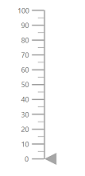
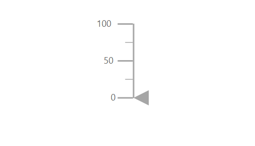

# Dimensions in Blazor Linear Gauge Component

## Size for Linear Gauge

Configure Linear Gauge dimensions using the [Width](https://help.syncfusion.com/cr/blazor/Syncfusion.Blazor.LinearGauge.SfLinearGauge.html#Syncfusion_Blazor_LinearGauge_SfLinearGauge_Width) and [Height](https://help.syncfusion.com/cr/blazor/Syncfusion.Blazor.LinearGauge.SfLinearGauge.html#Syncfusion_Blazor_LinearGauge_SfLinearGauge_Height) properties of the [SfLinearGauge](https://help.syncfusion.com/cr/blazor/Syncfusion.Blazor.LinearGauge.SfLinearGauge.html) component.

### In Pixel

Set the gauge size in pixels.

```cshtml

@using Syncfusion.Blazor.LinearGauge

<SfLinearGauge Width="100px" Height="350px">
    <LinearGaugeAxes>
        <LinearGaugeAxis>
            <LinearGaugePointers>
                <LinearGaugePointer></LinearGaugePointer>
            </LinearGaugePointers>
        </LinearGaugeAxis>
    </LinearGaugeAxes>
</SfLinearGauge>

```



### In Percentage

When using percentage values, the gauge scales relative to its parent. For example, a height of **50%** renders at half of the parent height. Setting the width to **100%** enables responsive layout.

```cshtml

@using Syncfusion.Blazor.LinearGauge

<SfLinearGauge Width="100%" Height="50%">
    <LinearGaugeAxes>
        <LinearGaugeAxis>
            <LinearGaugePointers>
                <LinearGaugePointer></LinearGaugePointer>
            </LinearGaugePointers>
        </LinearGaugeAxis>
    </LinearGaugeAxes>
</SfLinearGauge>

```



N> If no size is specified, the component defaults to a height of **450px** and a width that matches the parent element.
