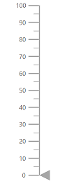

# Linear Gauge Dimensions

## Size for Linear Gauge

You can also set size for Linear Gauge directly through `Width` and `Height` properties.

## In Pixel

You can set the size of Linear Gauge in pixel as demonstrated below.

```csharp
<SfLinearGauge Width="100px" Height="350px">
</SfLinearGauge>
```


## In Percentage

By setting value in percentage, Linear Gauge gets its dimension with respect to its parent. For example, when the height is ‘50%’, Linear Gauge renders to half of the parent height.

```csharp
<SfLinearGauge Width="100%" Height="50%">
</SfLinearGauge>
```



>Note: When you do not specify the size, it takes `450px` as the height and window size as its width.