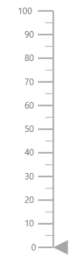
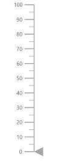

# Dimensions in Blazor Linear Gauge Component


The **Linear Gauge component in Blazor** provides flexible options for defining its size and layout, ensuring it can be used effectively in a wide range of application scenarios. Whether you are building dashboards, monitoring systems, or status displays, controlling the gauge dimensions is an important aspect of UI design.

This section explains how to configure the **height and width** of the Linear Gauge, along with best practices for using different sizing approaches such as pixel-based dimensions and percentage-based responsive layouts.

## Size for Linear Gauge


The overall size of the Linear Gauge is determined using the [Width](https://help.syncfusion.com/cr/blazor/Syncfusion.Blazor.LinearGauge.SfLinearGauge.html#Syncfusion_Blazor_LinearGauge_SfLinearGauge_Width) and [Height](https://help.syncfusion.com/cr/blazor/Syncfusion.Blazor.LinearGauge.SfLinearGauge.html#Syncfusion_Blazor_LinearGauge_SfLinearGauge_Height) properties of the [`SfLinearGauge`](https://help.syncfusion.com/cr/blazor/Syncfusion.Blazor.LinearGauge.SfLinearGauge.html) class. These properties accept string values, which allows developers to define sizes in multiple units such as pixels (`px`) or percentages (`%`).

By customizing these properties, you can precisely control how the gauge appears within your layout and how it adapts to different screen sizes.


### In Pixel

The size of the Linear Gauge can be set in pixel.

```cshtml
@using Syncfusion.Blazor.LinearGauge

<SfLinearGauge Width="100px" Height="350px">
    <LinearGaugeAxes>
        <LinearGaugeAxis>
            <LinearGaugePointers>
                <LinearGaugePointer></LinearGaugePointer>
            </LinearGaugePointers>
        </LinearGaugeAxis>
    </LinearGaugeAxes>
</SfLinearGauge>
```



### Key Points

- Width="100px" sets the gauge width to 100 pixels.
- Height="350px" sets the gauge height to 350 pixels.
- The size remains constant regardless of the parent container size.
- Useful for pixel-perfect layouts and controlled UI environments.

### Setting Dimensions in Percentage

Alternatively, the Linear Gauge can be sized using percentage values, making it responsive to its parent container. This is particularly useful in modern web applications where responsiveness is essential.
When dimensions are defined in percentages:

The width and height are calculated relative to the parent element.
The component adjusts dynamically when the parent container resizes.
It helps maintain consistency across different screen resolutions.

By setting value in percentage, Linear Gauge receives its dimension matching to its parent. For example, when the height is set as **50%**, Linear Gauge renders to half of the parent height. The Linear Gauge will be responsive when the width is set as **100%**.

```cshtml
@using Syncfusion.Blazor.LinearGauge

<SfLinearGauge Width="100%" Height="50%">
    <LinearGaugeAxes>
        <LinearGaugeAxis>
            <LinearGaugePointers>
                <LinearGaugePointer></LinearGaugePointer>
            </LinearGaugePointers>
        </LinearGaugeAxis>
    </LinearGaugeAxes>
</SfLinearGauge>
```



### Key Points

- Width="100%" makes the gauge occupy the full width of its parent container.
- Height="50%" sets the height to half of the parent container’s height.
- Enables responsive layouts for dashboards and fluid UI designs.
- Ideal for applications that need to adapt to different screen sizes and orientations.

### Default Dimensions
If no explicit dimensions are provided:

- The default height of the Linear Gauge is 450px.
- The default width automatically adjusts to match the width of the parent element.
- Understand default behaviors to avoid unexpected layouts.

This default behavior ensures that the gauge is displayed with a reasonable size even when no configuration is specified, making it easier for beginners to get started without worrying about layout setup.
The Blazor Linear Gauge component offers flexible and powerful options for controlling its dimensions. By using the Width and Height properties effectively, you can design gauges that are either fixed in size or fully responsive.

- Use pixel values for precise, fixed layouts.
- Use percentage values for adaptive, responsive designs.

With these techniques, you can ensure your Linear Gauge integrates seamlessly into any Blazor application while maintaining both functionality and visual consistency.

N> When the component's size is not specified, the height will be **450px** and the width will be the same as the parent element's width.
