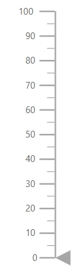
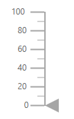

# Blazor Linear Gauge Dimensions

The height and width of the Linear Gauge can be set using the [Width](https://help.syncfusion.com/cr/blazor/Syncfusion.Blazor.LinearGauge.SfLinearGauge.html#Syncfusion_Blazor_LinearGauge_SfLinearGauge_Width) and [Height](https://help.syncfusion.com/cr/blazor/Syncfusion.Blazor.LinearGauge.SfLinearGauge.html#Syncfusion_Blazor_LinearGauge_SfLinearGauge_Height) properties in [SfLinearGauge](https://help.syncfusion.com/cr/blazor/Syncfusion.Blazor.LinearGauge.SfLinearGauge.html) class. Use pixel values for fixed-size layouts and percentage values for fluid or responsive layouts.

N> When the component's dimensions are not specified, the height will be **450px** and the width will be the same as the parent element's width.

## Sizing in Pixel

The size of the Linear Gauge can be set in pixels for fixed layouts.

```cshtml
@using Syncfusion.Blazor.LinearGauge

<SfLinearGauge Width="100px" Height="350px">
    <LinearGaugeAxes>
        <LinearGaugeAxis>
            <LinearGaugePointers>
                <LinearGaugePointer></LinearGaugePointer>
            </LinearGaugePointers>
        </LinearGaugeAxis>
    </LinearGaugeAxes>
</SfLinearGauge>
```



## Sizing in Percentage

By setting a value in percentage, the Linear Gauge receives its dimensions matching its parent. For example, when the height is set as **50%**, the Linear Gauge renders at 50% of the parent height. 

```cshtml
@using Syncfusion.Blazor.LinearGauge

<div style="width:600px;height:400px;">
    <SfLinearGauge Width="100%" Height="50%">
        <LinearGaugeAxes>
            <LinearGaugeAxis>
                <LinearGaugePointers>
                    <LinearGaugePointer></LinearGaugePointer>
                </LinearGaugePointers>
            </LinearGaugeAxis>
        </LinearGaugeAxes>
    </SfLinearGauge>
</div>
```



## See also

* [How to place Linear Gauge inside other components](how-to/place-gauge-inside-other-components.md)
* [Linear Gauge appearance](linear-gauge-appearance.md)
* [Getting started with Blazor Linear Gauge](getting-started.md)
