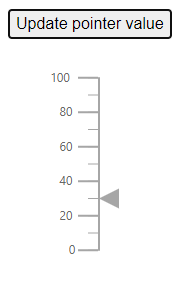

# Methods in Blazor Linear Gauge Component

The following public methods are available in the Linear Gauge component.

## SetPointerValue

Use the [SetPointerValue](https://help.syncfusion.com/cr/blazor/Syncfusion.Blazor.LinearGauge.SfLinearGauge.html#Syncfusion_Blazor_LinearGauge_SfLinearGauge_SetPointerValue_System_Int32_System_Int32_System_Double_) method to update a pointer value at runtime. Arguments:

|   Argument name      |   Description                            |
|----------------------|------------------------------------------|
|     axisIndex        |    Specifies the index of the axis in which the pointer value is to be updated. |
|     pointerIndex     |    Specifies the index of the pointer to be updated.           |
|     pointerValue     |    Specifies the value of the pointer to be updated.           |

```cshtml

@using Syncfusion.Blazor.LinearGauge

<button style="margin-left:34px" @onclick="ChangePoinerValue">Update pointer value
</button>
<SfLinearGauge @ref="lineargauge" Width="250px" Height="250px">
    <LinearGaugeAxes>
        <LinearGaugeAxis>
            <LinearGaugePointers>
                <LinearGaugePointer PointerValue="10"></LinearGaugePointer>
            </LinearGaugePointers>
        </LinearGaugeAxis>
    </LinearGaugeAxes>
</SfLinearGauge>

@code {
    SfLinearGauge lineargauge;

    public void ChangePoinerValue()
    {
        lineargauge.SetPointerValue(0, 0, 30);
    }
}

```



## SetAnnotationValue

Use the [SetAnnotationValue](https://help.syncfusion.com/cr/blazor/Syncfusion.Blazor.LinearGauge.SfLinearGauge.html#Syncfusion_Blazor_LinearGauge_SfLinearGauge_SetAnnotationValue_System_Int32_System_String_System_Int32_) method to change annotation content dynamically. Arguments:

|   Argument name      |   Description                            |
|----------------------|------------------------------------------|
|     annotationIndex  |    Specifies the index number of the annotation to be updated. |
|     content          |    Specifies the text for the annotation to be updated.        |
|     axisValue        |    Specifies the value of the axis where the annotation is to be placed.|

N> This method is not applicable for the [ContentTemplate](https://help.syncfusion.com/cr/blazor/Syncfusion.Blazor.LinearGauge.LinearGaugeAnnotation.html#Syncfusion_Blazor_LinearGauge_LinearGaugeAnnotation_ContentTemplate) property in [LinearGaugeAnnotation](https://help.syncfusion.com/cr/blazor/Syncfusion.Blazor.LinearGauge.LinearGaugeAnnotation.html).

```cshtml

@using Syncfusion.Blazor.LinearGauge

<button style="margin-left:34px" @onclick="ChangeAnnotationValue">Update annotation value</button>
<SfLinearGauge @ref="lineargauge" Width="250px" Height="250px">
    <LinearGaugeAnnotations>
        <LinearGaugeAnnotation AxisValue="0" ZIndex="1" Content="10">
        </LinearGaugeAnnotation>
    </LinearGaugeAnnotations>
    <LinearGaugeAxes>
        <LinearGaugeAxis>
        </LinearGaugeAxis>
    </LinearGaugeAxes>
</SfLinearGauge>

@code {
    SfLinearGauge lineargauge;

    public void ChangeAnnotationValue()
    {
        lineargauge.SetAnnotationValue(0, "50", 50);
    }
}

```

## RefreshAsync

Use [RefreshAsync](https://help.syncfusion.com/cr/blazor/Syncfusion.Blazor.LinearGauge.SfLinearGauge.html#Syncfusion_Blazor_LinearGauge_SfLinearGauge_RefreshAsync) to re-render the component after state changes.

```cshtml

@using Syncfusion.Blazor.LinearGauge

<button style="margin-left:34px" @onclick="RefreshAsync">Refresh Gauge</button>
<SfLinearGauge @ref="lineargauge" Width="250px" Height="250px">
    <LinearGaugeAxes>
        <LinearGaugeAxis>
            <LinearGaugePointers>
                <LinearGaugePointer PointerValue="10"></LinearGaugePointer>
            </LinearGaugePointers>
        </LinearGaugeAxis>
    </LinearGaugeAxes>
</SfLinearGauge>

@code {
    SfLinearGauge lineargauge;

    public async Task RefreshAsync()
    {
        await lineargauge.RefreshAsync();
    }
}

```
