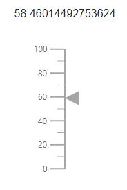

# Methods

## Using methods in Linear Gauge component

You can create object for the linear gauge component using `@ref` and call the `ChangePoinerValue` method as shown in the following example.

```csharp
@using Syncfusion.Blazor.LinearGauge

<button style="margin-left:34px" @onclick="ChangePoinerValue">Update pointer value</button>
<SfLinearGauge @ref="lineargauge" Width="250px" Height="250px">
</SfLinearGauge>

@code {
    SfLinearGauge lineargauge;
    void ChangePoinerValue()
    {
        lineargauge.SetPointerValue(0, 0, 30);
    }
}
```



## Available methods

### SetAnnotationValue

Description: Dynamically set the annotation content to the linear gauge.

Return: void

|   Argument name      |   Description                            |
|----------------------| -----------------------------------------|
|     annotationIndex  |    Specifies the annotation index        |
|     content          |    Specifies the annotation text         |
|     axisValue        |    Specifies the axis value              |

### SetPointerValue

Description: Dynamically set the pointer value to the linear gauge.

Return: void

|   Argument name      |   Description                            |
|----------------------| -----------------------------------------|
|     axis index       |    Specifies the axis index              |
|     pointerIndex     |    Specifies the pointer index           |
|     value            |    Specifies the pointer value           |

### Refresh

Description: The component is rendered again. Whenever you make changes with the gauge properties.

Return: void