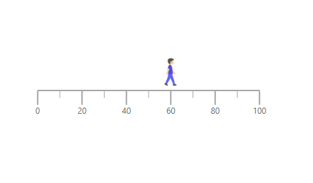
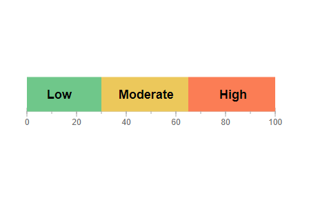
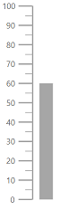
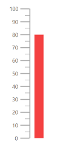
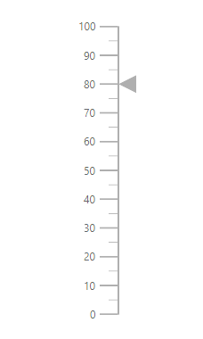
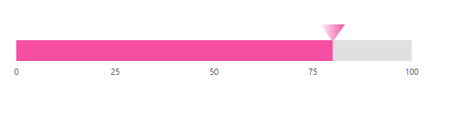
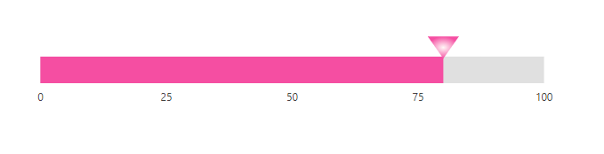

# Pointers in Blazor Linear Gauge Component

Pointers are used to indicate values on an axis. The value of the pointer can be modified using the [PointerValue](https://help.syncfusion.com/cr/blazor/Syncfusion.Blazor.LinearGauge.LinearGaugePointer.html#Syncfusion_Blazor_LinearGauge_LinearGaugePointer_PointerValue) property in [LinearGaugePointer](https://help.syncfusion.com/cr/blazor/Syncfusion.Blazor.LinearGauge.LinearGaugePointer.html).

```cshtml
@using Syncfusion.Blazor.LinearGauge

<SfLinearGauge>
    <LinearGaugeAxes>
        <LinearGaugeAxis>
            <LinearGaugePointers>
                <LinearGaugePointer PointerValue="80">
                </LinearGaugePointer>
            </LinearGaugePointers>
        </LinearGaugeAxis>
    </LinearGaugeAxes>
</SfLinearGauge>
```


## Types of pointer

The Linear Gauge supports the following types of pointers:

* Bar
* Marker

The type of pointer can be modified by using the [Type](https://help.syncfusion.com/cr/blazor/Syncfusion.Blazor.LinearGauge.LinearGaugePointer.html#Syncfusion_Blazor_LinearGauge_LinearGaugePointer_Type) property in [LinearGaugePointer](https://help.syncfusion.com/cr/blazor/Syncfusion.Blazor.LinearGauge.LinearGaugePointer.html).

### Marker pointer

A marker pointer is a shape that can be used to mark the pointer value in the Linear Gauge.

<b>Types of marker shapes</b>

By default, the marker shape for the pointer is **InvertedTriangle**. To change the shape of the pointer, use the [MarkerType](https://help.syncfusion.com/cr/blazor/Syncfusion.Blazor.LinearGauge.LinearGaugePointer.html#Syncfusion_Blazor_LinearGauge_LinearGaugePointer_MarkerType) property in [LinearGaugePointer](https://help.syncfusion.com/cr/blazor/Syncfusion.Blazor.LinearGauge.LinearGaugePointer.html). The following marker types are available in Linear Gauge.

* Circle
* Rectangle
* Triangle
* InvertedTriangle
* Diamond
* Image
* Text

```cshtml
@using Syncfusion.Blazor.LinearGauge

<SfLinearGauge>
    <LinearGaugeAxes>
        <LinearGaugeAxis>
            <LinearGaugePointers>
                <LinearGaugePointer PointerValue="60" MarkerType="MarkerType.Circle">
                </LinearGaugePointer>
            </LinearGaugePointers>
        </LinearGaugeAxis>
    </LinearGaugeAxes>
</SfLinearGauge>
```


Image can be rendered instead of rendering a shape as a pointer. It can be achieved by setting the [MarkerType](https://help.syncfusion.com/cr/blazor/Syncfusion.Blazor.LinearGauge.LinearGaugePointer.html#Syncfusion_Blazor_LinearGauge_LinearGaugePointer_MarkerType) property to **Image** and setting the source URL of image to [ImageUrl](https://help.syncfusion.com/cr/blazor/Syncfusion.Blazor.LinearGauge.LinearGaugePointer.html#Syncfusion_Blazor_LinearGauge_LinearGaugePointer_ImageUrl) property in [LinearGaugePointer](https://help.syncfusion.com/cr/blazor/Syncfusion.Blazor.LinearGauge.LinearGaugePointer.html).

```cshtml

@using Syncfusion.Blazor.LinearGauge;

<SfLinearGauge Orientation="Orientation.Horizontal">
    <LinearGaugeAxes>
        <LinearGaugeAxis>
            <LinearGaugeMajorTicks Position="Position.Outside">
            </LinearGaugeMajorTicks>
            <LinearGaugeMinorTicks Position="Position.Outside">
            </LinearGaugeMinorTicks>
            <LinearGaugeAxisLabelStyle Position="Position.Outside"></LinearGaugeAxisLabelStyle>
            <LinearGaugePointers>
                <LinearGaugePointer PointerValue="60" Offset="-27" Height="40" Width="40" MarkerType="MarkerType.Image" ImageUrl="https://blazor.syncfusion.com/demos/_content/blazor_server_common_net8/images/linear-gauge/step-count.png">
                </LinearGaugePointer>
            </LinearGaugePointers>
        </LinearGaugeAxis>
    </LinearGaugeAxes>
</SfLinearGauge>

```


Text can be added instead of rendering a shape as a pointer. It can be achieved by setting the [MarkerType](https://help.syncfusion.com/cr/blazor/Syncfusion.Blazor.LinearGauge.LinearGaugePointer.html#Syncfusion_Blazor_LinearGauge_LinearGaugePointer_MarkerType) property to **Text**, and the text content can be set using the [Text](https://help.syncfusion.com/cr/blazor/Syncfusion.Blazor.LinearGauge.LinearGaugePointer.html#Syncfusion_Blazor_LinearGauge_LinearGaugePointer_Text) property in [LinearGaugePointer](https://help.syncfusion.com/cr/blazor/Syncfusion.Blazor.LinearGauge.LinearGaugePointer.html).

The following properties in the [LinearGaugeMarkerTextStyle](https://help.syncfusion.com/cr/blazor/Syncfusion.Blazor.LinearGauge.LinearGaugeMarkerTextStyle.html#properties) tag can be used to set the text style for the text pointer.

* [FontFamily](https://help.syncfusion.com/cr/blazor/Syncfusion.Blazor.LinearGauge.LinearGaugeMarkerTextStyle.html#Syncfusion_Blazor_LinearGauge_LinearGaugeMarkerTextStyle_FontFamily) - It is used to set the font family for the text pointer.
* [FontStyle](https://help.syncfusion.com/cr/blazor/Syncfusion.Blazor.LinearGauge.LinearGaugeMarkerTextStyle.html#Syncfusion_Blazor_LinearGauge_LinearGaugeMarkerTextStyle_FontStyle) - It is used to set the font style for the text pointer.
* [FontWeight](https://help.syncfusion.com/cr/blazor/Syncfusion.Blazor.LinearGauge.LinearGaugeMarkerTextStyle.html#Syncfusion_Blazor_LinearGauge_LinearGaugeMarkerTextStyle_FontWeight) - It is used to set the font weight for the text pointer.
* [Size](https://help.syncfusion.com/cr/blazor/Syncfusion.Blazor.LinearGauge.LinearGaugeMarkerTextStyle.html#Syncfusion_Blazor_LinearGauge_LinearGaugeMarkerTextStyle_Size) - It is used to set the font size for the text pointer.

```cshtml
@using Syncfusion.Blazor.LinearGauge;

<SfLinearGauge Orientation="Orientation.Horizontal">
    <LinearGaugeAxes>
        <LinearGaugeAxis Minimum="0" Maximum="100" OpposedPosition="true">
            <LinearGaugeLine Width="5" />
            <LinearGaugeMajorTicks Interval="20" Height="7" Width="1" Position="Position.Inside" />
            <LinearGaugeMinorTicks Interval="10" Height="3" Position="Position.Inside" />
            <LinearGaugeAxisLabelStyle Position="Position.Inside">
                <LinearGaugeAxisLabelFont FontFamily="inherit" />
            </LinearGaugeAxisLabelStyle>
            <LinearGaugePointers>
                <LinearGaugePointer PointerValue="13" MarkerType="MarkerType.Text" Text="Low" Color="Black" Offset="-55">
                    <LinearGaugeMarkerTextStyle Size="18px" FontWeight="Bold"></LinearGaugeMarkerTextStyle>
                </LinearGaugePointer>
                <LinearGaugePointer PointerValue="48" MarkerType="MarkerType.Text" Text="Moderate" Color="Black" Offset="-55">
                    <LinearGaugeMarkerTextStyle Size="18px" FontWeight="Bold"></LinearGaugeMarkerTextStyle>
                </LinearGaugePointer>
                <LinearGaugePointer PointerValue="83" MarkerType="MarkerType.Text" Text="High" Color="Black" Offset="-55">
                    <LinearGaugeMarkerTextStyle Size="18px" FontWeight="Bold"></LinearGaugeMarkerTextStyle>
                </LinearGaugePointer>
            </LinearGaugePointers>
            <LinearGaugeRanges>
                <LinearGaugeRange Start="0" End="30" StartWidth="50" EndWidth="50" Color="#6FC78A" Position="Position.Inside" />
                <LinearGaugeRange Start="30" End="65" StartWidth="50" EndWidth="50" Color="#ECC85B" Position="Position.Inside" />
                <LinearGaugeRange Start="65" End="100" StartWidth="50" EndWidth="50" Color="#FB7D55" Position="Position.Inside" />
            </LinearGaugeRanges>
        </LinearGaugeAxis>
    </LinearGaugeAxes>
</SfLinearGauge>
```



<b>Marker pointer customization</b>

The marker pointer can be customized using the following properties and component.

* [Height](https://help.syncfusion.com/cr/blazor/Syncfusion.Blazor.LinearGauge.LinearGaugePointer.html#Syncfusion_Blazor_LinearGauge_LinearGaugePointer_Height) - To set the height of the pointer.
* [Position](https://help.syncfusion.com/cr/blazor/Syncfusion.Blazor.LinearGauge.LinearGaugePointer.html#Syncfusion_Blazor_LinearGauge_LinearGaugePointer_Position) - The position of the pointer can be changed by setting the value as "[Inside](https://help.syncfusion.com/cr/blazor/Syncfusion.Blazor.LinearGauge.Position.html#Syncfusion_Blazor_LinearGauge_Position_Inside)","[Outside](https://help.syncfusion.com/cr/blazor/Syncfusion.Blazor.LinearGauge.Position.html#Syncfusion_Blazor_LinearGauge_Position_Outside)", "[Cross](https://help.syncfusion.com/cr/blazor/Syncfusion.Blazor.LinearGauge.Position.html#Syncfusion_Blazor_LinearGauge_Position_Cross)", or "[Auto](https://help.syncfusion.com/cr/blazor/Syncfusion.Blazor.LinearGauge.Position.html#Syncfusion_Blazor_LinearGauge_Position_Auto)".
* [Width](https://help.syncfusion.com/cr/blazor/Syncfusion.Blazor.LinearGauge.LinearGaugePointer.html#Syncfusion_Blazor_LinearGauge_LinearGaugePointer_Width) - To set the width of the pointer.
* [Color](https://help.syncfusion.com/cr/blazor/Syncfusion.Blazor.LinearGauge.LinearGaugePointer.html#Syncfusion_Blazor_LinearGauge_LinearGaugePointer_Color) - To set the color of the pointer.
* [Placement](https://help.syncfusion.com/cr/blazor/Syncfusion.Blazor.LinearGauge.LinearGaugePointer.html#Syncfusion_Blazor_LinearGauge_LinearGaugePointer_Placement) - To place the pointer in the specified position. By default, the pointer is placed "[Far](https://help.syncfusion.com/cr/blazor/Syncfusion.Blazor.LinearGauge.Placement.html#Syncfusion_Blazor_LinearGauge_Placement_Far)" from the axis. To change the placement, set the [Placement](https://help.syncfusion.com/cr/blazor/Syncfusion.Blazor.LinearGauge.LinearGaugePointer.html#Syncfusion_Blazor_LinearGauge_LinearGaugePointer_Placement) property as "[Near](https://help.syncfusion.com/cr/blazor/Syncfusion.Blazor.LinearGauge.Placement.html#Syncfusion_Blazor_LinearGauge_Placement_Near)", "[Center](https://help.syncfusion.com/cr/blazor/Syncfusion.Blazor.LinearGauge.Placement.html#Syncfusion_Blazor_LinearGauge_Placement_Center)", or "[None](https://help.syncfusion.com/cr/blazor/Syncfusion.Blazor.LinearGauge.Placement.html#Syncfusion_Blazor_LinearGauge_Placement_None)".
* [Offset](https://help.syncfusion.com/cr/blazor/Syncfusion.Blazor.LinearGauge.LinearGaugePointer.html#Syncfusion_Blazor_LinearGauge_LinearGaugePointer_Offset) - To place the pointer with specified distance from the axis.
* [Opacity](https://help.syncfusion.com/cr/blazor/Syncfusion.Blazor.LinearGauge.LinearGaugePointer.html#Syncfusion_Blazor_LinearGauge_LinearGaugePointer_Opacity) - To set the opacity of the pointer.
* [AnimationDuration](https://help.syncfusion.com/cr/blazor/Syncfusion.Blazor.LinearGauge.LinearGaugePointer.html#Syncfusion_Blazor_LinearGauge_LinearGaugePointer_AnimationDuration) - To specify the duration of the animation in pointer.
* [LinearGaugePointerBorder](https://help.syncfusion.com/cr/blazor/Syncfusion.Blazor.LinearGauge.LinearGaugePointerBorder.html) - To set the color and width for the border of the pointer.

```cshtml
@using Syncfusion.Blazor.LinearGauge

<SfLinearGauge>
    <LinearGaugeAxes>
        <LinearGaugeAxis>
            <LinearGaugePointers>
                <LinearGaugePointer PointerValue="60" MarkerType="MarkerType.Circle"
                                    Height="15" Width="15" Color="#cd41f4"
                                    Position="Position.Outside">
                </LinearGaugePointer>
            </LinearGaugePointers>
        </LinearGaugeAxis>
    </LinearGaugeAxes>
</SfLinearGauge>
```


### Bar pointer

The bar pointer is used to track the axis value. The bar pointer starts from the beginning of the gauge and ends at the pointer value. To enable bar pointer, set the [Type](https://help.syncfusion.com/cr/blazor/Syncfusion.Blazor.LinearGauge.LinearGaugePointer.html#Syncfusion_Blazor_LinearGauge_LinearGaugePointer_Type) property in [LinearGaugePointer](https://help.syncfusion.com/cr/blazor/Syncfusion.Blazor.LinearGauge.LinearGaugePointer.html) as [Bar](https://help.syncfusion.com/cr/blazor/Syncfusion.Blazor.LinearGauge.Point.html#Syncfusion_Blazor_LinearGauge_Point_Bar).

```cshtml
@using Syncfusion.Blazor.LinearGauge

<SfLinearGauge>
    <LinearGaugeAxes>
        <LinearGaugeAxis>
            <LinearGaugePointers>
                <LinearGaugePointer PointerValue="60" Type="Point.Bar"
                                    Color="#a6a6a6">
                </LinearGaugePointer>
            </LinearGaugePointers>
        </LinearGaugeAxis>
    </LinearGaugeAxes>
</SfLinearGauge>
```



<b>Bar pointer customization</b>

The bar pointer can be customized using the following properties and component.

* [Width](https://help.syncfusion.com/cr/blazor/Syncfusion.Blazor.LinearGauge.LinearGaugePointer.html#Syncfusion_Blazor_LinearGauge_LinearGaugePointer_Width) - To set the thickness of the bar pointer.
* [Color](https://help.syncfusion.com/cr/blazor/Syncfusion.Blazor.LinearGauge.LinearGaugePointer.html#Syncfusion_Blazor_LinearGauge_LinearGaugePointer_Color) - To set the color of the bar pointer.
* [Offset](https://help.syncfusion.com/cr/blazor/Syncfusion.Blazor.LinearGauge.LinearGaugePointer.html#Syncfusion_Blazor_LinearGauge_LinearGaugePointer_Offset) - To place the bar pointer with the specified distance from it's default position.
* [Opacity](https://help.syncfusion.com/cr/blazor/Syncfusion.Blazor.LinearGauge.LinearGaugePointer.html#Syncfusion_Blazor_LinearGauge_LinearGaugePointer_Opacity) - To set the opacity of the bar pointer.
* [RoundedCornerRadius](https://help.syncfusion.com/cr/blazor/Syncfusion.Blazor.LinearGauge.LinearGaugePointer.html#Syncfusion_Blazor_LinearGauge_LinearGaugePointer_RoundedCornerRadius) - To set the corner radius of the bar pointer.
* [LinearGaugePointerBorder](https://help.syncfusion.com/cr/blazor/Syncfusion.Blazor.LinearGauge.LinearGaugePointerBorder.html) - To set the color and width for the border of the pointer.
* [AnimationDuration](https://help.syncfusion.com/cr/blazor/Syncfusion.Blazor.LinearGauge.LinearGaugePointer.html#Syncfusion_Blazor_LinearGauge_LinearGaugePointer_AnimationDuration) - To set the duration of the animation in bar pointer.

N>The Placement property is not applicable for the bar pointer.

```cshtml
@using Syncfusion.Blazor.LinearGauge

<SfLinearGauge>
    <LinearGaugeAxes>
        <LinearGaugeAxis>
            <LinearGaugePointers>
                <LinearGaugePointer PointerValue="80" Type="Point.Bar" Width="20"
                                    Color="#f44141">
                </LinearGaugePointer>
            </LinearGaugePointers>
        </LinearGaugeAxis>
    </LinearGaugeAxes>
</SfLinearGauge>
```



## Multiple pointers

Multiple pointers can be added to the Linear Gauge by adding multiple [LinearGaugePointer](https://help.syncfusion.com/cr/blazor/Syncfusion.Blazor.LinearGauge.LinearGaugePointer.html) in the [LinearGaugePointers](https://help.syncfusion.com/cr/blazor/Syncfusion.Blazor.LinearGauge.LinearGaugePointers.html) and customization for the pointers can be done with [LinearGaugePointer](https://help.syncfusion.com/cr/blazor/Syncfusion.Blazor.LinearGauge.LinearGaugePointer.html).

```cshtml
@using Syncfusion.Blazor.LinearGauge

<SfLinearGauge>
    <LinearGaugeAxes>
        <LinearGaugeAxis>
            <LinearGaugePointers>
                <LinearGaugePointer PointerValue="30" MarkerType="MarkerType.Circle">
                </LinearGaugePointer>
                <LinearGaugePointer PointerValue="60" MarkerType="MarkerType.Diamond">
                </LinearGaugePointer>
                <LinearGaugePointer PointerValue="80" AnimationDuration="1000">
                </LinearGaugePointer>
            </LinearGaugePointers>
        </LinearGaugeAxis>
    </LinearGaugeAxes>
</SfLinearGauge>
```


## Pointer animation

When the gauge is initially loaded and when the pointer value is changed dynamically, the pointer is animated. The [AnimationDuration](https://help.syncfusion.com/cr/blazor/Syncfusion.Blazor.LinearGauge.LinearGaugePointer.html#Syncfusion_Blazor_LinearGauge_LinearGaugePointer_AnimationDuration) property in the [LinearGaugePointer](https://help.syncfusion.com/cr/blazor/Syncfusion.Blazor.LinearGauge.LinearGaugePointer.html) can be used to customize the duration of the animation, and it must be specified in milliseconds. NOTE: Even if animation is turned on, it does not work when the pointer is dragged.

```cshtml
@using Syncfusion.Blazor.LinearGauge

<SfLinearGauge>
    <LinearGaugeAxes>
        <LinearGaugeAxis>
            <LinearGaugePointers>
                <LinearGaugePointer PointerValue="80" AnimationDuration="1000">
                </LinearGaugePointer>
            </LinearGaugePointers>
        </LinearGaugeAxis>
    </LinearGaugeAxes>
</SfLinearGauge>
```



## Gradient Color

Gradient support allows the addition of multiple colors in the pointers of the Linear Gauge. The following gradient types are supported in the Linear Gauge.

* Linear Gradient
* Radial Gradient

### Linear Gradient

Using linear gradient, colors will be applied in a linear progression. The start value of the linear gradient can be set using the [StartValue](https://help.syncfusion.com/cr/blazor/Syncfusion.Blazor.LinearGauge.LinearGaugeLinearGradient.html#Syncfusion_Blazor_LinearGauge_LinearGaugeLinearGradient_StartValue) property. The end value of the linear gradient will be set using the [EndValue](https://help.syncfusion.com/cr/blazor/Syncfusion.Blazor.LinearGauge.LinearGaugeLinearGradient.html#Syncfusion_Blazor_LinearGauge_LinearGaugeLinearGradient_EndValue) property. The color stop values such as [Color](https://help.syncfusion.com/cr/blazor/Syncfusion.Blazor.LinearGauge.ColorStop.html#Syncfusion_Blazor_LinearGauge_ColorStop_Color), [Opacity](https://help.syncfusion.com/cr/blazor/Syncfusion.Blazor.LinearGauge.ColorStop.html#Syncfusion_Blazor_LinearGauge_ColorStop_Opacity), and [Offset](https://help.syncfusion.com/cr/blazor/Syncfusion.Blazor.LinearGauge.ColorStop.html#Syncfusion_Blazor_LinearGauge_ColorStop_Offset) are set using [ColorStop](https://help.syncfusion.com/cr/blazor/Syncfusion.Blazor.LinearGauge.ColorStop.html) property.

```cshtml
@using Syncfusion.Blazor.LinearGauge

<SfLinearGauge Orientation="Orientation.Horizontal">
    <LinearGaugeContainer Width="30" Offset="30">
        <LinearGaugeContainerBorder Width="0" />
        <LinearGaugeAxes>
            <LinearGaugeAxis>
                <LinearGaugeAxisLabelStyle Offset="55">
                    <LinearGaugeAxisLabelFont Color="#424242" />
                </LinearGaugeAxisLabelStyle>
                <LinearGaugeLine Width="0.01" />
                <LinearGaugeMajorTicks Height="0.01" Interval="25" />
                <LinearGaugeMinorTicks Height="0.01" />
                <LinearGaugePointers>
                    <LinearGaugePointer PointerValue="80" Height="25" Width="35"
                                Offset="-40" MarkerType="MarkerType.Triangle"
                                Placement="Syncfusion.Blazor.LinearGauge.Placement.Near">
                        <LinearGradient StartValue="1%" EndValue="99%">
                            <ColorStops>
                                <ColorStop Opacity="1" Color= "#fef3f9" Offset="1%">
                                </ColorStop>
                                <ColorStop Opacity="1" Color= "#f54ea2" Offset="100%">
                                </ColorStop>
                            </ColorStops>
                        </LinearGradient>
                    </LinearGaugePointer>
                </LinearGaugePointers>
                <LinearGaugeRanges>
                    <LinearGaugeRange Color="#f54ea2" Start="0" End="80"
                                      StartWidth="30" EndWidth="30" Offset="30">
                    </LinearGaugeRange>
                </LinearGaugeRanges>
            </LinearGaugeAxis>
        </LinearGaugeAxes>
    </LinearGaugeContainer>
</SfLinearGauge>
```



### Radial Gradient

Using radial gradient, colors will be applied in circular progression. The inner-circle position of the radial gradient will be set using the [InnerPosition](https://help.syncfusion.com/cr/blazor/Syncfusion.Blazor.LinearGauge.InnerPosition.html). The outer circle position of the radial gradient can be set using the [OuterPosition](https://help.syncfusion.com/cr/blazor/Syncfusion.Blazor.LinearGauge.OuterPosition.html). The color stop values such as [Color](https://help.syncfusion.com/cr/blazor/Syncfusion.Blazor.LinearGauge.ColorStop.html#Syncfusion_Blazor_LinearGauge_ColorStop_Color), [Opacity](https://help.syncfusion.com/cr/blazor/Syncfusion.Blazor.LinearGauge.ColorStop.html#Syncfusion_Blazor_LinearGauge_ColorStop_Opacity), and [Offset](https://help.syncfusion.com/cr/blazor/Syncfusion.Blazor.LinearGauge.ColorStop.html#Syncfusion_Blazor_LinearGauge_ColorStop_Offset) are set using [ColorStop](https://help.syncfusion.com/cr/blazor/Syncfusion.Blazor.LinearGauge.ColorStop.html).

```cshtml
@using Syncfusion.Blazor.LinearGauge

<SfLinearGauge Orientation="Orientation.Horizontal">
    <LinearGaugeContainer Width="30" Offset="30">
        <LinearGaugeContainerBorder Width="0" />
        <LinearGaugeAxes>
            <LinearGaugeAxis>
                <LinearGaugeAxisLabelStyle Offset="55">
                    <LinearGaugeAxisLabelFont Color="#424242" />
                </LinearGaugeAxisLabelStyle>
                <LinearGaugeLine Width="0.01" />
                <LinearGaugeMajorTicks Height="0.01" Interval="25" />
                <LinearGaugeMinorTicks Height="0.01" />
                <LinearGaugePointers>
                    <LinearGaugePointer PointerValue="80" Height="25" Width="35"
                                Offset="-40" MarkerType="MarkerType.Triangle"
                                Placement="Syncfusion.Blazor.LinearGauge.Placement.Near">
                        <RadialGradient Radius="60%">
                            <InnerPosition X="50%" Y="50%"></InnerPosition>
                            <OuterPosition X="50%" Y="50%"></OuterPosition>
                            <ColorStops>
                                <ColorStop Opacity="0.9" Color="#fff5f5" Offset="1%">
                                </ColorStop>
                                <ColorStop Opacity="1" Color="#f54ea2" Offset="99%">
                                </ColorStop>
                            </ColorStops>
                        </RadialGradient>
                    </LinearGaugePointer>
                </LinearGaugePointers>
                <LinearGaugeRanges>
                    <LinearGaugeRange Color="#f54ea2" Start="0" End="80"
                                      StartWidth="30" EndWidth="30" Offset="30">
                    </LinearGaugeRange>
                </LinearGaugeRanges>
            </LinearGaugeAxis>
        </LinearGaugeAxes>
    </LinearGaugeContainer>
</SfLinearGauge>
```



N>If we set both gradients, only the linear gradient gets rendered. If we set the [StartValue](https://help.syncfusion.com/cr/blazor/Syncfusion.Blazor.LinearGauge.LinearGaugeLinearGradient.html#Syncfusion_Blazor_LinearGauge_LinearGaugeLinearGradient_StartValue) and [EndValue](https://help.syncfusion.com/cr/blazor/Syncfusion.Blazor.LinearGauge.LinearGaugeLinearGradient.html#Syncfusion_Blazor_LinearGauge_LinearGaugeLinearGradient_EndValue) of the [LinearGradient](https://help.syncfusion.com/cr/blazor/Syncfusion.Blazor.LinearGauge.LinearGaugeLinearGradient.html) as empty strings, then the radial gradient gets rendered in the pointer of the Linear Gauge.
