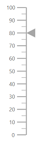
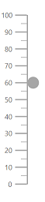
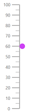
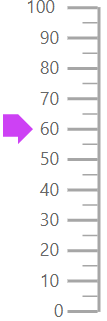
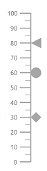

# Pointers

Pointers are used to indicate values on an axis. The value of the pointer can be modified using the [`Value`](https://help.syncfusion.com/cr/aspnetcore-blazor/Syncfusion.Blazor~Syncfusion.Blazor.LinearGauge.LinearGaugePointer~Value.html) property.

```csharp
@using Syncfusion.Blazor.LinearGauge

<SfLinearGauge>
    <LinearGaugeAxes>
        <LinearGaugeAxis>
            <LinearGaugePointers>
                <LinearGaugePointer Value="80">
                </LinearGaugePointer>
            </LinearGaugePointers>
        </LinearGaugeAxis>
    </LinearGaugeAxes>
</SfLinearGauge>
```



## Types of pointer

The Linear Gauge supports the following two types of pointers:

* Bar
* Marker

You can choose any pointer using the [`MarkerType`](https://help.syncfusion.com/cr/aspnetcore-blazor/Syncfusion.Blazor~Syncfusion.Blazor.LinearGauge.MarkerType.html) property.

### Marker pointer

A marker pointer is a shape that can be placed to mark the pointer value in the linear gauge.

<b>Types of marker shapes</b>

The following marker types are available in linear gauge. You can change the marker shape using the [`MarkerType`](https://help.syncfusion.com/cr/aspnetcore-blazor/Syncfusion.Blazor~Syncfusion.Blazor.LinearGauge.MarkerType.html) property in [`LinearGaugePointer`](https://help.syncfusion.com/cr/aspnetcore-blazor/Syncfusion.Blazor~Syncfusion.Blazor.LinearGauge.LinearGaugePointer_members.html) options.

* Circle
* Rectangle
* Triangle
* InvertedTriangle
* Diamond
* Image

You can also use an image instead of rendering a shape as pointer. It can be achieved by setting the [`MarkerType`](https://help.syncfusion.com/cr/aspnetcore-blazor/Syncfusion.Blazor~Syncfusion.Blazor.LinearGauge.MarkerType.html) property to `Image` and setting image path to [`ImageUrl`](https://help.syncfusion.com/cr/aspnetcore-blazor/Syncfusion.Blazor~Syncfusion.Blazor.LinearGauge.LinearGaugePointer~ImageUrl.html) in [`LinearGaugePointer`](https://help.syncfusion.com/cr/aspnetcore-blazor/Syncfusion.Blazor~Syncfusion.Blazor.LinearGauge.LinearGaugePointer_members.html).

```csharp
@using Syncfusion.Blazor.LinearGauge

<SfLinearGauge>
    <LinearGaugeAxes>
        <LinearGaugeAxis>
            <LinearGaugePointers>
                <LinearGaugePointer Value="60" MarkerType="MarkerType.Circle">
                </LinearGaugePointer>
            </LinearGaugePointers>
        </LinearGaugeAxis>
    </LinearGaugeAxes>
</SfLinearGauge>
```



<b>Marker pointer customization</b>

The marker pointer can be customized using following properties.

* [`Height`](https://help.syncfusion.com/cr/aspnetcore-blazor/Syncfusion.Blazor~Syncfusion.Blazor.LinearGauge.LinearGaugePointer~Height.html) - Specifies pointer height
* [`Position`] - Specifies the Position of the Pointers. Its Possible values are 'Position.Inside', 'Position.Outside' and 'Position.Cross'
* [`Width`](https://help.syncfusion.com/cr/aspnetcore-blazor/Syncfusion.Blazor~Syncfusion.Blazor.LinearGauge.LinearGaugePointer~Width.html) - Specifies pointer width
* [`Color`](https://help.syncfusion.com/cr/aspnetcore-blazor/Syncfusion.Blazor~Syncfusion.Blazor.LinearGauge.LinearGaugePointer~Color.html) - Specifies pointer color
* [`Placement`](https://help.syncfusion.com/cr/aspnetcore-blazor/Syncfusion.Blazor~Syncfusion.Blazor.LinearGauge.LinearGaugePointer~Placement.html) - Specifies pointer placement position, available placement options are 'Near', 'Far', 'Center' and 'None'
* [`Offset`](https://help.syncfusion.com/cr/aspnetcore-blazor/Syncfusion.Blazor~Syncfusion.Blazor.LinearGauge.LinearGaugePointer~Offset.html) - Specifies offset value from it default position.
* [`Opacity`](https://help.syncfusion.com/cr/cref_files/aspnetcore-blazor/Syncfusion.Blazor~Syncfusion.Blazor.LinearGauge.LinearGaugePointer~Opacity.html) - Specifies pointer opacity
* [`AnimationDuration`](https://help.syncfusion.com/cr/cref_files/aspnetcore-blazor/Syncfusion.Blazor~Syncfusion.Blazor.LinearGauge.LinearGaugePointer~AnimationDuration.html) - Specifies pointer animation duration
* [`LinearGaugePointerBorder`](https://help.syncfusion.com/cr/cref_files/aspnetcore-blazor/Syncfusion.Blazor~Syncfusion.Blazor.LinearGauge.LinearGaugePointer~Border.html) - Specifies pointer border color and width

```csharp
@using Syncfusion.Blazor.LinearGauge

<SfLinearGauge>
    <LinearGaugeAxes>
        <LinearGaugeAxis>
            <LinearGaugePointers>
                <LinearGaugePointer Value="60"
                                    MarkerType="MarkerType.Circle"
                                    Height="15"
                                    Width="15"
                                    Position="Position.Outside"
                                    Color="#cd41f4">
                </LinearGaugePointer>
            </LinearGaugePointers>
        </LinearGaugeAxis>
    </LinearGaugeAxes>
</SfLinearGauge>
```



### Bar pointer

The bar pointer is used to track the axis value, and it is rendered depending upon the container type. The bar pointer starts from the beginning of the gauge and ends at the pointer value. To enable bar pointer set 'Point.Bar' value in [`Type`](https://help.syncfusion.com/cr/aspnetcore-blazor/Syncfusion.Blazor~Syncfusion.Blazor.LinearGauge.Point.html) property.

```csharp
@using Syncfusion.Blazor.LinearGauge

<SfLinearGauge>
    <LinearGaugeAxes>
        <LinearGaugeAxis>
            <LinearGaugePointers>
                <LinearGaugePointer Value="60" Type="Point.Bar">
                </LinearGaugePointer>
            </LinearGaugePointers>
        </LinearGaugeAxis>
    </LinearGaugeAxes>
</SfLinearGauge>
```


<b>Bar pointer customization</b>

The bar pointer can be customized using following properties.

* [`Width`](https://help.syncfusion.com/cr/aspnetcore-blazor/Syncfusion.Blazor~Syncfusion.Blazor.LinearGauge.LinearGaugePointer~Width.html) - Specifies bar pointer width
* [`Color`](https://help.syncfusion.com/cr/aspnetcore-blazor/Syncfusion.Blazor~Syncfusion.Blazor.LinearGauge.LinearGaugePointer~Color.html) - Specifies bar pointer color
* [`Offset`](https://help.syncfusion.com/cr/aspnetcore-blazor/Syncfusion.Blazor~Syncfusion.Blazor.LinearGauge.LinearGaugePointer~Offset.html) - Helps to move the bar pointer from its default position.
* [`Opacity`](https://help.syncfusion.com/cr/aspnetcore-blazor/Syncfusion.Blazor~Syncfusion.Blazor.LinearGauge.LinearGaugePointer~Opacity.html) - Specifies bar pointer opacity
* [`RoundedCornerRadius`](https://help.syncfusion.com/cr/aspnetcore-blazor/Syncfusion.Blazor~Syncfusion.Blazor.LinearGauge.LinearGaugePointer~RoundedCornerRadius.html) - Specifies rounded corner for the bar pointer
* [`LinearGaugePointerBorder`](https://help.syncfusion.com/cr/aspnetcore-blazor/Syncfusion.Blazor~Syncfusion.Blazor.LinearGauge.LinearGaugePointer~Border.html) - Specifies bar pointer border width and color
* [`AnimationDuration`](https://help.syncfusion.com/cr/aspnetcore-blazor/Syncfusion.Blazor~Syncfusion.Blazor.LinearGauge.LinearGaugePointer~AnimationDuration.html) - Specifies animation duration for bar pointer

```csharp
@using Syncfusion.Blazor.LinearGauge

<SfLinearGauge>
    <LinearGaugeAxes>
        <LinearGaugeAxis>
            <LinearGaugePointers>
                <LinearGaugePointer Value="80"
                                    Type="Point.Bar"
                                    Width="20"
                                    Color="#f44141">
                </LinearGaugePointer>
            </LinearGaugePointers>
        </LinearGaugeAxis>
    </LinearGaugeAxes>
</SfLinearGauge>
```


## Pointer placement

You can placement the marker pointer in any of the following locations using [`Placement`](https://help.syncfusion.com/cr/aspnetcore-blazor/Syncfusion.Blazor~Syncfusion.Blazor.LinearGauge.Placement.html) property.

* Far
* Near
* Center
* None

```csharp
@using Syncfusion.Blazor.LinearGauge

<SfLinearGauge>
    <LinearGaugeAxes>
        <LinearGaugeAxis>
            <LinearGaugePointers>
                <LinearGaugePointer Value="60"
                                    MarkerType="MarkerType.Arrow"
                                    Color="#cd41f4"
                                    Placement="Placement.Near">
                </LinearGaugePointer>
            </LinearGaugePointers>
        </LinearGaugeAxis>
    </LinearGaugeAxes>
</SfLinearGauge>
```



## Multiple pointers

In addition to the default pointer, you can add n number of pointers to an axis.

```csharp
@using Syncfusion.Blazor.LinearGauge

<SfLinearGauge>
    <LinearGaugeAxes>
        <LinearGaugeAxis>
            <LinearGaugePointers>
                <LinearGaugePointer Value="30" MarkerType="MarkerType.Circle">
                </LinearGaugePointer>
                <LinearGaugePointer Value="60" MarkerType="MarkerType.Diamond">
                </LinearGaugePointer>
                <LinearGaugePointer Value="80" AnimationDuration="1000">
                </LinearGaugePointer>
            </LinearGaugePointers>
        </LinearGaugeAxis>
    </LinearGaugeAxes>
</SfLinearGauge>
```



## Pointer animation

Pointer is animated on loading the gauge. This can be handled using the [`AnimationDuration`](https://help.syncfusion.com/cr/aspnetcore-blazor/Syncfusion.Blazor~Syncfusion.Blazor.LinearGauge.LinearGaugePointer~AnimationDuration.html) property. You need to specify the duration of the animation in milliseconds.

```csharp
@using Syncfusion.Blazor.LinearGauge

<SfLinearGauge>
    <LinearGaugeAxes>
        <LinearGaugeAxis>
            <LinearGaugePointers>
                <LinearGaugePointer Value="80" AnimationDuration="1000">
                </LinearGaugePointer>
            </LinearGaugePointers>
        </LinearGaugeAxis>
    </LinearGaugeAxes>
</SfLinearGauge>
```


## Pointer dragging

You can drag either marker or bar pointer to the desired axis value using the [`EnableDrag`](https://help.syncfusion.com/cr/aspnetcore-blazor/Syncfusion.Blazor~Syncfusion.Blazor.LinearGauge.LinearGaugePointer~EnableDrag.html) property in the [`LinearGaugePointer`](https://help.syncfusion.com/cr/aspnetcore-blazor/Syncfusion.Blazor~Syncfusion.Blazor.LinearGauge.LinearGaugePointer_members.html).

```csharp
@using Syncfusion.Blazor.LinearGauge

<SfLinearGauge>
    <LinearGaugeAxes>
        <LinearGaugeAxis>
            <LinearGaugePointers>
                <LinearGaugePointer Value="80" EnableDrag="true">
                </LinearGaugePointer>
            </LinearGaugePointers>
        </LinearGaugeAxis>
    </LinearGaugeAxes>
</SfLinearGauge>
```


## Gradient Color

Gradient support allows to add multiple colors in the ranges and pointers of the linear gauge. The following gradient types are supported in the linear gauge.

* Linear Gradient
* Radial Gradient

### Linear Gradient

Using linear gradient, colors will be applied in a linear progression. The start value of the linear gradient can be set using the [`StartValue`](https://help.syncfusion.com/cr/blazor/Syncfusion.Blazor~Syncfusion.Blazor.LinearGauge.LinearGaugeLinearGradient~StartValue.html) property. The end value of the linear gradient will be set using the [`EndValue`](https://help.syncfusion.com/cr/blazor/Syncfusion.Blazor~Syncfusion.Blazor.LinearGauge.LinearGaugeLinearGradient~EndValue.html) property. The color stop values such as color, opacity and offset are set using [`ColorStop`](https://help.syncfusion.com/cr/blazor/Syncfusion.Blazor~Syncfusion.Blazor.LinearGauge.LinearGaugeLinearGradient~ColorStop.html) property.

The linear gradient can be applied to all pointer types like marker and range bar. To do so, follow the below code sample.

```csharp
@using Syncfusion.Blazor.LinearGauge

<SfLinearGauge Orientation="Orientation.Horizontal">
        <LinearGaugeContainer Width="30" Offset="30">
            <LinearGaugeContainerBorder Width="0"/>
            <LinearGaugeAxes>
                <LinearGaugeAxis>
                    <LinearGaugeAxisLabelStyle Offset="55">
                        <LinearGaugeAxisLabelFont Color="#424242"/>
                    </LinearGaugeAxisLabelStyle>
                    <LinearGaugeLine Width="0.01"/>
                    <LinearGaugeMajorTicks Height="0.01" Interval="25"/>
                    <LinearGaugeMinorTicks Height="0.01"/>
                    <LinearGaugePointers>
                        <LinearGaugePointer Value="80" Height="25" Width="35" Offset="-40" MarkerType="MarkerType.Triangle"
                        Placement="Syncfusion.Blazor.LinearGauge.Placement.Near" LinearGradient="@PointerLinearModel">
                        </LinearGaugePointer>
                    </LinearGaugePointers>
                    <LinearGaugeRanges>
                        <LinearGaugeRange Color="#f54ea2" Start="0" End="80" StartWidth="30" EndWidth="30" Offset="30">
                        </LinearGaugeRange>
                    </LinearGaugeRanges>
                </LinearGaugeAxis>
            </LinearGaugeAxes>
        </LinearGaugeContainer>
    </SfLinearGauge>
@code {
    public static LinearGradient PointerLinearModel = new LinearGradient() {
        StartValue = "1%",
        EndValue = "99%",
        ColorStop = new List<ColorStop>() {
            new ColorStop { Opacity=1, Color= "#fef3f9", Offset="1%" },
            new ColorStop { Opacity=1, Color= "#f54ea2", Offset="100%" }
        }
    };
}
```

### Radial Gradient

Using radial gradient, colors will be applied in circular progression. The inner circle position of the radial gradient will be set using the [`InnerPosition`](https://help.syncfusion.com/cr/blazor/Syncfusion.Blazor~Syncfusion.Blazor.LinearGauge.LinearGaugeRadialGradient~InnerPosition.html) property. The outer circle position of the radial gradient can be set using the [`OuterPosition`](https://help.syncfusion.com/cr/blazor/Syncfusion.Blazor~Syncfusion.Blazor.LinearGauge.LinearGaugeRadialGradient~OuterPosition.html) property. The color stop values such as color, opacity and offset are set using [`ColorStop`](https://help.syncfusion.com/cr/blazor/Syncfusion.Blazor~Syncfusion.Blazor.LinearGauge.LinearGaugeRadialGradient~ColorStop.html) property.

The radial gradient can be applied to all pointer types like marker and range bar. To do so, follow the below code sample.

```csharp
@using Syncfusion.Blazor.LinearGauge

<SfLinearGauge Orientation="Orientation.Horizontal">
        <LinearGaugeContainer Width="30" Offset="30">
            <LinearGaugeContainerBorder Width="0"/>
            <LinearGaugeAxes>
                <LinearGaugeAxis>
                    <LinearGaugeAxisLabelStyle Offset="55">
                        <LinearGaugeAxisLabelFont Color="#424242"/>
                    </LinearGaugeAxisLabelStyle>
                    <LinearGaugeLine Width="0.01"/>
                    <LinearGaugeMajorTicks Height="0.01" Interval="25"/>
                    <LinearGaugeMinorTicks Height="0.01"/>
                    <LinearGaugePointers>
                        <LinearGaugePointer Value="80" Height="25" Width="35" Offset="-40" MarkerType="MarkerType.Triangle"
                        Placement="Syncfusion.Blazor.LinearGauge.Placement.Near" RadialGradient="@PointerRadialModel">
                        </LinearGaugePointer>
                    </LinearGaugePointers>
                    <LinearGaugeRanges>
                        <LinearGaugeRange Color="#f54ea2" Start="0" End="80" StartWidth="30" EndWidth="30" Offset="30">
                        </LinearGaugeRange>
                    </LinearGaugeRanges>
                </LinearGaugeAxis>
            </LinearGaugeAxes>
        </LinearGaugeContainer>
    </SfLinearGauge>
@code {
    public static RadialGradient PointerRadialModel = new RadialGradient()
    {
        Radius = "60%",
        OuterPosition = new OuterPosition() { X="50%", Y="50%" },
        InnerPosition = new InnerPosition() { X="50%", Y="50%" },
        ColorStop = new List<ColorStop>() {
            new ColorStop { Opacity=0.9, Color= "#fff5f5", Offset="1%" },
            new ColorStop { Opacity=0.8, Color= "#f54ea2", Offset="99%" }
        }
    };
}
```